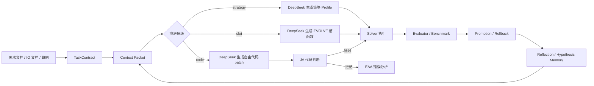

# Agent 自演进框架研究进度与新工程迁移备忘

> 目的：本文用于把当前 `fjsp_harness_agent` 中关于算法自演进 Agent 的研究过程、阶段性结论、失败原因和后续工程化路线沉淀下来，方便后续重开独立工程时直接迁移。本文不是正式宣传稿，而是面向下一阶段实现的工程复盘材料。

## 1. 当前阶段结论

当前研究已经证明了一个可行方向：不要让大模型直接自由改整个求解器，而应采用“固定评价器 + 隔离候选 worktree + 受控策略/代码槽 + 自动反思”的闭环。

已有能力包括：

- 可以从需求文档、IO 文档、算例和 best-known 数据构造标准 FJSP 任务。
- 可以运行固定 solver / evaluator / benchmark，并输出合法性、makespan、best gap 等指标。
- 可以调用 DeepSeek 生成策略 Profile，或生成代码修改 proposal。
- 可以通过 Judge Agent / Error Analysis Agent 阻止明显不合格候选进入 evaluator。
- 已接入网页端，支持上传文档、算例、运行若干轮、查看事件流和报告预览。
- 已新增 AWLS `zi` 策略公式 DSL，并在此基础上完成更稳的 `EVOLVE` 代码槽模式。

阶段性判断：

- 策略层演进更稳定，但主要改变参数和 profile，代码创新能力有限。
- 完全开放的代码层演进容易因锚点不匹配、长文本截断、空响应、误改大文件而失败。
- 代码槽模式是当前最合适的折中：模型确实在写代码，但写的是一个可审计、可替换、可回滚的小函数。
- AWLS 这类强基线不应被 LLM 从零重写；更合理的是作为领域插件/代码模板/知识库基线，让 LLM 演化其参数、权重公式、初始化策略、邻域选择和后处理策略。

## 2. 外部参考：LLM4AD_Next 给出的启发

参考项目：[Optima-CityU/LLM4AD_Next](https://github.com/Optima-CityU/LLM4AD_Next)。

该项目的 README 将目标描述为“从问题描述到可运行的演化算法搜索，一条命令完成”，并强调交互式配置可以自动生成 evaluator、算法骨架、配置和调试器。其文档中明确采用“LLM 作为 proposer，进化计算作为 evaluator 和 selector”的分工；同时限制 LLM 只修改由 `EVOLVE_START` / `EVOLVE_END` 标记的代码区域，并通过隔离 worktree 批量评估候选。这一点与我们后续“代码槽”方向高度一致。

对本项目的具体启发：

- LLM 不应默认获得整个仓库的任意修改权。
- 代码演化对象应该是显式声明的 evolve block，而不是大文件补丁。
- evaluator / validator 必须固定，不能由同一个模型随意修改。
- 每个候选应在独立 worktree 中运行，主分支只接收经过评价器筛选的结果。
- Web UI 的价值不只是提交任务，还要展示候选代码、策略意图、评价结果、失败原因和进化轨迹。

## 3. 已形成的系统框架

### 3.1 主体架构

当前工程以 `harness_agent` 为核心，主要模块如下：

- `TaskContract`：描述问题类型、算例、目标、solver 命令、evaluator 命令、预算和允许修改路径。
- `benchmark_runner`：执行候选 solver，调用 evaluator，聚合多算例/多 seed 指标。
- `standard_worker_loop`：为标准 FJSP 构造 contract、context packet，并驱动 CodingWorker 多轮循环。
- `DeepSeekWorker`：自由代码修改 worker，生成结构化 proposal，并支持 `create_or_replace`、`text_replace`、`insert_after`。
- `DeepSeekSlotWorker`：受控代码槽 worker，只允许修改 AWLS `EVOLVE` 标记函数。
- `agentic_review`：扮演 JA/EAA 的基础职责，检查候选代码是否真的修改、是否通过 quick test、是否应进入 evaluator。
- `web_app` / `web_static`：网页端任务提交、状态轮询、事件日志和报告预览。

### 3.2 当前工作流

标准流程如下：



### 3.3 JA / RA / EAA 的落地状态

当前已经落地了部分 JA/EAA 能力，但 RA 还不完整：

- JA 已能阻止未产生实际改动的候选进入 evaluator，例如 `no_changed_files_after_apply`。
- EAA 已能把候选被拒原因写入事件流和报告，作为下一轮反馈。
- RA 目前主要依赖下一轮 DeepSeek 从 context packet 中读取失败原因后自行修订，还没有形成独立的“修订智能体”类。

下一工程建议将三者显式化：

- JA：负责语法、接口、路径、evaluator 不可篡改、quick test 和 candidate diff 审查。
- RA：只根据 JA/EAA 反馈修订同一个候选，不重新发散生成全新方案。
- EAA：专门分析运行错误、evaluator 错误、无效指标和超时原因。

## 4. 主要实验历程

### 4.1 从标准 FJSP Harness 起步

早期目标是先在标准 FJSP 算例上跑通闭环，而不是直接处理铝加工工业约束。原因是标准 FJSP 的输入输出更清晰，best-known 可查，适合验证“文档到算法”的通用能力。

已完成内容：

- 构造标准 FJSP parser / evaluator / solution schema。
- 支持 best-known CSV，用于计算 gap。
- 支持多 seed、多候选、多实例的 benchmark。
- 支持 portfolio、local-search、AWLS 等 solver 入口。

这一阶段解决的是“评价闭环可信”问题。没有固定 evaluator，自演进框架就会退化成大模型自说自话。

### 4.2 策略层演进

策略层让 DeepSeek 根据文档和上一轮结果生成 profile，例如：

- 派工权重组合。
- local-search profile。
- portfolio size、neighbor limit、time limit 等参数。
- AWLS 相关重启、初始化、候选选择参数。

优点：

- 稳定，基本不会破坏代码。
- 候选容易批量比较。
- 适合作为非代码模式的入门演示。

缺点：

- 本质上更接近自动调参。
- 如果底层 solver 结构不够强，策略层很难凭空创造新的邻域动作或搜索机制。
- 对甲方所说“自演进生成算法代码”的说服力不足。

典型网页实验：

- `outputs/web_runs/20260623_163748_2310c79b`
- 配置：`standard_loop + strategy + awls + DeepSeek`
- 结果：运行完成，10 个 seed 均合法，事件流和报告可生成。
- 结论：策略层可作为稳定展示路径，但不能作为唯一的代码演进能力。

### 4.3 自由代码层演进

自由代码层让 DeepSeek 读取 context packet 后生成结构化代码修改 proposal。最初只支持 `create_or_replace`，后来扩展为：

- `create_or_replace`
- `text_replace`
- `insert_after`

这样做的目的是降低“大文件完整重写”的概率，让模型更容易做小 patch。

典型失败实验：

- `outputs/web_runs/20260623_165401_5e6de9eb`
- 配置：`standard_loop + code + awls + DeepSeek`
- 基线：10 个 seed 均合法，best makespan 为 `983.0`
- 3 轮结果：全部 rolled back
- round 0 / round 2：JA 拒绝，原因是 `no_changed_files_after_apply`
- round 1：DeepSeek 返回空内容

失败原因拆解：

- 模型提出了策略，但生成 patch 时没有成功落到真实文件。
- `text_replace` / `insert_after` 依赖精确锚点，稍有不一致就会失败。
- 大模型容易输出不完整 JSON、截断内容或“解释多、代码少”的响应。
- 即使 prompt 要求先写自然语言策略再改代码，自由 patch 仍然过宽。

结论：自由代码层可以保留为高级实验，但不应作为默认演示路径。

### 4.4 AWLS 强基线与 Python/C++ 对齐

为了避免框架只会生成弱启发式，后续引入 AWLS 作为标准 FJSP 强基线。已完成的研究包括：

- 阅读并对照 C++ AWLS / HGTSA 风格实现。
- 在 Python 中实现 disjunctive graph、关键块邻域、跨机 insertion、tabu、权重扰动等核心机制。
- 编写 `docs/awls_neighborhood_audit.md` 和 `docs/awls_python_cpp_alignment_20260618.md` 记录差距。

关键结论：

- Python AWLS 已经具备主要结构，但单位时间搜索深度明显弱于 C++。
- 纯 Python 版本在部分算例上仍存在 gap，核心原因包括候选枚举速度、近似评估细节、随机轨迹和权重扰动差异。
- 如果下一阶段目标是“效果强”，应允许把 C++ AWLS 作为领域插件或强基线后端，而不是强行要求 LLM 重新写出同等强度的求解器。

局部对齐记录中已有事实：

- C++ GREEDY_INIT AWLS 在 Mk10 上 20 seed、90 秒预算可达到 best=`195`、avg≈`196.85`。
- Python AWLS 在加速和对齐后仍有小差距，说明继续做 Python 逐行复刻收益有限。

### 4.5 AWLS-ZI 公式 DSL

为降低代码改动风险，先将 AWLS 自适应权重 `zi` 暴露成受控公式：

- 新增 `--zi-policy formula`
- 新增 `--zi-formula`
- 支持变量包括 `base`、`weight`、`cooldown`、`rr`、`gamma`、`is_critical`、`forward`、`backward`、`duration`、`machine_load`、`position` 等。
- 使用 AST 白名单限制表达式，避免任意代码执行。

意义：

- 模型可以改变搜索行为。
- evaluator 仍然固定。
- 失败候选更容易定位。

局限：

- 公式 DSL 仍然偏参数化，表达能力不如完整代码。
- 对“生成新规则/删掉旧规则”的展示力度有限。

### 4.6 代码槽模式

本次收尾已新增代码槽模式，参考 LLM4AD_Next 的 evolve block 思路。

新增文件：

- `examples/awls_evolved_slots.py`
- `harness_agent/workers/deepseek_slot_worker.py`
- `tests/test_awls_slot_mode.py`

新增能力：

- AWLS 支持 `--zi-policy slot`
- DeepSeek 只能返回一个完整函数 `evolved_zi(values)`
- 系统只替换 `# EVOLVE_START` / `# EVOLVE_END` 之间的代码
- solver 主体、evaluator、parser、benchmark 均不可被该 worker 修改
- 网页端新增“代码槽：DeepSeek 只改 EVOLVE 标记函数”

验证结果：

- `python -m unittest tests.test_awls_slot_mode`：3 个测试通过
- `python -m compileall examples harness_agent tests`：通过
- AWLS slot 冒烟：
  - 算例：`examples/fjsp.brandimarte.Mk01.m6j10c3.txt`
  - 命令：`examples/standard_fjsp_awls_solver.py --zi-policy slot`
  - evaluator：`valid=true`
  - `error_count=0`
  - `makespan=40`
  - `best_known_makespan=40`
  - `gap_pct=0.0`

该模式是当前最推荐迁移到新工程的代码演进入口。

## 5. 当前 Web Demo 状态

网页端当前提供：

- 上传需求文档 Markdown。
- 上传 IO 文档 Markdown。
- 上传标准 FJSP 算例。
- 可选上传 best-known CSV。
- 选择 solver：`portfolio`、`local-search`、`awls`。
- 选择演进层级：`strategy`、`slot`、`code`。
- 设置迭代轮次、seeds、预算和 AWLS 参数。
- 运行后展示事件流、关键指标、报告预览。

三个演进层级含义：

- `strategy`：DeepSeek 生成策略 Profile，不改源码，稳定但更像调参。
- `slot`：DeepSeek 只改 `EVOLVE` 代码槽，推荐作为默认代码演进模式。
- `code`：DeepSeek 自由修改允许路径下的代码，能力最强但失败率最高，建议作为高级实验。

## 6. 目前主要问题

### 6.1 仓库历史过长

当前仓库承载了太多并行探索：

- 华为铝加工原始求解器。
- 标准 FJSP Harness。
- DeepSeek 策略演化。
- OpenCode / CodingWorker 接口。
- Web Demo。
- AWLS Python/C++ 对齐。
- 合同文档、论文材料、测试报告。

这导致上下文非常长，后续 Agent 继续在该仓库内迭代会消耗大量 token，也容易混淆“通用 harness”和“FJSP 插件”边界。

建议新开工程。

### 6.2 自由改代码的成功率不足

自由 code mode 的失败不是 evaluator 错误，而是候选 patch 生成和应用失败：

- 锚点找不到。
- 模型输出空内容。
- JSON 不完整。
- 生成策略但未形成实际 diff。
- 大文件改动不可审计。

代码槽是对这个问题的直接修复。

### 6.3 强基线与自演进的关系要重新定义

如果拿弱 solver 做自演进，LLM 很容易在低水平规则上打转。更合理的路线：

- 内置强基线 AWLS / TS / SA / dispatch portfolio。
- LLM 不从零写 solver，而是先选择、配置、组合、微改强基线。
- 对有限代码槽做演化，例如 `zi`、邻域选择概率、候选接受准则、重启策略、初始化混合权重。
- 对工业变种，LLM 负责把约束映射到插件接口，而不是重写核心搜索器。

## 7. 新工程建议架构

建议新工程采用“通用 Harness + 领域插件”的结构。

```text
algoforge/
  core/
    task_contract.py
    evaluator_runner.py
    benchmark_runner.py
    worktree_manager.py
    judge_agent.py
    revise_agent.py
    error_analysis_agent.py
    loop_orchestrator.py
  workers/
    deepseek_worker.py
    slot_worker.py
    opencode_worker.py
  domains/
    fjsp/
      parser.py
      evaluator.py
      solvers/
        dispatch_portfolio.py
        awls_backend.py
        awls_slots.py
      skills/
      knowledge/
      docs_templates/
  web/
    app.py
    static/
  experiments/
  outputs/
  docs/
```

边界建议：

- `core` 不知道 FJSP 的业务细节，只处理 contract、候选、评价、晋级、日志。
- `domains/fjsp` 提供 parser、evaluator、solver、代码槽、知识库和默认 prompt。
- `workers` 只负责调用模型或外部 coding agent。
- `web` 只负责交互和可视化，不嵌入算法逻辑。

## 8. 下一阶段优先级

### P0：迁移和稳定

- 新建独立工程，不继续把 Agent 框架堆在旧仓库。
- 把 `TaskContract`、benchmark、worker loop、web UI、slot worker 迁出。
- 保留当前标准 FJSP parser/evaluator 作为第一个领域插件。
- 保留 AWLS solver，但明确它是领域插件中的强基线，不是通用 core。

### P1：把代码槽做成正式能力

至少内置以下 FJSP 代码槽：

- `zi` 自适应权重槽。
- 邻域选择概率槽。
- 初始解构造权重槽。
- 候选 move 过滤槽。
- 接受准则 / 重启策略槽。

每个槽都要有：

- 固定输入字典。
- 固定返回类型。
- AST / import / IO 限制。
- 单元测试。
- evaluator 证据。

### P2：实现显式 JA / RA / EAA

从当前隐式判断升级为显式智能体：

- JA 判断候选描述和代码是否满足任务要求。
- RA 根据 JA/EAA 反馈修改候选。
- EAA 分析运行错误、无效解和性能退化。
- 每轮都保存判断、修订建议、最终 diff 和 evaluator 证据。

### P3：实验设计

标准 FJSP：

- 选择 Brandimarte、Hurink、Barnes、DP 等代表性算例。
- 每个算例至少 10 seeds。
- 对比 dispatch rule、TS、SA、AWLS baseline、直接 LLM 生成、slot evolution。

工业变种：

- 先用构造变种测试特性开关。
- 再接铝加工数据。
- evaluator 必须人工确认。

消融实验：

- 有无知识库。
- 有无代码槽。
- 有无 JA/RA/EAA。
- 只调参 vs 调代码槽。
- 直接大模型生成 vs harness 自演进。

## 9. 对合同/论文表述的建议

更稳妥的表述：

- 本项目不是追求让 LLM 从零生成超过 SOTA 的 FJSP 求解器。
- 核心贡献是“评价器驱动的算法自演进工程框架”，通过领域知识库、强基线插件、受控代码槽和错误诊断闭环提高 LLM 在 FJSP 及其变种上的算法适配能力。
- 与直接大模型生成相比，框架的优势应体现在可行满足率、有效迭代率、修复成功率、平均求解质量和复现实验记录上。
- 与经典启发式/派工规则相比，可以在约定时间预算和测试集上展示求解质量或效率提升。

## 10. 当前可复用文件清单

建议迁移：

- `harness_agent/models.py`
- `harness_agent/evaluator_runner.py`
- `harness_agent/benchmark_runner.py`
- `harness_agent/standard_worker_loop.py`
- `harness_agent/workers/deepseek_worker.py`
- `harness_agent/workers/deepseek_slot_worker.py`
- `harness_agent/web_app.py`
- `harness_agent/web_static/`
- `examples/standard_fjsp_awls_solver.py`
- `examples/awls_evolved_slots.py`
- `examples/standard_fjsp_evaluator.py`
- `tests/test_awls_slot_mode.py`

建议谨慎迁移：

- 历史 outputs。
- 旧 DeepSeek 自由 code mode 实验输出。
- 未整理的临时 benchmark 结果。
- 与铝加工原求解器强绑定的脚本。

建议沉淀为知识库：

- `docs/awls_neighborhood_audit.md`
- `docs/awls_python_cpp_alignment_20260618.md`
- AWLS / HGTSA / TS / SA 论文摘要。
- FJSP 标准算例 best-known 数据说明。
- 铝加工问题特性与验证口径说明。

## 11. 给新工程的最低可运行目标

第一版不要追求大而全，只需要做到：

1. Web 上传需求文档、IO 文档、标准 FJSP 算例和 best-known。
2. 自动生成 TaskContract。
3. 运行 AWLS baseline。
4. DeepSeek 生成 1 个 `zi` 代码槽候选。
5. JA 检查代码槽。
6. evaluator 跑 10 seeds。
7. promotion / rollback。
8. 输出报告：baseline、candidate、gap、失败原因、候选函数代码、下一轮建议。

这个闭环跑通后，再扩展到多个代码槽、多个算例、知识库检索和工业变种。

## 12. 本次收尾改动记录

本次完成的未收尾事项：

- 新增 `examples/awls_evolved_slots.py`。
- 新增 `DeepSeekSlotWorker`。
- AWLS 新增 `--zi-policy slot`。
- `standard_worker_loop` 可向 AWLS 传递 `awls_zi_policy`。
- 网页端新增代码槽选项。
- 新增 `tests/test_awls_slot_mode.py`。

验证命令：

```powershell
& 'C:\Users\ASUS\AppData\Local\Programs\Python\Python312\python.exe' -m unittest tests.test_awls_slot_mode
& 'C:\Users\ASUS\AppData\Local\Programs\Python\Python312\python.exe' -m compileall examples harness_agent tests
& 'C:\Users\ASUS\AppData\Local\Programs\Python\Python312\python.exe' examples\standard_fjsp_awls_solver.py --input examples\fjsp.brandimarte.Mk01.m6j10c3.txt --output outputs\slot_smoke_solution.json --seed 0 --restarts 1 --cycles-per-restart 5 --iterations 50 --time-limit-sec 1 --zi-policy slot
& 'C:\Users\ASUS\AppData\Local\Programs\Python\Python312\python.exe' examples\standard_fjsp_evaluator.py --instance examples\fjsp.brandimarte.Mk01.m6j10c3.txt --solution outputs\slot_smoke_solution.json --metrics outputs\slot_smoke_metrics.json --best-known-csv examples\brandimarte_mk01_best.csv
```

验证结果：

- 单元测试通过：`Ran 3 tests`
- 编译检查通过
- 冒烟解合法：`valid=true`
- 错误数：`error_count=0`
- gap：`0.0%`

## 13. 最后一条建议

新工程应默认采用“slot-first，free-code-later”的路线。

也就是说：

- 默认让 LLM 修改代码槽。
- 只有当代码槽长期无提升，且 JA/RA/EAA 能够定位问题时，才开放更大范围的代码编辑。
- 所有代码演化都必须经过固定 evaluator。
- 所有成功或失败都要写入可复盘日志。

这样既能保留“LLM 真正在改代码”的核心卖点，又能避免自由代码模式把实验大量消耗在无效 patch 和语法错误上。
