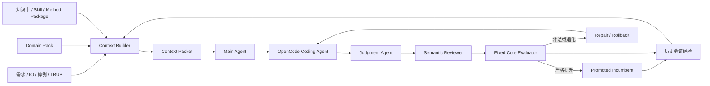

# FJSP Harness Agent 架构

## 设计原则

平台负责“理解任务、组织知识、生成代码、验证代码、积累证据”，不负责提供一个
写死的 FJSP 求解器。增加新变种时，优先新增 domain pack、IO 文档、知识卡、Skill
和 evaluator 契约，不在 Web 或 orchestration 中增加算法分支。

## 数据流

## 分层职责

### `agents/`

- `main.py`：每个用户可见轮次只提出一个改进方向。
- `judgment.py`：代码执行前门禁，检查语法、边界、完整性和确定性风险。
- `semantic.py`：对照本轮方法知识检查实际算法语义。
- `hypothesis.py`：维护实验假设图、经验层级和知识使用效果。

### `context/`

- `contract.py`：从需求与 IO 生成可确认任务契约。
- `packet.py`：汇总任务事实、算例诊断、RAG、incumbent 和反馈。
- `compaction.py`：结构化压缩历史；稳定信息在前、动态反馈追加在后。
- `knowledge.py`：按领域包、实例特征和 Main Agent 方向选择知识，不把所有卡片塞入上下文。
- `intake.py`：扫描 Coding Agent 将要面对的工程和入口。

### `orchestration/`

- `standard.py`：FJSP 文档到 Agent-generated solver 闭环的薄入口。
- `loop.py`：baseline、逐轮方向、同轮修补、promotion/rollback 和经验写入。
- `cycle.py`：隔离 worktree、应用候选、调用 JA 和固定 Core。

### `core/`

- `runner.py` / `graph.py`：执行契约中的 solver/evaluator，不理解具体算法。
- `evaluator.py`：统一指标合法性和目标排序。
- `ledger.py` / `evidence.py`：保存可追溯实验记录与报告。
- `health.py` / `intent.py`：运行前健康检查与目标一致性检查。

### `domains/`

- `io.py`：当前标准 FJSP/FJSP-SDST parser、数据模型和 schedule validator。
- `standard_fjsp.py`：从实际算例内容提取规模、候选机器和 setup 特征。
- `pack.py` / `families.py`：加载问题族能力、知识映射和只读 Core 依赖。

## 只读 Core 与可修改代码

`allowed_paths` 只描述 Coding Agent 可修改的源码。domain pack 的
`agent_generated_baseline.preserve_paths` 描述 evaluator 运行所需的只读 Core 文件。
候选 worktree 会复制两者，但 JA 和变更门禁只允许前者进入候选 patch。

这两个概念不能再次合并，否则会出现两种错误：为了让 evaluator 可导入而开放整个
后端，或为了禁止修改后端而漏复制 parser/evaluator 依赖。

## 轮次与修补

一个用户可见轮次代表一个实验方向。同方向内部可以包含多次 Coding Agent 尝试：

1. 首次候选；
2. JA/语义/evaluator 反馈；
3. 同轮修补；
4. Core 重新审查；
5. promotion 或 rollback。

只有方向变化才进入下一轮。合法但未提升的候选可以在有限预算内继续同方向细化；
基础设施故障不应消耗算法修补次数。

## 新变种接入

1. 编写需求与 IO 文档，定义约束、目标和输出格式。
2. 增加或扩展 domain pack，声明特征、知识标签和只读 Core 文件。
3. 提供固定 parser/evaluator 及最小合法性测试。
4. 将算法实现规范放入知识卡、Skill 或 method package。
5. 增加小算例合法性测试和代表性 benchmark/LB/UB 对比。
6. 不在 `web/`、`core/` 或 `orchestration/` 中增加该变种的求解算法。
