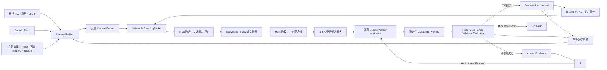

# FJSP Harness Agent 架构

## 设计原则

平台负责“理解任务、组织知识、生成代码、验证代码、积累证据”，不负责提供一个
写死的 FJSP 求解器。增加新变种时，优先新增 domain pack、IO 文档、知识卡、Skill
和 evaluator 契约，不在 Web 或 orchestration 中增加算法分支。

## 数据流

## 分层职责

### `agents/`

- `incumbent_audit.py`：只读解析 promoted Python 源码，提取符号、搜索控制表达式、集合规模、循环和内部调用关系；不输出完整源码、不判断具体算法优劣。
- `main.py`：方向 schema、任务书签发、repair lineage 和确定性 fallback。
- `opencode_main.py`：先构建不含具体方法包的方向选择包，再构建含定向知识和候选包的实现规划包；两次调用均只读。
- `judgment.py`：代码执行前门禁，检查语法、边界、完整性和确定性风险。
- `semantic.py`：对照本轮方法知识检查实际算法语义。
- `hypothesis.py`：维护实验假设图、经验层级和知识使用效果。

### `context/`

- `contract.py`：从需求与 IO 生成可确认任务契约。
- `packet.py`：汇总任务事实、算例诊断、RAG、incumbent 和反馈。
- `compaction.py`：结构化压缩 Main/审查历史；稳定信息在前、动态反馈追加在后。
- `worker.py`：把 Main 方向编译成不超过硬上限的最小 WorkerAssignment。
- `knowledge.py`：按领域包、实例特征和 Main Agent 方向选择知识，不把所有卡片塞入上下文。
- `intake.py`：扫描 Coding Agent 将要面对的工程和入口。

### `orchestration/`

- `standard.py`：FJSP 文档到 Agent-generated solver 闭环的薄入口。
- `loop.py`：baseline、逐轮方向、同轮修补、promotion/rollback 和经验写入。
- `cycle.py`：隔离 worktree、应用候选、执行确定性预检和固定 Core 复验。

### `core/`

- `runner.py` / `graph.py`：执行契约中的 solver/evaluator，不理解具体算法。
- `evaluator.py`：统一指标合法性和目标排序。
- `ledger.py` / `evidence.py`：保存可追溯实验记录与报告。
- `health.py` / `intent.py`：运行前健康检查与目标一致性检查。

### `domains/`

- `io.py`：当前标准 FJSP/FJSP-SDST parser、数据模型和 schedule validator。
- `standard_fjsp.py`：从实际算例内容提取规模、候选机器和 setup 特征。
- `pack.py` / `families.py`：加载问题族能力、知识映射和只读 Core 依赖。

## 只读 Core 与可修改代码

`allowed_paths` 只描述 Coding Agent 可修改的源码。domain pack 的
`agent_generated_baseline.preserve_paths` 描述 evaluator 运行所需的只读 Core 文件。
候选 worktree 会复制两者，但确定性变更门禁只允许前者进入候选 patch。

这两个概念不能再次合并，否则会出现两种错误：为了让 evaluator 可导入而开放整个
后端，或为了禁止修改后端而漏复制 parser/evaluator 依赖。

## 轮次与修补

每个 improvement round 在 Main 规划前先生成 `incumbent_capability_audit`，并把 promoted
solver 源码作为只读附件交给 Main。Main 必须把源码、AST 审计、Core `solver_evidence` 和上一轮
patch 对照起来，区分“机制缺失”和“机制已经存在但规模、覆盖、可达性或
预算策略不足”。静态审计不能证明运行时瓶颈，因此 Main 必须把原因写成可证伪假设，指定现有
目标符号、下一次有界变异和要测量的指标；缺少这些字段的规划会被拒绝并要求重写。

Main 在每个 OpenCode 调用中先通过原生 commentary 事件实时输出中文思考过程：正在检查的
证据、当前假设、备选方向比较、决定和下一项验证。Web 每 1.5 秒扫描 JSONL，把这些模型在
执行中真实发出的消息逐条放入统一对话区。最终机器可读方向 JSON 仍作为 artifact 保存，不在
聊天中重复倾倒。

两阶段最终输出还会合并为 `main_reasoning_trace.json`，用于审计和兼容不产生 commentary 的
模型。当同一 attempt 已有原生 commentary 时，Web 不再展示该事后结构化摘要，避免把最终
JSON 的复述冒充实时思考；只有完全没有原生过程消息时，才明确标成“思考摘要（兜底）”。

一个用户可见轮次代表同一实验方向的一次检查批次。同一方向可以跨越任意多个轮次，
每个检查批次内部可以包含多次 Coding Agent Local Trial：

1. 首次候选；
2. 确定性预检或 Core validator/evaluator 反馈；
3. Harness 保留最佳合法父候选，Main 根据真实 Trial 证据签发同方向 assignment revision；
4. Core 重新审查；
5. promotion 或 rollback。

批次完成即进入下一轮，但不会因此换方向。支持 session 续跑的 Worker 在同一方向内复用一个 OpenCode
session：编译、越权修改或 Core validator 的确定错误生成受限 `repair`；Core 合法但未提升
则生成仅允许一个有界规则/算子变异的 `improvement` refinement。每次 Trial 都收到前序
Core/activation/semantic 反馈，并从当前最佳合法、已激活父候选继续；后续退化不会覆盖该父候选。
配置的 Trial 数只是一次 Core/Main 检查批次的大小，不是方向寿命，也不授权自动换向。批次结束后
Harness 选择账本中的最佳候选并执行正式 promotion/rollback；下一轮若仍为同一方法方向，则沿用
获胜 Worker session 继续。Main 可以基于无提升证据建议换向，但只有用户明确同意才清空该 session；
20 秒无响应默认拒绝换向。不同并行候选仍使用不同 session，未获胜 session 不会传播到下一批次。

Coding Worker 不读取完整 Context Packet、方法目录、经验记忆或全部旧 attempt。Main 只从
Domain Pack 的规范目录选择一个主方法族和最多两个兼容补充方法族；Harness 再把它们解析为
受信 Worker Implementation Skill ID。任务书携带这些 ID、交付物、顺序、保留项、最新失败
和预算，不复制 Skill 正文。Harness 只把匹配 Skill 镜像到候选 `.opencode/skills`，通过
deny-all/allow-list 开放 Skill 工具，并按 `read_set` 开放相关合同、参考骨架和知识卡。
Coding Worker 自主学习获准 Skill 并决定代码级组合，但不能发现未选 Skill、替换 Main 方法族
或扩大读写范围。确定性 diff/preflight 和固定 Core 继续约束真实行为。

Main 每次可调用最多四个只读 specialist 做需求、证据、计划和候选策略审查。需要代码竞争时，
Main 输出同一方法族下的 `candidate_variants`，Harness 再从同一个 incumbent 建立最多四个隔离
worktree，并分别运行 Coding Worker、确定性预检和固定 Core。候选之间不共享未晋升代码；
只有 Core 合法且目标最优的候选可以进入 promotion check。默认竞争数为 1，避免无意增加成本。

Main 及其只读 specialist 可以读取完整项目树，以便自主核对知识卡、方法包、历史 patch、运行证据
和 incumbent 源码；`.env`、私钥等凭据文件始终拒绝读取，且 Main 不具备编辑或命令执行权限。
Coding Worker 不继承这项项目级读取能力，仍只读取 `WorkerAssignment.read_set` 和本轮获准的
Worker Implementation Skills，并且只能修改任务书指定的目标文件。

solver 可以在输出顶层增加有界 `diagnostics`，记录每个入口的 makespan、状态展开/保留/裁剪、
incumbent 路径存活、profile 碰撞、阶段耗时和机器 shortlist 分布。Runner 只把它作为 Main 的
解释证据；固定 evaluator 仍是合法性和目标值的唯一来源，diagnostics 不参与排名或晋升。

Main 和 Worker 的 OpenCode 调用使用彼此独立的新 session。常驻 `serve --attach` 虽能减少
冷启动，但 OpenCode 1.17.11 的服务端配置不是 assignment 级配置，无法安全承载每次变化的
精确读写白名单。因此当前明确保留进程隔离；只有上游支持请求级 runtime permission 后，
才重新评估 attach，且不得改回长期 `--continue` 上下文。

## 新变种接入

1. 编写需求与 IO 文档，定义约束、目标和输出格式。
2. 增加或扩展 domain pack，声明特征、知识标签和只读 Core 文件。
3. 提供固定 parser/evaluator 及最小合法性测试。
4. 将算法实现规范放入知识卡、Skill 或 method package。
5. 增加小算例合法性测试和代表性 benchmark/LB/UB 对比。
6. 不在 `web/`、`core/` 或 `orchestration/` 中增加该变种的求解算法。
