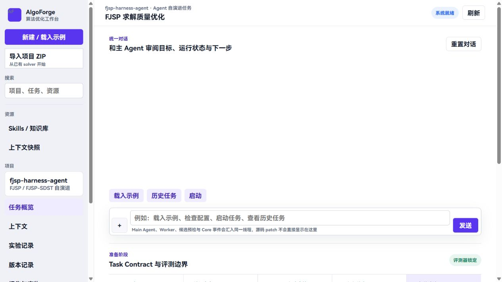
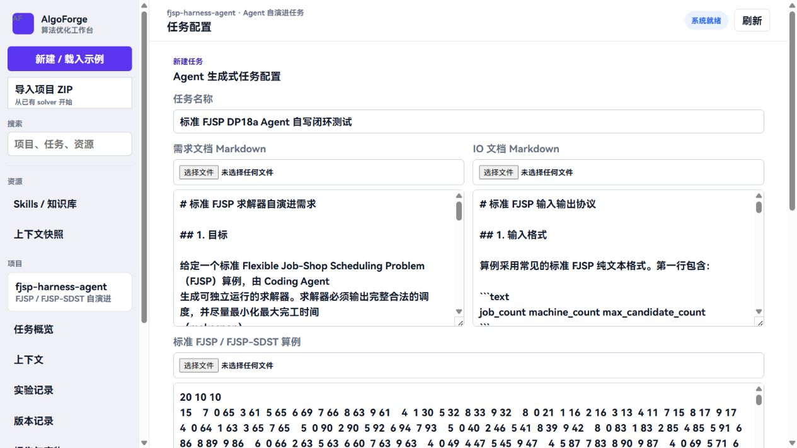
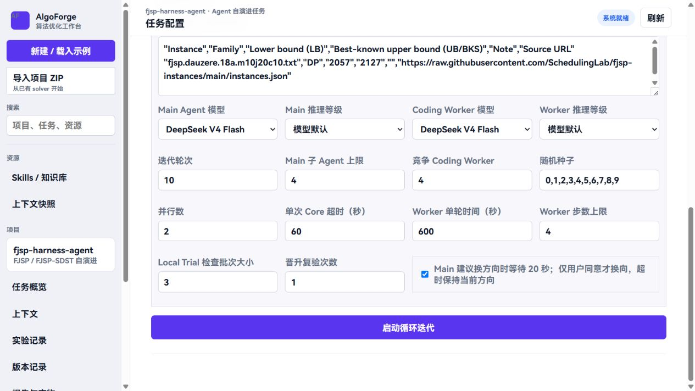
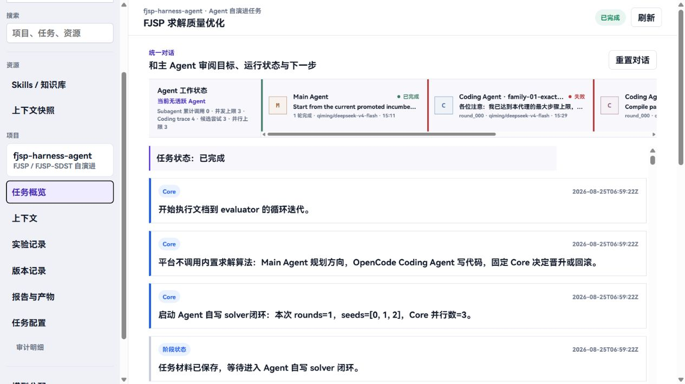
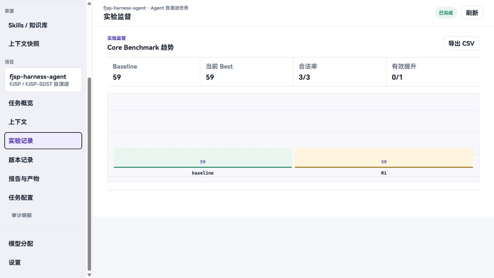
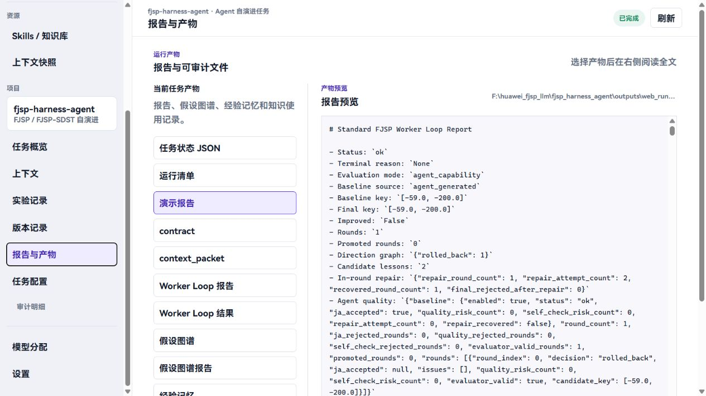

# FJSP Agent 本地部署与自建 DeepSeek 试用指南

本指南面向首次试用项目第三阶段 Agent 的用户，说明如何从 GitHub 拉取源码、配置自建 DeepSeek、启动网页服务，再提交一次算法演进任务并查看产物。“第三阶段”是项目阶段名称，不表示必须运行三个阶段或三轮。

主流程采用 Windows PowerShell 和 Docker Compose；不使用 Docker 的用户可按第五步原生启动。两种方式任选一种，不要同时占用同一端口。模型部署在远端，本地运行的是 Agent、网页服务和候选代码，不需要下载大模型或配置 GPU。

网页操作截图复用原设计文档第五章的真实界面，历史任务名称、数值和部分新增控件可能与首次试用不同。截图用于定位操作，不作为本次小算例的预期结果。

## 第一步 准备环境和访问权限

准备 Git、浏览器和项目仓库访问权限。Docker 路线还需要 Docker Engine 与 Compose；Windows 用户可使用 Docker Desktop 的 Linux 容器模式，安装及许可要求请由本单位 IT 确认。运行 `git --version`、`docker version` 和 `docker compose version` 检查工具；`docker version` 应包含服务端信息，仅显示客户端不代表引擎已启动。

确认能访问 GitHub、镜像和依赖下载站点，以及模型网关 `https://cpa.qiming.zone/v1`。如果公司网络限制外部访问，需要先开通对应访问权限。由项目管理员单独发放 API Key；不要在群聊、文档、截图或 Git 提交中传播密钥。多人试用建议发放可区分的凭据，并先约定并发额度。

官方安装资料：

- Docker Desktop：https://docs.docker.com/desktop/setup/install/windows-install/
- uv：https://docs.astral.sh/uv/getting-started/installation/
- OpenCode：https://opencode.ai/docs/
- Git：https://git-scm.com/downloads

## 第二步 从 GitHub 拉取源码

在较短、不含空格的工作目录中打开 PowerShell，例如 `C:\work`。执行：

```powershell
git clone --branch main https://github.com/xuqqqqq/FJSP-AGENT.git
cd FJSP-AGENT
git branch --show-current
git log -1 --oneline
```

预期当前分支为 `main`，目录中可看到 `README.md`、`.env.example`、`compose.yaml`、`harness_agent`、`examples` 和 `knowledge`。记录末条命令显示的提交号，便于反馈问题时确认版本。已有副本且没有本地改动时，可执行 `git switch main` 和 `git pull --ff-only origin main`；有改动时先保存自己的修改，不要强制覆盖。

如果提示 Repository not found，请先确认仓库地址及 GitHub 账号权限；不要将模型 API Key 当作 GitHub 登录凭据。Windows 出现 Filename too long 时，优先换用短目录重新拉取，不要把项目放在多层桌面或聊天软件临时目录下。

## 第三步 配置自建 DeepSeek

在项目根目录执行：

```powershell
Copy-Item .env.example .env
notepad .env
```

仅首次复制；已有 `.env` 时直接编辑，避免覆盖凭据。找到对应字段，启用并修改为以下内容；同一变量只保留一个有效定义：

```dotenv
FJSP_WEB_PORT=7860
QIMING_API_KEY=替换为管理员单独提供的密钥
QIMING_BASE_URL=https://cpa.qiming.zone/v1
OPENCODE_MODEL=qiming/deepseek-v4-flash
OPENCODE_MAIN_MODEL=qiming/deepseek-v4-flash
OPENCODE_WORKER_MODEL=qiming/deepseek-v4-flash
```

不要保留字面量“替换为管理员单独提供的密钥”。启用变量时删除行首 `#`，保存为 `.env`，不是 `.env.txt`。未使用官方模型时，`DEEPSEEK_API_KEY` 留空即可，不需要填写 `OPENAI_API_KEY`。

配置含义：`QIMING_*` 指向自建模型服务；三个 `OPENCODE_*` 字段指定 Agent 默认模型。网页使用的模型 ID 是 `qiming/deepseek-v4-flash`；直接调用模型 API 时，网关模型名为 `deepseek/deepseek-v4-flash`，两者不要混用。

若目录中存在 `.env.local`，检查是否有同名旧配置，避免它覆盖 `.env`。不要共享真实 `.env`，它已经被 Git 忽略。修改后需要重建容器或重启原生后端，使新进程加载配置。

## 第四步 使用 Docker 启动和检查

确保 Docker 引擎已启动，在项目根目录执行：

```powershell
docker compose up -d --build
docker compose ps
docker compose exec algoforge python -m harness_agent.cli worker-status
```

首次需要下载并构建镜像，耗时取决于网络。容器状态应为 running，并在健康检查完成后显示 healthy。`worker-status` 用于检查 OpenCode 运行时和 provider 配置，不代表已经成功发出模型请求。

浏览器打开 `http://127.0.0.1:7860/`，能看到工作台即表示前后端已启动。此工程由同一个 Web 服务提供前端静态页面和后端 API，无需再启动 npm 前端服务。可打开 `http://127.0.0.1:7860/healthz` 检查服务状态；页面健康并不保证模型凭据有效，实际连接在提交任务后继续确认。

常用命令：

```powershell
docker compose logs --tail 100 algoforge
docker compose up -d --force-recreate algoforge
docker compose down
```

修改 `.env` 后使用第二条重新创建容器，单纯 `restart` 不会重新注入 Compose 的环境变量。普通 `down` 保留命名卷；不要加 `-v`，否则会删除任务数据。若 7860 被占用，修改 `.env` 的 `FJSP_WEB_PORT` 后重新创建容器，并用新端口访问。



图1 网页工作台入口

## 第五步 不使用 Docker 时原生启动

采用第四步的用户直接跳到第六步。原生路线需要 Git、uv、Node.js/npm 和 OpenCode，Python 应满足仓库 `pyproject.toml` 的要求，当前为 3.10 或以上。按官方安装说明准备这些工具，再执行：

```powershell
uv sync --locked
npm install -g opencode-ai@1.17.11
opencode --version
uv run python -m harness_agent.cli worker-status
uv run python -m harness_agent.cli serve-web --host 127.0.0.1 --port 7860
```

以上命令均在项目根目录运行。终端出现监听地址后，保持该终端开启，浏览器访问 `http://127.0.0.1:7860/`。OR-Tools 等 Python 依赖由 `uv sync` 安装，不需要手动装进大模型服务。

如果找不到 `opencode`，先重新打开终端检查全局 npm 可执行目录是否在 PATH 中；也可以在 `.env` 指定 `OPENCODE_EXECUTABLE` 的绝对路径。修改 `.env` 后，先在后端终端按 Ctrl+C，再执行最后一条启动命令。原生与 Docker 的任务目录不同，切换部署方式不会自动迁移历史记录。

## 第六步 创建任务并上传三份材料

点击左侧“新建 / 载入示例”，填写容易辨认的任务名，例如“张三 标准FJSP 首次试用”。首次使用建议用仓库小算例确认整个链路，不要直接上传工业大算例。

依次选择以下三份文件：

1. 需求文档：`examples/standard_fjsp_requirement.md`。
2. IO 文档：`examples/standard_fjsp_io.md`。
3. FJSP 算例：`examples/standard_fjsp_tiny.fjs`。

上传后分别检查三个文本框内容非空。该小算例包含2个工件、2台机器、4道工序，适合验证部署和调用，不适合据此判断大规模求解水平。LB/UB/BKS 或“最优已知 CSV”可以留空。不导入 ZIP 起始项目时，系统从零生成求解器。

必须使用相互匹配的需求、IO 和算例，不能把标准 FJSP 文档配到含额外特性的变种实例上。成功跑通后，再选择 `docs/variants` 中对应的问题文档与匹配算例。



图2 任务名称与三份输入材料的上传位置

## 第七步 设置模型和首次试用预算

展开“运行参数”，Main Agent 模型和 Coding Worker 模型均选择 DeepSeek V4 Flash。它们对应自建 provider `qiming/deepseek-v4-flash`，不要选择官方 DeepSeek V4 Pro。Main、Worker 推理等级先保留“模型默认”。

推荐首次试用设置如下，截图中的旧数值仅示意控件位置，以本节设置为准：

- Main 规划模式：Fast Main，使用快速规划；Research 会调用专业分析 Agent，通常更慢，首次试用先不选。
- 迭代轮次：1；不限轮数：不勾选；主控累计预算：0，表示本次按轮数控制。
- 竞争 Coding Worker：1；Main 子 Agent 上限：0，适用于首次 Fast Main 链路验证。
- 随机种子：`0`；并行数：1；单次 Core 超时：60秒。
- Worker 单轮时间：900秒；Worker 步数上限：20。
- Local Trial 检查批次大小：1；晋升复验次数：1。

链路跑通后可将竞争 Coding Worker 改为3、迭代轮次改为2或3，并选择正常规模算例。先与管理员确认可用并发，因为多人同时运行会增加网关排队和本地 CPU 开销。

Worker 单轮时间限制的是一次编码尝试，不是任务总耗时；还会有初始求解器生成、修补、Main 规划与固定评价。自建模型延迟可能较大，不承诺固定完成分钟数。初始生成和正式演进是不同部分，设置1轮也可能先看到若干 Baseline Local Trial。



图3 模型与预算设置位置 历史界面截图

## 第八步 启动任务和判断运行状态

检查材料与参数后，点击“启动循环迭代”。系统会创建独立任务，并切换到任务概览。记录任务 ID，后续反馈问题或查找产物都使用这个 ID。首次试用不要重复点击启动，以免创建多个任务。

观察统一对话中的 Main Agent、Coding Agent 和 Core 事件。通常先识别输入、生成并验证 Baseline，再执行正式轮候选。Coding Agent 的局部测试用于修订，最终合法性和晋升由固定 Core 决定，不能只看 Worker 自报指标。

等待期间可使用页面“刷新”。关闭浏览器通常不会停止后端任务；关闭原生后端终端或停止容器会中断执行。需要停止任务时，使用页面对应的停止操作，而不是删除运行目录。

如果启用了换方向等待，系统在需要确认时提供短暂操作窗口；不确认时按页面说明保持原方向。首次试用建议不主动插入修改指令，让任务自然完成。



图4 任务概览中的 Agent 和 Core 事件 历史任务示意

## 第九步 查看最终结果

完成后点击“实验记录”，查看 Baseline、当前 Best、合法率和各轮结果。对于本指南的标准 FJSP 示例，主目标是最大完工时间 makespan，越小越好。对于变种，应以对应需求和 IO 文档中的目标定义为准。

候选合法并不必然晋升。只有通过固定评价与晋升检查、满足目标改进要求的候选才会替换正式版本；无改动、退化或不合法候选不会被包装为有效提升。某轮没有晋升并不表示整个任务失败，也不要求每轮都下降。

截图展示的是历史任务，不是上述 tiny 算例的标准答案。大模型生成具有不确定性，首次试用以“完成真实模型调用、生成代码、固定验证、产生合法结果和报告”为链路检查目标。



图5 Baseline 当前 Best 与正式轮结果 历史任务示意

## 第十步 查看报告和取得求解器代码

点击“报告与产物”，依次查看任务状态、运行清单、Worker Loop 报告和评测记录。左侧“版本记录”可重新选择历史任务，选中后查看它的结果与产物，注意不要把不同任务的指标混在一起。

原生部署的默认任务目录为 `outputs/web_runs/<任务ID>/`。任务状态在 `web_job_status.json`，主运行清单通常在 `run/standard_worker_loop/standard_worker_loop_manifest.json`。以实际运行清单的 `artifacts`、最终工作区或 incumbent 路径为准定位代码，不要把任意失败候选当成最终求解器。生成 solver 的默认相对文件名为 `examples/agent_generated_fjsp_solver.py`，实际以任务书和清单为准。

Docker 部署的数据在容器 `/app/outputs/web_runs/<任务ID>/` 及命名卷中，不会自动出现在宿主项目的 outputs 目录。将某个任务完整复制出来：

```powershell
# 将下面的任务ID替换为网页中记录的真实值
docker compose cp algoforge:/app/outputs/web_runs/任务ID ./任务ID
```

代码运行接口、依赖和参数以配套 IO 文档及运行清单记录的 solver 命令为准。共享结果时，可提供任务目录、版本提交号和日志；先检查是否含敏感输入或凭据，不要直接发送 `.env`。



图6 运行清单与过程报告入口 历史任务示意

## 第十一步 常见问题和反馈材料

页面打不开：先检查端口、后端终端或 `docker compose ps`。Docker 健康并不表示 API Key 有效；页面可打开但任务401/403时，检查密钥、权限和网关地址。404或 model not found 时，检查是否误选官方模型或混用了 API 模型名与 OpenCode 模型 ID。

429、provider retry 或等待较长：可能涉及网关并发额度、限流、服务延迟或网络；先看日志，不要立即同时再开多个任务。认证错误需要修正配置，重复开任务不能解决；修正 `.env` 后按部署方式重启或重建。

长时间没有新事件：查看服务日志和该任务 Worker 事件文件。状态不变不等于进程卡死，也可能仍在等待模型；若服务已退出、事件流长期不增长或重试耗尽，再联系管理员。不要修改 solver、评价器或任务状态文件来强行改变显示结果。

启动时缺依赖：Docker 路线检查镜像构建是否完成；原生路线执行 `uv sync --locked`，并确认用 `uv run` 启动，避免误用系统 Python。Windows 路径过长时使用短工作目录。

反馈时附：Git 提交号、部署方式、任务 ID、使用的模型 ID、问题发生时间、脱敏错误截图，以及 `docker compose logs --tail 100 algoforge` 或原生后端相应日志。请勿附 API Key。

## 多人试用与安全说明

优先各自在本地部署，统一访问远端模型服务。localhost 指试用者自己的电脑，不是模型服务器；多人同时使用同一网关时，额度和并发可能共享。

如要集中部署网页供多人访问，应由管理员配置受控网络、认证和访问权限；本指南的本地启动方式不是公网安全部署方案，不应直接将未保护的7860端口暴露到互联网。模型 Key 保存在后端配置中，不要求用户在网页聊天框中粘贴。

本手册已复用设计文档第五章的网页操作内容，并补齐源码获取、环境配置、启动检查与产物导出步骤。首次链路测试通过后，再组织正常规模算例与多特性验证。
