# A hybrid differential evolution algorithm for flexible job shop scheduling with outsourcing operations and job priority constraints

Hui Li a,\*, Xi Wang a, Jianbiao Peng b

a School of Information, Central University of Finance and Economics, Beijing, China

b School of Computer Science and Engineering, Central South University, Changsha, China

## A R T I C L E I N F O

Keywords: Flexible job shop scheduling problem Outsourcing Job priority Differential evolution Heuristic strategies

## A B S T R A C T

Owing to the increasing complexity of products and the specialization of enterprises, production outsourcing has become a common practice in industrial manufacturing. Moreover, different jobs feature various priorities in actual production. The previous research that aims to minimize the makespan may not be applicable in real scenarios. Therefore, this study investigates a flexible job shop scheduling problem with outsourcing operations and job priority constraints. We propose a sequence-based mathematical model aiming at minimizing weighted overdue days, which considers the outsourcing constraints and different overdue weights of jobs with different priorities. An efficient hybrid self-adaptive differential evolution algorithm with heuristic strategies (HSDE) is proposed to address this problem. In HSDE, a well-designed chromosome encoding and decoding method is presented. To eliminate individuals that do not satisfy the outsourcing constraints, we add a penalty term to improve the objective function. By considering heuristic strategies for initial chromosome generation, the proposed approach is able to achieve a high-quality initial population. Crossover and mutation operators with selfadaptive control of the parameters are established to enlarge the search range and accelerate the convergence speed. Finally, several experiments are conducted to verify the effectiveness of the proposed model and algorithm. Experimental results confirm that the proposed algorithm outperforms other algorithms both in efficiency and accuracy.

## 1. Introduction

Along with the sustained changes and segmentation of customer demand, market competition among manufacturers is becoming increasingly intense and challenging. In order to respond to such dynamics and remain competitive, an increasing number of aviation research and development (R&D) enterprises are gradually replacing traditional and repeated routines with one-time, ad-hoc project activities. However, in this development trend, aviation R&D enterprises are characterized by a wide range of products and noticeable differences owing to their various models, product types, parts, and huge differences between the products in each batch. Moreover, the production process of such enterprises is highly variable because they discretely engage in production and most of their products require the collaboration of other workshops, departments, or enterprises for completion. Thus, aviation R&D enterprises have gradually developed a production management mode based on large varieties and small batches of products. As a critical link in production management, the management of job shop scheduling directly affects the efficiency and cost of production. Therefore, it is crucial to study job shop scheduling problems (JSPs) and methods.

Job shop scheduling refers to the rational arrangement of the processing sequence and time of each workpiece with respect to the relevant equipment to ensure the optimal production performance of the selected target, considering the limited production resources and constraints of equipment and the process in an enterprise’s job shop. As an extension of the traditional JSP, the flexible job shop scheduling problem (FJSP) was first proposed by Brucker and Schlie (1990), after which it has drawn extensive attention, with the release of numerous research findings. These studies are mainly based on the assumption that all tasks are completed in one job shop, focusing on ways to minimize the maximum completion time, energy consumption, and cost or improve equipment usage or the balance between production lines. Yet, they are lacking in the optimization of job shop scheduling for minimizing the number of overdue days under the conditions that a part of the production processes is outsourced and a priority is set for different jobs. In the actual production, different jobs may have various priorities. A high priority is associated with strict requirements in terms of the order delivery time and high overrun costs. In addition, not all jobs in the workshop can be completed independently. Collaboration with other workshops/enterprises may be required to assist in completing some jobs (a.k.a. outsourcing). After the outsourcing is completed, the job may be returned to the original workshop to continue the subsequent production. In this case, if the outsourced process is timed within a fixed range by other auxiliary workshops, the related job arrangement in the workshop may require adjustments based on the fixed outsourcing time. If the outsourced process is set as the first step, the start time of the job is set; otherwise, the previous process of the job must be completed before the outsourced process.

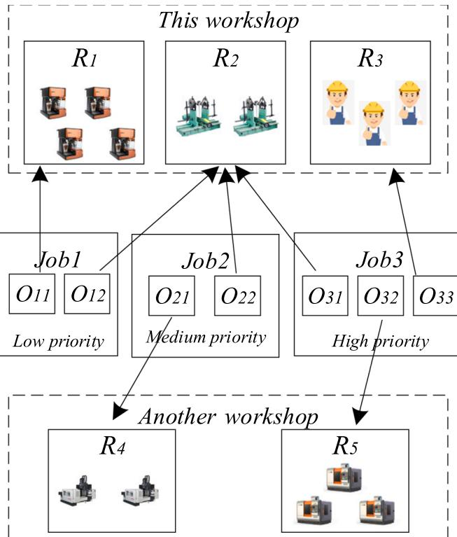  
Fig. 1. An instance with outsourcing operations and job priority.

Fig. 1 presents the research problem described above. There are three jobs and five types of production resources. Job 1 has a low priority and two operations, namely, $\mathrm { O } _ { 1 1 }$ and $\mathrm { O } _ { 1 2 } .$ Job 2 has a medium priority and two operations, namely, $\mathrm { O } _ { 2 1 }$ and ${ { \mathrm { O } } _ { 2 2 } } .$ Job 3 has a high priority and three operations, namely, $\mathrm { O } _ { 3 1 } , \mathrm { O } _ { 3 2 } ,$ , and ${ \bf O } _ { 3 3 } .$ . The five production resources are $\mathrm { R } _ { 1 } { \mathrm { - R } } _ { 5 } ,$ and each resource has a different number of machines or workers. $\mathrm { R } _ { 1 } , \mathrm { R } _ { 2 } ,$ and ${ \mathrm { R } } _ { 3 }$ belong to this workshop, and ${ \mathrm { R } } _ { 4 }$ and ${ \mathrm { R } } _ { 5 }$ require outsourcing. R can process $\mathrm { O } _ { 1 1 } ;$ R can process $O _ { 1 2 } , O _ { 2 2 } ,$ and $\mathrm { O } _ { 3 1 } ;$ ; R3 can process ${ \mathrm { O } } _ { 3 3 } ;$ R4 can process $\mathrm { O } _ { 2 1 }$ , and ${ \mathrm { R } } _ { 5 }$ can process ${ \bf O } _ { 3 2 } .$ . Each operation requires a machine or worker of the resource.

In practice, the production time of similar/same processes required for different jobs may not be consistent. Under the conditions of a fixed outsourcing time and different job priorities, we consider the following two scenarios to minimize the number of overdue days.

1) If different machines or workers in each resource require the same amount of time to complete the same operation, how should the resources be allocated for each operation?

2) If the machines/workers in one type of resource exhibit different characteristics (such as skill levels and work experience), they would require different processing times to handle the same operation. Then, how to allocate resources and operations?

Herein, we propose a new model of flexible job shop scheduling with outsourcing operations and job priority to minimize overdue days. This problem is still a nondeterministic polynomial time (NP)-hard problem, and its solution becomes more complicated under the influence of multiple constraints. Therefore, a hybrid approach that combines heuristic strategies and adaptive differential evolution (DE) algorithm is designed. Randomly generated chromosomes computed using the traditional evolution algorithm may hardly meet the requirements of the fixed time of the outsourced operations. Hence, we improve the initial chromosome generation method using a heuristic strategy and optimize the computation by adopting the adaptive DE algorithm with global and local search capabilities to improve the computational efficiency.

The remainder of this paper is organized as follows. In Section 2, we review the relevant literature. In Section 3, we present the FJSP and a mathematical programming model with outsourcing operations and job priority constraints. In Section 4, we present the proposed hybrid algorithm. In Section 5, we conduct several experiments and compare the performance of the hybrid algorithm with other algorithms. Concluding remarks are presented in Section 6.

## 2. Literature review

## 2.1. FJSP variants

FJSP is a well-known combinatorial optimization problem (Chaudhry & Khan, 2016). Recently, numerous studies have been conducted based on some new features or constraints under actual production conditions. Zheng and Wang (2016) presented a dual-resource constrained FJSP by considering job sequence, machine assignment, and worker assignment altogether. Mokhtari and Hasani (2017) studied the energy-efficient FJSP. Li, Huang, Wu, & Guo (2020) investigated a jobshop scheduling problem with variable processing speed constraints. Kubiak, Feng, Li, Sethi, and Sriskandarajah (2020) studied a FJSP with parallel machines. Some studies addressed dynamic FJSP under a dynamic environment with unpredicted events, such as new job arrivals (Caldeira, Gnanavelbabu, & Vaidyanathan, 2020; Zhang, Mei, Nguyen, & Zhang, 2020), uncertain machine state (Feng, Hong, Li, Zheng, & Tan, 2020). Li, Liu, Li, and Zheng (2020) studied a FJSP with high levels of uncertainty considering type-2 fuzzy processing time. Jiang and Wang (2020) addressed the flexible job shop scheduling under time-of-use electricity prices. From the outlined literature on FJSPs, most of them have considered the realistic constraints of the problem. However, outsourcing operations and job priority constraints are seldom considered together.

Moreover, multiple times are another important characteristic of many practical real-world scheduling settings. Lots of previous research only considered the processing time of each operation, however, the FJSP with setup time and transportation time gets more attention recently (Li, Deng et al., 2020). Shen, Dauz\`ere-P´er\`es, and Neufeld (2018) explored the FJSP with sequence-dependent setup times and thought the setup times were determined by the current job as well as the direct previous job processed on the same machine. Dai, Tang, Giret, and Salido (2019) developed a multi-objective optimization model for the FJSP with transportation constraints. Zhang, Hu, Sun, and Zhang (2020) analyzed an FJSP involving the processing time and the time required for assembly and transportation. They proposed an improved genetic algorithm (GA) for solving the problem with the objectives of optimizing and minimizing the maximum completion time, total installation time, and total transportation time.

In a practical manufacturing system, jobs may have higher or lower priorities (Caron, Hansen, Jaumard, 1999; Volgenant, 2004). Jobs belonging to higher priority classes need to be assigned first. In addition, many products which are organized as hierarchical Bills-Of-Materials and jobs become restricted by precedence constraints. Lee, Moon, Bae, and Kim (2012) solved flexible job-shop scheduling problems with ‘AND’/‘OR’ precedence constraints in the operations. Zhu and Zhou (2020, 2021) studied the FJSP with hierarchical job precedence constraints. These constraints may increase the complexity of the optimal solution.

Although there is no previous work on outsourcing operations constraints, some researchers have considered that jobs can be processed in multiple workshops. Meng, Zhang, Ren, Zhang, and Lv (2020) addressed the distributed flexible job shop scheduling problem and proposed four mixed-integer linear programming (MILP) models as well as a constraint programming (CP) model to solve the problem. Luo et al. (2020) considered a distributed flexible job shop scheduling problem, in which jobs can be processed in multiple factories by transfers. Zhang, Li, Zhang, and Wang (2020) studied the production scheduling problem in a flexible manufacturing system with two adjacent working areas, whose products are produced in one area before they are transported to the other area for assembly.

## 2.2. Scheduling algorithms

Since Jackson (1955), Johnson (1954), and Smith (1956) introduced a scientific and systematic approach to address this problem, the study of production scheduling has gradually become standardized and theorized. Moreover, numerous research findings have led to the gradual establishment and improvement of the production scheduling theory. Recently, in addition to the traditional scheduling methods based on operational research or heuristic strategies, new methods based on numerous algorithms and techniques, such as the simulated annealing algorithm (Cruz-Chavez, ´ Martínez-Rangel, & Cruz-Rosales, 2017), GA (Dai et al., 2019), tabu search algorithm (Vela, Afsar, Palacios, Gonzalez-Rodríguez, ´ & Puente, 2020), memetic algorithm(Abedi, Chiong, Noman, & Zhang, 2020), ant colony algorithm (Ebrahimi, Jeon, Lee, & Wang, 2020), particle swarm optimization algorithm (Ding & Gu, 2020), and variable neighborhood search algorithm(Ahmadian, Salehipour, & Cheng, 2021), have been proposed as resolutions for production scheduling problems. These studies have significantly enriched the theory and methods of production scheduling.

The heuristic strategy-based approach refers to the guidance and influence that can be biased toward a certain result using some parameters and rules. Then, the computation process becomes simple, thus saving the computational time. It also assists data convergence with respect to a particular type of result as soon as possible based on generalization or helps in achieving the optimal balance between the scheduling policy search and a convergence time at a minimal system cost. Jain and Meeran (1999) summarized heuristic-strategy-based approaches for solving the static JSP. Mohanasundaram, Natarajan, Viswanathkumar, Radhakrishnan, and Rajendran (2003) proposed some effective scheduling rules for minimizing the maximum process time, phase delay, and maximum job delay for a class of multi-layer manufacturing JSPs.

Owing to characteristics of practical engineering problems, such as the complexity, large scale, uncertainty, nonlinearity, modeling difficulty, and others, intelligent optimization algorithms have been emerged. From an engineering perspective, it’s difficult to find the optimal and exact scheduling solution in a reasonable and finite time. Hence, the most reasonable approach is to find an approximate and useful solution. Li and Gao (2016) proposed a hybrid algorithm combining the GA and tabu search algorithm. Karunakaran, Mei, Chen, and Zhang (2017) formulated assignment rules for dynamic JSPs in uncertain environments based on a genetic programming hyper heuristic algorithm. Using a partial scheduling mechanism based on the standard deviation and a cooling scheduling mechanism, Cruz-Chavez ´ et al. (2017) accelerated the simulated annealing algorithm and applied it to the FJSP. Abedi et al. (2020) studied a FJSP with deteriorating machines and proposed a multi-population and multi-objective memetic algorithm. Ahmadian et al. (2021) considered the just-intime JSP, where any deviation in the job completion time from its delivery time is subject to an early or late penalty. They proposed a vari able neighborhood search algorithm for solving the problem. Caldeira and Gnanavelbabu (2021) analyzed a multi-objective FJSP and proposed a discrete Jaya algorithm and a neighborhood local search technique to solve the problem. In terms of the scheduling theory, the current research focus has shifted from traditional heuristics to intelli gent scheduling, and intelligent search algorithms have been increasingly adopted.

The DE algorithm is a population-based adaptive global optimization algorithm proposed by Storn and Price (1995), which includes mutation, crossover, and selection operators. Compared with GA, DE exhibits the characteristics of a simple structure, easy implementation, and fast convergence; hence, it is widely used in various fields. Xu et al. (2013) proposed a hybrid discrete differential evolution algorithm to solve the lot splitting problem with equipment capacity constraints in flexible job shop scheduling. Yuan and Xu (2013) presented a hybrid differential evolution algorithm for solving the FJSP. They developed a novel conversion mechanism to make DE work on the continuous domain and embedded a local search algorithm based on the critical path to enhance the local searching ability. Zhao, Shao, Wang, and Zhang (2016) proposed a hybrid differential evolution and estimation of distribution algorithm based on neighborhood search to solve the FJSP. Mahmoodjanloo, Tavakkoli-Moghaddam, Baboli, and Bozorgi-Amiri (2020) proposed an adaptive DE algorithm for efficiently solving the FJSP. Gao, Wang, and Pedrycz (2020) analyzed an FJSP with fuzzy execution time and completion time and proposed an improved DE algorithm with a new selection mechanism to solve it.

Although considerable research related to the FJSP has been conducted, the scheduling problem with a fixed outsourcing time and task priority differences analyzed in this study is rare. Moreover, many studies have focused on production scheduling algorithms. Heuristic strategies-based approaches offer advantages such as high computational efficiency, good real-time performance, and good flexibility; however, their performance is not universal and general because it de pends on the type of scheduling problems being solved. Furthermore, as the quality of the optimization of the solution is poor, these approaches should be used in combination with other methods. Intelligent sched uling algorithms focus on coding research and particularly require the consideration of suitable means to demonstrate the state and process of the production scheduling problem. They must also handle various constraints and assist relevant optimization mechanisms for effective search. Thus, for specific problems, previous intelligent algorithms are not necessarily applicable and require corresponding improvements based on the characteristics of the problems. In conclusion, the research presented in this paper has good practical significance and a theoretical value.

## 3. Problem statement

## 3.1. Problem description

A FJSP with outsourcing operations and job priority constraints can be defined as follows

A production workshop receives J independent jobs, in which each job contains a procedure set O. The type and quantity of each job could be different, and each job must be completed according to the sequence of procedures. Each job has a priority P, and jobs with a higher priority must be prioritized. The delivery date of each job could also be different. There are various production resources, such as machines and workers, in the workshop. The same type of machines or workers constitute a resource group R. There are multiple machines or workers of the same type in each resource group, and the number of resources in each resource group may vary. Each operation of each job will be allocated to one resource group. The preparation time with respect to different resources in the resource group is consistent; however, their processing time may vary. Moreover, each operation may need accessories, such as tools and fixtures, to complete the production; however, the quantity of each type of accessory is limited. When one job requires outsourcing, the planner must apply for assistance from other workshops, and other workshops will provide feedback pertaining to the available assistance time to this workshop. Therefore, this workshop must arrange the resources of each operation and the production sequence of resources as well as meet the outsourcing constraints under fixed outsourcing time conditions to ensure that the overdue days of all jobs with different priorities are minimized.

<table><tr><td rowspan="2">Jobs</td><td rowspan="2">Priority</td><td rowspan="2">Operations</td><td colspan="2">This workshop</td><td colspan="3">Another workshop</td></tr><tr><td>Resources</td><td>preparation and processing time of different machines or workers (unit: minute)</td><td>Resources</td><td>outsourcing start and end time</td><td>preparation and processing time (unit: minute)</td></tr><tr><td rowspan="3"> $J_1$ </td><td rowspan="3">1</td><td> $O_{11}$ </td><td> $R_1(M_1,M_2)$ </td><td>{10, 40}, {10, 40}</td><td>—</td><td>—</td><td>—</td></tr><tr><td> $O_{12}$ </td><td> $R_2(M_3,M_4)$ </td><td>{10, 15}, {10, 20}</td><td>—</td><td>—</td><td>—</td></tr><tr><td> $O_{13}$ </td><td> $R_3(W_1,W_2)$ </td><td>{5, 15}, {5, 20}</td><td>—</td><td>—</td><td>—</td></tr><tr><td rowspan="2"> $J_2$ </td><td rowspan="2">2</td><td> $O_{21}$ </td><td>—</td><td>—</td><td> $R_4$ </td><td>[30,90]</td><td>{20, 30}</td></tr><tr><td> $O_{22}$ </td><td> $R_2(M_3,M_4)$ </td><td>{5, 35}, {5, 30}</td><td>—</td><td>—</td><td>—</td></tr><tr><td rowspan="4"> $J_3$ </td><td rowspan="4">3</td><td> $O_{31}$ </td><td> $R_1(M_1,M_2)$ </td><td>{10, 20}, {10, 25}</td><td>—</td><td>—</td><td>—</td></tr><tr><td> $O_{32}$ </td><td> $R_2(M_3,M_4)$ </td><td>{10, 35}, {10, 40}</td><td>—</td><td>—</td><td>—</td></tr><tr><td> $O_{33}$ </td><td>—</td><td>—</td><td> $R_5$ </td><td>[90,145]</td><td>{15, 40}</td></tr><tr><td> $O_{34}$ </td><td> $R_1(M_1,M_2)$ </td><td>{5, 35}, {5, 35}</td><td>—</td><td>—</td><td>—</td></tr><tr><td rowspan="3"> $J_4$ </td><td rowspan="3">1</td><td> $O_{41}$ </td><td> $R_2(M_3,M_4)$ </td><td>{10, 20}, {10, 22}</td><td>—</td><td>—</td><td>—</td></tr><tr><td> $O_{42}$ </td><td> $R_3(W_1,W_2)$ </td><td>{10, 40}, {10, 40}</td><td>—</td><td>—</td><td>—</td></tr><tr><td> $O_{43}$ </td><td> $R_3(W_1,W_2)$ </td><td>{5, 20}, {5, 15}</td><td>—</td><td>—</td><td>—</td></tr></table>

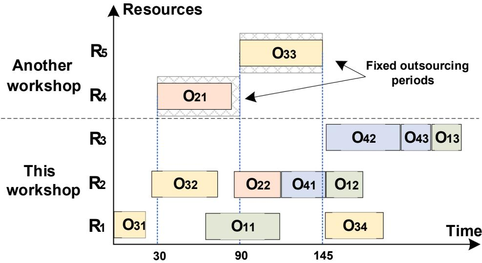  
Fig. 2. An example of the outsourcing operation constraints.

Table 1 and Fig. 2 present a simple example of this problem. There are two production workshops, one is this workshop and the other is the outsourcing workshop. This workshop has three resource groups, while the outsourcing workshop has two outsourcing resource groups. This workshop has several machines or workers in each resource group. There are four jobs, involving 3, 2, 4, and 3 operations, and their pri orities are 1, 2, 3, and 1, respectively. The 1st and 4th jobs have the highest priority, followed by the 2nd job, and the job with the lowest priority is the 3rd job. The preparation and processing times for each operation are provided in the 5th and 8th columns in Table 1 (the processing time of any operation may be the same or different for different machines or workers in the resource group). Outsourcing constraints determine the available start and end times for the outsourcing operations (the gray shaded part in Fig. 2). Based on these requirements, we provide a feasible production scheduling scheme (Fig. 2).

Moreover, the following assumptions are considered for the problem described in this study.

1) Each resource can process only one operation at any time, and each operation can be processed by only one resource at any time.

2) An operation cannot be interrupted after it has started, and it cannot be processed until its preceding operation(s) are completed.

3) A joint batch and a divided batch of jobs are not considered.

4) The moving time between the resources is included in the prepara tion time.

5) The preparation and processing times of the operations corresponding to different machines or workers are predefined.

6) All machines and workers are assumed to be ready and available at time zero.

## 3.2. Mathematical modeling

To reflect the characteristics of this problem, a mixed-integer programming mathematical model is established to arrange appropriate resources and production sequences for each operation of all jobs.

## 1) Notations

N: numbers, index of numbers n ∈ $N = \{ 1 , 2 , 3 \cdots \}$

R: resource groups, index of groups $r \in R = \{ 1 , 2 , 3 \cdots \}$

$N _ { r } \mathrm { : }$ number of machines or workers in resource group r

$r _ { t y p e } \mathrm { : }$ 1 if this resource is a machine set and 0 if this resource is a worker set

• trn : preparation time $\operatorname { i f } O _ { j i }$ processed on resource n of the resource group r

• $t _ { i i b } ^ { m . } ;$ processing time i $\textmd { ‰}$ processed on resource n of the resource group r

Z: fixtures, index of fixtures $z \in Z = \{ 1 , 2 , 3 \cdots \}$

H: attachments, index of attachments $h \in H = \{ 1 , 2 , 3 \cdots \}$

P: cutter tools, index of cutter tools $p \in P = \{ 1 , 2 , 3 \cdots \}$

• J: jobs, index of jobs j ∈ J = {1, 2, 3⋯}

• Sj: start time of job j

• Lj: delivery time of job j

• Pj: priority of job j

• $N _ { j } { \mathrm { : } }$ quantity of job j

• $d _ { j } \colon$ workshop number of job j

• I: operations, index of operations $i \in I = \{ 1 , 2 , 3 \cdots \}$

• Oji: operation i of job j

• r : resource group number of operation $O _ { j i }$

• $h _ { j i } \colon$ attachment set used for operation $O _ { j i }$

• $z _ { j i } \mathrm { : }$ fixture set used for operation Oji

$p _ { j i } \colon$ cutter toolset used for operation $O _ { j i }$

• $d _ { j i } \colon$ workshop number for operation $O _ { j i } ,$ which needs outsourcing when $d _ { j i } \neq d _ { j }$

$T _ { i i } ^ { w s . }$ available outsourcing start time of operation $O _ { j i }$

$T _ { j i } ^ { w l . } \mathrm { : }$ available outsourcing end time of operation $O _ { j i }$

α(Pj): weight corresponding to priority Pj of job j

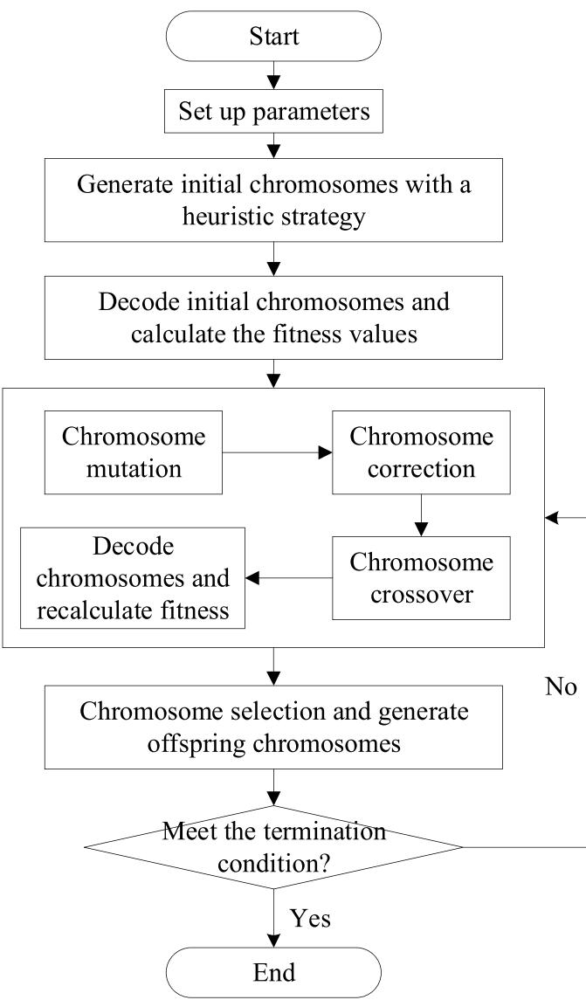  
Fig. 3. The framework of HSDE.

## 2) Auxiliary variables

$T _ { j i } ^ { a , } :$ preparation time of operation $O _ { j i }$

$T _ { j i } ^ { b . } \mathrm { : }$ processing time of operation $O _ { j i }$

$T _ { j i } ^ { a s , }$ : preparation start time of operation $O _ { j i }$

$T _ { j i } ^ { a l . } \qquad $ preparation end time of operation $O _ { j i }$

$T _ { j i } ^ { b s . }$ processing start time of operation $O _ { j i }$

$T _ { j i } ^ { b l . } \mathrm { : }$ processing end time of operation $O _ { j i }$

## 3) Decision variables

xrnji : 1 if $O _ { j i }$ is processed on resource n of the resource group r and 0 otherwise $y _ { j i j i } ^ { r n } ;$ : if operation $O _ { j i }$ is scheduled using the nth machine/worker of the resource group r before $O _ { j i }$ , then $y _ { j i j i } ^ { r n } = 1 ;$ it is $^ { 0 , }$ otherwise.

## 4) Objective function

Our model minimizes delivery delays for all jobs. First, with the end time of each operation $T _ { j i : } ^ { b l }$ , we calculate the planned completion time of each job j:

$$
T _ {j} ^ {b l} = \max _ {i} T _ {j i} ^ {b l}, \forall i \in I.
$$

Then, when job j is overdue, i.e., $T _ { j } ^ { b l } > L _ { j } ,$ , we achieve the overdue days as $T _ { j } = \left\lceil T _ { j } ^ { v l } - L _ { j } \right\rceil$ where the square bracket refers to the rounding up to an integer.

Finally, based on the priority of different jobs, we obtain the objective function as follows.

$$
f (x, y) = \min \sum_ {j} \alpha \left(P _ {j}\right) T _ {j}\tag{1}
$$

5) Constraints

$$
T _ {j i} ^ {a} = \sum_ {r} \sum_ {n} t _ {j i a} ^ {r n} \cdot x _ {j i} ^ {r n}, T _ {j i} ^ {b} = \sum_ {r} \sum_ {n} t _ {j i b} ^ {r n} \cdot x _ {j i} ^ {r n}, \forall i \in I, j \in J, r \in R, n \in N\tag{2}
$$

$$
T _ {j i} ^ {a l} - T _ {j i} ^ {a s} = T _ {j i} ^ {a}, T _ {j i} ^ {b l} - T _ {j i} ^ {b s} = T _ {j i} ^ {b} + T _ {j i} ^ {b} \cdot N _ {J _ {i}}, \forall i \in I, j \in J\tag{3}
$$

$$
T _ {j (i + 1)} ^ {a s} \geq T _ {j i} ^ {b l}, \quad \forall i, i + 1 \in I, j \in J
$$

(4)

$$
\sum_ {r} \sum_ {n} x _ {j i} ^ {r n} = 1, \quad \forall i \in I, j \in J\tag{5}
$$

$$
\text { If } r _ {j i} = r _ {j (i + 1)} \text { and } r _ {\text { type }} = 1, \text { then } x _ {j i} ^ {r n} = x _ {j (i + 1)} ^ {r n}. \forall i, i + 1 \in I, j \in J\tag{6}
$$

$$
\left\{ \begin{array}{l} T _ {j ^ {\prime} i ^ {\prime}} ^ {a s} \geq T _ {j i} ^ {b l} - V (2 - x _ {j i} ^ {r n} - x _ {j ^ {\prime} i ^ {\prime}} ^ {r n} + y _ {j ^ {\prime} i ^ {\prime} j i} ^ {r n}) \\ T _ {j i} ^ {a s} \geq T _ {j ^ {\prime} i ^ {\prime}} ^ {b l} - V (3 - x _ {j i} ^ {r n} - x _ {j ^ {\prime} i ^ {\prime}} ^ {r n} - y _ {j ^ {\prime} i ^ {\prime} j i} ^ {r n}) \end{array} \right.\tag{7}
$$

$$
\forall r \in R, n \in N, i, i ^ {\prime} \in I, j, j ^ {\prime} \in J, O _ {j ^ {\prime} i ^ {\prime}} \neq O _ {j i}
$$

$$
N _ {z} ^ {t} \leq N _ {z}, N _ {f} ^ {t} \leq N _ {f}, N _ {p} ^ {t} \leq N _ {p}, \forall t \leq \max _ {j} \left(T _ {j} ^ {b l}\right)\tag{8}
$$

$$
\exists j \in J, \text {   then   } \min _ {i} \left(T _ {j i} ^ {a s}\right) \geq S _ {j} \geq 0\tag{9}
$$

$$
\forall i \in I, j \in J \quad \text { if } \quad d _ {j i} \neq d _ {J _ {i}}, \exists T _ {j i} ^ {w s}, T _ {j i} ^ {w l}, \quad \text { then } \quad T _ {j i} ^ {a s} \geq T _ {j i} ^ {w s}, T _ {j i} ^ {b l} \leq T _ {j i} ^ {w l}.\tag{10}
$$

$$
x _ {j i} ^ {r n} \in \{0, 1 \}, \quad \forall r \in R, n \in N, i \in I, j \in J\tag{11}
$$

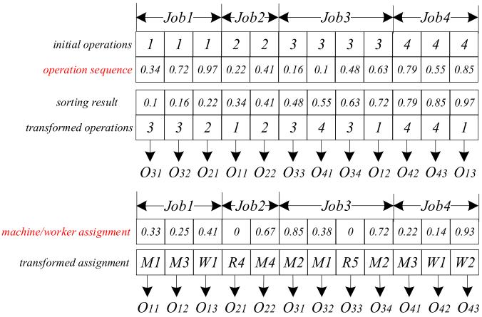  
Fig. 4. An example of the two-vector solution representation for the instance in Table 1 and Fig. 2.

$$
y _ {j i j ^ {\prime} i ^ {\prime}} ^ {r n} \in \{0, 1 \}, \quad \forall r \in R, n \in N, i \in I, j \in J\tag{12}
$$

Constraint set (2) implies that when a resource is selected for operation $O _ { j i } ,$ the preparation and processing times are determined. Constraint set (3) represents the preparation and processing time constraints of any operation. Constraint set (4) indicates that the operating time of jobs between each operation is subject to sequential constraints. Constraint set (5) implies that any operation $O _ { j i }$ can only be processed once by one resource. Constraint set (6) implies that if the neighboring operations of a job use the same resource group and the resource group contains machines, they should be scheduled to the same machine. Constraint set (7) implies that each resource can only process one operation at any time. Constraint (8) implies that the number of accessories, tools, and cutters used simultaneously at any time cannot exceed their total number. Constraint set (9) implies that the start time of any operation must be after that of the job. Constraint set (10) indicates that the operations to be outsourced must be completed within a given time. Constraint sets (11) and (12) specify that the decision variables x and y are binary variables.

## 4. The proposed algorithm

## 4.1. Framework of the proposed hybrid algorithm

To solve the problem described herein, this study proposes a hybrid self-adaptive differential evolution algorithm with heuristic strategies (HSDE). The major control parameters of the DE algorithm are the population size, mutation factor $\mathrm { F } ,$ and crossover factor CR. The F and CR values and the selection of the mutation strategy considerably influence the performance of the algorithm, which not only affects the diversity of the population but also affects the global optimization and local search capabilities of the algorithm. Therefore, this study improves the adaptive mutation and crossover operators and the selection of the mutation strategy. Moreover, a heuristic strategy is introduced to generate additional initial feasible chromosomes. The framework of the hybrid algorithm is presented in Fig. 3.

1) Set key parameters, such as the population size, mutation factor, cross factor, and genetic algebra.

2) Design the chromosome encoding and decoding method. Because the variables in the DE algorithm are continuous, these methods are different from the traditional methods.

3) Propose a heuristic strategy and generate initial chromosomes.

4) A penalty is added to the overdue objective function when the chromosomes do not conform to the outsourcing time constraints. Then, the fitness function is obtained.

5) Chromosome mutation, crossover, and then decode and recalculate fitness.

6) Chromosome selection and generate offspring chromosomes.

7) Repeat the above steps until the largest number of allowed evolution iterations is reached.

## 4.2. Chromosome encoding and decoding

Chromosomes consist of two layers, among which one is the operation sequence vector, whereas the other is the resource (machine or worker) assignment vector. To satisfy the constraint (5), we combine the neighboring operations of a job scheduled to the same machine group into a whole operation group for assignment. The data in Table 1 are considered as examples for chromosome encoding, and the results are shown in Fig. 4.

The operation sequence vector represents the processing order of operations, and the values are randomly generated between 0 and 1. Before decoding, we must sort the random numbers in order and then perform a transformation as shown in Fig. 4, to achieve the process order. The total number of occurrence times of each job number is the total number of procedures in the job, and the number of occurrence times of each job number represents the number of procedures in the job. The processing order of the operations in all jobs can be known based on this vector.

The resource assignment vector represents the machine or worker number assigned to each operation, and the values are also generated randomly between 0 and 1. When converting the random values to resource numbers, a probability matrix P is required, which is established according to the processing time of each operation on different machines/workers in one group. As shown in Table 1 and Table 2, O12 can be assigned to ${ { \bf { M } } _ { 3 } }$ or $\mathrm { M } _ { 4 } ,$ , with a processing time of 25 and 30 mi nutes, respectively. Then, we can get $\mathrm { P } _ { 1 2 } ^ { M 3 } = 2 5 / ( 2 5 + 3 0 ) \approx 0 . 4 5 , \mathrm { P } _ { 1 2 } ^ { M 4 } =$ $( 2 5 + 3 0 ) / ( 2 5 + 3 0 ) = 1$ . This implies that M is selected when the $\mathrm { O } _ { 1 2 }$ value in this vector satisfies $0 \leq \nu _ { 1 2 } \leq 0 . 4 5$ and $\mathrm { M } _ { 4 }$ is selected when it satisfies $0 . 4 5 < \nu _ { 1 2 } \leq 1$ . For example, 0.25 corresponding to $\mathbf { O } _ { 1 2 }$ in Fig. 4 will be converted to $\mathrm { M } _ { 3 } ,$ , and so on. The operations processed in this workshop will be arranged to a specific machine or worker number; however, for the outsourcing operations, only the resource group number will be displayed.

As described above, only the sequence of process processing and resource number are set in encoding. Then, the accessory constraints, such as fixtures, attachment, tools, and outsourcing constraints must be considered in decoding. Moreover, owing to the random generation of chromosomes, it may lead to the mismatch of the outsourcing constraints. To distinguish this type of chromosomes, we add a penalty Γ to their objective value f as a new target Ψ. As shown in Fig. 5, Γ is obtained by multiplying the offset of the outsourcing time and the actual arranged time using a large constant Φ. Consequently, chromosomes that do not meet the outsourcing constraints will be eliminated during the iterations.

Table 2  
Probability matrix for machine/worker assignment.

<table><tr><td>Jobs</td><td colspan="3"> $J_1$ </td><td colspan="2"> $J_2$ </td><td colspan="4"> $J_3$ </td><td colspan="3"> $J_4$ </td></tr><tr><td>Operations</td><td> $O_{11}$ </td><td> $O_{12}$ </td><td> $O_{13}$ </td><td> $O_{21}$ </td><td> $O_{22}$ </td><td> $O_{31}$ </td><td> $O_{32}$ </td><td> $O_{33}$ </td><td> $O_{34}$ </td><td> $O_{41}$ </td><td> $O_{42}$ </td><td> $O_{43}$ </td></tr><tr><td> $M_1$ </td><td>0.5</td><td>—</td><td>—</td><td>—</td><td>—</td><td>0.55</td><td>—</td><td>—</td><td>0.5</td><td>—</td><td>—</td><td>—</td></tr><tr><td> $M_2$ </td><td>1</td><td>—</td><td>—</td><td>—</td><td>—</td><td>1</td><td>—</td><td>—</td><td>1</td><td>—</td><td>—</td><td>—</td></tr><tr><td> $M_3$ </td><td>—</td><td>0.45</td><td>—</td><td>—</td><td>0.53</td><td>—</td><td>0.47</td><td>—</td><td>—</td><td>0.48</td><td>—</td><td>—</td></tr><tr><td> $M_4$ </td><td>—</td><td>1</td><td>—</td><td>—</td><td>1</td><td>—</td><td>1</td><td>—</td><td>—</td><td>1</td><td>—</td><td>—</td></tr><tr><td> $W_1$ </td><td>—</td><td>—</td><td>0.44</td><td>—</td><td>—</td><td>—</td><td>—</td><td>—</td><td>—</td><td>—</td><td>0.5</td><td>0.56</td></tr><tr><td> $W_2$ </td><td>—</td><td>—</td><td>1</td><td>—</td><td>—</td><td>—</td><td>—</td><td>—</td><td>—</td><td>—</td><td>1</td><td>1</td></tr></table>

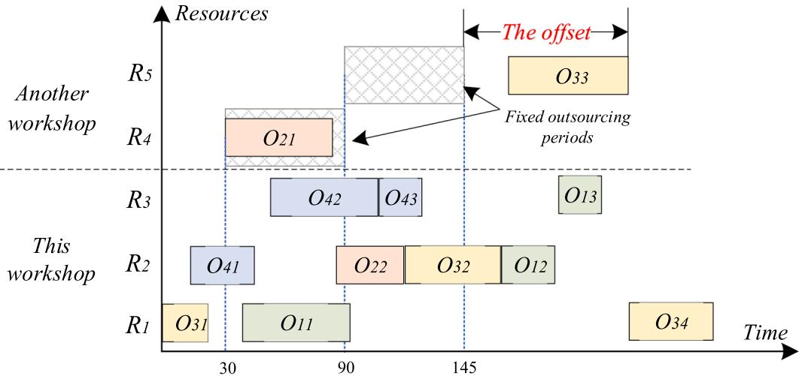  
Fig. 5. An example of penalty against an outsourcing time constraint.

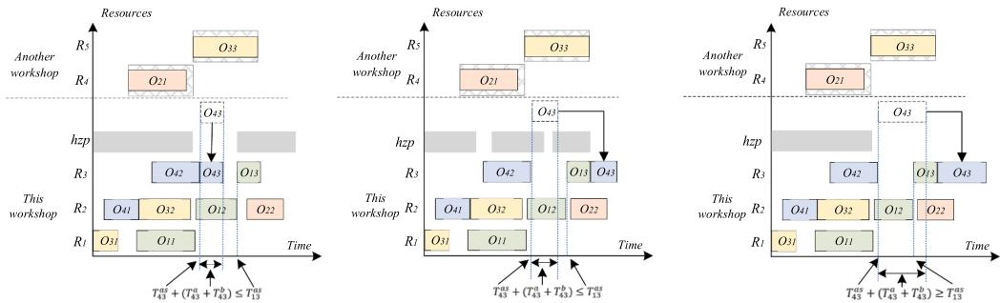  
Fig. 6. An efficient decoding method with operation insertion.

The detailed steps of an effective decoding method are as follows.

Step 1: Divide a chromosome into the operation sequence and resource assignment vectors.

Step 2: Extract and transform the machine or worker number from the resource assignment vector and then determine the preparation and processing times of operation $O _ { j i } , \mathrm { i . e . , } T _ { j i } ^ { a } = t _ { j i a } ^ { r n } , T _ { j i } ^ { b } = t _ { j i b } ^ { r n }$

Step 3: Read each gene in the operation sequence vector in the sequential order and distinguish its operation $O _ { j i }$

Step 4: If an operation is outsourced, $T _ { j i } ^ { a s }$ can be calculated using constraint set (3) and then $T _ { j i } ^ { a l } , T _ { j i } ^ { b s } , T _ { j i } ^ { b l }$ are obtained. Next, we discuss different situations: ① if $T _ { j i } ^ { a s } \geq T _ { j i } ^ { w s } a n d T _ { j i } ^ { b l } \leq T _ { j i } ^ { w l }$ , the outsourcing con straints are satisfied; ② if $T _ { j i } ^ { a s } < T _ { j i } ^ { w s }$ , we can update $T _ { j i } ^ { a s } = T _ { j i } ^ { w s }$ and then the outsourcing constraints are satisfied; $\textcircled { 3 } \mathrm { i f } T _ { j i } ^ { b l } > T _ { j i } ^ { w l }$ , the outsourcing constraints are not satisfied and the penalty value $\mathrm { Y } _ { j { i \atop j } }$ will be calculated.

Step 5: If an operation is processed in this workshop, we first obtain its preparation start time $T _ { j i } ^ { a s }$ using constraint set (4) and the processing time $T _ { j i } ^ { a } , T _ { j i } ^ { b }$ using constraint set (3). Then, the resource number rn and the required accessory set $( h _ { j i } , z _ { j i } , p _ { j i } )$ are obtained. Next, we calculate the idle periods of the resource rn and the required accessories to be greater than or equal to $T _ { j i } ^ { a s } :$ , and then use them to get the intersection of their idle periods. Thereafter, as shown in Fig. 6, the earliest period is determined and the operation is inserted. Finally, we can get $T _ { j i } ^ { a s } , T _ { j i } ^ { a l } , T _ { j i } ^ { b s }$ $T _ { j i } ^ { b l } .$ . If accessories are needed, the usage time of the accessories must be updated. The operation sequence vector represents the sequence of

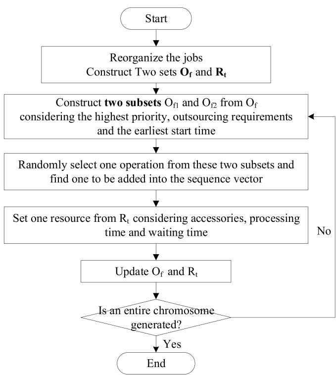  
Fig. 7. The steps of heuristic population initialization.

Table 3  
Evolutionary strategies of DE.

<table><tr><td>Strategies</td><td>Equations</td></tr><tr><td>rand/1/bin</td><td> $v_{k}^{G+1} = x_{r1}^{G} + F(x_{r2}^{G} - x_{r3}^{G})$ </td></tr><tr><td>best/1/bin</td><td> $v_{k}^{G+1} = x_{best}^{G} + F(x_{r1}^{G} - x_{r2}^{G})$ </td></tr><tr><td>rand to best/1/bin</td><td> $v_{k}^{G+1} = x_{k}^{G} + F(x_{best}^{G} - x_{k}^{G}) + F(x_{r1}^{G} - x_{r2}^{G})$ </td></tr><tr><td>rand/2/bin</td><td> $v_{k}^{G+1} = x_{r1}^{G} + F(x_{r2}^{G} - x_{r3}^{G}) + F(x_{r4}^{G} - x_{r5}^{G})$ </td></tr><tr><td>best/2/bin</td><td> $v_{k}^{G+1} = x_{best}^{G} + F(x_{r1}^{G} - x_{r2}^{G}) + F(x_{r3}^{G} - x_{r4}^{G})$ </td></tr><tr><td>rand to best/2/bin</td><td> $v_{k}^{G+1} = x_{k}^{G} + F(x_{best}^{G} - x_{k}^{G}) + F(x_{r1}^{G} - x_{r2}^{G}) + F(x_{r3}^{G} - x_{r4}^{G})$ </td></tr></table>

insertion.

Step 6: Repeat the above steps until the decoding is completed.

## 4.3. Heuristic population initialization

Based on the above framework, the initial population is first generated according to the population size. Both the operation sequence and resource assignment vectors are generated randomly. This random generation method can ensure the diversity of the population; however, owing to the limitation of outsourcing constraints, many infeasible solutions may exist. To accelerate the algorithm convergence and obtain more feasible solutions, we propose a heuristic strategy for initial pop ulation generation. This strategy redefines the generation method of the two vectors using two basic principles of the jobs’ high priority and outsourcing constraints. This approach optimizes the process processing order as well as the selection rules of the resource number. The steps of this strategy are shown in Fig. 7.

Step 1: Reorganize the jobs, including their operations set, priority, start time, and delivery time. Then, a set Of is constructed to gather the first operation of each job. Moreover, a set $\mathrm { R _ { t } }$ is constructed to save the available start time of all resources.

Step 2: Construct two subsets. One is set $\mathrm { O } _ { \mathrm { f 1 } }$ , which first selects the operations with the earliest start time of the set $\mathrm { O _ { f } }$ to achieve a subset and then determines the operations with the highest priority or outsourcing requirements from this subset. The other is set $\mathrm { O } _ { \mathrm { f } 2 } ,$ which first selects the operations with the highest priority or outsourcing requirements of the set $\mathrm { O _ { f } }$ to obtain a subset and then determines the operations with the earliest start time from this subset.

Step 3: Randomly select one operation from each subset $\mathrm { O } _ { \mathrm { f 1 } }$ and $\mathrm { O } _ { \mathrm { f } 2 }$ and compare their start time. Then, the operation with an earlier start time is selected to be added to the sequence vector of the chromosome.

Step 4: If the operation is not outsourced, all required machines/ workers and accessories that are currently idle are determined. When there are idle resources and accessories, randomly select one resource and add it to the chromosome if their processing time is the same. If their processing time is different, select one resource with the minimum processing time. When there are no idle resources or accessories, calculate the waiting time of each resource and accessory and randomly select one resource from the set with the shortest waiting time.

Step 5: Using constraints (3) and (6), compare the operation’s earliest start time and the resource’s available start time and obtain the larger one, which is considered as the actual preparation start time, and then the preparation end time and the processing start and end times can be estimated. Next, update set $\mathrm { O _ { f } }$ to establish the operation of the job to the next operation and update set $\mathrm { R } _ { \mathrm { t } }$ to establish the available start time of the resource. Further, update the occupant time of the required accessories.

Step 6: Repeat the above steps for each operation until an entire chromosome is generated. Finally, reverse the chromosome using the chromosome encoding method.

## 4.4. Evolutionary operators

The DE algorithm includes crossover, mutation, and selection operators. The algorithm adopts real encoding, a simple differential mutation operator, and a one-to-one competitive survival strategy, which reduces the complexity of the evolution. Further, it can dynamically adjust the search direction and strategy based on the current individual situation, thereby exhibiting strong local and global convergence.

The mutation operator is an important part of the DE algorithm. The steps are as follows: randomly select an individual from the current parent population as the target vector and then calculate the difference vector between other individuals of the parent generation to perturb the target vector and achieve a new mutation vector. Many researchers have proposed various mutation strategies, such as rand/1/bin, best/1/bin, rand-to-best/1/bin, rand/2/bin, best/2/bin, and rand-to-best/2/bin, as shown in Table 3. $x _ { r 1 } ^ { G } , x _ { r 2 } ^ { G } , x _ { r 3 } ^ { G } , x _ { r 4 } ^ { G }$ and $x _ { r 5 } ^ { G }$ are the vectors randomly selected from the parent population, $x _ { b e s t } ^ { G }$ represents the optimal individual in the current population, F is the mutation parameter, and $\nu _ { k } ^ { G + 1 }$ is the new individual generated by mutation.

After the mutation operator, the numbers in the new individual may exceed the range of [0, 1]. For the operation sequence vector, normalization can be performed to meet this requirement. For the resource assignment vector, the values less than 0 are corrected to $^ { 0 , }$ and the values greater than 1 are corrected to 1.

A crossover operator is a basic operation for exchanging information among individuals. By performing cross-operation between the target individual and the generated mutation individual, a new individual can be obtained, as shown in equation (13).

$$
u _ {k l} ^ {G + 1} = \left\{ \begin{array}{l l} v _ {k l} ^ {G + 1}, r a n d \leq C R & o r l = l _ {r a n d} \\ x _ {i j} ^ {G}, & o t h e r w i s e \end{array} \right.\tag{13}
$$

where CR represents the crossover parameter, $\nu _ { k l } ^ { G + 1 }$ represents the lth gene of individual $\nu _ { k } ^ { G + 1 }$ , and $l _ { \mathrm { r a n d } }$ is a random number selected within the interval of [0, D] in which $\mathcal { D }$ is the sum of the dimensions of the operation sequence and the resource assignment vectors.

The selection operation adopts a one-to-one competitive survival strategy, and the new individuals generated after crossover and mutation operators are compared with the target individuals. Only when the fitness value of the new individuals $( \Psi _ { k } ^ { G + 1 } = f _ { k } ^ { G + 1 } + \Gamma _ { k } ^ { G + 1 } )$ is less than that of the target individuals, the new individuals are directly retained in the next generation.

## 4.5. Self-adaptive control of the parameters

In DE algorithms, the mutation strategy and mutation and crossover parameters considerably influence the efficiency of the algorithm. Different mutation strategies have different effects on search. The rand strategy uses randomly selects individuals to prevent the population from being trapped in the local search, while the best strategy selects the optimal individuals to accelerate the algorithm convergence speed. The rand-to-best strategy combines the advantages of both these strategies. Different mutation parameters have different searching abilities. A small mutation parameter F is optimal for the local search. When F is large, it can jump out of the local minimum point; however, the convergence speed is slow. Therefore, this study proposes a method that combines the random selection of the mutation strategy and the self-adaptive control of the mutation parameter to balance the global and local search capabilities, as shown in equation (14).

$$
\mathrm{F} _ {i} = \mathrm{F} \cdot \frac {\Psi_ {i} - \Psi_ {b e s t}}{\gamma_ {s} (\Psi_ {w o r s t} - \Psi_ {b e s t})}\tag{14}
$$

where F is the initial mutation parameter, $\Psi _ { i }$ is the fitness value of the current individual, $\Psi _ { b e s t }$ is the fitness value of the best individual in the current population, $\Psi _ { w o r s t }$ is the fitness value of the worst individual in the current population, and $\gamma _ { s }$ is the adjustment parameter after randomly selecting the mutation strategy.

Similarly, the self-adaptive method of CR is also adopted. As shown in equation (15), when the fitness value of the individual is far from the optimal value of the population, CR increases, and vice versa.

Table 4 Instance generation.

<table><tr><td>1:</td><td>Generate a random integer  $N_{J}$  in the range [J/2, J]</td></tr><tr><td>2:</td><td>For j = 1 to  $N_{J}$ </td></tr><tr><td>3:</td><td>generate the due date  $L_{j}$ , the order quantity  $N_{j}$  and the priority  $P_{j}$ </td></tr><tr><td>4:</td><td>generate an available resource set R including machines and workers</td></tr><tr><td>5:</td><td>generate the number  $N_{r}$  of each resource randomly</td></tr><tr><td>6:</td><td>generate a random integer  $N_{I}$  in the range [I/2, I]</td></tr><tr><td>7:</td><td>For i = 1 to  $N_{I}$ </td></tr><tr><td>8:</td><td>generate the preparing and processing time matrix  $t_{jia}^{rn}$  and  $t_{jib}^{rn}$ </td></tr><tr><td>9:</td><td>End For</td></tr><tr><td>10:</td><td>End For</td></tr></table>

$$
\mathrm{CR} _ {i} = \mathrm{CR} + \frac {\Psi_ {i} - \Psi_ {b e s t}}{\Psi_ {w o r s t} - \Psi_ {b e s t}}\tag{15}
$$

where CR is the initial crossover parameter.

## 5. Experiments and discussions

To verify the effectiveness of the proposed algorithm for solving the FJSP with outsourcing operations and job priority constraints, we conduct two types of comparative experiments. In one type of experiment, the processing time is constant. In another type of experiment, the processing time varies depending on the performance of the equipment or the characteristics of the workers. The performance of the proposed solving approach (HSDE) is tested in this section. We use the IBM ILOG CPLEX 12.9.0 solver to determine the optimal objectives. We also compare the HSDE with other algorithms such as DE, SDE, and GA. All experiments are implemented using Matlab2016b and operated on a workstation with Intel Core TM i7–10710U@1.6-GHz processors, 16-GB RAM, and a 64-bit operating system.

## 5.1. Instance generation

This research is based on the actual problems faced by aviation R&D enterprises. Although we collected actual data, the large number of equipment and the complex process are unsuitable for multi-scale experimental verification. Therefore, we generate some instances based on the actual production conditions for the experiments.

The procedure for generating these instances is described in Table 4. We develop two sets of instances with instance numbers 1–40 for the FJSP with outsourcing operations and job priority constraints. The first set includes 20 test problems with sizes of $2 0 \times 1 0 \times 5 \times 5 ,$ , and the second set contains 20 test problems with sizes of $3 0 \times 2 0 \times 1 0 \times 5$ (the dimensions refer to $J \times I \times R \times N ,$ where J denotes jobs, I denotes operations, R denotes the types of resources, and N denotes machines/ workers per resource). The values of these parameters are randomly generated in each instance.

The priority of the jobs is set to 1, 2, 3, or 4, where 1 and 4 indicate the highest and lowest priorities, respectively. The order quantity of each job is a random integer in the range of [1, 3]. The processing time is randomly generated. In half of the two sets (instance numbers 1–10 and 21–30), we consider the processing time of any operation on any resource in the resource group to be the same. Therefore, the preparation time $T _ { j i } ^ { a }$ is generated based on a uniform distribution o $; 3 0 \times \mathrm { U } [ 1 , 5 ] ,$ and the processing time $T _ { j i } ^ { b }$ is generated based on a uniform distribution of $3 0 \times \mathrm { U } [ 1 , 3 0 ]$ . In the other half of the two sets (instance numbers 11–20 and 31–40), the preparation time is generated similarly; however, the processing time is generated based on a distribution function, with its mean value equaling the above $T _ { j i } ^ { b }$ and the upper and lower bounds equaling $( 1 \pm 0 . 1 ) \times T _ { j i } ^ { b }$

Table 5  
Results obtained using CPLEX and HSDE.

<table><tr><td rowspan="2">Instances No.</td><td rowspan="2"></td><td colspan="2">CPLEX</td><td colspan="2">HSDE</td><td rowspan="2">Gap(%)</td></tr><tr><td> $\Psi^*$ </td><td>Time (second)</td><td> $\Psi^*$ </td><td>Time (second)</td></tr><tr><td rowspan="10"> $t_{jib}^{m} = t_{jib}^{m}, \forall j \in J, i \in I, r \in R, n, n' \in r, n \neq n'$ </td><td>1 (9 × 10 × 5 × 5)</td><td>12</td><td>8.42</td><td>12</td><td>29.1</td><td>0</td></tr><tr><td>2 (10 × 10 × 5 × 5)</td><td>2</td><td>24.9</td><td>2</td><td>36.7</td><td>0</td></tr><tr><td>3 (11 × 10 × 5 × 5)</td><td>820</td><td>42.4</td><td>820</td><td>27.3</td><td>0</td></tr><tr><td>4 (12 × 10 × 5 × 5)</td><td>1776</td><td>73.4</td><td>1777</td><td>127.3</td><td>0.056</td></tr><tr><td>5 (13 × 10 × 5 × 5)</td><td>23</td><td>90.7</td><td>23</td><td>169.0</td><td>0</td></tr><tr><td>6 (14 × 10 × 5 × 5)</td><td>1100</td><td>50.4</td><td>1100</td><td>178.1</td><td>0</td></tr><tr><td>7 (15 × 10 × 5 × 5)</td><td>3006</td><td>147.7</td><td>3006</td><td>206.9</td><td>0</td></tr><tr><td>8 (16 × 10 × 5 × 5)</td><td>1001</td><td>113.2</td><td>1016</td><td>223.8</td><td>1.50</td></tr><tr><td>9 (18 × 10 × 5 × 5)</td><td>400</td><td>306.1</td><td>411</td><td>215.3</td><td>2.75</td></tr><tr><td>10 (20 × 10 × 5 × 5)</td><td>611</td><td>4830.9</td><td>633</td><td>276.5</td><td>3.60</td></tr><tr><td rowspan="10"> $t_{jib}^{m} \neq t_{jib}^{m}, \forall j \in J, i \in I, r \in R, n, n' \in r, n \neq n'$ </td><td>11 (9 × 10 × 5 × 5)</td><td>1</td><td>26.2</td><td>1</td><td>41.6</td><td>0</td></tr><tr><td>12 (10 × 10 × 5 × 4)</td><td>2</td><td>21.3</td><td>2</td><td>136.5</td><td>0</td></tr><tr><td>13 (11 × 10 × 5 × 4)</td><td>20</td><td>138.7</td><td>20</td><td>158.8</td><td>0</td></tr><tr><td>14 (12 × 10 × 5 × 5)</td><td>1646</td><td>328.3</td><td>1656</td><td>175.5</td><td>0.61</td></tr><tr><td>15 (13 × 10 × 5 × 5)</td><td>22</td><td>53.8</td><td>22</td><td>170.6</td><td>0</td></tr><tr><td>16 (14 × 10 × 5 × 5)</td><td>210</td><td>248.2</td><td>217</td><td>187.2</td><td>3.33</td></tr><tr><td>17 (15 × 10 × 5 × 5)</td><td>2006</td><td>304.5</td><td>2006</td><td>212.2</td><td>0</td></tr><tr><td>18 (16 × 10 × 5 × 5)</td><td>321</td><td>798.6</td><td>334</td><td>284.3</td><td>4.05</td></tr><tr><td>19 (18 × 10 × 5 × 5)</td><td>201</td><td>2225.4</td><td>211</td><td>309.5</td><td>4.98</td></tr><tr><td>20 (20 × 10 × 5 × 5)</td><td>914</td><td>7200+</td><td>958</td><td>398.4</td><td>4.81</td></tr></table>

① Gap = (objective value from the HSDE − objective value from CPLEX) × 100 / objective value from CPLEX.  
② + indicates that the computation time has exceeded the limit.

## 5.2. Parameter setting

After generating the experimental data, we set the overdue weight of jobs with different priorities and the penalty weight of violating the outsourcing constraint. The overdue weights corresponding to priorities

Table 6  
Comparisons of HSDE, DE, SDE, GA, PSO and SA.

<table><tr><td rowspan="2">Instances No.</td><td rowspan="2"></td><td colspan="2">HSDE</td><td colspan="2">DE</td><td colspan="2">SDE</td><td colspan="2">GA</td><td colspan="2">PSO</td><td colspan="2">SA</td></tr><tr><td> $\Psi^*$ </td><td>Time</td><td> $\Psi^*$ </td><td>Time</td><td> $\Psi^*$ </td><td>Time</td><td> $\Psi^*$ </td><td>Time</td><td> $\Psi^*$ </td><td>Time</td><td> $\Psi^*$ </td><td>Time</td></tr><tr><td rowspan="10"> $t_{jib}^{m}=t_{jib}^{m},\forall j\in J,i\in I,r\in R,n,n'\in r,n\neq n'$ </td><td>21</td><td>314</td><td>760.3</td><td>565</td><td>848.2</td><td>726</td><td>731.9</td><td>727</td><td>758.5</td><td>658</td><td>867.8</td><td>681</td><td>941.6</td></tr><tr><td>22</td><td>412</td><td>780.3</td><td>811</td><td>883.1</td><td>923</td><td>778.5</td><td>940</td><td>799.2</td><td>971</td><td>917.7</td><td>800</td><td>989.4</td></tr><tr><td>23</td><td>1037</td><td>853.7</td><td>2679</td><td>913.9</td><td>2754</td><td>803.4</td><td>2426</td><td>850.1</td><td>2196</td><td>1022.0</td><td>2283</td><td>1090.4</td></tr><tr><td>24</td><td>418</td><td>881.2</td><td>4167</td><td>955.1</td><td>3466</td><td>824.9</td><td>3341</td><td>863.0</td><td>3228</td><td>1049.7</td><td>3537</td><td>1121.8</td></tr><tr><td>25</td><td>466</td><td>935.4</td><td>6039</td><td>998.6</td><td>4538</td><td>856.5</td><td>5509</td><td>912.2</td><td>6447</td><td>1107.9</td><td>5666</td><td>1187.8</td></tr><tr><td>26</td><td>84</td><td>1078.1</td><td>4080</td><td>1084.8</td><td>4024</td><td>926.8</td><td>3036</td><td>950.8</td><td>4434</td><td>1174.3</td><td>3135</td><td>1263.5</td></tr><tr><td>27</td><td>1209</td><td>962.8</td><td>8038</td><td>1130.9</td><td>6642</td><td>963.5</td><td>7102</td><td>981.3</td><td>8401</td><td>1234.8</td><td>8410</td><td>1307.9</td></tr><tr><td>28</td><td>411</td><td>1000.4</td><td>5964</td><td>1294.3</td><td>6363</td><td>1000.3</td><td>3930</td><td>1019.4</td><td>7567</td><td>1263.6</td><td>5925</td><td>1358.0</td></tr><tr><td>29</td><td>328</td><td>1032.2</td><td>9213</td><td>1255.5</td><td>6862</td><td>1029.0</td><td>5771</td><td>1047.7</td><td>7109</td><td>1317.1</td><td>7906</td><td>1402.4</td></tr><tr><td>30</td><td>66</td><td>1103.2</td><td>9986</td><td>1297.3</td><td>8819</td><td>1254.6</td><td>9684</td><td>1110.1</td><td>8132</td><td>1417.7</td><td>11,039</td><td>1484.8</td></tr><tr><td rowspan="10"> $t_{jib}^{m}\neq t_{jib}^{m},\forall j\in J,i\in I,r\in R,n,n'\in r,n\neq n'$ </td><td>31</td><td>216</td><td>836.7</td><td>636</td><td>839.1</td><td>858</td><td>841.4</td><td>719</td><td>721.3</td><td>754</td><td>886.8</td><td>643</td><td>954.5</td></tr><tr><td>32</td><td>214</td><td>863.4</td><td>950</td><td>866.3</td><td>1076</td><td>846.7</td><td>663</td><td>745.5</td><td>851</td><td>942.2</td><td>895</td><td>996.4</td></tr><tr><td>33</td><td>724</td><td>963.9</td><td>2571</td><td>963.5</td><td>2306</td><td>952.0</td><td>2517</td><td>824.3</td><td>2693</td><td>1047.2</td><td>2607</td><td>1104.8</td></tr><tr><td>34</td><td>211</td><td>992.5</td><td>2874</td><td>999.0</td><td>2513</td><td>979.8</td><td>3618</td><td>859.1</td><td>3456</td><td>1082.7</td><td>3131</td><td>1139.5</td></tr><tr><td>35</td><td>117</td><td>1033.7</td><td>6281</td><td>1041.4</td><td>4168</td><td>1035.9</td><td>5757</td><td>898.3</td><td>6971</td><td>1123.8</td><td>5523</td><td>1187.3</td></tr><tr><td>36</td><td>20</td><td>1113.1</td><td>3962</td><td>1115.0</td><td>3258</td><td>1100.3</td><td>3748</td><td>964.1</td><td>2727</td><td>1212.0</td><td>3904</td><td>1277.7</td></tr><tr><td>37</td><td>1</td><td>1150.0</td><td>7353</td><td>1156.7</td><td>5598</td><td>1151.3</td><td>8904</td><td>991.7</td><td>9291</td><td>1259.1</td><td>7978</td><td>1323.3</td></tr><tr><td>38</td><td>138</td><td>1197.2</td><td>6620</td><td>1197.7</td><td>5638</td><td>1190.9</td><td>5230</td><td>1036.0</td><td>4667</td><td>1306.3</td><td>5686</td><td>1368.8</td></tr><tr><td>39</td><td>32</td><td>1247.4</td><td>9437</td><td>1233.2</td><td>6160</td><td>1238.9</td><td>8108</td><td>1069.1</td><td>8960</td><td>1348.7</td><td>8394</td><td>1414.9</td></tr><tr><td>40</td><td>0</td><td>1303.0</td><td>10,326</td><td>1291.4</td><td>8760</td><td>1298.2</td><td>10,025</td><td>1126.0</td><td>7329</td><td>1428.4</td><td>10,067</td><td>1491.1</td></tr></table>

1, 2, 3, and 4 are $\alpha \left( P _ { j } \right) = \left[ 1 0 ^ { 3 } , 1 0 ^ { 2 } , 1 0 , 1 \right]$ , and the penalty weight is established as $\Phi = 1 0 ^ { 4 }$ . The due dates of jobs, the required resources for operations, attachments, and outsourcing operations are set in the test problems based on the actual data.

The proposed HSDE has four critical parameters, namely, the pop ulation size NP, initial mutation factor F, initial crossover factor CR, and the number of generations GEN. To determine the values of these key parameters, we conduct some experimental analysis. First, we randomly select three groups from instance numbers 1–40 and then select different parameters for each group, such as $\mathrm { N P } = [ 1 0 0 , 2 0 0 , 3 0 0 , 4 0 0 ] , \mathrm { F } = [ 0 . 4 ,$ $0 . 5 , 0 . 6 , 0 . 7 ] , \mathrm { C R } = [ 0 . 1 , 0 . 2 , 0 . 3 , 0 . 4 ]$ , and $\mathtt { G E N } = [ 5 , 1 0 , 2 0 , 3 0 ]$ . Next, each test group is run 10 times, while the HSDE is used to reflect the influence of the parameters on algorithm efficiency. Thereafter, the performance and running time of these parameters are compared. Finally, for the subsequent experiments, the parameters are fixed as follows: $\mathrm { N P } = 2 0 0 , \mathrm { G E N } = 2 0 , \mathrm { F } = 0 . 7 .$ , and CR = 0.2. Additionally, we also determine the key parameters of other algorithms through experiments. The GA parameters are selected as follows: the initial NP and GEN are the same with DE; however, the selection, crossover, and mutation parameters are 0.8, 0.6, and 0.4, respectively. The PSO parame ters are selected as follows: the initial NP and GEN are the same with DE; however, the inertia weight w is linearly decreasing as the increase of GEN, that is, $w = w _ { m a x } - ( w _ { m a x } - w _ { m i n } ) { \cdot } g e n / G E N ,$ , where $w _ { m a x } = 1 . 2$ and $w _ { m i n } = 0 . 2 ;$ the constants c and c are 2. The SA parameters are selected as follows: According to the Metropolis criterion, the initial temperature is 1000, the final temperature is 0.1 and the cooling rate is 0.9.

## 5.3. Comparisons and analysis

## 5.3.1. Comparison between HSDE and CPLEX

To verify the effectiveness of our proposed model, we use CPLEX to determine the optimal solutions based on instance numbers 1–20. The maximum computational time for each instance is set to 2 h. Moreover, HSDE is used to solve these instances. Then, the performance of the two algorithms is compared. The results, including the fitness value and calculation time, are presented in Table 5.

As shown in Table 5, twenty groups of data are established, in which the number of jobs varies, to verify the effectiveness of the HSDE. It can be seen from the table that the gap between the two methods is small (except for 0, the maximum and minimum values are 4.98% and 0.056%, respectively). As the numbers of jobs in the instances increase, the computational time of the HSDE increases smoothly; however, the computational time of CPLEX increases exponentially. In instance 20, 7200+ indicates that the optimal solution has not been calculated out when the computational time reaches 7200 s. Therefore, when the number of instances is large, obtaining an exact solution in the finite time using CPLEX is difficult. The proposed HSDE can obtain the optimal/near-optimal solutions for the FJSP with outsourcing operations and job priority constraints in a reasonable computational time.

## 5.3.2. Comparison between HSDE and other algorithms

When the number of instances increases, obtaining the optimal so lution using CPLEX within the limited time is difficult; hence, HSDE, DE, SDE, GA, particle swarm optimization algorithm (PSO) and simulated annealing algorithm (SA) are adopted and compared for solving largesize problems by providing approximate solutions. DE is the standard DE algorithm, and SDE is the parameter adaptive DE algorithm. GA is a classic evolution algorithm that adopts the crossover and mutation operators and is one of the most commonly used algorithms for solving the NP-hard problems (Yu, Semeraro, & Matta, 2018; Zhang, Hu et al., 2020). PSO is the standard PSO and SA is the standard SA. They are both random search algorithms and are often used to solve FJSPs. In the experiments, the same settings are used for the chromosome size and evolution algebra. For instances 21–40, their running times and fitness values are compared. The results are presented in Table 6 and Fig. 8.

Table 6 indicates little differences in the computational time of the six algorithms; however, the proposed HSDE exhibits the best performance in terms of the scheduling results. The quantity of instances 21–30 and 31–40 ranges from 21 to 30. The processes in instances 21–30 require the same processing time for different equipment or workers with respect to one resource; however, the instances 31–40 require different processing times.

As the number of jobs increases, the number of operations that needs to be assigned increases. It can be seen from Table 6 and Fig. 8(a) that the objective value obtained using HSDE is better than those obtained using other algorithms. The scheduling results in Table 6 indicate that the results obtained using other standard algorithms are not satisfactory. With the current population and evolution parameter settings, determining a suitable solution using DE, GA, PSO and SA is difficult. Although in SDE, the parameters are adaptively adjusted, the improvement in objective values is not obvious.

Furthermore, HSDE also performs best with the outsourcing constraint. For example, instance 40 can be solved using HSDE by ensuring all jobs are completed within the deadline. However, when DE, GA and SA are used to solve instance 40, the objective values in bold are more than 10,000 and further analysis shows that their outsourcing constraints are not satisfied. Although SDE and PSO satisfy the outsourcing constraints, there are still a large number of overdue jobs. Hence, HSDE satisfies the outsourcing constraint and minimizes the objective value, which can be applied in practice.

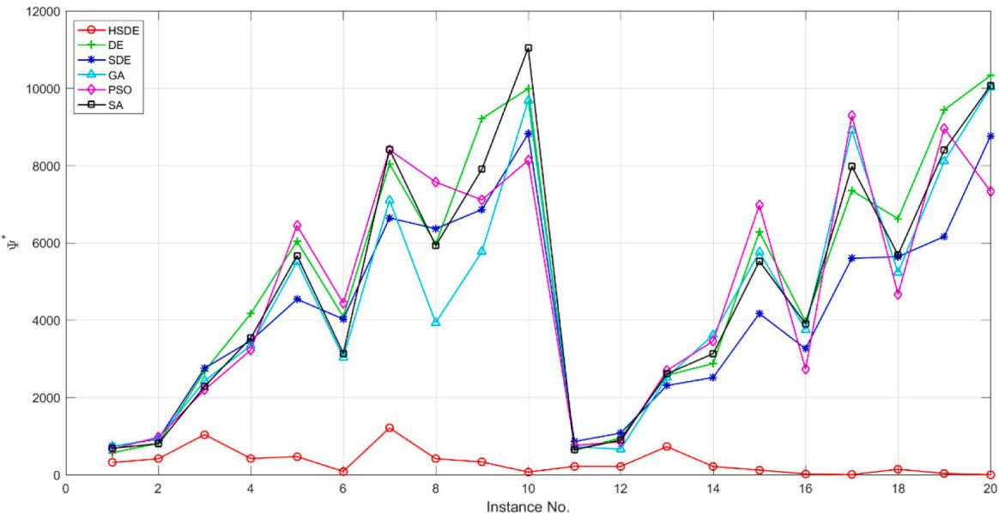

(a) Minimum objective values of the four algorithms  
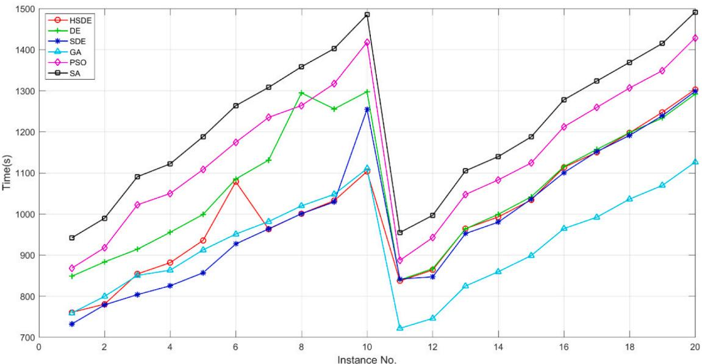  
(b) Computational time of the four algorithms  
Fig. 8. Comparison of the four algorithms.

In order to solve the problem in limited time, we take the population size and the number of generations required by HSDE algorithm as the benchmark. We also did more experiments. As the population size and the number of generations increase, the differences between the results of other algorithms and the proposed algorithm decrease slowly, but at the same time the computation time will be increased linearly. However, the performance of the proposed algorithm is still the best in all ex periments. We also find that other algorithms have poor convergence and low generality. That’s why other algorithms are not performing well in Fig. 8. Furthermore, it can be seen from Table 6 and Fig. 8(b) that the computational time of all algorithms gradually increases, which is related to the increase in the number of calculations. However, the increasing trend in the computational time is steady and slow, and the computational time still has advantages compared with CPLEX.

Therefore, HSDE, which combines a heuristic chromosome generation strategy with adaptive parameters and a random mutation strategy, shows good feasibility and advantages in solving the scheduling problem described in this study.

## 5.3.3. Further experiment and discussion

Based on the above experiments, the proposed HSDE algorithm performs better than the other algorithms considered in this study and is suitable for solving such FJSP with outsourcing operations and job priority constraints. To verify the effectiveness of the proposed algorithm in practical situations, we use a set of actual data for experimental analysis. This set comprises 10 jobs, and the number of operations in each job is different. Among these jobs, five involve outsourcing operations and each job has a different priority (J and $J _ { 4 } ^ { \prime } s \mathrm { i } s 1 ; J _ { 1 } ,$ , J3 and J6′s is 2; J7 and $J _ { 8 } { ' } s$ is $3 ; J _ { 4 } , J _ { 9 }$ and $J _ { 1 0 } { ' } s$ is 4). Considering all types of constraints in the model, the production should be reasonably arranged to minimize the overdue value of all jobs. HSDE is used to obtain the optimal solution, and the scheduling results are shown in terms of Gantt charts in Fig. 9.

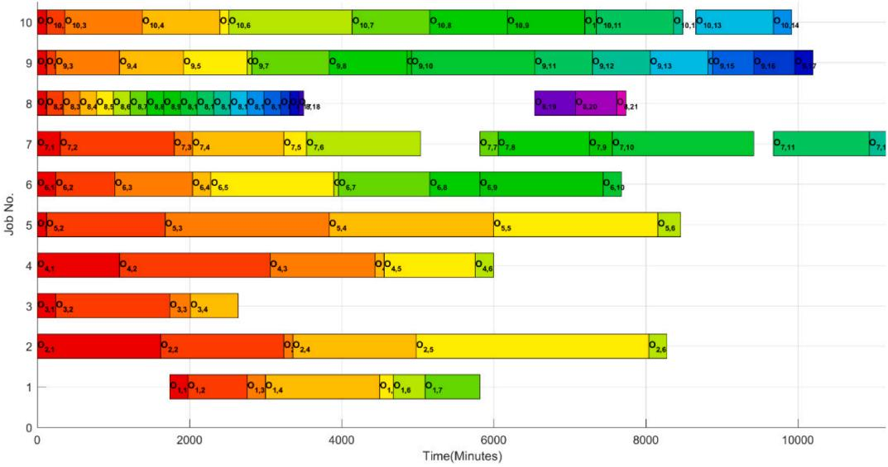

(a) Gantt chart of the jobs  
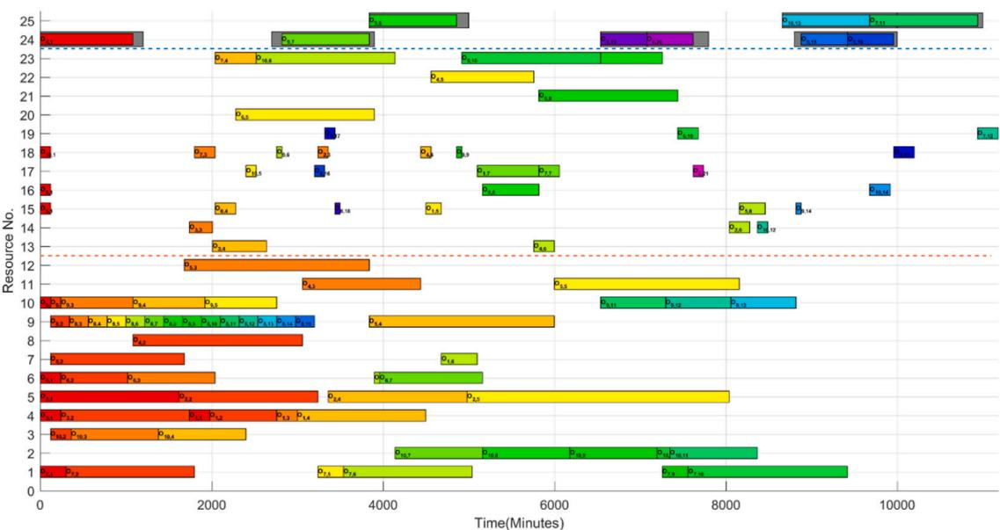  
(b) Gantt chart of the resources  
Fig. 9. Gantt charts of a solution.

Fig. 9(a) shows the production of 10 jobs, and Fig. 9(b) shows the service process of 25 machines or workers in which the gray blocks are fixed outsourcing periods. Based on this figure, jobs with a high priority will be arranged first, while jobs with a low priority will be appropriately arranged to postpone the production. The schedule of all jobs is compact. Resource No.1–12 are machines and No. 13–23 are workers. Resource No. 24–25 are outsourcing resources, and the time required for the outsourcing operation meets the actual requirements. If the same resource is used in adjacent operations of one job, it will be merged into one component and distributed to the same equipment for production, which conforms to the actual constraint. Based on the above analysis, the production scheduling scheme generated using the proposed method is suitable for practical production and achieves the expected goal.

## 6. Conclusions

In this study, we study a FJSP with outsourcing operations and job priority constraints. We propose a sequence-based mathematical model, which aims to efficiently arrange the sequence and resource of all jobs. To address the problem described in this study, an HSDE algorithm is proposed, in which a new heuristic population initialization method and an effective encoding and decoding operator are designed. The heuristic strategies generate a high-quality initial population, and the greedy insertion decoding method facilitates more compact operations. Moreover, the self-adaptive control of parameters and random mutation strategy selection method are designed. Therefore, the proposed algorithm exhibits a fast convergence speed and comprehensive search space, owing to which good solutions can be obtained reasonably.

Computational experiments are performed to evaluate the perfor mance of the mathematical model and the proposed algorithm. First, according to the actual production data, 40 experimental instances are randomly generated and the parameters are experimentally established. Thereafter, the proposed HSDE is compared with CPLEX to optimally solve some small-scale instances. The compared results validate that the best solution can be achieved using HSDE. Furthermore, extensive comparisons are performed between the proposed HSDE and other wellknown algorithms based on some large-scale instances. In the experi ment, we consider two cases, where the processing time of similar re sources is either the same or different. All experimental results show that the proposed HSDE can solve the FJSP with outsourcing operations and job priority constraints.

In the future, we intend to consider the balance of equipment, production cost, and other objectives. Some new models will be built, and effective algorithms will be investigated.

## CRediT authorship contribution statement

Hui Li: Conceptualization, Methodology, Software, Formal analysis. Xi Wang: Investigation, Writing – review & editing, Funding acquisi tion. Jianbiao Peng: Validation, Writing – original draft.

## Declaration of Competing Interest

The authors declare that they have no known competing financial interests or personal relationships that could have appeared to influence the work reported in this paper.

## Acknowledgments

The authors thank the editors and the anonymous referees for their constructive comments that improved the content and exposition of this research. This study is supported by National Natural Science Foundation of China (grant no. 72104261), and Program for Innovation Research in Central University of Finance and Economics.

## References

Abedi, M., Chiong, R., Noman, N., & Zhang, R. (2020). A multi-population, multiobjective memetic algorithm for energy-efficient job-shop scheduling with deteriorating machines. Expert Systems with Applications, 157, Article 113348 https://doi.org/10.1016/j.eswa.2020.113348

Ahmadian, M. M., Salehipour, A., & Cheng, T. C. E. (2021). A meta-heuristic to solve the just-in-time job-shop scheduling problem. European Journal of Operational Research, 288(1), 14–29. https://doi.org/10.1016/j.ejor.2020.04.017

Brucker, P., & Schlie, R. (1990). Job-shop scheduling with multi-purpose machines. Computing, 45(4), 369–375. https://doi.org/10.1007/BF02238804

Caldeira, R. H., & Gnanavelbabu, A. (2021). A Pareto based discrete Jaya algorithm for multi-objective flexible job shop scheduling problem. Expert Systems with Applications, 170, Article 114567. https://doi.org/10.1016/j.eswa.2021.11456

Caldeira, R. H., Gnanavelbabu, A., & Vaidyanathan, T. (2020). An effective backtracking search algorithm for multi-objective flexible job shop scheduling considering new job arrivals and energy consumption. Computers & Industrial Engineering, 149, Article 106863. https://doi.org/10.1016/j.cie.2020.106863

Caron, G., Hansen, P., & Jaumard, B. (1999). The assignment problem with seniority and job priority constraints. Operations Research, 47(3), 449–453. https://doi.org 10.1287/opre.47.3.449

Chaudhry, I. A., & Khan, A. A. (2016). A research survey: Review of flexible job shop scheduling techniques. International Transactions in Operational Research, 23(3), 551–591. https://doi.org/10.1111/itor.12199

Cruz-Ch´avez, M. A., Martínez-Rangel, M. G., & Cruz-Rosales, M. H. (2017). Accelerated simulated annealing algorithm applied to the flexible job shop scheduling problem. International Transactions in Operational Research, 24(5), 1119–1137. https://doi.org/ 10.1111/itor.12195

Dai, M., Tang, D., Giret, A., & Salido, M. A. (2019). Multi-objective optimization for energy-efficient flexible job shop scheduling problem with transportation constraints. Robotics and Computer-Integrated Manufacturing, 59, 143–157. https:// doi.org/10.1016/j.rcim.2019.04.006

Ding, H., & Gu, X. (2020). Improved particle swarm optimization algorithm based novel encoding and decoding schemes for flexible job shop scheduling problem. Computers

& Operations Research, 121, Article 104951. https://doi.org/10.1016/j. cor.2020.10495

Ebrahimi, A., Jeon, H. W., Lee, S., & Wang, C. (2020). Minimizing total energy cost and tardiness penalty for a scheduling-layout problem in a flexible job shop system: A comparison of four metaheuristic algorithms. Computers & Industrial Engineering, 141, Article 106295. https://doi.org/10.1016/j.cie.2020.106295

Feng, Y., Hong, Z., Li, Z., Zheng, H., & Tan, J. (2020). Integrated intelligent green scheduling of sustainable flexible workshop with edge computing considering uncertain machine state. Journal of Cleaner Production, 246, Article 119070. https:/ doi.org/10.1016/j.jclepro.2019.119070

Gao, D., Wang, G.-G., & Pedrycz, W. (2020). Solving Fuzzy Job-Shop Scheduling Problem Using DE Algorithm Improved by a Selection Mechanism. IEEE Transactions on Fuzzy Systems, 28(12), 3265–3275. https://doi.org/10.1109/TFUZZ.2020.3003506

Jackson, J. R. (1955). Scheduling a production line to minimize maximum tardiness. Management Science Research Project, Unirrersity of California, Las Angeles, Califarnia, USA.

Jain, A. S., & Meeran, S. (1999). Deterministic job-shop scheduling: Past, present and future. European Journal of Operational Research, 113(2), 390–434. https://doi.org 10.1016/S0377-2217(98)00113-1

Jiang, E., & Wang, L. (2020). Multi-objective optimization based on decomposition for flexible job shop scheduling under time-of-use electricity prices. Knowledge-Based Systems, 204, Article 106177. https://doi.org/10.1016/j.knosys.2020.106177

Johnson, S. M. (1954). Optimal two- and three-stage production schedules with setup times included. Naval Research Logistics Quarterly, 1(1), 61–68.

Karunakaran, D., Mei, Y., Chen, G., & Zhang, M. (2017). Dynamic Job Shop Scheduling Under Uncertainty Using Genetic Programming. In G. Leu, H. K. Singh, & S. Elsayed (Eds.), Intelligent and Evolutionary Systems (pp. 195–210). Springer International Publishing.

Kubiak, W., Feng, Y., Li, G., Sethi, S. P., & Sriskandarajah, C. (2020). Efficient algorithms for flexible job shop scheduling with parallel machines. Naval Research Logistic (NRL), 67(4), 272–288.

Lee, S., Moon, I., Bae, H., & Kim, J. (2012). Flexible job-shop scheduling problems with ‘AND /‘OR precedence constraints. International Journal of Production Research, 50 (7), 1979 2001. https://doi.org/10.1080/00207543.2011.561375

Li, J., Deng, J., Li, C., Han, Y., Tian, J., Zhang, B., & Wang, C. (2020). An improved Jaya algorithm for solving the flexible job shop scheduling problem with transportation and setup times. Knowledge-Based Systems, 200, Article 106032.

Li, X., & Gao, L. (2016). An effective hybrid genetic algorithm and tabu search for flexible job shop scheduling problem. International Journal of Production Economics, 174, 93–110.

Li, Y., Huang, W., Wu, R., & Guo, K. (2020). An improved artificial bee colony algorithm for solving multi-objective low-carbon flexible job shop scheduling problem. Applied Soft Computing, 95, Article 106544. https://doi.org/10.1016/j.asoc.2020.106544

Li, J., Liu, Z., Li, C., & Zheng, Z. (2020). Improved artificial immune system algorithm for Type-2 fuzzy flexible job shop scheduling problem. IEEE Transactions on Fuzzy Systems, 1–1. https://doi.org/10.1109/TFUZZ.2020.3016225

Luo, Q., Deng, Q., Gong, G., Zhang, L., Han, W., & Li, K. (2020). An efficient memetic algorithm for distributed flexible job shop scheduling problem with transfers. Expert Systems with Applications, 160, Article 113721. https://doi.org/10.1016/j. eswa.2020.113721

Mahmoodjanloo, M., Tavakkoli-Moghaddam, R., Baboli, A., & Bozorgi-Amiri, A. (2020). Flexible job shop scheduling problem with reconfigurable machine tools: An improved differential evolution algorithm. Applied Soft Computing, 94, Article 106416. https://doi.org/10.1016/j.asoc.2020.106416

Meng, L., Zhang, C., Ren, Y., Zhang, B., & Lv, C. (2020). Mixed-integer linear programming and constraint programming formulations for solving distributed flexible job shop scheduling problem. Computers Industrial Engineering, 142, Article 106347. https://doi.org/10.1016/j.cie.2020.10634

Mohanasundaram, K. M., Natarajan, K., Viswanathkumar, G., Radhakrishnan, P., & Rajendran, C. (2003). Scheduling rules for dynamic shops that manufacture multilevel jobs. Computers & Industrial Engineering, 44(1), 119–131.

Mokhtari, H., & Hasani, A. (2017). An energy-efficient multi-objective optimization for flexible job-shop scheduling problem. Computers & Chemical Engineering, 104, 339–352. https://doi.org/10.1016/j.compchemeng.2017.05.004

Shen, L., Dauz\`ere-P´er\`es, S., & Neufeld, J. S. (2018). Solving the flexible job shop scheduling problem with sequence-dependent setup times. European Journal of Operational Research, 265(2), 503–516. https://doi.org/10.1016/j.ejor.2017.08.021 Smith, W. E. (1956). Various optimizers for single-stage production. Naval Research Logistics Quarterly, 3(1 2), 59 66.

Storn, R., Price, K. (1995). Differential Evolution A simple and efficient adaptive scheme for global optimization over continuous spaces [Technical Report TR-95-012].

Vela, C. R., Afsar, S., Palacios, J. J., Gonz´alez-Rodríguez, I., & Puente, J. (2020). Evolutionary tabu search for flexible due-date satisfaction in fuzzy job shop scheduling. Computers & Operations Research, 119, Article 104931. https://doi.org/ 10.1016/j.cor.2020.104931

Volgenant, A. (2004). A note on the assignment problem with seniority and job priority constraints. European Journal of Operational Research, 154(1), 330–335. https://doi. org/10.1016/S0377-2217(03)00090-0

Xu, X., Li, L., Fan, L., Zhang, J., Yang, X., & Wang, W. (2013). Hybrid discrete differential evolution algorithm for lot splitting with capacity constraints in flexible job scheduling. Mathematical Problems in Engineering, 2013, Article e986218. https://doi. org/10.1155/2013/986218

Yu, C., Semeraro, Q., & Matta, A. (2018). A genetic algorithm for the hybrid flow shop scheduling with unrelated machines and machine eligibility. Computers Operations Research, 100, 211 229.

Yuan, Y., & Xu, H. (2013). Flexible job shop scheduling using hybrid differential evolution algorithms. Computers & Industrial Engineering, 65(2), 246–260. https:// doi.org/10.1016/j.cie.2013.02.022

Zhang, G., Hu, Y., Sun, J., & Zhang, W. (2020). An improved genetic algorithm for the flexible job shop scheduling problem with multiple time constraints. Swarm and Evolutionary Computation, 54, Article 100664. https://doi.org/10.1016/j. swevo.2020.100664

Zhang, S., Li, X., Zhang, B., & Wang, S. (2020). Multi-objective optimisation in flexible assembly job shop scheduling using a distributed ant colony system. European Journal of Operational Research, 283(2), 441–460. https://doi.org/10.1016/j. ejor.2019.11.016

Zhang, F., Mei, Y., Nguyen, S., & Zhang, M. (2020). Evolving scheduling heuristics via genetic programming with feature selection in dynamic flexible job-shop scheduling. IEEE Transactions on Cybernetics, 1–15. https://doi.org/10.1109/ TCYB.2020.3024849

Zhao, F., Shao, Z., Wang, J., & Zhang, C. (2016). A hybrid differential evolution and estimation of distribution algorithm based on neighbourhood search for job shop scheduling problems. International Journal of Production Research, 54(4), 1039–1060. https://doi.org/10.1080/00207543.2015.1041575

Zheng, X., & Wang, L. (2016). A knowledge-guided fruit fly optimization algorithm for dual resource constrained flexible job-shop scheduling problem. International Journal of Production Research, 54(18), 5554–5566. https://doi.org/10.1080/ 00207543.2016.1170226

Zhu, Z., & Zhou, X. (2020). An efficient evolutionary grey wolf optimizer for multiobjective flexible job shop scheduling problem with hierarchical job precedence constraints. Computers & Industrial Engineering, 140, Article 106280. https://doi.org 10.1016/j.cie.2020.106280

Zhu, Z., & Zhou, X. (2021). A multi-objective multi-micro-swarm leadership hierarchy based optimizer for uncertain flexible job shop scheduling problem with job precedence constraints. Expert Systems with Applications, 182, Article 115214. https://doi.org/10.1016/j.eswa.2021.115214