# A multi-critical-path co-driven evolutionary algorithm addressing the dual-resource flexible job shop scheduling problem with ofline operations and job priority constraints

Ziyu Zhang, Dongchen Qiu, Xinyu Li, Liang Gao, Qihao Liu, Yue Teng, Xuxia Zhang & Jun Wu

To cite this article: Ziyu Zhang, Dongchen Qiu, Xinyu Li, Liang Gao, Qihao Liu, Yue Teng, Xuxia Zhang & Jun Wu (2026) A multi-critical-path co-driven evolutionary algorithm addressing the dual-resource flexible job shop scheduling problem with ofline operations and job priority constraints, International Journal of Production Research, 64:11, 4310-4340, DOI: 10.1080/00207543.2025.2601263

To link to this article: https://doi.org/10.1080/00207543.2025.2601263


Published online: 10 Dec 2025.


Submit your article to this journal


Article views: 280


View related articles


View Crossmark data


Citing articles: 4 View citing articles

Check for updates

# A multi-critical-path co-driven evolutionary algorithm addressing the dual-resource flexible job shop scheduling problem with offline operations and job priority constraints

Ziyu Zhang <sup>a</sup>, Dongchen Qiu<sup>b</sup>, Xinyu Li <sup>a</sup>, Liang Gao<sup>a</sup>, Qihao Liu<sup>a</sup>, Yue Teng<sup>a</sup>, Xuxia Zhang<sup>c</sup> and Jun Wu<sup>c</sup>

<sup>a</sup>National Center of Technology Innovation for Intelligent Design and Numerical Control, School of Mechanical Science and Engineering, Huazhong University of Science and Technology, Wuhan, People’s Republic of China; <sup>b</sup>China Tobacco Jiangsu Industrial Co. Ltd., Nanjing, People’s Republic of China; <sup>c</sup>Zhejiang Wanfeng Technology Development Co. Ltd., Shaoxing, People’s Republic of China

## ABSTRACT

In the customised manufacturing of complex structural components, such as precision instruments and ships, jobs often have different priorities and involve a mix of online and offline operations. To address these challenges, this paper studies the dual-resource flexible job shop scheduling problem with special workers and job priority constraints (DRFJSP-OJP). Correspondingly, a mixed-integer linear programming (MILP) model is developed, and a multi-critical-path co-driven evolutionary algorithm (MCPEA) is proposed, which includes three key innovations. Firstly, a priority-driven threelayer segmented encoding and priority-based multi-segment active decoding scheme is designed. Secondly, a migration operator based on exemplar selection is introduced to accelerate the convergence. Finally, the global critical-path of the problem and local critical-paths with priorities are defined, then a problem-specific neighbourhood structure is designed. The experimental results indicate that the constructed MILP model can successfully solve small-scale problems. Meanwhile, MCPEA demonstrates superior overall performance than other methods, not only improving production efficiency but also ensuring the timely processing of high-priority jobs. Finally, MCPEA is applied to a real-world case from a complex structural component manufacturing enterprise. The optimised scheduling scheme shortens makespan by 49.60%, and decreases delay rate by 33.33%.

ARTICLE HISTORY Received 9 July 2025 Accepted 27 November 2025

KEYWORDS Flexible job shop scheduling; dual-resource; job priority; evolutionary algorithm; neighbourhood structure

## 1. Introduction

The production scheduling problem, as a core decisionmaking challenge in intelligent manufacturing systems, has long attracted attention from both academia and industry (Bakon et al. 2022; Y. Li, Li et al. 2025; Zhou et al. 2022). Among its variants, the flexible job shop scheduling problem (FJSP) shortens the production cycle by optimising operation sequence and machine assignment, providing a theoretical basis for enhancing production eficiency and bearing significant practical importance (Dauzère-Pérès et al. 2024; Li and Gao 2016; Xie, Gao et al. 2019; Yang et al. 2025). However, the traditional FJSP model focuses solely on machines as the core resource, overlooking the impact ofworkers’ skill heterogeneity on production eficiency and quality (Destouet et al. 2023; Thürer, Stevenson, and Renna 2019). In real-world discrete manufacturing workshops, workers usually represent another crucial and often bottleneck resource (Goli, Tirkolaee, and Aydın 2021; Mraihi, Driss, and El-Haouzi 2024; Vahedi-Nouri et al. 2024; Wang, Hu, and Gong 2018). To address it, researchers have proposed the dual-resource flexible job shop scheduling problem (DRFJSP), aiming to collaboratively optimise both the machine and worker resources (Thürer et al. 2020; Zhang, Wang, and Xu 2017; Zheng and Wang 2016). In contrast, this model ofers a closer approximation to practical scenarios and provides valuable guidance for improving the feasibility and accuracy of production planning. As an important extension, DRFJSP has rapidly garnered research interest globally, with a growing body of related literature (e.g. Chen, Kuo, and Chien 2024; Gnanavelbabu, Caldeira, and Vaidyanathan 2021; X. Gong et al. 2018; Meng et al. 2019; Usman, Lu, and Gao 2024; C. Wang, Fan et al. 2025).

Nevertheless, most existing DRFJSP models contain a key assumption that all operations require simultaneous allocation of both machine and worker resources (e.g. Andrade-Pineda et al. 2020; G. Gong, Chiong et al. 2020; Han and Gong 2025; Q. Luo, Deng, Xie et al. 2023; C. Wang, Fan et al. 2025). Because these studies generally consider that all operations must be processed on machines and cannot be separated from the machining line. However, this constraint exhibits obvious limitations in discrete manufacturing industries with complex structural components, such as precision instruments and ships, primarily because some ofline operations in the process route are not considered. Taking the reference mirror base in high-precision measuring instruments as an example. Its manufacturing process not only involves the operations performed on machines such as lathes, milling machines, and planers, but also includes operations like cryogenic treatment, aging, and marking, which do not need to be completed on the machining line. These ofline operations rely on fixed or dedicated workbenches, do not require the assignment of machine resources, but must be performed by workers with the corresponding skills (J. Li et al. 2025). Neglecting this characteristic leads to models that cannot accurately reflect the resource competition situation, leading to deviations in production cycle and imbalance in resource allocation. Therefore, it is necessary to incorporate the unique resource constraints of ofline operations into the scheduling model to improve the utilisation of critical resources.

On the other hand, existing studies generally assume that all jobs possess the same priority (e.g. C. Luo et al. 2025; Ren et al. 2022; Shi et al. 2023; C. Wang, Wei et al. 2025; Z. Zhang, Li et al. 2025). However, in actual production environments, especially in order-driven discrete manufacturing, significant priority diferences exist among jobs due to economic benefit and delivery urgency (Kim 2020; Sara 2025). For orders with larger profit margins or higher late delivery costs, enterprises will prioritise them as much as possible during scheduling (Chen et al. 2020; Ham 2017; Z. Zhu et al. 2022). Similarly, taking the structural components of precision instruments as our example, the reference mirror base, as a fundamental core component ensuring measurement accuracy, is assigned higher priority since any delivery delay would halt subsequent installation and debugging. On the contrary, the production of non-core structural components (such as the support base, equipment enclosure, and auxiliary sliding table) allows for a certain degree offlexibility and thus lower priority. Scheduling schemes that ignore job priorities, even if they theoretically achieve the optimal production eficiency, are likely to cause high-value jobs to be delayed due to waiting for low-value ones in practice, resulting in substantial economic losses (Li, Peng, and Wang 2024). From this perspective, developing scheduling methods that ensure high-priority jobs are processed as early as possible is an inevitable requirement for enhancing the practicality of production plans and realising value-driven production.

In conclusion, the insuficient consideration of ofline operations and job priority diferences significantly weakens the practical guiding value of existing DRFJSP theoretical models (Delgoshaei et al. 2023; Mlekusch and Hartl 2025). This obvious gap between theory and practice necessitates a more specific and systematic scheduling model and method that can reflect the complexity ofthe real-world manufacturing environment. Therefore, the starting point of this paper is to fill the gap in current research regarding ofline operations and job priorities, so that the scheduling theory can be efectively applied to complex manufacturing fields such as precision instruments and ships. By focussing on these two critical characteristics, this paper investigates a dual-resource flexible scheduling problem that better aligns with operation types and production urgency, thereby developing an eficient scheduling method that satisfies diferent resource spatio-temporal constraints and prioritises high-priority tasks.

Driven by this motivation, the DRFJSP with ofline operations and job priority constraints (DRFJSP-OJP) is defined in this work. To address this issue, a mixed integer linear programming (MILP) model is developed, then a multi-critical-path co-driven evolutionary algorithm is proposed, referred to as MCPEA. In this algorithm, a hierarchical multi-segment encoding and decoding scheme is presented for the special constraints brought by ofline operations and job priorities. Based on this, the initialisation method, migration strategy and mutation operator based on problem characteristics are proposed, and a priority-driven neighbourhood structure is designed. Experimental results demonstrate that the proposed algorithm can obtain high-quality solutions, with overall performance significantly surpassing that of other advanced scheduling methods. Finally, the MCPEA is applied to a real case of one complex structural component manufacturing enterprise, resulting in a 49.60% reduction in the original makespan and a 33.33% decrease in the delay rate. The main contributions and innovations can be summarised as follows:

(1) The MILP for DRFJSP-OJP is developed, where the skill diversity of workers is represented by diferent constraint sets based on the types of operations, achieving the structured expression of the problem.

(2) A three-layer segmented encoding scheme that aligns with the characteristics of ofline operations and job priorities is designed, and a priority-based multi-segment active decoding method is proposed. This framework ensures the resource legality and constraint satisfaction of all solutions.

(3) The unique global critical-path of the problem is defined, along with multiple local critical-paths of diferent job priorities. By extracting common critical operations, a problem-specific neighbourhood structure that can efectively explore the solution space is designed.

The rest of this paper is organised as follows. The literature review is analysed in Section 2. In Section $^ { 3 , }$ DRFJSP-OJP is described in detail, and the MILP model is developed. Then, the algorithm is systematically proposed in Section 4. Comparison experiments are provided in Section 5. Further, Section 6 conducts a study on an actual case from a complex structure component production workshop, along with specific management insights. Finally, the conclusion and future work are given in Section 7.

## 2. Literature review

## 2.1. DRFJSP variants

FJSP serves as a fundamental model for complex manufacturing environments, extending the classical job shop scheduling problem (JSP) (Hajariwala, Patil, and Patil 2025; Huang, Zhao, and Han 2022; Xiong et al. 2022) by allowing operations to be processed on any machine within a given set of compatible machines. Early foundational work by Brucker and Schlie (1990) established the computational complexity of FJSP, while later research focussed on developing eficient solution methods, such as mathematical programming (Lim and Moon 2023), meta-heuristic (Han et al. 2024), and reinforcement learning (Lei et al. 2022). In recent years, recognising the limitations of the standard FJSP model in capturing realworld complexities, researchers have progressively incorporated various practical constraints. Such as the random processing time with probability distribution (Caldeira and Gnanavelbabu 2021), transportation resource constraints (Pan et al. 2022), sequence-dependent setup time (Z. Zhang, Fu et al. 2024), lot streaming (Yang et al. 2025), multi-machine collaboration (Huang, Li, and Gao 2025), and so on. However, these variants predominantly focus on machine allocation, overlooking the critical role of labor in real-world production systems. This led to the development of the DRFJSP, which explicitly incorporated the requirement for worker resources into models.

Thürer, Stevenson, and Renna (2019) investigated the performance of workload control in dual-resource constrained high-variety shops, considering the interchangeable labor. Andrade-Pineda et al. (2020) studied the DRFJSP focussing on product customisation and on-time delivery, where worker expertise influences both eligibility and processing time. H. Zhu et al. (2020) took workers into account and considered the efects of their learning abilities on the processing time and energy consumption. On this basis, Peng et al. (2022) developed a multi-objective model constrained by job transportation time and worker learning efect. Then, the DRFJSP with time window constraints was defined by Frihat, Hadj-Alouane, and Sadfi (2022), and was solved using MILP and constraint programming (CP) models. Li, Wang, and Peng (2022) first discussed the job priority constraints in the DRFJSP, although they did not propose a specific optimisation method. He, Tang, and Luan (2022) developed a MILP model for DRFJSP aimed at minimising both makespan and total tardiness, efectively capturing the additional constraints arising from worker flexibility. Considering that when dealing with complex operations, machines may require multiple workers, Q. Luo, Deng, Xie et al. (2023) proposed the DRFJSP with the flexibility of worker cooperation. Usman, Lu, and Gao (2024) noticed that excessive work for workers might lead to reduced productivity, so studied the DRFJSP with limited flexible workers. Tang et al. (2024) extended the dualresource flexibility to the distributed scenario and studied the significant impact of operation sequencing flexibility on production eficiency. Furthermore, the problem variant with worker shift arrangement was addressed, considering constraints such as job priority and resource unavailability (Li, Peng, and Wang 2024). Vahedi-Nouri et al. (2024) explored an integrated production scheduling and workforce planning problem in the reconfigurable manufacturing system (RMS) benefiting from reconfigurable machines and human-machine collaboration for the first time. Recently, J. Li et al. (2025) discussed the DRFJSP with multitasking workers who can perform multiple operations simultaneously. Z. Zhang, Li et al. (2025) studied a variant in the production line reconfiguration scenario, which further expanded the scope of dual-resource scheduling.

## 2.2. Scheduling algorithms

Initial approaches for scheduling are primarily dominated by heuristic rules (Kaban, Othman, and Rohmah 2012; Wang 2005) and operational research (OR) techniques (Fattahi et al. 2014; Lopes and de Carvalho 2007; Shahvari, Logendran, and Tavana 2022). While heuristic rules can ofer computational simplicity and rapid solution time, they typically struggle to get the optimal scheduling solution. Conversely, OR methods can guarantee the optimal solution for the scheduling model, but, their significant computational overhead renders them impractical for large-scale problems. In recent years, swarm intelligence optimisation algorithms have emerged as a powerful alternative (Gao et al. 2019). Their demonstrated efectiveness in handling the inherent complexity, scale, uncertainty, and nonlinearity characteristic of real-world engineering challenges (K. Wang et al. 2023; Z. Zhang, Gao et al. 2023; Zuo and Gao 2025) has led to their widespread adoption in shop scheduling research (Li and Wang 2022; Neufeld, Schulz, and Buscher 2023; C. Wang, Wei et al. 2025).

Gao et al. (2016) proposed a discrete harmony search algorithm for solving FJSP. Ahmadi-Javid and Hooshangi-Tabrizi (2017) developed an anarchic society optimisation (ASO) algorithm to solve the problem of scheduling machines, transporters, and employee timetabling in a job-shop environment. Huang, Guan, and Yang (2018) combined the genetic algorithm (GA) with the particle swarm optimisation (PSO), and pro posed a hybrid genetic PSO algorithm based on teaching and learning to solve multi-objective FJSP. After that, Chen et al. (2020) proposed a self-learning GA. Mah moodjanloo et al. (2020) introduced an adaptive diferential evolution (DE) algorithm designed to minimise makespan for efectively addressing the FJSP involving reconfigurable machine tools. Müller and Kress (2022) proposed a meta-heuristic based on disjunctive graph encoding to solve the DRFJSP, and designed a local search based on the critical-path. Similarly, Lou et al. (2022) employed a neighbourhood structure based on the critical-path to develop a multi-objective evolutionary algorithm, aiming to address the DRFJSP that incorporates the worker learning-forgetting efects. Z. Zhu et al. (2022) proposed a shufled cellular evolutionary grey wolf optimiser (GWO), which ensured the satisfaction of job priority constraints by binary sort tree-based repair mechanism. Wang, Wang, and Xiu (2023) pro posed a cooperative memetic algorithm (MA) to tackle the energy-aware distributed welding shop scheduling problem. Subsequently, Li, Li, and Gao (2024) studied the distributed heterogeneous permutation flow-shop scheduling problem, and proposed an iterative greedy algorithm with acceleration of job allocation probability. Huang, Gong, and Lu (2024) addressed the type-2 green fuzzy JSP by proposing a MA that incorporates a hierar chical heuristic neighbourhood search. Yu et al. (2024) studied the energy-eficient distributed heterogeneous welding shop scheduling problem, and designed a selflearning artificial bee colony (ABC) algorithm. Of late, Xu, Wang et al. (2025) designed a chaotic encoding scheme into the quantum PSO, and conducted a comprehensive study on the application of this method in solving FJSP. Deng et al. (2025) further developed a knowledge-driven MA that incorporated a two-stage mutation mechanism to encourage the generation ofnew scheduling solutions. To address the scheduling chal lenges posed by the worker cooperation flexibility, Han and Gong (2025) introduced the algorithm based on non-dominated levels and defined a critical path-driven local search operator.

## 2.3. Research gap

We summarise the previous research in Table 1. According to this table, the DRFJSP considering machine and worker resource constraints is a highly valuable research topic. Currently, scholars have incorporated several practical production constraints into this scheduling model, such as the learning-forgetting efect, sequencing flexibility, outsourcing constraints, transportation constraints, and machine speed. At the same time, many metaheuristic methods for solving DRFJSP are developed, primarily using critical-path-based neighbourhood structures to implement local search. However, through further analysis, we can identify the following key limitations in the existing literature when it is applied to real industrial scenarios.

Firstly, the presence and impact of ofline operations have not been systematically incorporated into the scheduling model. The vast majority of studies assume that all operations must be completed on the machining line, meaning that both machine and worker resources must be allocated simultaneously. Secondly, the inherent job priority constraint within the production system is often overlooked or treated simplistically. Existing studies (e.g. Gnanavelbabu, Caldeira, and Vaidyanathan 2021; G. Gong, Deng, Gong et al. 2021; Han and Gong 2025; Hongyu and Xiuli 2021; J. Li et al. 2025) frequently assume all jobs are equally important, failing to fully capture the widespread need for the priority-driven scheduling decision.

In solution methods, the existing algorithms do not efectively address the specific constraints posed by ofline operations and job priorities. Traditional encoding schemes often lead to chromosomal decoding errors and lack priority-driven search operators. On the other hand, existing neighbourhood structures are primarily designed for the single resource (Liu, Yao, and Zhu 2021; Xie, Li et al. 2023; Xu, Zhang et al. 2024; C. Zhang et al. 2007), lacking consideration of the collaboration between machine and worker resources. At the same time, current neighbourhood search methods mainly rely on a single critical-path, whereas jobs with diferent priorities may have multiple corresponding local criticalpaths. Although Tang et al. (2024) or Fan et al. (2021) proposed a neighbourhood structure based on double or multiple critical-paths, these methods are not directly applicable to problems with job priorities. To sum up, an efective scheduling algorithm should be designed specifically to deal with the specific characteristics of

Table 1 The summarisation of existing research.

<table><tr><td>Literature</td><td>Workshop type</td><td>Production constraints</td><td>Encoding and decoding</td><td>Neighborhood structure</td></tr><tr><td>Zheng and Wang (2016)</td><td>FJSP</td><td>Worker flexibility</td><td>Two-layer encoding, Semi-active decoding</td><td>×</td></tr><tr><td>Ahmadi-Javid and Hooshangi-Tabrizi (2017)</td><td>JSP</td><td>Worker shift, Transportation</td><td>Random key, Semi-active decoding</td><td>×</td></tr><tr><td>Zhang, Wang, and Xu (2017)</td><td>FJSP</td><td>Worker flexibility</td><td>Two-layer encoding, Semi-active decoding</td><td>Critical-path</td></tr><tr><td>G. Gong, Gong, Liu et al. (2018)</td><td>FJSP</td><td>Worker flexibility</td><td>Three-layer encoding, Active decoding</td><td>×</td></tr><tr><td>X. Gong et al. (2018)</td><td>FJSP</td><td>Worker flexibility</td><td>Three-layer encoding, Active decoding</td><td>Critical-path</td></tr><tr><td>Andrade-Pineda et al. (2020)</td><td>FJSP</td><td>Worker flexibility</td><td>Disjunctive graph</td><td>×</td></tr><tr><td>G. Gong, Chiong et al. (2020)</td><td>FJSP</td><td>Worker flexibility</td><td>Three-layer encoding, Active decoding</td><td>Critical-path</td></tr><tr><td>H. Zhu et al. (2020)</td><td>Low carbon FJSP</td><td>Worker flexibility, Worker learning</td><td>Three-layer encoding, Active decoding</td><td>Critical-block</td></tr><tr><td>Chen et al. (2020)</td><td>Open shop</td><td>Job priority</td><td>Precedence graph</td><td>×</td></tr><tr><td>Gnanavelbabu, Caldeira, and Vaidyanathan (2021)</td><td>Stochastic FJSP</td><td>Worker flexibility</td><td>Two-layer encoding, Semi-active decoding</td><td>×</td></tr><tr><td>Liu, Yao, and Zhu (2021)</td><td>Green FJSP</td><td>Worker flexibility</td><td>Three-layer encoding, Active decoding</td><td>×</td></tr><tr><td>Tan et al. (2021)</td><td>FJSP</td><td>Worker fatigue, Transfer time</td><td>Three-layer encoding, Active decoding</td><td>Critical-path</td></tr><tr><td>Peng et al. (2022)</td><td>FJSP</td><td>Worker learning effect</td><td>Three-stage encoding, Semi-active decoding</td><td>Critical-path</td></tr><tr><td>Müller and Kress (2022)</td><td>FJSP</td><td>Worker flexibility</td><td>Disjunctive graph</td><td>Critical-path</td></tr><tr><td>Q. Luo, Deng, Gong et al. (2022)</td><td>Distributed FJSP</td><td>Worker flexibility</td><td>Two-layer encoding, Semi-active decoding</td><td>Critical-path</td></tr><tr><td>Li, Wang, and Peng (2022)</td><td>FJSP</td><td>Worker flexibility, Job priority, Outsourcing</td><td>Random key, Active decoding</td><td>×</td></tr><tr><td>Lou et al. (2022)</td><td>FJSP</td><td>Worker flexibility</td><td>Three-layer encoding, Active decoding</td><td>Critical-path</td></tr><tr><td>Z. Zhu et al. (2022)</td><td>FJSP</td><td>Job priority</td><td>Three-layer encoding, Semi-active decoding</td><td>×</td></tr><tr><td>He, Tang, and Luan (2022)</td><td>FJSP</td><td>Worker flexibility</td><td>Three-layer encoding, Semi-active decoding</td><td>×</td></tr><tr><td>Shi et al. (2023)</td><td>FJSP</td><td>Worker flexibility</td><td>Two-layer encoding, Semi-active decoding</td><td>×</td></tr><tr><td>Q. Luo, Deng, Xie et al. (2023)</td><td>FJSP</td><td>Worker cooperation flexibility</td><td>Two-layer encoding, Active decoding</td><td>Critical-path</td></tr><tr><td>Vital-Soto, Baki, and Azab (2023)</td><td>FJSP</td><td>Worker flexibility, Sequencing flexibility</td><td>Three-layer encoding, Active decoding</td><td>×</td></tr><tr><td>Y. Li, Chen et al. (2023)</td><td>JSP</td><td>Worker flexibility, Machine layout, Transportation</td><td>Three-layer encoding, Semi-active decoding</td><td>×</td></tr><tr><td>Luo, Gong, and Lu (2024)</td><td>FJSP</td><td>Machine speed</td><td>Three-layer encoding, Semi-active decoding</td><td>Critical-path</td></tr><tr><td>Tang et al. (2024)</td><td>Distributed FJSP</td><td>Worker flexibility, Sequencing flexibility</td><td>Five-layer encoding, Semi-active decoding</td><td>Double critical-paths</td></tr><tr><td>Li, Peng, and Wang (2024)</td><td>FJSP</td><td>Worker shift, Job priority</td><td>Random key, Active decoding</td><td>×</td></tr><tr><td>Huang, Gong, and Lu (2024)</td><td>Fuzzy FJSP</td><td>Type-2 fuzzy processing time</td><td>Two-layer encoding, Semi-active decoding</td><td>Critical-path</td></tr><tr><td>Han et al. (2024)</td><td>FJSP</td><td>AGV allocation</td><td>Two-layer encoding, Semi-active decoding</td><td>×</td></tr><tr><td>J. Li et al. (2025)</td><td>FJSP</td><td>Multitasking worker</td><td>Two-layer encoding, Semi-active decoding</td><td>Critical-path</td></tr><tr><td>Z. Zhang, Li et al. (2025)</td><td>FJSP</td><td>Worker flexibility, Auxiliary resource</td><td>Three-layer encoding, Active decoding</td><td>Critical-path</td></tr><tr><td>Deng et al. (2025)</td><td>Distributed FJSP</td><td>Machine endurance</td><td>Three-layer encoding, Semi-active decoding</td><td>Critical-path</td></tr><tr><td>Han and Gong (2025)</td><td>FJSP</td><td>Worker cooperation flexibility, learning-forgetting effect</td><td>Three-layer encoding, Active decoding</td><td>Critical-path</td></tr><tr><td>This work</td><td>FJSP</td><td>Worker flexibility, Offline operation, Job priority</td><td>Three-layer segmented encoding, Multi-segment active decoding</td><td>Multiple critical-paths</td></tr></table>

DRFJSP-OJP. Therefore, this work has certain theoretical value and guiding significance.

## 3. Problem formulation

## 3.1. Problem description

The DRFJSP-OJP is described as follows: n jobs with different priorities need to be processed on m machines by w workers, where each job $J _ { i }$ consists of $h _ { i }$ operations. Among them, the operations belonging to the same job have a strict processing sequence, and higher-priority jobs should be processed as early as possible. Each operation $O _ { i j }$ can be one of two types: online operation that must be processed on one machine selected from its optional machine set $\Omega _ { i j }$ and one worker assigned from the optional worker set $\psi _ { k }$ of that machine, or ofline operation that not requires the machine resource but must be performed by one worker with the required skill.

For online operations, workers must collaborate with the machines on the machining line, so they are in online processing mode. On the contrary, the workers are in ofline processing mode because the ofline operations are not carried out on the machining line. Then, workers who can perform both types of operations are defined as the dual-mode worker.

It can be found, solving the DRFJSP-OJP needs to optimise machine assignment, worker selection and operation sequence simultaneously. The objective is to minimise the maximum completion time while ensuring that high-priority tasks are processed as early as possible. Moreover, other constraints and related assumptions considered are as follows.

• Each machine can process only one job at a time.

• Each worker can only collaborate one machine or perform one task at a time.

Table 2 The specific processing information of each job in the example.

<table><tr><td rowspan="2">Jobs</td><td rowspan="2">Priority</td><td rowspan="2">Operations</td><td rowspan="2">Type</td><td colspan="5">Processing time</td></tr><tr><td> $M_1$ </td><td> $M_2$ </td><td> $M_3$ </td><td> $W_1$ </td><td> $W_3$ </td></tr><tr><td rowspan="2"> $J_1$ </td><td rowspan="2">2</td><td> $O_{11}$ </td><td>1</td><td>12</td><td>-</td><td>13</td><td>-</td><td>-</td></tr><tr><td> $O_{12}$ </td><td>1</td><td>16</td><td>14</td><td>-</td><td>-</td><td>-</td></tr><tr><td rowspan="3"> $J_2$ </td><td rowspan="3">1</td><td> $O_{21}$ </td><td>0</td><td>-</td><td>-</td><td>-</td><td>16</td><td>16</td></tr><tr><td> $O_{22}$ </td><td>1</td><td>-</td><td>18</td><td>17</td><td>-</td><td>-</td></tr><tr><td> $O_{23}$ </td><td>1</td><td>14</td><td>12</td><td>-</td><td>-</td><td>-</td></tr><tr><td rowspan="3"> $J_3$ </td><td rowspan="3">1</td><td> $O_{31}$ </td><td>0</td><td>-</td><td>-</td><td>-</td><td>-</td><td>22</td></tr><tr><td> $O_{32}$ </td><td>1</td><td>20</td><td>-</td><td>18</td><td>-</td><td>-</td></tr><tr><td> $O_{33}$ </td><td>1</td><td>21</td><td>19</td><td>-</td><td>-</td><td>-</td></tr><tr><td rowspan="3"> $J_4$ </td><td rowspan="3">2</td><td> $O_{41}$ </td><td>1</td><td>-</td><td>26</td><td>24</td><td>-</td><td>-</td></tr><tr><td> $O_{42}$ </td><td>1</td><td>15</td><td>-</td><td>15</td><td>-</td><td>-</td></tr><tr><td> $O_{43}$ </td><td>1</td><td>14</td><td>13</td><td>-</td><td>-</td><td>-</td></tr><tr><td rowspan="2"> $J_5$ </td><td rowspan="2">1</td><td> $O_{51}$ </td><td>0</td><td>-</td><td>-</td><td>-</td><td>18</td><td>18</td></tr><tr><td> $O_{52}$ </td><td>1</td><td>13</td><td>-</td><td>11</td><td>-</td><td>-</td></tr><tr><td rowspan="3"> $J_6$ </td><td rowspan="3">2</td><td> $O_{61}$ </td><td>1</td><td>-</td><td>17</td><td>19</td><td>-</td><td>-</td></tr><tr><td> $O_{62}$ </td><td>1</td><td>23</td><td>-</td><td>23</td><td>-</td><td>-</td></tr><tr><td> $O_{43}$ </td><td>0</td><td>-</td><td>-</td><td>-</td><td>24</td><td>24</td></tr><tr><td rowspan="3"> $J_7$ </td><td rowspan="3">2</td><td> $O_{71}$ </td><td>1</td><td>-</td><td>22</td><td>20</td><td>-</td><td>-</td></tr><tr><td> $O_{72}$ </td><td>1</td><td>21</td><td>-</td><td>24</td><td>-</td><td>-</td></tr><tr><td> $O_{73}$ </td><td>0</td><td>-</td><td>-</td><td>-</td><td>20</td><td>-</td></tr></table>

• Operation $O _ { i j }$ cannot be processed unless its preceding operation $O _ { i , j - 1 }$ has completed.

• Once an operation begins to be processed, no interruption is allowed.

• The transfer time of jobs or workers between machines is ignored.

To clarify the relatively novel research issue of DRFJSP-OJP, a simple example is presented, as shown in Table 2. In this example, there are seven jobs $\{ J _ { 1 } , J _ { 2 } , \ldots , J _ { 7 } \}$ to be processed in the workshop with three machines $\{ M _ { 1 } , M _ { 2 } , M _ { 3 } \}$ and four workers $\{ W _ { 1 } , W _ { 2 } , W _ { 3 } \}$ $W _ { 4 } \}$ . Among these, two workers $\{ W _ { 1 } , W _ { 3 } \}$ are dual-mode workers, meaning they can perform both online and ofline operations. The optional worker sets for the three machines $\{ M _ { 1 } , M _ { 2 } , M _ { 3 } \}$ are $\{ W _ { 1 } , W _ { 3 } , W _ { 4 } \} , \{ W _ { 2 } , W _ { 3 } \}$ and $\{ W _ { 1 } , W _ { 2 } , W _ { 4 } \}$ , respectively. Where, ‘Type’ indicates the processing type of the corresponding operation. $^ { \mathfrak { c } } \mathrm { _ { 1 } } \mathrm { \mathrm { ) } }$ means an online operation that requires machine processing, and $^ { \mathfrak { c } } 0 ^ { \mathfrak { c } }$ represents an ofline operation. Then, $\hookrightarrow$ means that this operation cannot be processed by that machine or worker.

Figure 1 illustrates the gantt chart of a feasible solution for this example problem. It can be observed that the processing of an operation can only begin when both the machine and worker are idle. Taking the operation $O _ { 3 3 }$ as an instance, after processing the $O _ { 3 2 }$ , the machine $M _ { 1 }$ assigned to $O _ { 3 3 }$ is idle. However, the worker $W _ { 4 }$ assigned to $M _ { 1 }$ is operating on $M _ { 3 }$ , so $O _ { 3 3 }$ cannot start immediately. Meanwhile, it can be found that the high-priority jobs $\left\{ J _ { 1 } , J _ { 4 } , J _ { 6 } , J _ { 7 } \right\}$ are processed as early as possible, and their completion times are generally smaller than those of other jobs $( \mathrm { e . g . } J _ { 2 } , J _ { 3 } , \mathrm { e t c . } )$ . Furthermore, Figure 2 presents the gantt chart from the workers’ perspective corresponding to the same feasible solution. It can be observed that the dual-mode worker needs to leave the machining line when performing ofline operations. For instance, $W _ { 3 }$ is in ofline mode when processing $O _ { 3 1 }$ , and then transfers to the machining line to process $O _ { 4 3 }$

## 3.2. Mathematical model

Through the abstraction of practical scenarios into mathematical formulations, optimisation objectives and constraints can be precisely defined (Seifi, Schulze, and Zimmermann 2021). Subsequently, a MILP model is formulated to capture the characteristics of the DRFJSP-OJP, and its notation description is shown in Table 3.

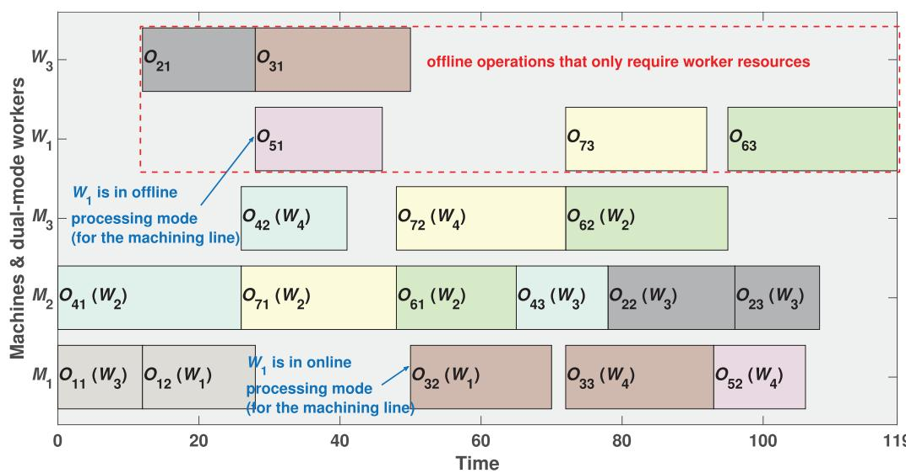  
Fi 1 The gantt chart of a feasible solution for the example problem (machines’ perspective).

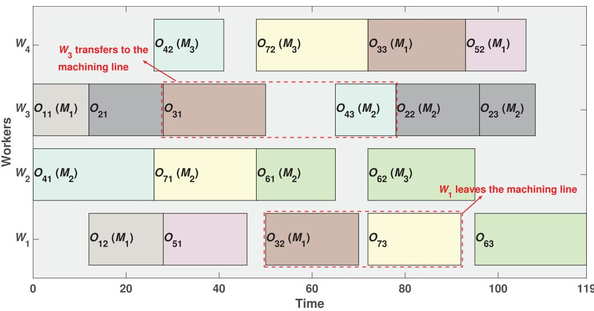  
Figure 2 The gantt chart with the workers’ perspective corresponding to the same feasible solution.

Objective function:

$$
\min f = C _ {\max} + \sum_ {i = 1} ^ {n} (p _ {i} \cdot (C _ {i} - r _ {i}))\tag{1}
$$

The job priority is an open constraint without a corresponding constraint expression. To address it, we introduced a penalty mechanism into the objective function. By imposing penalties on the completion time, the consideration for processing high-priority jobs as soon as possible is directly reflected in the model.

Constraints:

$$
\begin{array}{l} \sum_ {k \in \Omega_ {i j}} X _ {i j k} + \sum_ {e \in \Phi_ {i j}} Y _ {i j e} = 1 \\ (i = 1, 2, \dots , n; j = 1, 2, \dots , h _ {i}) \\ \text { if } N _ {i j} = 1 \\ \sum_ {k \in \Omega_ {i j}} X _ {i j k} = \sum_ {e \in \psi_ {k}} Z _ {i j k e} \quad (i = 1, 2, \dots , n; j = 1, 2, \dots , h _ {i}) \end{array} \tag {2}\tag{3}
$$

$$
S _ {i 1} \geq r _ {i} (i = 1, 2, \dots , n)\tag{4}
$$

$$
\begin{array}{l} S _ {i j} + \left(\sum_ {k \in \Omega_ {i j}} X _ {i j k} p _ {i j k} + \sum_ {e \in \Phi_ {i j}} Y _ {i j e} p _ {i j e}\right) \\ \leq S _ {i, j + 1} (i = 1, 2, \ldots , n; j = 1, \ldots , h _ {i} - 1) \\ S _ {i, h _ {i}} + \left(\sum_ {k \in \Omega_ {i, h _ {i}}} X _ {i, h _ {i}, k} p _ {i, h _ {i}, k} + \sum_ {e \in \Phi_ {i, h _ {i}}} Y _ {i, h _ {i}, e} p _ {i, h _ {i}, e}\right) \\ \leq C _ {\max}, \quad i = 1, 2, \ldots , n \\ \text {if} N _ {i j}, N _ {i ^ {\prime} j ^ {\prime}} = 1 \end{array}\tag{5}
$$

(6)

$$
\left\{ \begin{array}{l} S _ {i j} + p _ {i j k} \leq S _ {i ^ {\prime} j ^ {\prime}} + L \left(3 - A _ {i j i ^ {\prime} j ^ {\prime}} - X _ {i j k} - X _ {i ^ {\prime} j ^ {\prime} k}\right) \\ S _ {i ^ {\prime} j ^ {\prime}} + p _ {i ^ {\prime} j ^ {\prime} k} \leq S _ {i j} + L \left(2 + A _ {i j i ^ {\prime} j ^ {\prime}} - X _ {i j k} - X _ {i ^ {\prime} j ^ {\prime} k}\right) \\ i, i ^ {\prime} = 1, 2, \ldots , n   |   i \neq i ^ {\prime};   j = 1, 2, \ldots , h _ {i}; \\ \quad j ^ {\prime} = 1, 2, \ldots , h _ {i ^ {\prime}};   k \in \Omega_ {i j} \cap \Omega_ {i ^ {\prime} j ^ {\prime}} \end{array} \right.\tag{7}
$$

$$
\mathrm{if} N _ {i j}, N _ {i ^ {\prime} j ^ {\prime}} = 0
$$

$$
\left\{ \begin{array}{l} S _ {i j} + p _ {i j e} \leq S _ {i ^ {\prime} j ^ {\prime}} + L \left(3 - B _ {i j i ^ {\prime} j ^ {\prime}} - Y _ {i j e} - Y _ {i ^ {\prime} j ^ {\prime} e}\right) \\ S _ {i ^ {\prime} j ^ {\prime}} + p _ {i ^ {\prime} j ^ {\prime} e} \leq S _ {i j} + L \left(2 + B _ {i j i ^ {\prime} j ^ {\prime}} - Y _ {i j e} - Y _ {i ^ {\prime} j ^ {\prime} e}\right) \\ i, i ^ {\prime} = 1, 2, \ldots , n \mid i \neq i ^ {\prime};   j = 1, 2, \ldots , h _ {i}; \\ j ^ {\prime} = 1, 2, \ldots , h _ {i ^ {\prime}};   e \in \Phi_ {i j} \cap \Phi_ {i ^ {\prime} j ^ {\prime}} \end{array} \right.\tag{8}
$$

$$
\left\{ \begin{array}{l} S _ {i j} + p _ {i j k} \leq S _ {i ^ {\prime} j ^ {\prime}} + L \left(5 - C _ {i j i ^ {\prime} j ^ {\prime}} - X _ {i j k} \right. \\ \quad \left. - X _ {i ^ {\prime} j ^ {\prime} k ^ {\prime}} - Z _ {i j k e} - Z _ {i ^ {\prime} j ^ {\prime} k ^ {\prime} e}\right) \\ S _ {i ^ {\prime} j ^ {\prime}} + p _ {i ^ {\prime} j ^ {\prime} k ^ {\prime}} \leq S _ {i j} + L \left(4 + C _ {i j i ^ {\prime} j ^ {\prime}} - X _ {i j k} \right. \\ \quad \left. - X _ {i ^ {\prime} j ^ {\prime} k ^ {\prime}} - Z _ {i j k e} - Z _ {i ^ {\prime} j ^ {\prime} k ^ {\prime} e}\right) \\ i, i ^ {\prime} = 1, 2, \ldots , n | i \neq i ^ {\prime}; j = 1, 2, \ldots , h _ {i}; \\ \quad j ^ {\prime} = 1, 2, \ldots , h _ {i ^ {\prime}}; k \in \Omega_ {i j}; k ^ {\prime} \in \Omega_ {i ^ {\prime} j ^ {\prime}}; e \in \psi_ {k} \cap \psi_ {k ^ {\prime}} \end{array} \right.\tag{9}
$$

$$
\begin{array}{l} \text {if} N _ {i j} + N _ {i ^ {\prime} j ^ {\prime}} = 1 \\ \left\{ \begin{array}{l} S _ {i j} + p _ {i j e} \\ \quad \leq S _ {i ^ {\prime} j ^ {\prime}} + L \left(4 - D _ {i j i ^ {\prime} j ^ {\prime}} - Y _ {i j e} - X _ {i ^ {\prime} j ^ {\prime} k} - Z _ {i ^ {\prime} j ^ {\prime} k e}\right) \\ S _ {i ^ {\prime} j ^ {\prime}} + p _ {i ^ {\prime} j ^ {\prime} k} \\ \quad \leq S _ {i j} + L \left(3 + D _ {i j i ^ {\prime} j ^ {\prime}} - Y _ {i j e} - X _ {i ^ {\prime} j ^ {\prime} k} - Z _ {i ^ {\prime} j ^ {\prime} k e}\right) \\ i, i ^ {\prime} = 1, 2, \ldots , n   |   i \neq i ^ {\prime};   j = 1, 2, \ldots , h _ {i}; \\ \quad j ^ {\prime} = 1, 2, \ldots , h _ {i ^ {\prime}};   e \in \Phi_ {i j} \cap \psi_ {k} \end{array} \right. \end{array}\tag{10}
$$

Eq. (2) is the resource allocation constraint. for an online operation, only one machine can be assigned to it, while for an ofline operation, only one worker can be selected. Then, the meaning of Eq. (3) is that if the machine assigned to it is $M _ { k } ,$ then only one worker is definitely assigned to $M _ { k } .$ Eq. (4) indicates that each job can only be processed after it has been released. Eq. (5) is the operation sequence constraint: the end time of $O _ { i j }$ cannot exceed the start time of $O _ { i , j + 1 }$ . And $\operatorname { E q } .$ . (6) is the makespan constraints, that is the completion time of the last operation cannot exceed the $C _ { \mathrm { m a x } }$ . Subsequently, Eq. (7) represents the constraint set when processing online operations $O _ { i j }$ and $O _ { i ^ { \prime } j ^ { \prime } }$ on the same machine $M _ { k }$ . Eq. (8) represents the constraint set when the same worker $W _ { e }$ independently processing ofline operations $O _ { i j }$ and $O _ { i ^ { \prime } j ^ { \prime } }$ . While Eq. (9) represents the constraint set when the same worker $W _ { e }$ operates the machines $M _ { k }$ for $O _ { i j }$ and $M _ { k ^ { \prime } }$ for $O _ { i ^ { \prime } j ^ { \prime } }$ . Finally, Eq. (10) symbolises the constraint set when the same worker $W _ { e }$ independently processing $O _ { i j }$ and operating $M _ { k }$ for $O _ { i ^ { \prime } j ^ { \prime } }$

Table 3 Description of notations of the mathematical model.  
```csv
Notation Description
Indices i, i' Index of jobs, i, i' = 1, 2, ..., n
j, j' Index of operations, j, j' = 1, 2, ..., hi
k, k' Index of machines, k, k' = 1, 2, ..., m
e, e' Index of workers, e, e' = 1, 2, ..., w
Parameters n Total number of jobs
m Total number of machines
w Total number of workers
hi Total number of operations of Ji
ri The release time of Ji
pi The priority weight of Ji
Oij The j-th operation of Ji
Ωij The optional machine set of the online operation Oij
Φij The optional worker set of the offline operation Oij
ψk The assignable worker set of Mk
pijk The processing time of Oij on Mk
pije The time for worker We to independently process Oij
Nij = {1, if Oij is an online operation
0, else
L A large enough positive number
Decision variables Xijk = {1, if the online operation Oij
is processed on Mk
0, else
Yije = {1, if the offline operation Oij
is processed by We
0, else
Zijke = {1, if Mk of the online operation Oij
is operated by We
0, else
Aiji'j' = {1, if Oij is processed before Oi'j' on Mk
0, else
Biji'j' = {1, if We independently processes Oij
before Oi'j'
0, else
Ciji'j' = {1, if We operates the machine for Oij
before the machine for Oi'j'
0, else
Diji'j' = {1, if We independently processes Oij
before operating Mk to process Oi'j'
0, else
Sij The start time of Oij
Cmax The maximum completion time of all jobs
```

The logical correctness of these paired constraints (6) to (9) is ensured by the standard big-L method. The binary variables A, B, C, and D are introduced to model the sequencing decisions between operations competing for the same resource: $A _ { i j i ^ { \prime } j ^ { \prime } }$ for the processing sequence on the same machine, $B _ { i j i ^ { \prime } j ^ { \prime } }$ for the independent processing sequence by the same worker, $C _ { i j i ^ { \prime } j ^ { \prime } }$ for the operating sequence of the same worker on diferent machines, and $D _ { i j i ^ { \prime } j ^ { \prime } }$ for the sequence between a worker’s independent processing and machine operation tasks. For any given pair of operations, when the corresponding binary variable equals 1, the associated constraint is activated to enforce the sequence relationship. While it equals 0, the term multiplied by L becomes dominant and the constraint is deactivated. The value of L is a suficiently large positive constant, thus guaranteeing the model’s linearity.

## 4. Proposed algorithm

## 4.1. Framework ofMCPEA

To overcome the limitations of existing methods in handling the job priority constraints and the dual-resource coupling relationship in DRFJSP-OJP, this section proposes the MCPEA. The algorithm features a prioritydriven three-layer segmented encoding and active decoding to ensure solution feasibility. Meanwhile, it designs structured evolutionary operators that respect job priority constraints, and presents a problem-specific neighbourhood search method. Notably, MCPEA employs the migration operator from biogeography-based optimisation (BBO) (Simon 2008; Z. Zhang, Gao et al. 2023) instead of traditional crossover operator. This design better preserves the priority-based segmented structure, utilises the cosine migration model for quality-guided information exchange without additional parameters, and reduces the risk of disrupting superior solutions while enhancing the population diversity.

The following subsections detail the technical components: Subsection 4.2 presents the solution representation method, Subsection 4.3 describes population initialisation, Subsections 4.4 and 4.5 detail the migration and mutation operators respectively, while Subsection 4.6 explains the neighbourhood search method. The overall procedure is outlined in Algorithm 1, with specific parameter configurations including population size $P s ,$ mutation probability $M p ;$ , and local search probability $L \boldsymbol { p }$ provided in the experiments. In addition, although the MILP model introduces a penalty term to reflect priority constraints, the algorithm uses makespan as the fitness function for clear evaluation and comparison of solution eficiency. The handling of job priority constraints is embedded in the customised encoding and decoding scheme, and search strategies.

<div class="mineru-algorithm" style="white-space: pre-wrap; font-family:monospace;">
Algorithm 1 The pseudo code of MCPEA
1: Parameter setting, including population size (Ps), mutation probability(Mp), and local search probability (Lp)
2: For (i = 1 to Ps) do % Subsection 4.3
3: Hybrid heuristic initialization
4: Calculate the objective function value $f(x_i)$ for $x_i$
5: End for
6: Determine the ranking of all individuals in the population
7: Calculate the species number ($S_i$) of each individual
8: Calculate the immigration rate ($\lambda_i$) of each individual
9: While (termination condition is not met) do
10: For (i = 1 to Ps) do % Subsection 4.4
11: If ($rand(0,1) \leq \lambda_i$) do
12: Use Equation (16) to select a example exemplar $x_j$
13: Perform the migration operator
14: End if
15: If ($rand(0,1) \leq Mp$) do % Subsection 4.5
16: Perform the mutation operator
17: End If
18: End for
19: For (i = 1 to Ps) do
20: Calculate the new objective function value $f(x_i')$ for $x_i'$
21: If ($f(x_i') &lt; f(x_i)$) do
22: $x_i' = x_i; f(x_i) = f(x_i')$
23: End if
24: End for
25: For (i = 1 to the top 30% in Ps) do % Subsection 4.6
26: If $rand(0,1) \leq L_p$
27: Determine multiple critical-paths by Algorithm 2
28: Extract common critical operations and perform the neighborhood search by Algorithm 3
29: Calculate the new objective function value $f(x_i')$ for $x_i'$
30: If ($f(x_i') &lt; f(x_i)$) do
31: $x_i' = x_i; f(x_i) = f(x_i')$
32: End if
33: End if
34: End for
35: Determine the ranking of all individuals in the population
36: End while
37: Output the best solution
</div>

## 4.2. Encoding and decoding

4.2.1. Priority-driven three-layer segmented encoding When solving DRFJSP, researchers designed the threelayer encoding scheme, including the operation sequence (OS) layer, the machine selection (MS) layer and the worker selection (WS) layer (Lou et al. 2022; Zhang, Wang, and Xu 2017; H. Zhu et al. 2020). Among them, the OS layer uses the same number to represent operations belonging to the same job, and the number of times a certain number appears indicates the operation serial number of the job corresponding to that number. Such as [3, 1, 2, 2, 1, 3] represents the operation sequence $\{ O _ { 3 1 } , O _ { 1 1 } , O _ { 2 1 } , O _ { 2 2 } , O _ { 1 2 } , O _ { 3 2 } \}$ . Then, the MS layer arranges each operation in ascending order of the jobs, with each gene value representing the corresponding machine from the optional machine set for that operation in sequence. Taking $O _ { 1 1 }$ in Table 2 as an example, suppose its MS layer encoding value is 2, which indicates that it corresponds to the second machine $\left( M _ { 3 } \right)$ in its optional machine set $\{ M _ { 1 } , M _ { 3 } \}$ . The encoding logic of the WS layer is consistent with that of the MS layer, and each gene represents the worker further assigned to the machine selected for the operation. However, since DRFJSP-OJP considers ofline operations and job priorities, the traditional three-layer encoding scheme is no longer valid (e.g. Gnanavelbabu, Caldeira, and Vaidyanathan 2021; Han and Gong 2025; He, Tang, and Luan 2022; Usman, Lu, and Gao 2024, etc.). The main reasons are: (1) Ofline operations do not need to assign machines, while the previous encoding scheme must allocate both types ofresources simultaneously. (2) Existing encoding schemes typically treat all jobs as undifferentiated tasks, which cannot efectively deal with the special constraints arising from job priorities.

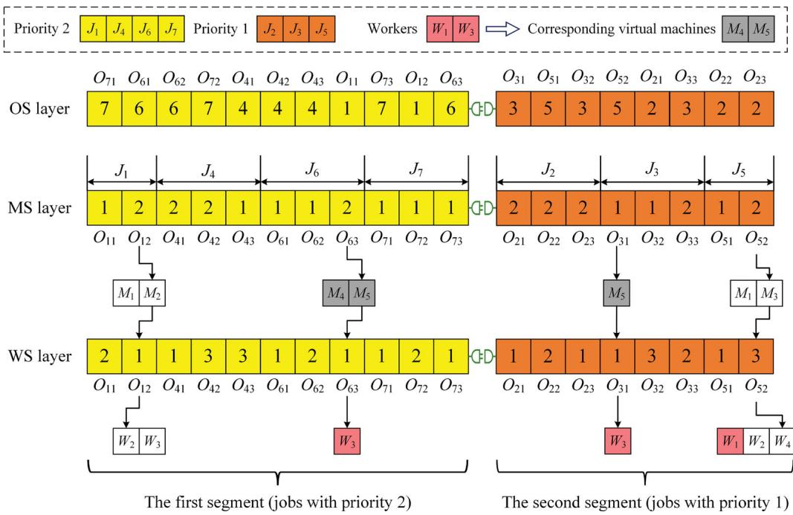  
Figure 3 An example of the proposed encoding chromosome.

To address these two bottleneck issues, we propose the priority-driven three-layer segmented encoding scheme, which includes two targeted improvements based on the previous three-layer encoding method. Firstly, for the dual-mode workers that handle ofline operations, configure a virtual machine one-to-one for them. For example, for the workers $W _ { 1 }$ and $W _ { 3 }$ in Table 2, the virtual machines $M _ { 4 }$ (with only $W _ { 1 }$ as the controllable worker) and $M _ { 5 }$ (with only $W _ { 3 }$ as the controllable worker) are added in sequence on the basis of the original machines. This approach accommodates the requirement of the three-layer encoding scheme to allocate both machine and worker resources simultaneously. For an ofline operation, a virtual machine is first assigned. Since the virtual machine is bound one-to-one with the worker, this also determines the allocation of the worker at the same time. As shown in Figure 3, for $O _ { 6 3 } { \mathrm { ; } }$ the virtual machine assigned to it is $M _ { 5 }$ , so it is processed independently by $W _ { 3 }$

Next, for job priorities, we implement a segmented encoding for each layer of the chromosome. Specifically, jobs that belong to the same priority are encoded as a segment of the chromosome. Thus, the number of priorities is equal to the number of segments in the chromosome. For instance, in Figure 3, the OS, MS and WS layers corresponding to the jobs $\{ J _ { 1 } , J _ { 4 } , J _ { 6 } , J _ { 7 } \}$ belonging to the priority 2 are regarded as the first segment, and the jobs $\left\{ J _ { 2 } , J _ { 3 } , J _ { 5 } \right\}$ belonging to the priority 1 are regarded as the second segment. The advantage of the segmented encoding is that it facilitates the algorithm to identify jobs belonging to diferent priorities, allowing for higherpriority tasks to be given preference during decoding and optimisation. Therefore, through the above two key improvements, the proposed encoding scheme efectively solves the problem of chromosome expression caused by ofline operations and job priorities.

## 4.2.2. Priority-based multi-segment active decoding

Since we have implemented segmented encoding for jobs belonging to diferent priorities, this makes the previous semi-active decoding method ineficient (Dauzère-Pérès et al. 2024; Shi et al. 2023; Zhang, Wang, and Xu 2017). This is because high-priority jobs can create idle time slots on machines during the semi-active decoding, which could accommodate subsequent lowpriority jobs. However, the semi-active decoding method does not allow for operations to insert forward. To overcome this drawback, we propose the priority-based multi-segment active decoding scheme, which efectively improves the quality of the scheduling solution. The specific steps are as follows.

Step 1: Extract the gene segments corresponding to the jobs belong to the current highest priority in the chromosomes of the OS, MS and WS layers respectively: sub\_OS, sub\_MS and sub\_WS, and remove them from the original chromosome.

Step 2: Extract all genes from the sub\_OS chromosome. Sequentially analyse each gene to identify the target operation $O _ { i j } .$ . Then, determine the processing machine $M _ { k }$ and the corresponding processing time ${ { p } _ { i j k } }$ through the sub\_MS vector, and determine the worker $W _ { e }$ to be allocated through the sub\_WS vector.

Step 3: Find all idle time periods $[ S M _ { k l } , E M _ { k l } ]$ on machine $M _ { k }$ and $[ S W _ { e l } , E W _ { e l } ]$ for worker $W _ { e }$ . Here, SM, SW represent the start time ofthe idle time periods, while EM, EW represent the end time. On this basis, determine all the common idle time periods $[ S C _ { l } , E C _ { l } ]$ of $M _ { k }$ and $W _ { e }$ . Obviously, ${ S C _ { l } = \operatorname* { m a x } \{ S M _ { k l } , S W _ { e l } \} }$ , and $E C _ { l } =$ min $\{ E M _ { k l } , E W _ { e l } \}$

Step 4: Determine the earliest start time $E S _ { i j }$ for operation $O _ { i j }$ according to Eq. (11), where $C _ { i , j - 1 }$ represents the end time of the previous operation. $\operatorname { I f } j = 1$ , then $C _ { i , j - 1 } = r _ { i } ,$ , indicating that the earliest start time for the first operation is the release time of job $J _ { i \cdot }$

$$
E S _ {i j} = \max \{C _ {i, j - 1}, S C _ {l} \}\tag{11}
$$

Step 5: Judge whether there exists a common idle time period where $O _ { i j }$ can be inserted according to Eq. (12). If so, insert $O _ { i j }$ into the specified time period for processing, as shown in Figure 4(a), and calculate the end time $C _ { i j } =$ $E S _ { i j } + p _ { i j k }$

$$
E S _ {i j} + p _ {i j k} \leq E C _ {l}\tag{12}
$$

Step 6: If there is no common idle time period that meets the insertion condition, then schedule at $t _ { i j }$ as defined in Eq. (13), where $L M _ { k }$ represents the end time of the last operation of $M _ { k }$ , and $L W _ { e }$ represents the end time of the last operation of We. Figure (4)(b) shows the scheduling of $O _ { i j }$ in the second case.

$$
t _ {i j} = \max \{L M _ {k}, L W _ {e} \}\tag{13}
$$

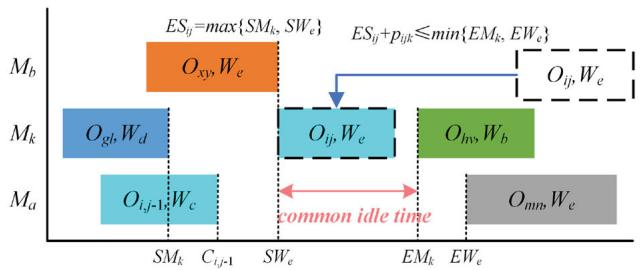  
(a) There is a common idle period that $O _ { i j }$ can be inserted

Step 7: Check whether all the genes in the sub\_OS vector have been decoded. If not, return to Step 2; Otherwise, further check if there are any segments in the OS layer chromosome. If so, return to Step 1; otherwise, the decoding is completed.

## 4.3. Hybrid heuristic initialisation

Unlike random initialisation, the heuristic approach that considers the specific characteristics of the problem can lead to fewer algorithmic iterations. Accordingly, we introduce three heuristic strategies to generate superior initial scheduling solutions.

Heuristic 1: global minimum workload heuristic considering resource continuity.

Randomly generate an OS layer chromosome and create empty chromosomes for the MS and WS layers of the same length. Then, for each operation $O _ { i j }$ in the OS layer, sequentially select the machine and worker with the minimum cumulative workload, and record their encoded values in the corresponding gene points of the MS and WS layer chromosomes. If the optional machine sets for the current operation and the previous operation include same machines, select the one with the minimum cumulative workload among these machines. Similarly, if the currently selected machine and the previous machine have the same available workers, choose the worker with the least workload among them.

Heuristic 2: local minimum workload heuristic based on jobs.

According to the job sequence of each segment in the priority-driven three-layer segmented encoding scheme, sequentially select machines and workers for each operation $O _ { i j } .$ Specifically, according to the sequence of operations for each job, select the machine and worker with the minimum cumulative workload, and store the corresponding encoded values in the MS and WS chromosomes. After initialising all operations of a job, reset the workload of each machine and worker to zero until all jobs are completed.

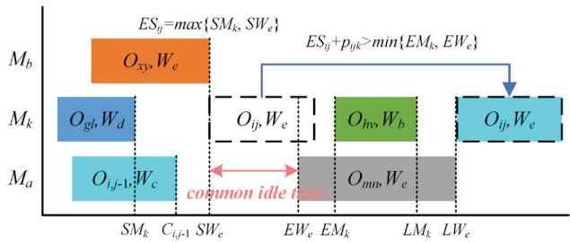  
(b) There is no common idle period that $O _ { i j }$ can be inserted  
Figure 4 A priority-based multi-segment active decoding for DRFJSP-OJP. (a) There is a common idle period that $O _ { i j }$ can be inserted. (b) There is no common idle period that $O _ { i j }$ can be inserted.

Heuristic 3: shortest processing time heuristic.

The OS layer chromosome is randomly generated, and then the MS and WS vectors of the same length are constructed. Read each operation $O _ { i j }$ of the OS layer chromosome in sequence, and select the machine with the shortest processing time from the optional machine set. For the worker selection, randomly assign a worker from the available worker set of the selected machine. Finally, store the corresponding encoded values in the MS and WS layer chromosomes.

In addition, random initialisation can maintain the diversity of the initial population. Therefore, this paper uses three heuristics and the random rule to initialise the population, with proportions of30%, 30%, 30% and 10%, respectively.

## 4.4. Migration operator

The essence of the migration operator is to copy the characteristics of one individual to another one. It difers fundamentally from the crossover operator in both concept and mechanism. The former simulates the migration process of species between habitats, where individuals exchange characteristics through immigration and emigration rates, emphasising the utilisation of population information and collaboration among individuals. The latter simulates genetic recombination in biological reproduction, generating ofspring by exchanging gene segments between two parent individuals, emphasising random combination and exploration. Although crossover can also be based on jobs, it typically does not distinguish between priorities, which may disrupt the job order and result in lower eficiency. In contrast, migration divides the job set into diferent subsets based on job priorities, allowing specific subsets of operation sequences to be copied from emigrant individuals to new individuals, thus maintaining the priority segment structure. In addition, crossover randomly produces two ofspring, while migration generates only one individual that merges the excellent features of two individuals, resulting in a higher probability of producing superior solutions.

Therefore, inspired by the optimisation ability of the migration strategy of BBO, in this section, we propose a discrete migration operator to assist the population in global search and improve the convergence speed of the algorithm. Specifically, each individual is regarded as a habitat, and the greater the species number within that habitat, the more suitable for species survival, resulting in a better fitness value. All individuals in the population are ranked from best to worst, and the number of species in each habitat is calculated using Eq. (14).

$$
S _ {i} = S _ {\mathrm{max}} - i, \quad i = 1, 2, \ldots , P s\tag{14}
$$

where, $S _ { \mathrm { m a x } }$ represents the maximum number of species and is set as $S _ { \mathrm { m a x } } = P s$ . According to the species number of each habitat, the immigration rate and emigration rate can be calculated. The immigration rate refers to the probability that an individual adopts the traits of others, while the emigration rate refers to the probability that the individual shares its traits with others. So, if $x _ { j }$ copies genetic information to $x _ { i } ,$ the former is the emigration individual and the latter is the immigration one. Diferent migration rate models significantly impact the optimisation performance of the algorithm. Ma (2010) demonstrated that performance of complex migration rate models outperform simple ones. Hence, we use the cosine migration rate model to calculate the immigration rate for each individual.

$$
\lambda_ {i} = \frac {I}{2} \left(\cos \frac {\pi \cdot S _ {i}}{S _ {\mathrm{max}}} + 1\right)\tag{15}
$$

where, I represents the maximum immigration rate. Since it is a probability, $I = 1$ . The advantage of this model is twofold. Firstly, for habitats (individuals) with medium species counts, the cosine function produces a relatively flat curve. This means that a larger portion of the population has moderate and similar immigration rates, promoting extensive information exchange and helping the algorithm to explore diverse regions. Secondly, for the best and worst habitats, the curve changes more steeply. The best individuals have very low immigration rates, protecting them from being disrupted. Conversely, the worst individuals have very high immigration rates, forcing them to learn from the better individuals.

It is worth noting that we do not calculate the emigration rate for each individual. This is because the method used by BBO to randomly select individuals for emigration based on the emigration rate has drawbacks, as it may share characteristics of individuals that are worse than $x _ { i } ,$ potentially damaging better solutions. To address this, we propose the exemplar learning strategy to determine the emigration individual $x _ { j }$ for $x _ { i }$ using Eq. (16). Since all individuals in the population are ranked from best to worst based on their fitness values, individuals ranked higher than $x _ { i }$ can be considered as its exemplar individuals. This ensures that the individuals sharing characteristics with $x _ { i }$ are always better, thereby avoiding the selection of inferior solutions.

$$
x _ {j}: j = \text { randi } (1, i)\tag{16}
$$

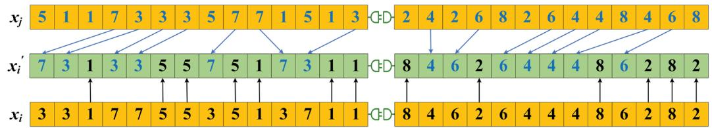

Figure 5 JBM for OS.  
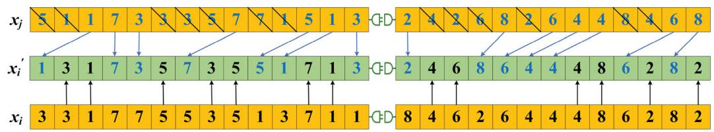  
Figure 6 GPM for OS.

This exemplar learning method selects emigrants directly based on individual rankings, eliminating the need to calculate emigration rates. Due to the diferences in encoding logic, diferent migration modes are designed for the OS, MS, and WS layer chromosomes.

For OS, randomly select one of the migration modes, either job-based migration (JBM) or generalised position migration (GPM). As shown in Figure 5, JBM performs segmented migration of the OS layer chromosomes based on the job priority, and the migration steps of each segment chromosomes are the same. For example, the job set with the highest priority is $\{ J _ { 1 } , J _ { 3 } , J _ { 5 } , J _ { 7 } \}$ . It is randomly divided into two non-empty subsets: $S U B _ { 1 } =$ $\{ J _ { 1 } , J _ { 5 } \} , S U B _ { 2 } = \{ J _ { 3 } , J _ { 7 } \}$ . The new individual $x _ { i } ^ { \prime }$ retains the operations from $x _ { i }$ that belong to $S U B _ { 1 }$ , while replicating the operations from $x _ { j }$ that belong to $S U B _ { 2 }$ . Specifically, all the operations that belong to $S U B _ { 1 }$ in the immigration individual $x _ { i }$ are copied to $x _ { i } ^ { \prime }$ while maintaining their original positions. Then, all the operations belonging to $S U B _ { 2 }$ in the emigration individual $x _ { j }$ are sequentially copied into the remaining empty positions of $x _ { i } ^ { \prime }$ in their original order. For the segmentation of other priorities, the steps are same.

For another migration model of OS, Figure 6 presents an example of GPM. Unlike JBM, which groups jobs, GPM randomly selects one sub-sequence V from the chromosome of $x _ { i }$ and replicates it to the same gene points of $x _ { i } ^ { \prime } .$ As shown in the figure, for the first chromosome segment, $V = [ 3 , 1 , 5 , 3 , 5 , 7 , 1 ]$ . Then, each element of V is removed from its corresponding position in $x _ { j } ,$ taking care to maintain the correct order. For example, if the element $ { \mathbf { \ell } } ^ { * }  { \mathbf { 7 } } ^ { * }$ in $V$ is the third occurrence in $x _ { i } ,$ then find the element $ { \mathbf { \varepsilon } } ^ { \mathrm { < } }  { \mathbf { 7 } } ^ { \mathrm { > } }$ that appears for the third time in $x _ { j }$ and delete it. After removing $V ,$ the chromosome sequence of $x _ { j }$ becomes [1, 7, 3, 7, 5, 1, 3], which is then sequentially inserted into the ofspring $x _ { i } ^ { \prime } .$ Similarly, for the second segment, $V = [ 4 , 6 , 4 , 8 , 2 , 2 ]$ , the operation sequence after x deletes V is $[ 2 , 8 , 6 , 4 , 4 , 6 , 8 ]$ , and finally it is inserted into the empty position of $x _ { i } ^ { \prime }$ in order. Both migration methods ensure the feasibility of new solutions, and efectively traverse the solution space of the problem.

For the MS and WS layers, the multi-point migration (MPM) mode is used simultaneously to ensure the coupling relationship of resources. Specifically, a 0-1 vector R with the same length as the chromosome is randomly generated. The gene points in $x _ { i }$ corresponding to $^ { \mathfrak { c } } 0 ^ { \mathfrak { c } }$ in R are replicated into the ofspring $x _ { i } ^ { \prime } .$ Then, the gene points corresponding to $^ { \mathfrak { c } } _ { 1 } { } ^ { , }$ in $x _ { j }$ are migrated to $x _ { i } ^ { \prime } .$ As shown in Figure 7, for the first chromosome segment, $R = [ 0 , 1 , 0 , 1 , 0 , 1 , 1 , 0 , 0 , 1 , 1 , 0 , 1 ]$ , which is still used by the first chromosome segment in the WS layer during migration. This method can traverse diferent resource allocation strategies, and enhance the diversity of scheduling schemes.

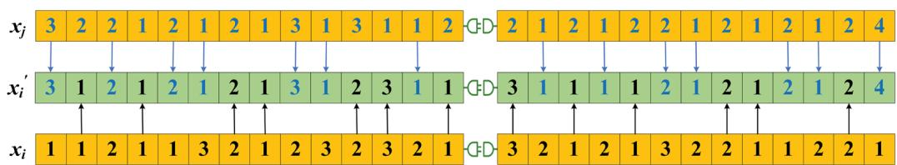  
Fi 7 MPM for MS.

## 4.5. Mutation operator

As a complement to the migration operator, mutation provides the population with the opportunity to escape local optima, helping to prevent premature convergence. So, this paper also designs diferent mutation operators specifically for the OS, MS, and WS layers.

For the OS layer, the inversion mutation strategy is employed. From each chromosome segment, two gene points $r _ { 1 }$ and $r _ { 2 }$ are randomly selected, and all gene points between $r _ { 1 }$ and $r _ { 2 }$ are inversed. As shown in Figure $^ { 8 , }$ for the first chromosome segment of the OS layer, the gene sequence [3, 1, 3, 5, 7] between $r _ { 1 } = 5$ and $r _ { 2 } = 9 { \mathrm { ; } }$ is selected. After the inversion mutation, the new gene arrangement becomes [7, 5, 3, 1, 3]. Similarly, for the second chromosome segment, the gene sequence [8, 4, 6, 2] of the mutant individual is generated by reversing the original segment [2, 6, 4, 8].

For the MS layer, a gene point is randomly selected from each chromosome segment and replaced with the machine with the shortest processing time among the optional machine set for that operation. For the WS layer, one position is selected from each chromosome segment, and a worker is randomly assigned from the eligible worker set. If the operation corresponding to this gene point can only be processed by one machine or worker, then randomly select a new position.

The proposed mutation operators increase population diversity, enabling the exploration of diferent regions in the solution space and potentially leading to better overall optimisation results.

## 4.6. Problem-specific neighbourhood search

Neighborhood search is the bridge between current solutions and potentially better ones. In this section, the unique global critical-path of DRFJSP-OJP is proposed, along with multiple local critical-paths based on job priorities. Furthermore, the neighbourhood structure driven by common critical operations is designed.

## 4.6.1. Collaboration ofmulti-critical-path

Since DRFJSP-OJP introduces job release time and worker resource, the critical path of traditional FJSP is no longer applicable. So, we also take the continuity of workers in time as a factor for identifying the critical path. Specifically, for the worker assigned to the current critical operation, if the previous operation performed by this worker is continuous in time with the current critical operation, then the previous operation can also be defined as a critical operation. In addition, both the global critical path and the local critical path are defined for a job set. For example, the local critical path corresponding to the highest priority is focussed on the set of jobs that belong to that highest priority category. In contrast, the global critical path clearly pertains to the collection of all jobs involved in the scheduling problem. This means that whether it is the global or local critical-path, only the corresponding job set needs to be determined, because the definition method ofthe critical path is the same. Based on this, Algorithm 2 presents the specific steps for determining the critical path.

As shown in Figure 9, this gantt chart presents an example of multiple critical-paths. The global critical path obtained from the set of all jobs is $O _ { 7 1 }  O _ { 7 2 } $ $O _ { 5 3 }  O _ { 5 4 }  O _ { 5 5 }  O _ { 3 4 }  O _ { 4 1 }  O _ { 4 2 }  O _ { 4 3 } $ $O _ { 4 4 } \to O _ { 4 5 } \to O _ { 2 6 } \to O _ { 8 3 } \to O _ { 1 5 } \to O _ { 1 0 , 7 } \to O _ { 8 6 }$ . In this scheduling scheme, the last completed operation $O _ { 8 6 }$ among all jobs is identified as a critical operation, and other critical operations are searched forward in sequence. If the start time of the critical operation $O _ { i j }$ is equal to the end time of its preceding operation $O _ { i , j - 1 } ,$ or equal to the completion time of the previous operation on the same machine $P M _ { i j } ,$ or equal to the end time of the previous task assigned to the same worker $P W _ { i j } ,$ then the corresponding preceding operation is also defined as a critical operation. According to the same method, local critical-paths belonging to the job sets of diferent priorities can be defined. For instance, for the jobs $\{ J _ { 3 } , J _ { 5 } , J _ { 7 } \}$ belonging to the highest priority, determine the latest completed operation $O _ { 3 5 }$ as the critical operation, and then search forward in sequence to obtain the local critical-path: $O _ { 7 1 }  O _ { 7 2 }  O _ { 5 3 }  O _ { 5 4 } $ $O _ { 5 5 }  O _ { 5 6 }  O _ { 7 5 }  O _ { 7 6 }  O _ { 3 5 }$ . Similarly, the local critical-path corresponding to jobs with the second priority is $O _ { 4 1 }  O _ { 4 2 }  O _ { 4 3 }  O _ { 4 4 }  O _ { 4 5 }  O _ { 2 6 } $ $O _ { 2 7 }  O _ { 2 8 }$ . It can be observed that all critical operations of the local critical-path with the lowest priority will be included in the global critical-path, as they share the same maximum completion time. Finally, by comparing each local critical-path with the global critical-path, we can extract the critical operations that are common to both, and the common critical operation set is obtained as $\{ O _ { 7 1 } , O _ { 7 2 } , O _ { 5 3 } , O _ { 5 4 } , O _ { 5 5 } , O _ { 4 1 } , O _ { 4 2 } , O _ { 4 3 } , O _ { 4 4 } , O _ { 4 5 } , O _ { 2 6 } , O _ { 4 6 } \}$ $O _ { 8 3 } , O _ { 1 5 } , O _ { 1 0 , 7 } , O _ { 8 6 } \}$ . The extraction process of common critical operations is shown in Algorithm 3.

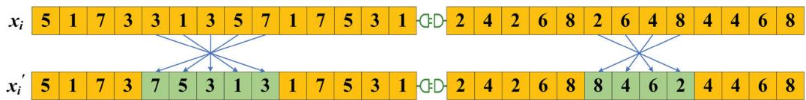  
Fi 8 Inversion mutation for OS.

```julia
Algorithm 2 Pseudo code for calculating the critical-path

1: Determine the job set U of the critical path
2: Define ST(·) and CT(·) to be the start time and end time of an operation
3: Define operation Oij to be processed on machine Mij, and Mij to be operated by worker Wij
4: Define the previous operations of Oij, Mij, and Wij as POij, PMij, and PWij, respectively
5: Define the critical operation set Cop = ∅
6: Define Oij as a critical operation COij if CT(Oij) is equal to the maximum completion time in the job set U
7: If COij requires machine processing
8: Define ET as the earliest start time of machine Mij
9: Else
10: Define ET as the earliest start time of worker Wij
11: End If
12: Cop = Cop ∪ COij
13: While (ST(COij) ≠ ET) do
14: If j ≥ 2
15: If COij requires machine processing
16: Define Oi'j' as a critical operation COi'j' with CT = max{CT(POij), CT(PMij), CT(PWij)}
17: Else
18: Define Oi'j' as a critical operation COi'j' with CT = max{CT(POij), CT(PWij)}
19: End If
20: Else
21: If COij requires machine processing
22: Define Oi'j' as a critical operation COi'j' with CT = max{CT(PMij), CT(PWij)}
23: Else
24: Define Oi'j' as a critical operation COi'j' with CT = CT(PWij)
25: End If
26: End If
27: Oi'j' → Oij, Mi'j' → Mij, Wi'j' → Wij
28: Cop = Cop ∪ COij
29: End While
30: Output the critical operation set Cop and critical path
```

## 4.6.2. Neighborhood structure driven by common critical operations

Based on the set of the above common critical operations, an eficient neighbourhood structure that satisfies the resource coupling constraints is designed. This neighbourhood structure aims to reduce the makespan by strategically repositioning critical operations, thereby optimising resource utilisation and enhancing overall scheduling eficiency.

For the critical operation $O _ { i j } ,$ let $P O _ { i j }$ denote its preceding operation, and $N O _ { i j }$ denote its next operation. Suppose the operation $O _ { i j }$ is processed by the machine $M _ { k } ,$ we define $P M _ { i j } ^ { k }$ as the previous operation on machine $M _ { k } ,$ and $N M _ { i j } ^ { k }$ as the next task on the same machine. Then, suppose the operation $O _ { i j }$ is performed by worker $W _ { e } ,$ then $P W _ { i j } ^ { e }$ represents the previous task of the worker $W _ { e } ,$ and $N W _ { i j } ^ { e }$ represents the succeeding operation of the worker. Clearly, the earliest start time $S T ^ { E }$ of this critical operation $O _ { i j }$ equals the maximum value of the latest completion time $C T ^ { L }$ of $P O _ { i j }$ , $P M _ { i j } ^ { k } ,$ and $P W _ { i j } ^ { e } .$ Thus, we have ${ \cal S } T ^ { E } ( { \cal O } _ { i j } ) =$ max $\{ C T ^ { L } ( P \dot { O _ { i j } } ) , C T ^ { L } ( P M _ { i j } ^ { k } ) , C T ^ { L } ( P W _ { i j } ^ { e } ) \}$ Conversely, the latest completion time of the critical operation $O _ { i j }$ is equal to the minimum value of the earliest start time of $\bar { N O } _ { i j } , \ N M _ { i j } ^ { k } ,$ and $N W _ { i j } ^ { e } ,$ which can be expressed as $C T ^ { L } ( { \cal O } _ { i j } ) = \operatorname * { m i n } \{ S T ^ { E } ( N { \dot { O _ { i j } } } ) , S T ^ { E } ( N M _ { i j } ^ { k } ) , S T ^ { E } ( N W _ { i j } ^ { e } ) \}$

Based on the generalised definition above, we can begin moving critical operations to conduct the neighbourhood search. For the critical operation $O _ { i j } ,$ it can only be moved if there is an idle time period for insertion. Therefore, we search for these idle time periods by exploring the optional machines and corresponding resources for $O _ { i j } .$ However, since some critical operations may not require machine processing and only need the worker resource, the conditions for their insertion will difer.

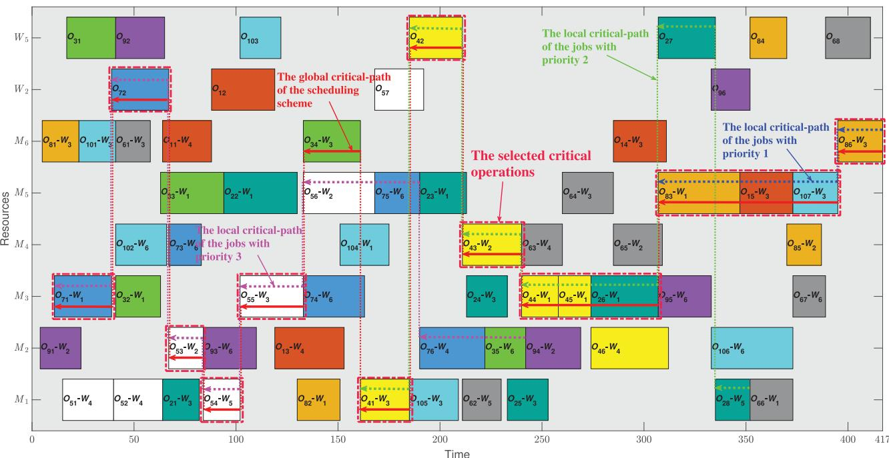  
Figure 9 A diagram of a critical path.

Firstly, if the critical operation $O _ { i j }$ requires the machine resource, the idle time of both machines and workers needs to be considered simultaneously. The earliest start time $S T ^ { E }$ of the critical operation $O _ { i j }$ can be determined by the following formula.

$$
\begin{array}{r l} & S T ^ {E} (O _ {i j}) \\ & \qquad = \max \left\{C T ^ {L} (P O _ {i j}), C T ^ {L} (P M _ {i j} ^ {k}), C T ^ {L} (P W _ {i j} ^ {e}) \right\} \end{array}\tag{17}
$$

Then, if $S T ^ { E } ( O _ { i j } )$ meets the following insertion condition, $O _ { i j }$ can be moved to that idle time period.

$$
\begin{array}{l} S T ^ {E} (O _ {i j}) + p _ {i j k} \\ \leq \min \left\{S T ^ {E} \left(N O _ {i j}\right), S T ^ {E} \left(N M _ {i j} ^ {k}\right), S T ^ {E} \left(N W _ {i j} ^ {e}\right) \right\} \end{array}\tag{18}
$$

Ifthe critical operation $O _ { i j }$ does not require machine processing, then only the availability ofthe worker $W _ { e }$ needs to be considered. In this case, the earliest start time of $O _ { i j }$ can be determined by Eq. (19).

$$
S T ^ {E} (O _ {i j}) = \max \left\{C T ^ {L} \left(P O _ {i j}\right), C T ^ {L} \left(P W _ {i j} ^ {e}\right) \right\}\tag{19}
$$

Furthermore, only when $S T ^ { E } ( O _ { i j } )$ satisfies the constraint of Eq. (20) can operation $O _ { i j }$ be inserted into the corresponding idle time period.

$$
S T ^ {E} \left(O _ {i j}\right) + p _ {i j k} \leq \min \left\{S T ^ {E} \left(N O _ {i j}\right), S T ^ {E} \left(N W _ {i j} ^ {e}\right) \right\}\tag{20}
$$

The neighbourhood structure driven by common critical operations takes into account the dual-resource flexibility, and conducts precise perturbations for diferent types of critical operations. Algorithm 3 presents its pseudo code. This method helps the algorithm identify the better scheduling scheme by systematically searching for neighbourhood solutions, thereby improving the overall optimisation performance.

## 4.7. Complexity analysis

The time complexity of MCPEA mainly depends on the population size $P s ,$ the number of iterations G, and the total number of operations N, where the total length of chromosomes is 3N. The initialisation generates the population using the hybrid heuristic method, with a complexity of $O ( P s \cdot 3 N ) \approx O ( P s \cdot N )$ . Similarly, the fitness evaluation involves decoding and calculating the objective function, with a complexity of $O ( P s \cdot N )$ per generation. Both the migration and mutation operators have a complexity of $O ( P s \cdot N )$ . The neighbourhood search includes the critical-path calculation with O(N) and the extraction of common critical operations with O(N), resulting in an overall complexity ofO(Ps · N). The insertion check in the critical operation movement takes O(1), which is neglected.

<div class="mineru-algorithm" style="white-space: pre-wrap; font-family:monospace;">
Algorithm 3 Pseudo code for common critical operations driven neighbourhood search

1: Determine the current scheduling solution X
2: Define  $X'$  to be a new neighboring solution
3: Initialize the common critical operation set  $C_{common} \leftarrow \emptyset$ 
4: Calculate the global critical-path  $CP_{global}$  for all jobs using Algorithm 2
5: Extract the global critical operation set  $C_{global}$  from  $CP_{global}$ 
6: For (each job priority level p) do
7: Determine the job set  $U_{p}$  belonging to priority p
8: Calculate the local critical-path  $CP_{local}^{p}$  for  $U_{p}$  using Algorithm 2
9: Extract the local critical operation set  $C_{local}^{p}$  from  $CP_{local}^{p}$ 
10:  $C_{common} \leftarrow C_{common} \cup (C_{global} \cap C_{local}^{p})$ 
11: End for
12: Remove duplicates from  $C_{common}$ 
13: Randomly select a critical operation  $O_{ij}$  from  $C_{common}$ 
14: If ( $O_{ij}$  requires machine processing) do
15: Identify available machine  $M_{k}$  and worker  $W_{e}$  for  $O_{ij}$ 
16: Calculate  $ST^{E}(O_{ij})$  using Equation (17)
17: If ( $ST^{E}(O_{ij})$  satisfies Equation (18)) do
18: Move  $O_{ij}$  to the idle time period on  $M_{k}$  and  $W_{e}$ 
19: Update the schedule to generate  $X'$ 
20: End if
21: Else % Only requires worker resource
22: Identify available worker  $W_{e}$  for  $O_{ij}$ 
23: Calculate  $ST^{E}(O_{ij})$  using Equation (19)
24: If ( $ST^{E}(O_{ij})$  satisfies Equation (20)) do
25: Move  $O_{ij}$  to the idle time period on  $W_{e}$ 
26: Update the schedule to generate  $X'$ 
27: End if
28: End if
29: Output the new solution  $X'$
</div>

Therefore, the overall time complexity of MCPEA can be approximated as $O ( G \cdot P s \cdot N )$

## 5. Experiments and discussions

In this section, to fully test the performance of MCPEA in solving the DRFJSP-OJP, systematic numerical experiments are conducted. 20 benchmark problems are used as the test suite. To ensure fairness, the same maximum running time is used as the termination condition for all algorithms. All experiments are conducted on the system equipped with an Intel(R) Core(TM) i7-14700KF processor running at 3.40 GHz and 16.0 GB RAM, and the experimental platform includes MATLAB R2022a and IBM ILOG CPLEX 20.1.0 solver.

In addition, to assess the performance of encoding and decoding schemes when handling job priority constraints, we designed weighted completion time diference with release time compensation as a evaluation metric of priority satisfaction degree (PSD). As shown in Eq. (21), subtracting the release time avoids a larger completion time caused by delayed task releases, and multiplying by the priority weight makes the delay penalty for high-priority jobs greater. So, PSD reflects whether high-priority jobs are completed as quickly as possible after being released, thus giving higher weight to highpriority jobs. A smaller value of PSD indicates a better adherence to job priority constraints in the scheduling solution, ensuring that high-priority jobs are processed preferentially.

$$
P S D = \frac {\sum_ {i = 1} ^ {n} (p _ {i} \cdot (C _ {i} - r _ {i}))}{\sum_ {i = 1} ^ {n} p _ {i}}\tag{21}
$$

## 5.1. Benchmarks construction

Based on the actual production data of a certain enterprise, this paper generates a test suite named ZQL, which includes 20 benchmark instances (ZQL01-ZQL20). This test suite includes problems of diferent scales, with the number of jobs increasing from six to 30, machines increasing from five to 12, job priorities increasing from two to five, workers increasing from four to 10. Table 4 presents the detailed information about the test suite. In this table, n represents the number of jobs, m represents the number ofmachines, and w represents the total number of workers. Furthermore, [min, max] represents the minimum and maximum operation numbers in the job set, sum\_op represents the total number of operations in this instance, avg\_op represents the average value of operations for each job, pro\_of represents the proportion of ofline operations in the problem. Furthermore, ‘CPU (s)’ represents the running time (in seconds) of each algorithm for this instance, that is, the termination criterion of each algorithm. Its calculation formula is ‘ceil(3 · sum\_op/5) · 5’. The termination time for each instance is set according to its total number ofoperations.

Taking ZQL03 as an example, it contains 10 jobs, five machines, and five workers, with a total of 56 operations. The jobs contain a minimum of four operations and a maximum of eight operations, with an average of 5.60 operations per job. Additionally, 26.79% ofall operations are ofline operations. When calculating this instance using algorithms, the running time is 85 seconds. The detailed data of the ZQL benchmark suite and the corresponding MATLAB code have been made available at https://zenodo.org/records/17226700.

Table 4 Descriptions of the benchmark problems (ZQL01- ZQL20).

<table><tr><td>No.</td><td>n</td><td>m</td><td>w</td><td>[min, max]</td><td>sum_op</td><td>avg_op</td><td>pro_off</td><td>CPU (s)</td></tr><tr><td>ZQL01</td><td>6</td><td>5</td><td>4</td><td>[4, 6]</td><td>29</td><td>4.83</td><td>13.79%</td><td>45</td></tr><tr><td>ZQL02</td><td>8</td><td>5</td><td>4</td><td>[5, 6]</td><td>42</td><td>5.25</td><td>11.90%</td><td>65</td></tr><tr><td>ZQL03</td><td>10</td><td>5</td><td>5</td><td>[4, 8]</td><td>56</td><td>5.60</td><td>26.79%</td><td>85</td></tr><tr><td>ZQL04</td><td>10</td><td>6</td><td>6</td><td>[5, 8]</td><td>64</td><td>6.40</td><td>26.56%</td><td>100</td></tr><tr><td>ZQL05</td><td>11</td><td>7</td><td>6</td><td>[4, 7]</td><td>62</td><td>5.64</td><td>29.03%</td><td>95</td></tr><tr><td>ZQL06</td><td>12</td><td>6</td><td>5</td><td>[5, 6]</td><td>71</td><td>5.92</td><td>23.94%</td><td>110</td></tr><tr><td>ZQL07</td><td>14</td><td>7</td><td>5</td><td>[6, 7]</td><td>90</td><td>6.43</td><td>26.67%</td><td>135</td></tr><tr><td>ZQL08</td><td>16</td><td>8</td><td>6</td><td>[5, 9]</td><td>103</td><td>6.44</td><td>24.27%</td><td>155</td></tr><tr><td>ZQL09</td><td>16</td><td>8</td><td>7</td><td>[4, 8]</td><td>105</td><td>6.56</td><td>28.57%</td><td>160</td></tr><tr><td>ZQL10</td><td>17</td><td>7</td><td>4</td><td>[8, 8]</td><td>136</td><td>8.00</td><td>8.09%</td><td>205</td></tr><tr><td>ZQL11</td><td>18</td><td>8</td><td>6</td><td>[7, 9]</td><td>145</td><td>8.06</td><td>23.45%</td><td>220</td></tr><tr><td>ZQL12</td><td>20</td><td>8</td><td>7</td><td>[6, 9]</td><td>148</td><td>7.40</td><td>21.62%</td><td>225</td></tr><tr><td>ZQL13</td><td>21</td><td>9</td><td>8</td><td>[5, 10]</td><td>148</td><td>7.05</td><td>22.97%</td><td>225</td></tr><tr><td>ZQL14</td><td>22</td><td>10</td><td>8</td><td>[6, 8]</td><td>154</td><td>7.00</td><td>23.38%</td><td>235</td></tr><tr><td>ZQL15</td><td>23</td><td>10</td><td>8</td><td>[6, 7]</td><td>150</td><td>6.52</td><td>37.33%</td><td>225</td></tr><tr><td>ZQL16</td><td>24</td><td>10</td><td>7</td><td>[5, 9]</td><td>166</td><td>6.92</td><td>18.07%</td><td>250</td></tr><tr><td>ZQL17</td><td>26</td><td>10</td><td>8</td><td>[7, 8]</td><td>194</td><td>7.46</td><td>26.29%</td><td>295</td></tr><tr><td>ZQL18</td><td>28</td><td>11</td><td>7</td><td>[4, 9]</td><td>172</td><td>6.14</td><td>16.28%</td><td>260</td></tr><tr><td>ZQL19</td><td>30</td><td>11</td><td>9</td><td>[7, 7]</td><td>210</td><td>7.00</td><td>20.95%</td><td>315</td></tr><tr><td>ZQL20</td><td>30</td><td>12</td><td>10</td><td>[6, 10]</td><td>234</td><td>7.80</td><td>22.22%</td><td>355</td></tr></table>

## 5.2. Parameters setting

The proposed MCPEA involves three parameters that need to be initialised: population size (Ps), mutation probability (Mp), and local search probability $( L p )$ . To allow non-experts to execute the algorithm by setting parameters without needing to understand the specific details of the algorithm, this paper uses the Taguchi experiment (Z. Zhang, Li et al. 2025) to determine the parameter combinations. Firstly, we provide four candidate values for each parameter: $P s = [ 5 0 , 1 0 0 , 1 5 0 , 2 0 0 ]$ $M p = [ 0 . 0 5 , 0 . 1 0 , 0 . 1 5 , 0 . 2 0 ]$ , and $L \rho = [ 0 . 1 , 0 . 2 , 0 . 3 , 0 . 4 ]$ Then, according to the number of parameters and levels, the orthogonal table $L _ { 1 6 }$ is determined, as shown in Table 5, resulting in 16 combinations of the three parameters. Each set of parameters is applied to the MCPEA to solve the 20 instances of the ZQL test suite. The CPU running time from Table 4 serves as the termination criterion, and the average value of the objective function obtained by the algorithm for each parameter set is recorded as the response value.

Finally, Figure 10 shows the average response values of the three parameters at the same level. It is not difficult to see that the optimal levels for each parameter are $L _ { 2 } , L _ { 3 } ,$ , and $L _ { 3 } ,$ , respectively. Therefore, the recommended optimal parameter combination for MCPEA is $[ P s , M p , L p ] = [ 1 0 0 , 0 . 1 5 , 0 . 3 ]$

Table 5 The orthogonal table of the Taguchi experiment.

<table><tr><td>No.</td><td>Ps</td><td>Mp</td><td>Lp</td><td>Response value</td></tr><tr><td>1</td><td>50</td><td>0.05</td><td>0.1</td><td>851.8</td></tr><tr><td>2</td><td>50</td><td>0.10</td><td>0.2</td><td>858.6</td></tr><tr><td>3</td><td>50</td><td>0.15</td><td>0.3</td><td>851.7</td></tr><tr><td>4</td><td>50</td><td>0.20</td><td>0.4</td><td>857.4</td></tr><tr><td>5</td><td>100</td><td>0.05</td><td>0.2</td><td>854.5</td></tr><tr><td>6</td><td>100</td><td>0.10</td><td>0.1</td><td>855.4</td></tr><tr><td>7</td><td>100</td><td>0.15</td><td>0.4</td><td>852.5</td></tr><tr><td>8</td><td>100</td><td>0.20</td><td>0.3</td><td>846.3</td></tr><tr><td>9</td><td>150</td><td>0.05</td><td>0.3</td><td>854.6</td></tr><tr><td>10</td><td>150</td><td>0.10</td><td>0.4</td><td>858.2</td></tr><tr><td>11</td><td>150</td><td>0.15</td><td>0.1</td><td>853.8</td></tr><tr><td>12</td><td>150</td><td>0.20</td><td>0.2</td><td>857.0</td></tr><tr><td>13</td><td>200</td><td>0.05</td><td>0.4</td><td>855.7</td></tr><tr><td>14</td><td>200</td><td>0.10</td><td>0.3</td><td>856.5</td></tr><tr><td>15</td><td>200</td><td>0.15</td><td>0.2</td><td>851.4</td></tr><tr><td>16</td><td>200</td><td>0.20</td><td>0.1</td><td>854.1</td></tr></table>

## 5.3. Ablation experiment ofthe algorithm

This subsection performs an ablation experiment to validate the efectiveness of the key components in MCPEA. We design three algorithm variants for comparison. MCPEA-V1 utilises random initialisation instead of the hybrid heuristic method. MCPEA-V2 replaces the migration operator with the traditional crossover operator. MCPEA-V3 disables the problem-specific neighbourhood search to assess its contribution to solution improvement. All variants maintain identical parameter settings and termination criteria as the complete MCPEA. All algorithms are independently run 20 times on 20 benchmark instances to ensure the scientific nature ofthe experiments. The best, mean value ofthe makespan and PSD are recorded as the experimental results, as given in Table 6, where the bold data represents the best results among all variants.

According to the experimental results, the complete MCPEA achieves the best average makespan on 85 percent instances and obtains the best average PSD value on 90 percent problems, outperforming the three variants comprehensively. Specifically, MCPEA-V1 with random initialisation shows a major decline in average solution quality on 75 percent of the problems, demonstrating the efectiveness of the hybrid heuristic initialisation in improving the convergence starting point. MCPEA-V2 using the crossover operator performs moderately well on instances like ZQL19, but its degree of priority satisfaction is inferior to that of the migration operator on most problems, verifying the advantages ofthe migration strategy based on exemplar learning. MCPEA-V3 without neighbourhood search experiences the most significant performance decline, performing obviously worse on complex problems, which highlights the importance ofneighbourhood search based on multiple critical-paths in developing better solutions. It is evident that all three strategies enhance the algorithm performance to diferent extents, with the neighbourhood structure playing the most critical role. As a result, the experimental results fully prove the necessity and collaborative efectiveness of the three components. Three strategies complement each other to jointly enhance the algorithm performance.

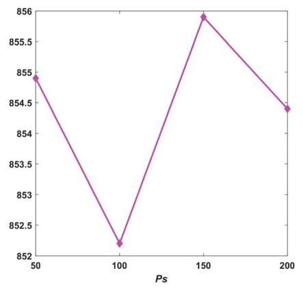  
Figure 10 The mean response values at the same level of three parameters.

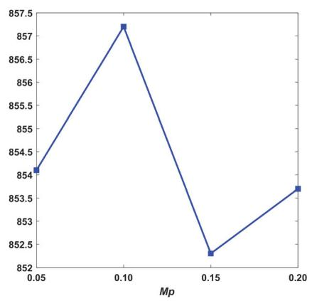

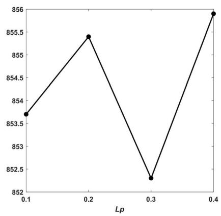

Table 6 Results of MCPEA-V1, MCPEA-V2, MCPEA-V3 and MCPEA.

<table><tr><td rowspan="2">No.</td><td rowspan="2">Indexs</td><td colspan="2">MCPEA-V1</td><td colspan="2">MCPEA-V2</td><td colspan="2">MCPEA-V3</td><td colspan="2">MCPEA</td></tr><tr><td>Best</td><td>Mean</td><td>Best</td><td>Mean</td><td>Best</td><td>Mean</td><td>Best</td><td>Mean</td></tr><tr><td rowspan="2">ZQL01</td><td>Makespan</td><td>243</td><td>254.5</td><td>245</td><td>251.9</td><td>244</td><td>255.4</td><td>239</td><td>249.5</td></tr><tr><td>PSD</td><td>201.6</td><td>211.1</td><td>194.7</td><td>209.9</td><td>199.0</td><td>208.5</td><td>197.7</td><td>205.3</td></tr><tr><td rowspan="2">ZQL02</td><td>Makespan</td><td>332</td><td>342.4</td><td>327</td><td>340.4</td><td>333</td><td>347.6</td><td>324</td><td>340</td></tr><tr><td>PSD</td><td>216.1</td><td>239.4</td><td>213.1</td><td>229.1</td><td>222.2</td><td>234.7</td><td>212.3</td><td>226.7</td></tr><tr><td rowspan="2">ZQL03</td><td>Makespan</td><td>306</td><td>324.6</td><td>315</td><td>320.6</td><td>312</td><td>323.2</td><td>305</td><td>316.2</td></tr><tr><td>PSD</td><td>188.2</td><td>198.7</td><td>189.4</td><td>199.4</td><td>183.3</td><td>201.5</td><td>178.8</td><td>192.5</td></tr><tr><td rowspan="2">ZQL04</td><td>Makespan</td><td>359</td><td>365.9</td><td>357</td><td>369.3</td><td>374</td><td>387.4</td><td>347</td><td>368.5</td></tr><tr><td>PSD</td><td>215.7</td><td>224.1</td><td>222.7</td><td>226.2</td><td>229.2</td><td>239.3</td><td>198.1</td><td>222.7</td></tr><tr><td rowspan="2">ZQL05</td><td>Makespan</td><td>338</td><td>346.1</td><td>337</td><td>343.7</td><td>343</td><td>354.4</td><td>335</td><td>346</td></tr><tr><td>PSD</td><td>229.5</td><td>251.0</td><td>234.1</td><td>239.4</td><td>238.5</td><td>254.1</td><td>229.3</td><td>238.9</td></tr><tr><td rowspan="2">ZQL06</td><td>Makespan</td><td>480</td><td>489.1</td><td>474</td><td>484.2</td><td>502</td><td>511</td><td>477</td><td>491.3</td></tr><tr><td>PSD</td><td>315.4</td><td>327.8</td><td>298.2</td><td>332.1</td><td>327.4</td><td>341.2</td><td>304.7</td><td>323.7</td></tr><tr><td rowspan="2">ZQL07</td><td>Makespan</td><td>509</td><td>521.6</td><td>516</td><td>524.2</td><td>541</td><td>549.8</td><td>506</td><td>518.9</td></tr><tr><td>PSD</td><td>302.7</td><td>316.4</td><td>303.1</td><td>322.0</td><td>327.0</td><td>339.5</td><td>297.9</td><td>312.9</td></tr><tr><td rowspan="2">ZQL08</td><td>Makespan</td><td>589</td><td>596.6</td><td>583</td><td>592.9</td><td>603</td><td>616</td><td>566</td><td>587.3</td></tr><tr><td>PSD</td><td>328.8</td><td>346.4</td><td>331.5</td><td>356.8</td><td>348.1</td><td>368.9</td><td>323.6</td><td>341.7</td></tr><tr><td rowspan="2">ZQL09</td><td>Makespan</td><td>575</td><td>584.7</td><td>572</td><td>591.6</td><td>621</td><td>631.5</td><td>564</td><td>581.2</td></tr><tr><td>PSD</td><td>264.9</td><td>287.4</td><td>270.3</td><td>287.4</td><td>287.5</td><td>309.1</td><td>268.2</td><td>282.9</td></tr><tr><td rowspan="2">ZQL10</td><td>Makespan</td><td>1062</td><td>1083.1</td><td>1058</td><td>1075.9</td><td>1102</td><td>1121.4</td><td>1048</td><td>1078.7</td></tr><tr><td>PSD</td><td>550.7</td><td>584.2</td><td>536.0</td><td>569.3</td><td>578.1</td><td>594.9</td><td>529.0</td><td>563.0</td></tr><tr><td rowspan="2">ZQL11</td><td>Makespan</td><td>833</td><td>862.7</td><td>849</td><td>862.9</td><td>891</td><td>903.2</td><td>826</td><td>854.1</td></tr><tr><td>PSD</td><td>486.5</td><td>507.3</td><td>469.2</td><td>499.3</td><td>479.9</td><td>515.6</td><td>456.8</td><td>481.3</td></tr><tr><td rowspan="2">ZQL12</td><td>Makespan</td><td>851</td><td>892.4</td><td>890</td><td>910.3</td><td>922</td><td>953.8</td><td>838</td><td>887.4</td></tr><tr><td>PSD</td><td>394.8</td><td>420.2</td><td>401.7</td><td>426.8</td><td>426.5</td><td>452.2</td><td>400.2</td><td>417.6</td></tr><tr><td rowspan="2">ZQL13</td><td>Makespan</td><td>818</td><td>838.6</td><td>813</td><td>834.8</td><td>861</td><td>875.2</td><td>783</td><td>825</td></tr><tr><td>PSD</td><td>459.8</td><td>483.9</td><td>461.1</td><td>485.5</td><td>476.3</td><td>505.4</td><td>462.6</td><td>472.4</td></tr><tr><td rowspan="2">ZQL14</td><td>Makespan</td><td>794</td><td>836.4</td><td>819</td><td>836.7</td><td>866</td><td>880.8</td><td>792</td><td>827.2</td></tr><tr><td>PSD</td><td>450.9</td><td>484.2</td><td>444.5</td><td>474.0</td><td>476.4</td><td>504.6</td><td>439.1</td><td>462.8</td></tr><tr><td rowspan="2">ZQL15</td><td>Makespan</td><td>709</td><td>736.6</td><td>726</td><td>741.8</td><td>786</td><td>794.3</td><td>695</td><td>724.8</td></tr><tr><td>PSD</td><td>361.9</td><td>374.3</td><td>353.7</td><td>371.7</td><td>383.1</td><td>399.0</td><td>336.5</td><td>359.9</td></tr><tr><td rowspan="2">ZQL16</td><td>Makespan</td><td>934</td><td>955.9</td><td>950</td><td>963.8</td><td>988</td><td>1003.3</td><td>908</td><td>954.5</td></tr><tr><td>PSD</td><td>518.4</td><td>544.4</td><td>526.3</td><td>545.2</td><td>533.4</td><td>568.9</td><td>517.6</td><td>532.7</td></tr><tr><td rowspan="2">ZQL17</td><td>Makespan</td><td>824</td><td>855.4</td><td>839</td><td>865.2</td><td>887</td><td>899</td><td>811</td><td>840.3</td></tr><tr><td>PSD</td><td>378.7</td><td>397.8</td><td>381.5</td><td>394.6</td><td>382.1</td><td>405.5</td><td>375.8</td><td>383.0</td></tr><tr><td rowspan="2">ZQL18</td><td>Makespan</td><td>993</td><td>1012.4</td><td>1002</td><td>1020.2</td><td>1028</td><td>1044.1</td><td>986</td><td>1008.4</td></tr><tr><td>PSD</td><td>554.1</td><td>570.3</td><td>526.0</td><td>554.8</td><td>549.0</td><td>580.9</td><td>522.3</td><td>554.7</td></tr><tr><td rowspan="2">ZQL19</td><td>Makespan</td><td>891</td><td>899.7</td><td>881</td><td>896.2</td><td>910</td><td>929.8</td><td>886</td><td>894.5</td></tr><tr><td>PSD</td><td>518.1</td><td>536.1</td><td>511.4</td><td>530.7</td><td>513.4</td><td>536.8</td><td>498.4</td><td>514.3</td></tr><tr><td rowspan="2">ZQL20</td><td>Makespan</td><td>997</td><td>1015.6</td><td>1002</td><td>1014.3</td><td>1028</td><td>1036.3</td><td>978</td><td>1005.7</td></tr><tr><td>PSD</td><td>491.3</td><td>508.7</td><td>483.5</td><td>511.8</td><td>497.9</td><td>524.2</td><td>485.4</td><td>500.6</td></tr></table>

## 5.4. Comparison between the model and the algorithm

To verify the correctness of the proposed MILP model, we employ the CPLEX solver to solve the 20 instances, setting the maximum computation time for each case to 600 s. At the same time, the MCPEA is applied to address these problems, with the termination criterion for the algorithm being the preset running time for each instance. Although the MILP model incorporates a penalty term in its objective function to handle job priority constraints, for an intuitive evaluation of solution eficiency, we record the makespan and PSD of the optimal scheduling solution for comparison, as shown in Table 7. Here, ‘NaN’ stands for ‘Not a Number’, indicating that the MILP model cannot find any feasible solution for the corresponding instance within the 600-s time limit.

Table 7 Results obtained by MILP model and MCPEA.

<table><tr><td rowspan="2">No.</td><td colspan="2">MILP</td><td colspan="2">MCPEA</td><td rowspan="2">No.</td><td colspan="2">MILP</td><td colspan="2">MCPEA</td></tr><tr><td>Makespan</td><td>PSD</td><td>Makespan</td><td>PSD</td><td>Makespan</td><td>PSD</td><td>Makespan</td><td>PSD</td></tr><tr><td>ZQL01</td><td>317</td><td>222.8</td><td>239</td><td>197.7</td><td>ZQL11</td><td>NaN</td><td>NaN</td><td>826</td><td>456.8</td></tr><tr><td>ZQL02</td><td>194</td><td>168.3</td><td>324</td><td>212.3</td><td>ZQL12</td><td>NaN</td><td>NaN</td><td>838</td><td>400.2</td></tr><tr><td>ZQL03</td><td>217</td><td>165.1</td><td>305</td><td>178.8</td><td>ZQL13</td><td>NaN</td><td>NaN</td><td>783</td><td>462.6</td></tr><tr><td>ZQL04</td><td>324</td><td>253.5</td><td>347</td><td>198.1</td><td>ZQL14</td><td>NaN</td><td>NaN</td><td>792</td><td>439.1</td></tr><tr><td>ZQL05</td><td>288</td><td>249.2</td><td>335</td><td>229.3</td><td>ZQL15</td><td>NaN</td><td>NaN</td><td>695</td><td>336.5</td></tr><tr><td>ZQL06</td><td>348</td><td>300.4</td><td>477</td><td>304.7</td><td>ZQL16</td><td>NaN</td><td>NaN</td><td>908</td><td>517.6</td></tr><tr><td>ZQL07</td><td>522</td><td>483.3</td><td>506</td><td>297.9</td><td>ZQL17</td><td>NaN</td><td>NaN</td><td>811</td><td>375.8</td></tr><tr><td>ZQL08</td><td>672</td><td>378.0</td><td>566</td><td>323.6</td><td>ZQL18</td><td>NaN</td><td>NaN</td><td>986</td><td>522.3</td></tr><tr><td>ZQL09</td><td>NaN</td><td>NaN</td><td>564</td><td>268.2</td><td>ZQL19</td><td>NaN</td><td>NaN</td><td>886</td><td>498.4</td></tr><tr><td>ZQL10</td><td>NaN</td><td>NaN</td><td>1048</td><td>529.0</td><td>ZQL20</td><td>NaN</td><td>NaN</td><td>978</td><td>485.4</td></tr></table>

From Table 7, it is clear that for small-scale instances, the proposed MILP model can find feasible solutions within the 600 s, especially achieving better completion time than MCPEA on ZQL04, ZQL05, and ZQL06. This verifies the correctness of the constructed MILP model and indicates that the model can accurately describe and solve the DRFJSP-OJP. However, as the problem size increases, this model fails to find feasible solutions for any larger instances within 600 s. In contrast, the MCPEA demonstrates superior solving eficiency, generating high-quality feasible scheduling schemes for instances of varying sizes within a reasonable time. Therefore, experimental results confirm the correctness of the MILP model and its ability to successfully solve some small-scale problems. But it struggles to obtain feasible solutions for larger instances even with long time.

## 5.5. Comparison between the algorithm and other methods

To verify the superiority of MCPEA, comparative experiments are conducted with eGA (Zhang, Gao, and Shi 2011), HDPSO (Zhang, Wang, and Xu 2017), HSDE (Li, Wang, and Peng 2022), DCGA (Han et al. 2024), and KMA (Deng et al. 2025). The selection of these algorithms is not arbitrary but is based on the high relevance of the problems addressed in their original literature to the core challenges of this paper, ensuring fairness and persuasiveness in the comparisons. The specific rationale is as follows: (1) eGA is a classic and eficient algorithm for solving standard FJSP. It is chosen as a reference benchmark to demonstrate that specialised improvements for the complex constraints in this paper must significantly outperform established general algorithms. (2) HDPSO is an advanced evolutionary algorithm specifically designed for DRFJSP. It directly tests whether MCPEA performs better than existing advanced algorithms in the same field when addressing the core challenge of coordinating scheduling between machines and workers. (3) HSDE is one of the few studies that explicitly considers job priority constraints in DRFJSP. Therefore, it serves as the most relevant comparison method for evaluating MCPEA’s performance in meeting priority constraints. (4) DCGA and KMA represent the latest algorithmic frameworks for solving complex resource-constrained problems. They can verify whether the overall framework design of MCPEA has advantages over the current eficient algorithms when facing complex extended FJSP. Then, the parameters for the five algorithms are set according to their original reference papers, as given in Table 8.

Table 8 Parameters setting for all compared algorithms.

<table><tr><td>Algorithm</td><td>Parameters setting</td><td>Termination condition</td></tr><tr><td>eGA</td><td> $Ps = 100; r_{GS} = 0.6; r_{LS} = 0.3; r_{RS} = 0.1; Pc = 0.7; Mp = 0.01$ </td><td>CPU (s)</td></tr><tr><td>HDPSO</td><td> $Ps = 100; T_0 = 3; T_{end} = 0.01; B = 0.9; pl_1 = 0.6; pl_2 = 0.8; pf_{max} = 0.9; pf_{min} = 0.2$ </td><td>CPU (s)</td></tr><tr><td>HSDE</td><td> $Ps = 200; F = 0.7; CR = 0.2$ </td><td>CPU (s)</td></tr><tr><td>DCGA</td><td> $Ps = 500; Pc = 0.9; Mp = 0.15$ </td><td>CPU (s)</td></tr><tr><td>KMA</td><td> $Ps = 200; Pc = 0.9; Mp = 0.6; \alpha = 0.92$ </td><td>CPU (s)</td></tr><tr><td>MCPEA</td><td> $Ps = 100; Mp = 0.15; Lp = 0.3$ </td><td>CPU (s)</td></tr></table>

Similarly, all algorithms are independently run 20 times on each problem. The best value and mean value of the makespan, along with their corresponding PSD, are recorded, as shown in Table 9, where the bold data represents the best results. It is not dificult to see that the proposed algorithm demonstrates outstanding overall performance in optimising makespan under the same CPU time constraint. From Table 9, it can be observed that MCPEA achieves the best makespan on 14 instances of the ZQL test suite and obtains the smallest average value on 17 instances. This proves that, with equal computational resources, MCPEA has a stronger capability for obtaining optimal scheduling solutions and robustness. In individual instances, such as ZQL05, ZQL06, and ZQL19, KMA achieves better or comparable results in terms of the best makespan, demonstrating its competitiveness as a new algorithm. However, the average value of MCPEA in these instances is nearly the same as those of KMA, and even better on ZQL19, while significantly leading in the vast majority of other instances, reflecting its more comprehensive superiority.

Table 9 Results of eGA, HDPSO, HSDE, DCGA, KMA and MCPEA.

<table><tr><td rowspan="2">No.</td><td rowspan="2">Indexs</td><td colspan="2">eGA</td><td colspan="2">HDPSO</td><td colspan="2">HSDE</td><td colspan="2">DCGA</td><td colspan="2">KMA</td><td colspan="2">MCPEA</td></tr><tr><td>Best</td><td>Mean</td><td>Best</td><td>Mean</td><td>Best</td><td>Mean</td><td>Best</td><td>Mean</td><td>Best</td><td>Mean</td><td>Best</td><td>Mean</td></tr><tr><td rowspan="2">ZQL01</td><td>Makespan</td><td>284</td><td>298.6</td><td>269</td><td>277.5</td><td>250</td><td>265.7</td><td>246</td><td>260.0</td><td>247</td><td>256.0</td><td>239</td><td>249.5</td></tr><tr><td>PSD</td><td>198.9</td><td>224.5</td><td>201.3</td><td>215.7</td><td>207.1</td><td>219.1</td><td>205.0</td><td>215.3</td><td>207.6</td><td>220.1</td><td>197.7</td><td>205.3</td></tr><tr><td rowspan="2">ZQL02</td><td>Makespan</td><td>359</td><td>366.9</td><td>347</td><td>359.4</td><td>338</td><td>366.9</td><td>335</td><td>347.6</td><td>336</td><td>341.5</td><td>324</td><td>340.0</td></tr><tr><td>PSD</td><td>248.8</td><td>257.0</td><td>214.4</td><td>227.1</td><td>237.3</td><td>252.4</td><td>237.3</td><td>249.4</td><td>236.6</td><td>253.3</td><td>212.3</td><td>226.7</td></tr><tr><td rowspan="2">ZQL03</td><td>Makespan</td><td>321</td><td>342.8</td><td>321</td><td>325.3</td><td>331</td><td>350.0</td><td>313</td><td>324.7</td><td>307</td><td>318.1</td><td>305</td><td>316.2</td></tr><tr><td>PSD</td><td>201.3</td><td>208.4</td><td>193.8</td><td>199.1</td><td>198.6</td><td>214.8</td><td>199.1</td><td>208.0</td><td>193.1</td><td>209.3</td><td>178.8</td><td>192.5</td></tr><tr><td rowspan="2">ZQL04</td><td>Makespan</td><td>397</td><td>413.5</td><td>387</td><td>397.1</td><td>404</td><td>412.4</td><td>368</td><td>377.6</td><td>356</td><td>370.6</td><td>347</td><td>368.5</td></tr><tr><td>PSD</td><td>234.6</td><td>244.0</td><td>228.1</td><td>240.1</td><td>227.8</td><td>254.1</td><td>216.6</td><td>237.1</td><td>232.4</td><td>244.3</td><td>198.1</td><td>222.7</td></tr><tr><td rowspan="2">ZQL05</td><td>Makespan</td><td>367</td><td>371.1</td><td>360</td><td>368.7</td><td>370</td><td>379.4</td><td>336</td><td>349.6</td><td>332</td><td>340.7</td><td>335</td><td>346.0</td></tr><tr><td>PSD</td><td>245.6</td><td>254.6</td><td>243.9</td><td>253.4</td><td>249.3</td><td>268.7</td><td>237.8</td><td>256.7</td><td>234.2</td><td>253.4</td><td>229.3</td><td>238.9</td></tr><tr><td rowspan="2">ZQL06</td><td>Makespan</td><td>484</td><td>496.1</td><td>505</td><td>517.6</td><td>502</td><td>528.3</td><td>489</td><td>501.4</td><td>475</td><td>486.9</td><td>477</td><td>491.3</td></tr><tr><td>PSD</td><td>340.2</td><td>346.8</td><td>314.2</td><td>327.3</td><td>333.0</td><td>351.9</td><td>319.7</td><td>343.7</td><td>304.2</td><td>337.5</td><td>304.7</td><td>323.7</td></tr><tr><td rowspan="2">ZQL07</td><td>Makespan</td><td>550</td><td>563.0</td><td>533</td><td>539.6</td><td>552</td><td>570.3</td><td>519</td><td>532.7</td><td>504</td><td>520.2</td><td>506</td><td>518.9</td></tr><tr><td>PSD</td><td>309.6</td><td>324.5</td><td>314.8</td><td>326.2</td><td>324.6</td><td>353.7</td><td>316.6</td><td>336.8</td><td>312.2</td><td>333.9</td><td>297.9</td><td>312.9</td></tr><tr><td rowspan="2">ZQL08</td><td>Makespan</td><td>592</td><td>622.7</td><td>611</td><td>620.7</td><td>632</td><td>645.4</td><td>586</td><td>612.7</td><td>570</td><td>593.7</td><td>566</td><td>587.3</td></tr><tr><td>PSD</td><td>339.9</td><td>358.7</td><td>351.5</td><td>363.6</td><td>346.4</td><td>372.9</td><td>349.3</td><td>369.8</td><td>332.0</td><td>348.1</td><td>323.6</td><td>341.7</td></tr><tr><td rowspan="2">ZQL09</td><td>Makespan</td><td>618</td><td>633.6</td><td>594</td><td>607.4</td><td>632</td><td>651.8</td><td>589</td><td>611.1</td><td>582</td><td>592.7</td><td>564</td><td>581.2</td></tr><tr><td>PSD</td><td>293.3</td><td>297.2</td><td>277.5</td><td>295.2</td><td>308.3</td><td>320.8</td><td>288.9</td><td>307.1</td><td>292.7</td><td>309.1</td><td>268.2</td><td>282.9</td></tr><tr><td rowspan="2">ZQL10</td><td>Makespan</td><td>1098</td><td>1118.9</td><td>1080</td><td>1094.8</td><td>1114</td><td>1156.0</td><td>1076</td><td>1104.6</td><td>1070</td><td>1098.0</td><td>1048</td><td>1078.7</td></tr><tr><td>PSD</td><td>580.8</td><td>602.8</td><td>521.5</td><td>532.0</td><td>614.4</td><td>632.9</td><td>584.3</td><td>612.4</td><td>568.1</td><td>587.5</td><td>529.0</td><td>563.0</td></tr><tr><td rowspan="2">ZQL11</td><td>Makespan</td><td>854</td><td>883.0</td><td>855</td><td>871.9</td><td>929</td><td>941.7</td><td>874</td><td>884.4</td><td>847</td><td>875.6</td><td>826</td><td>854.1</td></tr><tr><td>PSD</td><td>490.3</td><td>512.7</td><td>468.9</td><td>482.6</td><td>505.6</td><td>538.2</td><td>517.6</td><td>545.3</td><td>479.1</td><td>516.8</td><td>456.8</td><td>481.3</td></tr><tr><td rowspan="2">ZQL12</td><td>Makespan</td><td>925</td><td>944.5</td><td>902</td><td>913.9</td><td>973</td><td>991.2</td><td>879</td><td>923.7</td><td>896</td><td>920.9</td><td>838</td><td>887.4</td></tr><tr><td>PSD</td><td>425.3</td><td>444.1</td><td>412.1</td><td>430.2</td><td>441.3</td><td>469.2</td><td>403.4</td><td>444.8</td><td>442.8</td><td>457.6</td><td>400.2</td><td>417.6</td></tr><tr><td rowspan="2">ZQL13</td><td>Makespan</td><td>827</td><td>867.0</td><td>832</td><td>849.6</td><td>884</td><td>904.7</td><td>836</td><td>851.4</td><td>813</td><td>836.7</td><td>783</td><td>825.0</td></tr><tr><td>PSD</td><td>476.0</td><td>502.1</td><td>469.9</td><td>482.1</td><td>499.2</td><td>537.5</td><td>500.5</td><td>527.7</td><td>473.9</td><td>503.2</td><td>462.6</td><td>472.4</td></tr><tr><td rowspan="2">ZQL14</td><td>Makespan</td><td>854</td><td>865.6</td><td>842</td><td>851.9</td><td>907</td><td>917.3</td><td>832</td><td>853.8</td><td>835</td><td>847.3</td><td>792</td><td>827.2</td></tr><tr><td>PSD</td><td>461.3</td><td>478.2</td><td>444.6</td><td>464.8</td><td>502.7</td><td>521.9</td><td>472.8</td><td>497.6</td><td>460.2</td><td>499.5</td><td>439.1</td><td>462.8</td></tr><tr><td rowspan="2">ZQL15</td><td>Makespan</td><td>769</td><td>788.3</td><td>738</td><td>757.1</td><td>821</td><td>838.3</td><td>762</td><td>774.7</td><td>719</td><td>741.0</td><td>695</td><td>724.8</td></tr><tr><td>PSD</td><td>382.1</td><td>390.3</td><td>357.7</td><td>364.5</td><td>394.9</td><td>409.4</td><td>379.1</td><td>399.4</td><td>369.7</td><td>402.1</td><td>336.5</td><td>359.9</td></tr><tr><td rowspan="2">ZQL16</td><td>Makespan</td><td>950</td><td>973.2</td><td>953</td><td>969.6</td><td>1015</td><td>1039.8</td><td>960</td><td>977.1</td><td>938</td><td>965.9</td><td>908</td><td>954.5</td></tr><tr><td>PSD</td><td>553.2</td><td>564.5</td><td>519.7</td><td>535.6</td><td>569.8</td><td>589.2</td><td>546.9</td><td>579.5</td><td>527.5</td><td>562.7</td><td>517.6</td><td>532.7</td></tr><tr><td rowspan="2">ZQL17</td><td>Makespan</td><td>866</td><td>885.8</td><td>844</td><td>863.5</td><td>929</td><td>940.6</td><td>858</td><td>883.3</td><td>833</td><td>868.1</td><td>811</td><td>840.3</td></tr><tr><td>PSD</td><td>398.5</td><td>405.3</td><td>372.8</td><td>386.8</td><td>409.6</td><td>424.0</td><td>411.9</td><td>422.6</td><td>376.6</td><td>403.2</td><td>375.8</td><td>383.0</td></tr><tr><td rowspan="2">ZQL18</td><td>Makespan</td><td>987</td><td>1025.6</td><td>1016</td><td>1027.9</td><td>1067</td><td>1081.9</td><td>993</td><td>1026.7</td><td>999</td><td>1016.2</td><td>986</td><td>1008.4</td></tr><tr><td>PSD</td><td>555.3</td><td>569.4</td><td>539.1</td><td>558.9</td><td>583.7</td><td>609.4</td><td>571.4</td><td>595.7</td><td>530.0</td><td>557.2</td><td>522.3</td><td>554.7</td></tr><tr><td rowspan="2">ZQL19</td><td>Makespan</td><td>882</td><td>910.5</td><td>914</td><td>920.4</td><td>951</td><td>966.2</td><td>890</td><td>912.9</td><td>879</td><td>892.5</td><td>886</td><td>894.5</td></tr><tr><td>PSD</td><td>510.0</td><td>525.8</td><td>474.4</td><td>496.3</td><td>556.0</td><td>571.7</td><td>519.0</td><td>546.9</td><td>499.1</td><td>534.4</td><td>498.4</td><td>514.3</td></tr><tr><td rowspan="2">ZQL20</td><td>Makespan</td><td>1001</td><td>1016.9</td><td>1012</td><td>1020.9</td><td>1052</td><td>1069.4</td><td>988</td><td>1030.8</td><td>992</td><td>1011.0</td><td>978</td><td>1005.7</td></tr><tr><td>PSD</td><td>487.7</td><td>507.1</td><td>498.6</td><td>508.3</td><td>524.3</td><td>542.5</td><td>513.9</td><td>532.0</td><td>503.7</td><td>521.6</td><td>485.4</td><td>500.6</td></tr></table>

In terms ofsatisfying job priority constraints, MCPEA also demonstrates overwhelmingly superior performance under the same computation time. As a key indicator for measuring an algorithm’s ability to handle priority constraints, MCPEA achieves the best PSD value on 18 instances, which fully proves the efectiveness of our designed priority-driven segmented encoding and decoding scheme and the multi-critical-path neighbourhood search. Even in individual instances where the makespan of MCPEA is not optimal, such as ZQL05 and ZQL06, its PSD value still remains optimal. This indicates that the proposed method successfully realises the optimisation goal ofensuring timely completion ofhighpriority jobs while pursuing production eficiency. In contrast, other algorithms show significant deficiencies in meeting this specific constraint.

Convergence curves can provide a more intuitive representation of the convergence performance of each algorithm on diferent instances. Therefore, Figure 11 shows the convergence graphs of MCPEA and the five comparative algorithms on several instances. It can be seen that convergence curves ofMCPEA are always lower than other curves, with a faster convergence speed and higher convergence accuracy. Then, it is not dificult to find that the starting point of MCPEA’s convergence curve is significantly lower than that of other algorithms.

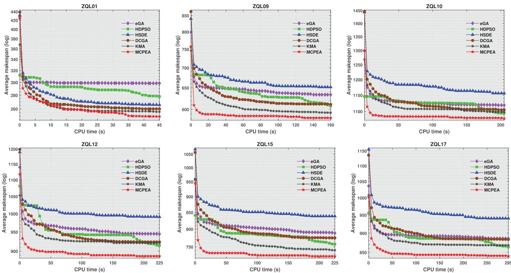  
Figure 11 Convergence curves of eGA, HDPSO, HSDE, DCGA, KMA and MCPEA on some benchmark instances.

This demonstrates that our hybrid heuristic initialisation method significantly enhances the quality ofthe first generation population. Furthermore, the rapid decline of MCPEA’s convergence curve in the early iterations can be attributed to the migration operator based on exemplar selection, which efectively explores better solutions within the problem solution space, thereby improving the convergence speed. In the middle and later stages of evolution, the neighbourhood structure co-driven by multi-critical-path plays a role and continuously exploits approximate optimal solutions.

To obtain scientifically valid statistical results, we conducted the Friedman test on the experimental data (the mean value of makespan) presented in Table 9 to perform an overall comparison of the six algorithms. The results are shown in Table 10, where ‘Count’ indicates the number of times the algorithm achieves the best mean value on 20 instances, ‘Avg.rank’ represents the average ranking of the algorithm, and ‘Total.rank’ indicates the final ranking. From Table 10, we can see that the average rankings for eGA, HDPSO, HSDE, DCGA, KMA, and MCPEA are 4.60, 3.55, 5.80, 3.80, 2.05, and 1.15, respectively. Thus, among the six algorithms, the proposed MCPEA ranks the highest and performs the best overall. Following MCPEA, KMA ranks second, DCGA ranks third, and HSDE ranks last. Building on this, Figure 12 presents the radar chart displaying the rankings of the six algorithms across various instances. Obviously, except for three instances where our algorithm ranks lower than KMA, MCPEA occupies the top spot on the remaining instances. This statistical conclusion confirms the performance of MCPEA in optimising the makespan.

Table 10 The Friedman test results of Table 9.

<table><tr><td>Index</td><td>eGA</td><td>HDPSO</td><td>HSDE</td><td>DCGA</td><td>KMA</td><td>MCPEA</td></tr><tr><td>Count</td><td>0</td><td>0</td><td>0</td><td>0</td><td>3</td><td>17</td></tr><tr><td>Ave.rank</td><td>4.60</td><td>3.55</td><td>5.80</td><td>3.80</td><td>2.05</td><td>1.15</td></tr><tr><td>Total.rank</td><td>5</td><td>4</td><td>6</td><td>3</td><td>2</td><td>1</td></tr></table>

In summary, the systematic experimental results indicate that the proposed MCPEA not only demonstrates significant advantage on the traditional production eficiency metric (makespan) when solving the DRFJSP-OJP, but also exhibits superior performance in meeting the job priority constraints that are essential in practical production. The overall framework of MCPEA and its core components are efective and advanced for addressing this complex problem.

## 6. Case study

## 6.1. Application ofthe algorithm in a practical case

The proposed algorithm is applied in this section to a real case in a workshop of one complex structural components manufacturing enterprise. This enterprise mainly undertakes the manufacturing of structural components for some high-end equipment, such as aircraft engine blades, optical mirror mounts, and electrostatic chucks. The machining line in the studied workshop

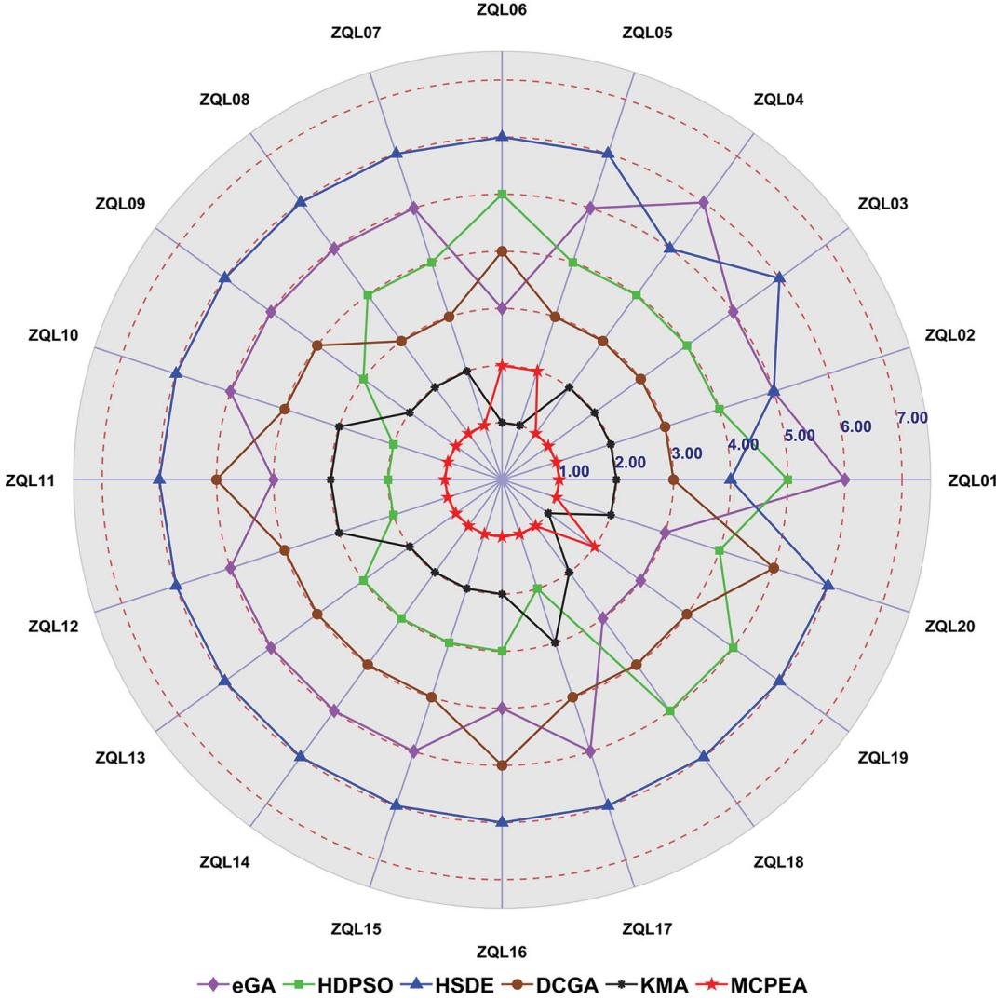  
Figure 12 The radar chart of eGA, HDPSO, HSDE, DCGA, KMA and MCPEA on 20 benchmark instances.

has eight machines capable of performing processes such as turning, milling, drilling, boring, and grinding. These machines are all semi-automated and workers must be assigned to collaborate with them for processing. The manufacturing of complex structural components involves not only online operations that must be processed on the machining line, but also ofline operations such as aging, sandblasting, marking, and deburring. These operations need to be performed away from the machining line on fixed workstations. For instance, aging is a heat treatment operation where workers place the workpiece into the box-type aging furnace for heating, holding, and cooling. Therefore, online operations must be completed by workers on the machines, while ofline operations can be carried out independently by workers. Table 11 provides detailed information about this actual case, including nine jobs, eight machines, and seven workers. In addition, each production task has different priorities, release times, and delivery times. It can be seen that the resource allocation in this workshop is particularly complex, with strong coupling relationships among tasks, machines and workers. Currently, formulating an eficient production plan is a major challenge that this enterprise urgently needs to address.

Table 12 shows information on the skills of workers and the types of machines. Among them, workers $W _ { 1 } , W _ { 2 } , W _ { 5 }$ , and $W _ { 6 }$ can both perform online and ofline operations, which means they need to frequently leave or return to the machining line. In contrast, workers $W _ { 3 } , W _ { 4 } ,$ and $W _ { 7 }$ can only collaborate with machines on the machining line for processing. At the same time, the more processes a machine can perform, the higher the skill level required for the workers. For example, machine $M _ { 7 }$ is a multi-tasking machining center that can execute various processes, and currently, only worker $W _ { 4 }$ is able to operate it. While $M _ { 1 }$ can only perform turning, and workers $W _ { 1 } , W _ { 2 } , W _ { 4 } ,$ , and $W _ { 5 }$ all possess the corresponding skill to operate it.

Before applying the proposed algorithm, this workshop used a scheduling method based on the workers’

Table 11 Detailed information for the actual case from the workshop, including nine jobs, eight machines and seven workers.

<table><tr><td>Jobs</td><td>Priority</td><td>Release time</td><td>Delivery time</td><td>Operation Number</td><td>Process name</td><td>Operation Type</td><td>Machine/Worker set</td><td>Processing time</td></tr><tr><td rowspan="7"> $J_1$ </td><td rowspan="7">2</td><td rowspan="7">17</td><td rowspan="7">102</td><td> $O_{11}$ </td><td>Turning</td><td>Online</td><td> $M_1,M_2,M_7$ </td><td>31, 32, 34</td></tr><tr><td> $O_{12}$ </td><td>Milling</td><td>Online</td><td> $M_3,M_5,M_7$ </td><td>40, 38, 41</td></tr><tr><td> $O_{13}$ </td><td>Turning</td><td>Online</td><td> $M_1,M_2,M_7$ </td><td>28, 25, 30</td></tr><tr><td> $O_{14}$ </td><td>Aging</td><td>Offline</td><td> $W_1,W_2,W_5,W_6$ </td><td>12</td></tr><tr><td> $O_{15}$ </td><td>Drilling</td><td>Online</td><td> $M_4,M_7$ </td><td>18, 20</td></tr><tr><td> $O_{16}$ </td><td>Boring</td><td>Online</td><td> $M_7,M_8$ </td><td>26, 23</td></tr><tr><td> $O_{17}$ </td><td>Deburring</td><td>Offline</td><td> $W_2,W_5,W_6$ </td><td>8</td></tr><tr><td rowspan="7"> $J_2$ </td><td rowspan="7">1</td><td rowspan="7">23</td><td rowspan="7">158</td><td> $O_{21}$ </td><td>Milling</td><td>Online</td><td> $M_3,M_5,M_7$ </td><td>25, 27, 28</td></tr><tr><td> $O_{22}$ </td><td>Turning</td><td>Online</td><td> $M_1,M_2,M_7$ </td><td>31, 28, 33</td></tr><tr><td> $O_{23}$ </td><td>Aging</td><td>Offline</td><td> $W_1,W_2,W_5,W_6$ </td><td>15</td></tr><tr><td> $O_{24}$ </td><td>Boring</td><td>Online</td><td> $M_7,M_8$ </td><td>20, 17</td></tr><tr><td> $O_{25}$ </td><td>Blasting</td><td>Offline</td><td> $W_1,W_2$ </td><td>9</td></tr><tr><td> $O_{26}$ </td><td>Grinding</td><td>Online</td><td> $M_6,M_7$ </td><td>22, 24</td></tr><tr><td> $O_{27}$ </td><td>Marking</td><td>Offline</td><td> $W_5,W_6$ </td><td>12</td></tr><tr><td rowspan="6"> $J_3$ </td><td rowspan="6">1</td><td rowspan="6">10</td><td rowspan="6">246</td><td> $O_{31}$ </td><td>Turning</td><td>Online</td><td> $M_1,M_2,M_7$ </td><td>35, 37, 38</td></tr><tr><td> $O_{32}$ </td><td>Milling</td><td>Online</td><td> $M_3,M_5,M_7$ </td><td>25, 28, 29</td></tr><tr><td> $O_{33}$ </td><td>Aging</td><td>Offline</td><td> $W_1,W_2,W_5,W_6$ </td><td>22</td></tr><tr><td> $O_{34}$ </td><td>Drilling</td><td>Online</td><td> $M_4,M_7$ </td><td>38, 41</td></tr><tr><td> $O_{35}$ </td><td>Milling</td><td>Online</td><td> $M_3,M_5,M_7$ </td><td>29, 26, 29</td></tr><tr><td> $O_{36}$ </td><td>Deburring</td><td>Offline</td><td> $W_2,W_5,W_6$ </td><td>19</td></tr><tr><td rowspan="4"> $J_4$ </td><td rowspan="4">3</td><td rowspan="4">0</td><td rowspan="4">188</td><td> $O_{41}$ </td><td>Turning</td><td>Online</td><td> $M_1,M_2,M_7$ </td><td>29, 30, 32</td></tr><tr><td> $O_{42}$ </td><td>Milling</td><td>Online</td><td> $M_3,M_5,M_7$ </td><td>26, 28, 28</td></tr><tr><td> $O_{43}$ </td><td>Aging</td><td>Offline</td><td> $W_1,W_2,W_5,W_6$ </td><td>16</td></tr><tr><td> $O_{44}$ </td><td>Boring</td><td>Online</td><td> $M_7,M_8$ </td><td>18, 18</td></tr><tr><td rowspan="6"> $J_5$ </td><td rowspan="6">3</td><td rowspan="6">6</td><td rowspan="6">275</td><td> $O_{51}$ </td><td>Turning</td><td>Online</td><td> $M_1,M_2,M_7$ </td><td>24, 24, 25</td></tr><tr><td> $O_{52}$ </td><td>Drilling</td><td>Online</td><td> $M_4,M_7$ </td><td>32, 34</td></tr><tr><td> $O_{53}$ </td><td>Milling</td><td>Online</td><td> $M_3,M_5,M_7$ </td><td>27, 25, 28</td></tr><tr><td> $O_{54}$ </td><td>Boring</td><td>Online</td><td> $M_7,M_8$ </td><td>23, 19</td></tr><tr><td> $O_{55}$ </td><td>Blasting</td><td>Offline</td><td> $W_1,W_2$ </td><td>15</td></tr><tr><td> $O_{56}$ </td><td>Marking</td><td>Offline</td><td> $W_5,W_6$ </td><td>12</td></tr><tr><td rowspan="8"> $J_6$ </td><td rowspan="8">1</td><td rowspan="8">16</td><td rowspan="8">260</td><td> $O_{61}$ </td><td>Turning</td><td>Online</td><td> $M_1,M_2,M_7$ </td><td>24, 22, 25</td></tr><tr><td> $O_{62}$ </td><td>Milling</td><td>Online</td><td> $M_3,M_5,M_7$ </td><td>26, 26, 30</td></tr><tr><td> $O_{63}$ </td><td>Aging</td><td>Offline</td><td> $W_1,W_2,W_5,W_6$ </td><td>18</td></tr><tr><td> $O_{64}$ </td><td>Boring</td><td>Online</td><td> $M_7,M_8$ </td><td>21, 18</td></tr><tr><td> $O_{65}$ </td><td>Drilling</td><td>Online</td><td> $M_4,M_7$ </td><td>20, 22</td></tr><tr><td> $O_{66}$ </td><td>Deburring</td><td>Offline</td><td> $W_2,W_5,W_6$ </td><td>18</td></tr><tr><td> $O_{67}$ </td><td>Blasting</td><td>Offline</td><td> $W_1,W_2$ </td><td>13</td></tr><tr><td> $O_{68}$ </td><td>Grinding</td><td>Online</td><td> $M_6,M_7$ </td><td>23, 25</td></tr><tr><td rowspan="6"> $J_7$ </td><td rowspan="6">2</td><td rowspan="6">9</td><td rowspan="6">324</td><td> $O_{71}$ </td><td>Milling</td><td>Online</td><td> $M_3,M_5,M_7$ </td><td>42, 38, 44</td></tr><tr><td> $O_{72}$ </td><td>Turning</td><td>Online</td><td> $M_1,M_2,M_7$ </td><td>27, 27, 29</td></tr><tr><td> $O_{73}$ </td><td>Aging</td><td>Offline</td><td> $W_1,W_2,W_5,W_6$ </td><td>20</td></tr><tr><td> $O_{74}$ </td><td>Drilling</td><td>Online</td><td> $M_4,M_7$ </td><td>34, 36</td></tr><tr><td> $O_{75}$ </td><td>Grinding</td><td>Online</td><td> $M_6,M_7$ </td><td>37, 40</td></tr><tr><td> $O_{76}$ </td><td>Marking</td><td>Offline</td><td> $W_5,W_6$ </td><td>16</td></tr><tr><td rowspan="5"> $J_8$ </td><td rowspan="5">3</td><td rowspan="5">12</td><td rowspan="5">295</td><td> $O_{81}$ </td><td>Turning</td><td>Online</td><td> $M_1,M_2,M_7$ </td><td>32, 33, 35</td></tr><tr><td> $O_{82}$ </td><td>Milling</td><td>Online</td><td> $M_3,M_5,M_7$ </td><td>27, 24, 28</td></tr><tr><td> $O_{83}$ </td><td>Boring</td><td>Online</td><td> $M_7,M_8$ </td><td>18, 17</td></tr><tr><td> $O_{84}$ </td><td>Blasting</td><td>Offline</td><td> $W_1,W_2$ </td><td>22</td></tr><tr><td> $O_{85}$ </td><td>Marking</td><td>Offline</td><td> $W_5,W_6$ </td><td>14</td></tr><tr><td rowspan="7"> $J_9$ </td><td rowspan="7">1</td><td rowspan="7">21</td><td rowspan="7">212</td><td> $O_{91}$ </td><td>Milling</td><td>Online</td><td> $M_3,M_5,M_7$ </td><td>26, 28, 30</td></tr><tr><td> $O_{92}$ </td><td>Aging</td><td>Offline</td><td> $W_1,W_2,W_5,W_6$ </td><td>11</td></tr><tr><td> $O_{93}$ </td><td>Boring</td><td>Online</td><td> $M_7,M_8$ </td><td>27, 24</td></tr><tr><td> $O_{94}$ </td><td>Drilling</td><td>Online</td><td> $M_4,M_7$ </td><td>28, 32</td></tr><tr><td> $O_{95}$ </td><td>Deburring</td><td>Offline</td><td> $W_2,W_5,W_6$ </td><td>9</td></tr><tr><td> $O_{96}$ </td><td>Blasting</td><td>Offline</td><td> $W_1,W_2$ </td><td>15</td></tr><tr><td> $O_{97}$ </td><td>Grinding</td><td>Online</td><td> $M_6,M_7$ </td><td>18, 23</td></tr></table>

experience. For example, the longest processing time (LPT) rule is used to determine the operation sequence. At the same time, the minimum workload (MW) rule is used to prioritise machines and workers with the least workload to allocate resources. For the actual case in Table 11, the production cycle of the enterprise’s original scheduling plan is 623, as shown in Figure 13. This scheme results in a 77.77% delay rate, with a low priority satisfaction degree and longer idle time for the machines. The optimised scheduling scheme, using the algorithm proposed in this paper, is shown in Figure 14. The new plan shortens the production cycle to 314, which is 49.60% lower than the original scheme, and the delay rate is reduced by 33.33%. Meanwhile, the preferentially

Table 12 The specific information of the workers and the machines for this case.

<table><tr><td>Workers</td><td>Skills</td><td>Machines</td><td>Mode</td></tr><tr><td> $W_1$ </td><td>Turning, Boring, Aging, and Blasting</td><td> $M_1,M_2$ (Turning), and  $M_8$ (Boring)</td><td>Dual-mode</td></tr><tr><td> $W_2$ </td><td>Turning, Grinding, Aging, Blasting, and Deburring</td><td> $M_1,M_2$ (Turning), and  $M_6$ (Grinding)</td><td>Dual-mode</td></tr><tr><td> $W_3$ </td><td>Milling, and Boring</td><td> $M_3,M_5$ (Milling), and  $M_8$ (Boring)</td><td>Single-mode</td></tr><tr><td> $W_4$ </td><td>Turning, Milling, Drilling, Grinding, and Boring</td><td> $M_1,M_2$ (Turning),  $M_3,M_5$ (Milling), $M_4$ (Drilling),  $M_6$ (Grinding),  $M_8$ (Boring),and  $M_7$ (Turning, Milling, Drilling, Grinding, Boring)</td><td>Single-mode</td></tr><tr><td> $W_5$ </td><td>Turning, Aging, Marking, and Deburring</td><td> $M_1,M_2$ (Turning)</td><td>Dual-mode</td></tr><tr><td> $W_6$ </td><td>Milling, Drilling, Aging, Marking, and Deburring</td><td> $M_3,M_5$ (Milling), and  $M_4$ (Drilling)</td><td>Dual-mode</td></tr><tr><td> $W_7$ </td><td>Milling, and Boring</td><td> $M_3,M_5$ (Milling), and  $M_8$ (Boring)</td><td>Single-mode</td></tr></table>

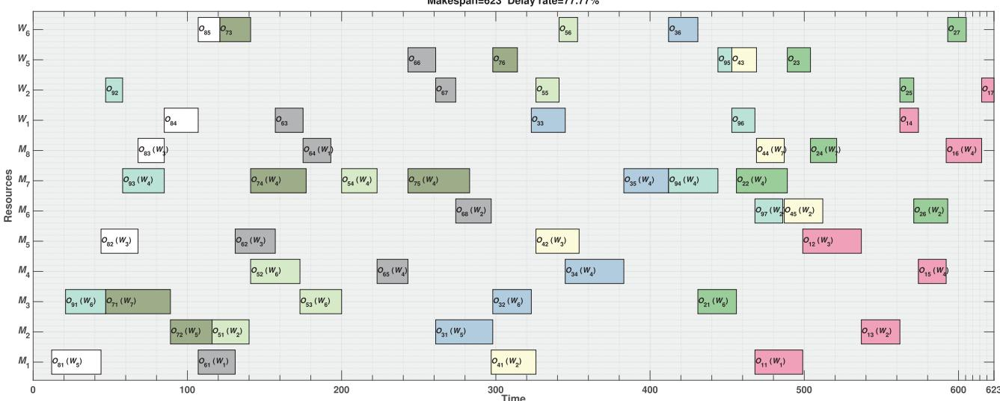  
Figure 13 The gantt chart of the original scheduling scheme of the enterprise $( C _ { \mathrm { m a x } } = 6 2 3 )$

production of high-priority orders such as $J _ { 4 } , \ J _ { 5 }$ and J<sub>8</sub> is guaranteed, and their completion times are generally earlier than other low-priority tasks. Moreover, the equipment utilisation rate has also been improved, especially with significant reductions in idle times for $M _ { 1 } , M _ { 3 }$ and $M _ { 4 } .$ . Therefore, the results of this case study indicate that the proposed MCPEA can efectively shorten the production cycle of the workshop and ensure the early completion of high-priority tasks, demonstrating practical application value.

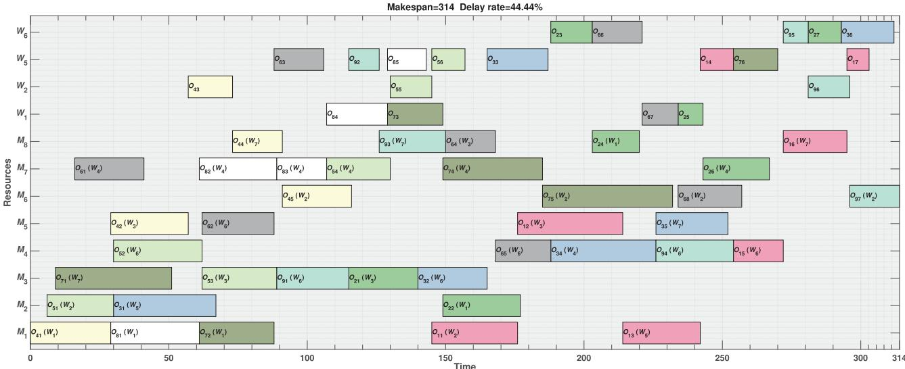  
Figure 14 The gantt chart of the optimal scheduling scheme from the proposed algorithm $( C _ { \mathrm { m a x } } = 3 1 4 )$

## 6.2. Management insights

Through systematic experimental analysis and the case study, this subsection extracts the following management insights to provide decision support for production planning and scheduling in manufacturing enterprises, particularly in the high-customisation, multi-variety, and small-batch production environment.

(1) Managers should emphasise the collaborative scheduling of machines and workers, especially in complex workshops with ofline operations. Reasonable allocation of workers efectively alleviates the pressure on bottleneck resources. This requires enterprises to integrate the skills, patterns, and flexibility of human resources as important modules when building or upgrading the manufacturing system.

(2) This study confirms that embedding job priorities into the scheduling system ensures the timely completion ofhigh-value orders. Managers should establish a quantitative priority assessment system based on factors such as profit, penalties, customer ratings, and strategic importance, and use corresponding algorithms to convert these priorities into executable scheduling plans, achieving a transition from ‘pursuing maximum eficiency’ to ‘ensuring maximum value’.

(3) For workers with comprehensive skills who can operate multiple machines, or for equipment capable of performing various operations, they should not be allocated at the initial stage of scheduling. Instead, managers should treat these high-flexibility resources as ‘strategic substitutes’, prioritising the allocation of dedicated resources in the early planning stages while reserving high-flexibility resources for later stages to fill resource gaps or address bottleneck operations. For example, in the aforementioned case, $M _ { 7 }$ and $W _ { 4 }$ can serve as alternative options for the allocation of machines and workers, thereby reducing the occurrence of bottleneck resource situations.

## 7. Conclusion and future work

This paper defines the dual-resource flexible job shop scheduling problem with ofline operations and job priority constraints. The problem considers both the operations that do not require processing on the maching line and the priority constraints of diferent jobs, making it more aligned with actual production background than previous studies. To address this issue, a MILP model is first developed to accurately map all constraints. Based on this, we propose a multi-critical-path co-driven evolutionary algorithm, called MCPEA. In this algorithm, a priority-driven threelayer segmented encoding scheme and priority-based multi-segment active decoding scheme are designed. Then, a migration operator based on exemplar selection is introduced to strengthen information exchange among population individuals, improving the algorithm’s convergence speed. Furthermore, the unique global criticalpath and multiple local critical-paths of DRFJSP-OJP are defined, and a problem-specific neighbourhood structure that satisfies resource coupling constraints is designed for common critical operations.

In numerical experiments, an ablation study is first conducted to thoroughly evaluate the efectiveness of both the proposed hybrid heuristic initialisation, evolutionary operators and the local search strategy. Then, we validate the correctness of the developed MILP model, and compare the performance of the proposed algorithm with several advanced algorithms from recent years. Experimental results show that the MILP model can obtain feasible solutions for small-scale instances within a limited time. In contrast, MCPEA demonstrates superior convergence and stability, outperforming other algorithms in both makespan minimisation and priority satisfaction. Finally, the proposed method is implemented in a real case involving a complex structural component manufacturing enterprise, achieving a 49.60% reduction in the original makespan and a 33.33% decrease in the delay rate.

This study primarily focuses on the static scheduling scenario, while future work can delve into algorithm design in the dynamic scheduling environment. Future work will address dynamic scheduling scenarios by incorporating real-world uncertainties such as machine failures, rush orders, and worker unavailability. This will require designing responsive mechanisms to handle such disruptions efectively. Based on the proposed MCPEA, the focus will be on breaking through the collaborative optimisation problem of priority constraints and dynamic disturbances, developing an adaptive scheduling system with online response capabilities, and further enhancing the practical value ofthe algorithm in complex industrial scenarios.

## Acknowledgements

The authors would like to express their sincere thanks to the editors and reviewers for their valuable suggestions and comments.

## Disclosure statement

The authors declare that there are no competing interests regarding the publication of this manuscript. All authors have disclosed any financial or personal relationships that could be perceived as potential conflicts of interest. The research was conducted independently, and the findings presented in this paper reflect the authors’ views and interpretations. There are no afiliations or financial arrangements that could influence the results or conclusions of this study.

## Author contributions

Ziyu Zhang: Conceptualization, Methodology, Software, Formal analysis, Writing – original draft. Dongchen Qiu: Validation, Resources, Project Administration. Xi Li Supervision, Funding acquisition, Writing – review. Liang Gao: Investigation, Supervision, Writing – review. Qihao Liu: Visualization, Funding acquisition, Writing – review & editing. Yue Teng: Data curation, Writing – Review & Editing. Xuxia Zhang Resources. Jun Wu Resources.

## Funding

This work was supported by the National Natural Science Foundation of China under Grant 52305534, the Key Research and Development Program of Zhejiang Province under Grant 2024C01139, and the Fundamental Research Funds for the Central Universities under Grant 2024BRA004.

## Notes on contributors


Ziyu Zhang He is currently pursuing the Ph.D. degree in mechanical engineering with the Huazhong University of Science and Technology (HUST), Wuhan, China. His current research interests include evolutionary computation, machine learning, and their applications in production scheduling.


Dongchen Qiu received the B.Eng. degree from the Nanjing Tech University, Nanjing, China, in 2011. He currently works as a technician in the Production and Manufacturing Department of China Tobacco Jiangsu Industrial Co., Ltd.. His current research focuses on the planning and scheduling of automated tobacco produc-

tion processes.  


Xi Li received the Ph.D. degree in industrial engineering from the Huazhong University of Science and Technology (HUST), Wuhan, China, in 2009. He is currently a Professor with the Department of Industrial and Manufacturing Systems Engineering, State Key Laboratory of Intelligent Manufacturing Equip-

ment and Technology, School ofMechanical Science and Engineering, HUST. He has published more than 100 refereed articles. His research interests include intelligent manufacturing system, big data, and machine learning.


Liang Gao received the B.Sc. degree in mechatronic engineering from the Xidian University, Xi’an, China, in 1996, and the Ph.D. degree in mechatronic engineering from the Huazhong University of Science and Technology (HUST), Wuhan, China, in 2002. He is currently a Professor with the Department of Industrial and Manufacturing System Engineering, State Key Laboratory of Intelligent Manufacturing Equipment and Technology, School of Mechanical Science and Engineering, HUST. He has published more than 400 refereed articles. His research interests include operations research and optimization, big data, and machine learning. Prof. Gao currently serves as the Co-Editor-in-Chief for IET Collaborative Intelligent Manufacturing and an Associate Editor for Swarm and Evolutionary Computation and Chinese Journal of Mechanical Engineering.


Qih Li received the Ph.D. degree in industrial engineering from the Huazhong University of Science and Technology (HUST), Wuhan, China, in 2022. From 2022 to 2024, he was a Postdoctoral Reseacher with HUST. He is currently a Lecturer ofindustrial engineering with the School of Mechanical Science and Engi-

neering, HUST. His research interests include process planning and shop scheduling.


Y T received the B.Eng. degree in industrial engineering from the Huazhong University of Science and Technology (HUST), Wuhan, China, 2020. He is currently pursuing the Ph.D. degree in mechanical engineering with HUST. His current research interests include discrete optimisation and shop scheduling.


Xuxia Zhang She is a senior engineer and serves as the Chief Engineer of Zhejiang Wanfeng Technology Development Co., Ltd., Shaoxing, China. Her achievements include three national project honors, 15 invention patents, 67 utility model patents, five software copyrights, 13 published papers, and she has spearheaded

the development of 11 national industry standards. Her current research focus on intelligent control systems and casting management systems.


J W He is a senior engineer and serves as the General Manager ofZhejiang Wanfeng Technology Development Co., Ltd., Shaoxing, China. His achievements include three national project honors, 21 provincial honors, two horizontal research projects, 18 invention patents, and participation in the formulation of two national industry standards. His current research focuses on the development and application of intelligent casting production lines.

## Data availability statement

The dataset of the ZQL test suite is publicly available at https://zenodo.org/records/17226700. The MATLAB code is available from the corresponding author on reasonable request.

## ORCID

Ziyu Zhang http://orcid.org/0000-0002-4140-6467 Xinyu Li http://orcid.org/0000-0002-3730-0360

## References

Ahmadi-Javid, A., and P. Hooshangi-Tabrizi. 2017. “Integrating Employee Timetabling with Scheduling of Machines and Transporters in a Job-Shop Environment: A Mathematical Formulation and an Anarchic Society Optimization Algorithm.” Computers & Operations Research 84:73–91. https://doi.org/10.1016/j.cor.2016.11.017.

Andrade-Pineda, J. L., D. Canca, P. L. Gonzalez-R, and M. Calle. 2020. “Scheduling a Dual-Resource Flexible Job Shop with Makespan and Due Date-Related Criteria.” Annals of Operations Research 291 (1-2): 5–35. https://doi.org/10.1007/s10479-019-03196-0.

Bakon, K., T. Holczinger, Z. Süle, S. Jaskó, and J. Abonyi. 2022. “Scheduling under Uncertainty for Industry 4.0 and 5.0.” IEEE Access 10:74977–75017. https://doi.org/10.1109/ACCE SS.2022.3191426.

Brucker, P., and R. Schlie. 1990. “Job-Shop Scheduling with Multi-purpose Machines.” Computing 45 (4): 369–375. https://doi.org/10.1007/BF02238804.

Caldeira, R. H., and A. Gnanavelbabu. 2021. “A Simheuristic Approach for the Flexible Job Shop Scheduling Problem with Stochastic Processing times.” Simulation 97:215–236. https://doi.org/10.1177/0037549720968891.

Chen, C. A., H. A. Kuo, and C. F. Chien. 2024. “Dual-Resource Constrained Flexible Job Shop Scheduling for Smt Back-End Production and an Empirical Study of Wearable Devices.” IEEE Transactions on Automation Science and Engineering 22:9230–9239. https://doi.org/10.1109/TASE.2024.3503412.

Chen, R., B. Yang, S. Li, and S. Wang. 2020. “A Self-learning Genetic Algorithm Based on Reinforcement Learning for Flexible Job-Shop Scheduling Problem.” Computers & Industrial Engineering 149:106778. https://doi.org/10.1016/j.cie. 2020.106778.

Chen, Y., R. Goebel, G. Lin, B. Su, and A. Zhang. 2020. “Open-Shop Scheduling for Unit Jobs under Precedence Constraints.” Theoretical Computer Science 803:144–151. https://doi.org/10.1016/j.tcs.2019.09.046.

Dauzère-Pérès, S., J. Ding, L. Shen, and K. Tamssaouet. 2024. “The Flexible Job Shop Scheduling Problem: A Review.” European Journal ofOperational Research 314 (2): 409–432. https://doi.org/10.1016/j.ejor.2023.05.017.

Delgoshaei, A., M. K. A. M. Arifin, S. Maleki, and Z. Leman. 2023. “Review Evolution of Dual-Resource-constrained Scheduling Problems in Manufacturing Systems: Modeling and Scheduling Methods’ Trends.” Soft Computing-A Fusion of Foundations, Methodologies & Applications 27:18489–18528.

Deng, L., Y. Qiu, Y. Di, and L. Zhang. 2025. “A Knowledge-Driven Memetic Algorithm for Distributed Green Flexible Job Shop Scheduling considering the Endurance of

Machines.” Applied Soft Computing 170:112697. https://doi. org/10.1016/j.asoc.2025.112697.

Destouet, C., H. Tlahig, B. Bettayeb, and B. Mazari. 2023. “Flex ible Job Shop Scheduling Problem under Industry 5.0: a Survey on Human Reintegration, Environmental Consideration and Resilience Improvement.” Journal ofManufacturing Systems 67:155–173. https://doi.org/10.1016/j.jmsy.2023.01. 004.

Fan, J., W. Shen, L. Gao, C. Zhang, and Z. Zhang. 2021. “A Hybrid Jaya Algorithm for Solving Flexible Job Shop Scheduling Problem considering Multiple Critical Paths.” Journal of Manufacturing Systems 60:298–311. https://doi. org/10.1016/j.jmsy.2021.05.018.

Fattahi, P., S. M. H. Hosseini, F. Jolai, and R. Tavakkoli-Moghaddam. 2014. “A Branch and Bound Algorithm for Hybrid Flow Shop Scheduling Problem with Setup Time and Assembly Operations.” Applied Mathematical Modelling 38 (1): 119–134. https://doi.org/10.1016/j.apm.2013.06.005.

Frihat, M., A. B. Hadj-Alouane, and C. Sadfi. 2022. “Optimization of the Integrated Problem of Employee Timetabling and Job Shop Scheduling.” Computers & Operations Research 137:105332. https://doi.org/10.1016/j.cor.2021.105332.

Gao, K., Z. Cao, L. Zhang, Z. Chen, Y. Han, and Q. Pan. 2019. “A Review on Swarm Intelligence and Evolutionary Algorithms for Solving Flexible Job Shop Scheduling Problems.” IEEE/CAA Journal of Automatica Sinica 6:904–916. https://doi.org/10.1109/JAS.2019.1911540.

Gao, K. Z., P. N. Suganthan, Q. K. Pan, T. J. Chua, T. X. Cai, and C. S. Chong. 2016. “Discrete Harmony Search Algorithm for Flexible Job Shop Scheduling Problem with Multiple Objectives.” Journal ofIntelligent Manufacturing 27 (2): 363–374. https://doi.org/10.1007/s10845-014-0869-8.

Gnanavelbabu, A., R. H. Caldeira, and T. Vaidyanathan. 2021. “A Simulation-Based Modified Backtracking Search Algorithm for Multi-objective Stochastic Flexible Job Shop Scheduling Problem with Worker Flexibility.” Applied Soft Computing 113:107960. https://doi.org/10.1016/j.asoc.2021. 107960.

Goli, A., E. B. Tirkolaee, and N. S. Aydın. 2021. “Fuzzy Integrated Cell Formation and Production Scheduling considering Automated Guided Vehicles and Human Factors.” IEEE Transactions on Fuzzy Systems 29:3686–3695. https://doi.org/10.1109/TFUZZ.2021.3053838.

Gong, G., R. Chiong, Q. Deng, and X. Gong. 2020. “A Hybrid Artificial Bee Colony Algorithm for Flexible Job Shop Scheduling with Worker Flexibility.” International Journal of Production Research 58 (14): 4406–4420. https://doi.org/10. 1080/00207543.2019.1653504.

Gong, G., Q. Deng, X. Gong, and D. Huang. 2021. “A Nondominated Ensemble Fitness Ranking Algorithm for Multiobjective Flexible Job-Shop Scheduling Problem considering Worker Flexibility and Green Factors.” Knowledge-Based Systems 231:107430. https://doi.org/10.1016/j.knosys.2021. 107430.

Gong, G., Q. Deng, X. Gong, W. Liu, and Q. Ren. 2018. “A New Double Flexible Job-Shop Scheduling Problem Integrating Processing Time, Green Production, and Human Factor Indicators.” Journal of Cleaner Production 174:560–576. https://doi.org/10.1016/j.jclepro.2017.10.188.

Gong, X., Q. Deng, G. Gong, W. Liu, and Q. Ren. 2018. “A Memetic Algorithm for Multi-objective Flexible Job-Shop Problem with Worker Flexibility.” International Journal of

Production Research 56 (7): 2506–2522. https://doi.org/10. 1080/00207543.2017.1388933.

Hajariwala, D. C., S. S. Patil, and S. M. Patil. 2025. “A Review of Metaheuristic Algorithms for Job Shop Scheduling.” Engineering Access 11:65–91.

Ham, A. 2017. “Flexible Job Shop Scheduling Problem for Parallel Batch Processing Machine with Compatible Job Families.” Applied Mathematical Modelling 45:551–562. https://doi.org/10.1016/j.apm.2016.12.034.

Han, K., and W. Gong. 2025. “Memetic Algorithm Based on Non-dominated Levels for Flexible Job Shop Scheduling Problem with Learn-Forgetting Efect and Worker Cooperation.” Computers & Industrial Engineering 200:110845. https://doi.org/10.1016/j.cie.2024.110845.

Han, X., W. Cheng, L. Meng, B. Zhang, K. Gao, C. Zhang, and P. Duan. 2024. “A Dual Population Collaborative Genetic Algorithm for Solving Flexible Job Shop Scheduling Problem with Agv.” Swarm and Evolutionary Computation 86:101538. https://doi.org/10.1016/j.swevo.2024.101538.

He, Z., B. Tang, and F. Luan. 2022. “An Improved African Vulture Optimization Algorithm for Dual-Resource Constrained Multi-objective Flexible Job Shop Scheduling Prob lems.” Sensors 23:90. https://doi.org/10.3390/s23010090.

Hongyu, L., and W. Xiuli. 2021. “A Survival Duration-Guided Nsga-Iii for Sustainable Flexible Job Shop Scheduling Problem considering Dual Resources.” IET Collaborative Intelligent Manufacturing 3 (2): 119–130. https://doi.org/10.1049/ cim2.v3.2.

Huang, J., X. Li, and L. Gao. 2025. “A Novel Ga-Cp Method for Fixed-Type Multi-robot Collaborative Scheduling in Flexible Job Shop.” IEEE Transactions on Automation Science and Engineering 22:13531–13543. https://doi.org/10.1109/TASE. 2025.3554019.

Huang, K., W. Gong, and C. Lu. 2024. “An Enhanced Memetic Algorithm with Hierarchical Heuristic Neighborhood Search for Type-2 Green Fuzzy Flexible Job Shop Scheduling.” Engineering Applications of Artificial Intelligence 130:107762. https://doi.org/10.1016/j.engappai.2023. 107762.

Huang, L., S. Zhao, and Q. Han. 2022. “A Fast Layered Path Planning Algorithm for Job Shop Scheduling Problem.” IET Collaborative Intelligent Manufacturing 4 (4): 299–315. https://doi.org/10.1049/cim2.v4.4.

Huang, X., Z. Guan, and L. Yang. 2018. “An Efective Hybrid Algorithm for Multi-objective Flexible Job-Shop Scheduling Problem.” Advances in Mechanical Engineering 10:1–14.

Kaban, A., Z. Othman, and D. Rohmah. 2012. “Comparison of Dispatching Rules in Job-Shop Scheduling Problem Using Simulation: A Case Study.” International Journal of Simulation Modelling 11 (3): 129–140. https://doi.org/10.2507/IJ SIMM.

Kim, T. Y. 2020. “Improving Warehouse Responsiveness by Job Priority Management: A European Distribution Centre Field Study.” Computers & Industrial Engineering 139:105564. https://doi.org/10.1016/j.cie.2018.12.011.

Lei, K., P. Guo, W. Zhao, Y. Wang, L. Qian, X. Meng, and L. Tang. 2022. “A Multi-action Deep Reinforcement Learning Framework for Flexible Job-Shop Scheduling Problem.” Expert Systems with Applications 205:117796. https://doi.org/10.1016/j.eswa.2022.117796.

Li, H., X. Li, and L. Gao. 2024. “An Iterated Greedy Algorithm with Acceleration of Job Allocation Probability

for Distributed Heterogeneous Permutation Flowshop Scheduling Problem.” Swarm and Evolutionary Computation 88:101580. https://doi.org/10.1016/j.swevo.2024.101580.

Li, H., J. Peng, and X. Wang. 2024. “An Eficient Two-Stage Optimization Algorithm for a Flexible Job Shop Scheduling Problem with Worker Shift Arrangement.” Computers & Operations Research 171:106785. https://doi.org/10.1016/j. cor.2024.106785.

Li, H., X. Wang, and J. Peng. 2022. “A Hybrid Diferential Evolution Algorithm for Flexible Job Shop Schedul ing with Outsourcing Operations and Job Priority Constraints.” Expert Systems with Applications 201:117182. https://doi.org/10.1016/j.eswa.2022.117182.

Li, J., Q. Liu, X. Li, and L. Gao. 2025. “An Eficient Problem-Specific Evolutionary Algorithm for Flexible Job Shop Scheduling Problem with Specific Workers in Highly Customised Manufacturing Systems.” International Journal of Production Research 63 (19): 7238–7259. https://doi.org/10. 1080/00207543.2025.2496971.

Li, M., and G. G. Wang. 2022. “A Review of Green Shop Scheduling Problem.” Information Sciences 589:478–496. https://doi.org/10.1016/j.ins.2021.12.122.

Li, X., and L. Gao. 2016. “An Efective Hybrid Genetic Algorithm and Tabu Search for Flexible Job Shop Scheduling Problem.” International Journal ofProduction Economics 174:93–110. https://doi.org/10.1016/j.ijpe.2016.01.016.

Li, Y., X. Chen, Y. An, Z. Zhao, H. Cao, and J. Jiang. 2023. “Integrating Machine Layout, Transporter Allocation and Worker Assignment into Job-Shop Scheduling Solved by an Improved Non-dominated Sorting Genetic Algorithm.” Computers & Industrial Engineering 179:109169. https://doi. org/10.1016/j.cie.2023.109169.

Li, Y., X. Li, L. Gao, and Z. Lu. 2025. “Multi-agent Deep Reinforcement Learning for Dynamic Reconfigurable Shop Scheduling considering Batch Processing and Worker Cooperation.” Robotics and Computer-Integrated Manufacturing 91:102834. https://doi.org/10.1016/j.rcim.2024.102834.

Lim, C. H., and S. K. Moon. 2023. “A Two-Phase Iterative Mathematical Programming-Based Heuristic for a Flexible Job Shop Scheduling Problem with Transportation.” Applied Sciences 13:5215. https://doi.org/10.3390/app13085215.

Liu, C., Y. Yao, and H. Zhu. 2021. “Hybrid Salp Swarm Algorithm for Solving the Green Scheduling Problem in a Double-Flexible Job Shop.” Applied Sciences 12:205. https://doi.org/10.3390/app12010205.

Lopes, M. J. P., and J. V. de Carvalho. 2007. “A Branch-and-price Algorithm for Scheduling Parallel Machines with Sequence Dependent Setup times.” European Journal of Operational Research 176 (3): 1508–1527. https://doi.org/10.1016/j.ejor. 2005.11.001.

Lou, H., X. Wang, Z. Dong, and Y. Yang. 2022. “Memetic Algorithm Based on Learning and Decomposition for Multiobjective Flexible Job Shop Scheduling considering Human Factors.” Swarm and Evolutionary Computation 75:101204. https://doi.org/10.1016/j.swevo.2022.101204.

Luo, C., W. Gong, and C. Lu. 2024. “Knowledge-Driven Two-Stage Memetic Algorithm for Energy-Eficient Flexible Job Shop Scheduling with Machine Breakdowns.” Expert Systems with Applications 235:121149. https://doi.org/10.1016/ j.eswa.2023.121149.

Luo, C., X. Li, W. Gong, and L. Gao. 2025. “Afinity Propagation Hierarchical Memetic Algorithm for Multimodal

Multi-objective Flexible Job Shop Scheduling with Variable Speed.” IEEE Transactions on Evolutionary Computation 29:2729–2741. https://doi.org/10.1109/TEVC.2024.352 1585.

Luo, Q., Q. Deng, G. Gong, X. Guo, and X. Liu. 2022. “A Distributed Flexible Job Shop Scheduling Problem considering Worker Arrangement Using an Improved Memetic Algorithm.” Expert Systems with Applications 207:117984. https://doi.org/10.1016/j.eswa.2022.117984.

Luo, Q., Q. Deng, G. Xie, and G. Gong. 2023. “A Pareto-Based Two-Stage Evolutionary Algorithm for Flexible Job Shop Scheduling Problem with Worker Cooperation Flexibility.” Robotics and Computer-Integrated Manufacturing 82:102534. https://doi.org/10.1016/j.rcim.2023.102534.

Müller, D., and D. Kress. 2022. “Filter-and-fan Approaches for Scheduling Flexible Job Shops under Workforce Constraints.” International Journal of Production Research 60 (15): 4743–4765. https://doi.org/10.1080/00207543.2021. 1937745.

Ma, H. 2010. “An Analysis of the Equilibrium of Migration Models for Biogeography-Based Optimization.” Information Sciences 180 (18): 3444–3464. https://doi.org/10.1016/j.ins. 2010.05.035.

Mahmoodjanloo, M., R. Tavakkoli-Moghaddam, A. Baboli, and A. Bozorgi-Amiri. 2020. “Flexible Job Shop Scheduling Problem with Reconfigurable Machine Tools: An Improved Diferential Evolution Algorithm.” Applied Soft Computing 94:106416. https://doi.org/10.1016/j.asoc.2020.106416.

Meng, L., C. Zhang, B. Zhang, and Y. Ren. 2019. “Mathematical Modeling and Optimization of Energy-Conscious Flexible Job Shop Scheduling Problem with Worker Flexibility.” IEEE Access 7:68043–68059. https://doi.org/10.1109/Access.628 7639.

Mlekusch, J., and R. F. Hartl. 2025. “The Dual-Resourceconstrained re-entrant Flexible Flow Shop a Constraint Programming Approach and a Hybrid Genetic Algorithm.” International Journal of Production Research 63 (5): 1803– 1824. https://doi.org/10.1080/00207543.2024.2392198.

Mraihi, T., O. B. Driss, and H. B. El-Haouzi. 2024. “Distributed Permutation Flow Shop Scheduling Problem with Worker Flexibility: Review, Trends and Model Proposition.” Expert Systems with Applications 238:121947. https://doi.org/10. 1016/j.eswa.2023.121947.

Neufeld, J. S., S. Schulz, and U. Buscher. 2023. “A Systematic Review of Multi-objective Hybrid Flow Shop Scheduling. European Journal of Operational Research 309 (1): 1–23. https://doi.org/10.1016/j.ejor.2022.08.009.

Pan, Z., L. Wang, J. Zheng, J. F. Chen, and X. Wang. 2022. “A Learning-Based Multipopulation Evolutionary Optimization for Flexible Job Shop Scheduling Problem with Finite Transportation Resources.” IEEE Transactions on Evolutionary Computation 27:1590–1603. https://doi.org/10.1109/ TEVC.2022.3219238.

Peng, Z., H. Zhang, H. Tang, Y. Feng, and W. Yin. 2022. “Research on Flexible Job-Shop Scheduling Problem in Green Sustainable Manufacturing Based on Learning Efect.” Journal of Intelligent Manufacturing 33 (6): 1725– 1746. https://doi.org/10.1007/s10845-020-01713-8.

Ren, W., Y. Yan, Y. Hu, and Y. Guan. 2022. “Joint Optimisation for Dynamic Flexible Job-Shop Scheduling Problem

with Transportation Time and Resource Constraints.” International Journal ofProduction Research 60 (18): 5675–5696. https://doi.org/10.1080/00207543.2021.1968526.

Sara, B. Y. 2025. “Application of Order Priority Strategies in Project Scheduling: Qualitative Study of Industrial Companies.” International Journal of Applied Management and Economics 2:289–300.

Seifi, C., M. Schulze, and J. Zimmermann. 2021. “A New Mathematical Formulation for a Potash-Mine Shift Scheduling Problem with a Simultaneous Assignment of Machines and Workers.” European Journal ofOperational Research 292 (1): 27–42. https://doi.org/10.1016/j.ejor.2020.10.007.

Shahvari, O., R. Logendran, and M. Tavana. 2022. “An Eficient Model-Based Branch-and-price Algorithm for Unrelated-Parallel Machine Batching and Scheduling Problems.” Journal of Scheduling 25 (5): 589–621. https://doi.org/10.1007 s10951-022-00729-7.

Shi, J., M. Chen, Y. Ma, and F. Qiao. 2023. “A New Boredom-Aware Dual-Resource Constrained Flexible Job Shop Scheduling Problem Using a Two-Stage Multi-objective Particle Swarm Optimization Algorithm.” Information Sciences 643:119141. https://doi.org/10.1016/j.ins.2023.119141.

Simon, D. 2008. “Biogeography-Based Optimization.” IEEE Transactions on Evolutionary Computation 12:702–713. https://doi.org/10.1109/TEVC.2008.919004.

Tan, W., X. Yuan, J. Wang, and X. Zhang. 2021. “A Fatigue-Conscious Dual Resource Constrained Flexible Job Shop Scheduling Problem by Enhanced Nsga-Ii: An Application from Casting Workshop.” Computers & Industrial Engineering 160:107557. https://doi.org/10.1016/j.cie.2021.107557.

Tang, J., G. Gong, N. Peng, K. Zhu, D. Huang, and Q. Luo. 2024. “An Efective Memetic Algorithm for Distributed Flex ible Job Shop Scheduling Problem considering Integrated Sequencing Flexibility.” Expert Systems with Applications 242:122734. https://doi.org/10.1016/j.eswa.2023.122734.

Thürer, M., M. Stevenson, and P. Renna. 2019. “Workload Con trol in Dual-Resource Constrained High-Variety Shops: An Assessment by Simulation.” International Journal ofProduction Research 57 (3): 931–947. https://doi.org/10.1080/0020 7543.2018.1497313

Thürer, M., H. Zhang, M. Stevenson, F. Costa, and L. Ma. 2020. “Worker Assignment in Dual Resource Constrained Assembly Job Shops with Worker Heterogeneity: An Assessment by Simulation.” International Journal ofProduction Research 58 (20): 6336–6349. https://doi.org/10.1080/00207543.2019. 1677963.

Usman, S., C. Lu, and G. Gao. 2024. “Flexible Job-Shop Scheduling with Limited Flexible Workers Using an Improved Multiobjective Discrete Teaching–learning Based Optimization Algorithm.” Optimization and Engineering 25 (3): 1237–1270. https://doi.org/10.1007/s11081-023-098 42-8.

Vahedi-Nouri, B., R. Tavakkoli-Moghaddam, Z. Hanzálek, and A. Dolgui. 2024. “Production Scheduling in a Reconfigurable Manufacturing System Benefiting from Human-Robot Collaboration.” International Journal of Production Research 62 (3): 767–783. https://doi.org/10.1080/00207543.2023.217 3503.

Vital-Soto, A., M. F. Baki, and A. Azab. 2023. “A Multi-objective Mathematical Model and Evolutionary Algorithm for the

Dual-Resource Flexible Job-Shop Scheduling Problem with Sequencing Flexibility.” Flexible Services and Manufacturing Journal 35 (3): 626–668. https://doi.org/10.1007/s10696-02 2-09446-x.

Wang, C., D. Fan, Y. Liu, S. Ren, and J. Wang. 2025. “Dual-Resource Flexible Job Shop Scheduling considering Worker Proficiency Diferences.” Computers & Operations Research 184:107216. https://doi.org/10.1016/j.cor.2025.107216.

Wang, C., M. Wei, Q. Liu, X. Zhang, and X. Li. 2025. “An Improved Adaptive Hybrid Algorithm for Solving Distributed Flexible Job Shop Scheduling Problem.” Swarm and Evolutionary Computation 94:101873. https://doi.org/10. 1016/j.swevo.2025.101873.

Wang, H. 2005. “Flexible Flow Shop Scheduling: Optimum, Heuristics and Artificial Intelligence Solutions.” Expert Systems 22:78–85. https://doi.org/10.1111/exsy.2005.22.issue-2.

Wang, J., L. Wang, and X. Xiu. 2023. “A Cooperative Memetic Algorithm for Energy-Aware Distributed Welding Shop Scheduling Problem.” Engineering Applications of Artificial Intelligence 120:105877. https://doi.org/10.1016/j.engappai. 2023.105877.

Wang, K., M. Guo, C. Dai, and Z. Li. 2023. “A Novel Heuristic Algorithm for Solving Engineering Optimization and Real-World Problems: People Identity Attributes-Based Information-Learning Search Optimization.” Computer Methods in Applied Mechanics and Engineering 416:116307. https://doi.org/10.1016/j.cma.2023.116307.

Wang, Z., H. Hu, and J. Gong. 2018. “Modeling Worker Competence to Advance Precast Production Scheduling Optimization.” Journal ofConstruction Engineering and Management 144 (11):04018098. https://doi.org/10.1061/(ASCE)CO.194 3-7862.0001556.

Xie, J., L. Gao, K. Peng, X. Li, and H. Li. 2019. “Review on Flexible Job Shop Scheduling.” IET Collaborative Intelligent Manufacturing 1 (3): 67–77. https://doi.org/10.1049/cim2.v1.3.

Xie, J., X. Li, L. Gao, and L. Gui. 2023. “A New Neighbourhood Structure for Job Shop Scheduling Problems.” International Journal of Production Research 61 (7): 2147–2161. https://doi.org/10.1080/00207543.2022.2060772.

Xiong, H., S. Shi, D. Ren, and J. Hu. 2022. “A Survey of Job Shop Scheduling Problem: The Types and Models.” Computers & Operations Research 142:105731. https://doi.org/10.1016/j.cor.2022.105731.

Xu, Y., D. Wang, M. Zhang, M. Yang, and C. Liang. 2025. “Quantum Particle Swarm Optimization with Chaotic Encoding Schemes for Flexible Job-Shop Scheduling Problem.” Swarm and Evolutionary Computation 93:101836. https://doi.org/10.1016/j.swevo.2024.101836.

Xu, Y., M. Zhang, M. Yang, and D. Wang. 2024. “Hybrid Quantum Particle Swarm Optimization and Variable Neighborhood Search for Flexible Job-Shop Scheduling Problem.” Journal of Manufacturing Systems 73:334–348. https://doi. org/10.1016/j.jmsy.2024.02.007.

Yang, Z., X. Li, L. Gao, and Q. Liu. 2025. “A Novel Topological Neighborhood Structure for Flexible Job Shop Scheduling Problem with Variable Sublots.” Computers & Operations Research 182:107120. https://doi.org/10.1016/j.cor.2025.10 7120.

Yu, F., L. Yin, B. Zeng, C. Lu, and Z. Xiao. 2024. “A Self-learning Discrete Artificial Bee Colony Algorithm for Energy-Eficient Distributed Heterogeneous Lr Fuzzy Welding Shop

Scheduling Problem.” IEEE Transactions on Fuzzy Systems 32:3753–3764. https://doi.org/10.1109/TFUZZ.2024.3382 398.

Zhang, C., P. Li, Z. Guan, and Y. Rao. 2007. “A Tabu Search Algorithm with a New Neighborhood Structure for the Job Shop Scheduling Problem.” Computers & Operations Research 34 (11): 3229–3242. https://doi.org/10.1016/j.cor. 2005.12.002.

Zhang, G., L. Gao, and Y. Shi. 2011. “An Efective Genetic Algorithm for the Flexible Job-Shop Scheduling Problem.” Expert Systems with Applications 38 (4): 3563–3573. https://doi.org/10.1016/j.eswa.2010.08.145.

Zhang, J., W. Wang, and X. Xu. 2017. “A Hybrid Discrete Particle Swarm Optimization for Dual-Resource Constrained Job Shop Scheduling with Resource Flexibility. Journal of Intelligent Manufacturing 28 (8): 1961–1972. https://doi.org/10.1007/s10845-015-1082-0.

Zhang, Z., Y. Fu, K. Gao, Q. Pan, and M. Huang. 2024. “A Learning-Driven Multi-objective Cooperative Artificial Bee Colony Algorithm for Distributed Flexible Job Shop Scheduling Problems with Preventive Maintenance and Transportation Operations.” Computers & Industrial Engineering 196:110484. https://doi.org/10.1016/j.cie.2024.11 0484.

Zhang, Z., Y. Gao, Y. Liu, and W. Zuo. 2023. “A Hybrid Biogeography-Based Optimization Algorithm to Solve High-Dimensional Optimization Problems and Real-World Engineering Problems.” Applied Soft Computing 144:110514. https://doi.org/10.1016/j.asoc.2023.110514.

Zhang, Z., X. Li, L. Gao, Q. Liu, and J. Huang. 2025. “Tackling Dual-Resource Flexible Job Shop Scheduling Problem in the Production Line Reconfiguration Scenario: An Eficient Meta-heuristic with Critical Path-Based Neighbor hood Search.” Advanced Engineering Informatics 65:103282. https://doi.org/10.1016/j.aei.2025.103282.

Zheng, X., and L. Wang. 2016. “A Knowledge-Guided Fruit Fly Optimization Algorithm for Dual Resource Con strained Flexible Job-Shop Scheduling Problem.” International Journal of Production Research 54 (18): 5554–5566. https://doi.org/10.1080/00207543.2016.1170226.

Zhou, L., Z. Jiang, N. Geng, Y. Niu, F. Cui, K. Liu, and N. Qi. 2022. “Production and Operations Management for Intelligent Manufacturing: A Systematic Literature Review.” International Journal of Production Research 60 (2): 808–846. https://doi.org/10.1080/00207543.2021.2017055.

Zhu, H., Q. Deng, L. Zhang, X. Hu, and W. Lin. 2020. “Low Carbon Flexible Job Shop Scheduling Problem considering Worker Learning Using a Memetic Algorithm.” Optimization and Engineering 21 (4): 1691–1716. https://doi.org/10. 1007/s11081-020-09494-y.

Zhu, Z., X. Zhou, D. Cao, and M. Li. 2022. “A Shufled Cellular Evolutionary Grey Wolf Optimizer for Flexible Job Shop Scheduling Problem with Tree-Structure Job Precedence Constraints.” Applied Soft Computing 125:109235. https://doi.org/10.1016/j.asoc.2022.109235.

Zuo, W., and Y. Gao. 2025. “Solving Numerical and Engineering Optimization Problems Using a Dynamic Dual-Population Diferential Evolution Algorithm.” International Journal of Machine Learning and Cybernetics 16 (3): 1701–1760. https://doi.org/10.1007/s13042-024-02361-7.