# A Feedback Learning-Based Memetic Algorithm for Energy-Aware Distributed Flexible Job-Shop Scheduling With Transportation Constraints

Jingjing Wang , Honggui Han , Senior Member, IEEE, and Ling Wang , Member, IEEE

Abstract—With increasing energy concerns and development of globalization, energy-aware scheduling and distributed scheduling have become significant topics in modern manufacturing. However, realistic manufacturing scenarios, such as collaborative scheduling of distributed shops and limited transportation resources, are rarely taken into account. To bridge the gap, this article addresses the energy-aware distributed flexible jobshop with transportation constraints (EDFJSP-T) and proposes a feedback learning-based memetic algorithm (FLMA) to minimize makespan and total energy consumption simultaneously. First, a mathematical model is formulated to represent the relationship between different subproblems. Additionally, an encoding and decoding method based on forward insertion is designed to reduce the search space and obtain high-quality schedules. Second, various problem-specific operators are designed to focus on different subproblems and objectives to enrich search patterns. Third, memetic search with feedback learning is proposed via introducing observer indexes for both population state and individual state to adaptively match appropriate operators for individuals. Besides, local intensification search with multiple operators is incorporated for low-density regions to further improve exploitation ability. The parameter setting is investigated and experimental tests are carried out using different types of instances. The comparisons demonstrate the effectiveness of the feedback learning mechanism and the superiority of the FLMA over existing algorithms for solving the EDFJSP-T.

Index Terms—Distributed collaborative scheduling, energyaware scheduling, feedback learning, flexible job-shop, memetic algorithm (MA), transportation constraints.

## I. INTRODUCTION

REEN manufacturing is a sustainable manufacturing both economic and environmental objectives. It aims to apply the green concept to the whole life cycle of products for reducing the adverse effects on the environment and improving resource utilization [1]. Facing increasingly serious environmental issues and energy shortages, many industries pay growing attention to energy consumption (EC) during production. Production scheduling is an effective means to improve product quality and production efficiency and reduce costs and consumption without equipment upgrades and product redesign [2]. Thus, it is of extraordinary significance to develop effective energy-aware scheduling for production systems [3].

Cooperation between enterprises and industries is becoming widespread as a result of growing globalization for mutual benefit. The traditional centralized organization has been changing to multiple decentralized workshops to form distributed manufacturing mode, which has become an important modern manufacturing paradigm [4]. In distributed manufacturing, the products are produced through resource sharing and cooperation among different workshops to improve production efficiency and reduce management risks [5]. Under distributed manufacturing environment, distributed scheduling can optimize the scheduling objectives by reasonable job allocation and processing sequence. Due to its multiple subproblems and multiobjective characteristics, energy-aware distributed shop scheduling is more difficult to solve than traditional shop scheduling. Thus, it is of extraordinary significance to design effective and efficient solution algorithms for energyaware distributed shop scheduling.

As one of the classical scheduling problems, flexible jobshop scheduling problem (FJSP) has attracted attention of many researchers and widely existed in numerous practical production scenarios, such as textile production process, equipment manufacturing, chemical materials processing, and automobile assembly [6], [7], [8], [9]. As an extension of the FJSP under distributed manufacturing, the DFJSP is more complex and difficult to solve than the FJSP, since it contains three subproblems, i.e., factory assignment, machine assignment, and job sequencing. Giovanni and Pezzella [8] proposed an improved genetic algorithm (GA) with a new local searchbased operator to refine promising solutions for solving the DFJSP with makespan minimization. Meng et al. [9] proposed four mixed integer linear programming (MILP) models as well as a constraint programming (CP) model based on interval decision variables and domain filtering algorithms to obtain the optimality for 62 benchmark problems. To compare the effect of different chromosome representations for solving the DFJSP, Wu et al. [10] developed a new chromosome representation and investigated the importance of appropriate chromosome representations. For the practical distributed sand casting job-shop scheduling problem, Tang et al. [11] proposed a hybrid teaching and learning-based optimization algorithm adopting dynamic teacher group and tabu search to improve the quality of teachers.

With consideration of green manufacturing, energy-aware scheduling receives much attention from modern industries. Gahm et al. [12] developed a research framework for energy-efficient scheduling and introduced three dimensions “energetic coverage,” “energy supply,” and “energy demand” to classify the energy-related literature. For the FJSP with minimization of total EC (TEC), Rakovitis et al. [13] developed a novel mathematical formulation using the improved unit-specific event-based time representation and proposed a grouping-based decomposition approach to divide large-scale problems into smaller subproblems. To minimize total completion time, total energy cost and maximum total availability of the FJSP, Mokhtari and Hasani [14] proposed a multiobjective optimization model and an enhanced GA incorporating simulated annealing (SA) to improve the diversity and global optimization performance. For solving the multiobjective energy-efficient FJSP with type-2 processing time, Li et al. [15] proposed a learning-based reference vector memetic algorithm (MA), combining a reinforcement learningbased parameter selection strategy to improve diversity.

Taking into account both distributed factories and energy efficiency, Wang et al. [16] proposed an evolutionary gamebased solver method for solving real-time scheduling of the energy-aware DFJSP (EDFJSP) under the industrial Internet of Things. Considering crane transportation constraints, Du et al. [17] proposed an estimation of distribution algorithm (EDA) combining variable neighborhood search (VNS) to solve the EDFJSP with four crane conditions. To enhance the performance of mainstream works for solving the EDFJSP, Li et al. [18] proposed a surprisingly popularbased adaptive MA incorporating the thought of a surprisingly popular algorithm. However, most works about the EDFJSP assume that all the operations of one job can only be processed in the same factory. The collaborative production between different factories for different processes of one product is more consistent with the distributed production of intelligent factories. Thus, Luo et al. [19] proposed an efficient MA to deal with the situation of job transfer between different factories when solving the DFJSP. To simultaneously optimize the economic indicators and green indicators of distributed flexible job-shop collaborative scheduling, Sang and Tan [20] proposed a high-dimensional many-objective MA (HMOMA) via combining the improved NSGA-III and problem-specific local search.

In the collaborative scheduling of EDFJSP, the transportation process can not be ignored due to the transfer between machines and factories. In particular, transportation resources are generally limited in many real-world manufacturing scenarios. Therefore, it is of practical significance to study collaborative scheduling of distributed shops with limited transportation resources. For solving the simultaneous scheduling of both machines and vehicles in the flexible manufacturing system with makespan minimization, Kumar et al. [21] proposed a differential evolution approach, incorporating a machine selection heuristic and a vehicle assignment heuristic. Considering the bounded processing times in FJSP with transportation constraints (FJSP-T), Zhang et al. [22] developed a GA with tabu search to solve both assignment of transportation resources and sequencing problems. Nouri et al. [23] proposed hybrid metaheuristics based on a clustered holonic multiagent model, employing a neighborhood-based GA for global exploration and a tabu search for local exploitation. Homayouni and Fontes [24] built a MILP model and showed its efficiency in solving smallsized instances. Meanwhile, a local search-based heuristic is also designed to solve the large-scale instances. Yan et al. [25] designed an improved GA (IGA) with a three-layer encoding and a decoding for correction and proposed an entity JavaScript object notation method to apply the scheduling results to the digital twin system. Pan et al. [26] designed a learning-based multipopulation evolutionary optimization, where a reinforcement learning-based mating selection is proposed and a local search is designed based on the problem properties. However, the existing research mainly primarily centers on the FJSP or FJSP-T, neglecting the crucial aspects of distributed scheduling and energy efficiency. The distributed scheduling, transportation constraints, and multiple objectives contribute to the complexity of coupled subproblems, such as factory assignment, AGV scheduling, and the tradeoff between conflicting objectives. Facing such complex characteristics, it is of urgency to propose effective scheduling methods for the EDFJSP with transportation constraints (EDFJSP-T) in view of its significant academic and practical values.

The evolutionary algorithm is a mainstream and effective method by combining the learning mechanism and optimization techniques to solve complex optimization problems. As one of the evolutionary algorithms, MA is an evolutionary search framework incorporating local refinements, which has been successfully applied to various scheduling problems [18], [27], [28]. Meanwhile, diversified mechanisms and strategies can be fused in MA framework to enhance the algorithm performance [29]. Generally, the search process in common algorithms is unidirectional, without utilization of valid information during search. However, incorporating the information of variation for each generation and historical individuals can effectively guide the search process. Therefore, feedback learning mechanism inspired by cybernetics has been integrated into the MA to enhance its search ability and efficiency recently. Zhang et al. [30] proposed several information feedback models, utilizing historical information. Lu et al. [31] designed a feedback mechanism for the multiobjective evolutionary algorithms via introducing solutions from the external archive to the current search process. Wang and Wang [32] proposed a cooperative MA with feedback mechanism via utilizing the historical information from historical solutions and elite solutions. Zhang et al. [33] built an external elite archive and proposed an elite sharing strategy based on information feedback to diversify the population. Li et al. [18] developed a surprisingly popular degree feedback-based self-modifying operator selection model. However, the above approaches solely focus on incorporating historical information in various ways, but lack the exploration of general feedback learning mechanisms that support the search process. Thus, effective cooperation of feedback learning and the MA framework is worth studying to solve complex scheduling problems.

In this article, we propose a feedback learning-based MA (FLMA) to solve the EDFJSP-T with minimization of both makespan and TEC simultaneously. To solve collaborative scheduling of distributed flexible production and transportation, a mathematical model is built to represent the complex coupling relation between different subproblems. An encoding with dynamic constraints and a decoding based on forward insertion are developed to map the solutions to high-quality schedules. A hybrid initialization with two heuristics is employed to produce a diverse population. Based on analysis of multiple subproblems and two conflicting objectives, various problem-specific operators are provided for enhancing search capability. Then, memetic search with feedback learning is designed, assisting a certain individual in a certain population to choose an appropriate operator via monitoring population state and individual state. In addition, local intensification is designed to improve the exploitation of the objective regions with low density. Extensive experimental tests are carried out using different types of instances and the comparative results demonstrate the effectiveness of the specific designs and the superior performance of the FLMA in solving the EDFJSP-T.

The remaining contents are organized as follows. Section II presents the problem description and mathematical model. Section III introduces the detailed designs of the proposed algorithm. Section IV provides the experimental results and comparisons. Finally, we end this article with some conclusions and future work in Section V.

## II. ENERGY-AWARE DISTRIBUTED FLOW SHOP SCHEDULING

## A. Problem Description

The EDFJSP-T can be described by perspectives from four objects, i.e., factory, machine, job, AGV as follows.

1) There are F heterogeneous factories with different layouts and production resources. Each factory f is a flexible job-shop with $m _ { f }$ processing machines, raw warehouse and product warehouse, and $a _ { f }$ AGVs.

2) For each machine, it turns on when the processing starts and turns off when all jobs are completed. Assume that the raw warehouse is virtual machine $M _ { 0 }$ and the final warehouse is virtual machine $M _ { m + 1 }$ . The processing time on the virtual machine is 0.

3) For each job j, there are $n _ { j }$ operations $o _ { j , i } ( i { = } 1 , . . . , n _ { j } )$ to be completed orderly on several designated machines. Each job should be taken out from the raw material warehouse, and transported to the assigned available machine by an allocated AGV. If operation $o _ { j , i }$ and $o _ { j , i + 1 }$ are processed on the same machine, $o _ { j , i + 1 }$ does not need to be transported. When job j is completed, it should be transported to the product warehouse by an allocated AGV.

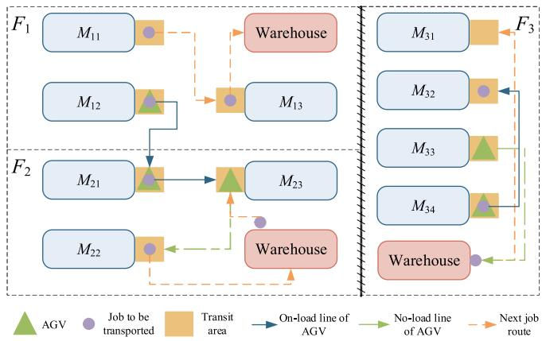  
Fig. 1. Illustration of distributed flexible job-shop with limited AGVs.

4) For each AGV, the starting position is in the warehouse. The transportation time is calculated as $d _ { k , k ^ { \prime } } / \nu _ { a } ,$ where $d _ { k , k ^ { \prime } }$ denotes the distance between machine k and $k ' ,$ and $\nu _ { a }$ denotes the speed of the AGV. Each AGV has three modes, that is, on-load running mode, no-load running mode, and idle mode.

The following assumptions are made in the proposed EDFJSP-T. All jobs can be processed at the zero moment and all machines and AGVs are available at zero moment. Due to different geographic locations, jobs can be transferred between designated factories, while transfer is not allowed between the factories across great distances. Each machine can only process one job and each AGV can only transport one job at a time. The process and transportation of each job cannot be interrupted. Each job can only be processed by one machine and be transported by one AGV at a time. It is assumed that all AGVs are fully charged and fault-free during processing.

The first objective is to minimize the maximum time of all jobs to the finished warehouse, denoted as $C _ { \mathrm { m a x } }$ . The second objective is to minimize the TEC during the processing and transportation, containing the EC of all machines and AGVs. The conflicting relationship between the two objectives can be analyzed qualitatively. Generally, machines have both highprocessing capability and high EC, while AGVs have both high-running speeds and EC. If the TEC is optimized, the machine and AGV with lowest EC will always be selected. Thus, $C _ { \mathrm { m a x } }$ will be far from the optimum. Similarly, if the Cmax is optimized first, the TEC is probably not the optimal value. Therefore, $C _ { \mathrm { m a x } }$ and TEC are conflicting objectives and their synergic optimization is significant.

For solving the EDFSJP-T, three subproblems for production and two subproblems for transportation should be determined, that is, factory assignment of all jobs, machine assignment in each factory, job sequence on each machine and AGV assignment and AGV scheduling. To illustrate the EDFSJP-T intuitively, Fig. 1 shows an example with three heterogeneous flexible job-shops, where the processing machines, AGVs and jobs to be processed are presented. All factories have different layouts, machines and AGVs. In the example of Fig. 1, the jobs can be transferred between factory $F _ { 1 }$ and factory F2, while transfer between factory $F _ { 3 }$ and other factories is not allowed. Each job starts from the warehouse and ends to the warehouse. The transportation time of each job contains two parts: 1) no-load transportation time and 2) on-load transportation time. As shown the no-load line in Fig. 1, the no-load transportation occurs when the no-load AGV locates the area of other positions away from the job to be transferred. Then, the no-load AGV need to transport to the location of the job. Once the job completes the current processing and the no-load AGV arrives, the AGV loads and transports the job along the on-load line to the next processing machine.

## B. Mathematical Formulation

## PARAMETERS

F Number of factories.

f Index of factories, $f \in \{ 1 , 2 , \ldots , F \} .$

$$
n \quad \text {   Number   of   jobs.   }
$$

$$
j \quad \text {   Index   of   jobs,   } j \in \{1, 2, \dots , n \}.
$$

mf Number of machines in each factory f.

M Machine set in all factories, $\begin{array} { r } { | M | = \sum _ { f = 1 } ^ { F } m _ { f } . } \end{array}$

$k , k ^ { \prime }$ Indexes of machines, k, k ∈ M.

g Number of AGVs.

$$
\text {   a   } \quad \text {   Index   of   AGVs,   } a \in \{1, 2, \dots , g \}.
$$

$n _ { j }$ Number of operations for job j.

i Index of operations.

h Numbers of all operations of all jobs, $\begin{array} { r } { h = \sum _ { j = 1 } ^ { n } n _ { j } } \end{array}$

$o _ { j , i }$ ith operation of job j .

$M _ { j , i }$ Available machine set of $o _ { j , i }$

$p _ { j , i , k }$ Processing time of $o _ { j , i }$ on machine k.

$\nu _  a , $ Speed of AGV a.

$r$ Position index of jobs on machines or AGVs.

$d _ { k , k ^ { \prime } }$ Standard transportation time between machine k and machine k.

$P P _ { k }$ Power consumption of machine k at running mode per unit time.

$S P _ { k }$ Power consumption of machine k at standby mode per unit time.

$A P P _ { a }$ Power consumption of AGV a at running mode per unit time.

$A S P _ { a }$ Power consumption of AGV a at standby mode per unit time.

$e _ { j , i , k }$ Constant variable that equals to 1 if $o _ { j , i }$ can be processed on machine k; otherwise equals to 0; $\begin{array} { r } { | M _ { j , i } | = \sum _ { k = 1 } ^ { | M | } e _ { j , i , k } } \end{array}$

L Very large positive number.

## VARIABLES

$C _ { \mathrm { m a x } }$ Maximum completion time (makespan) of a schedule.

TEC Total energy consumption.

$x _ { j , i , k , r }$ Binary variable that equals to 1 if $o _ { j , i }$ is processed at position r on machine k, otherwise equals to 0.

yj,i,k,k Binary variable that equals to 1 if $o _ { j , i }$ is processed on machine k and $o _ { j , i - 1 }$ is processed on machine k , otherwise equals to 0.

$z _ { j , i , a , r }$ Binary variable that equals to 1 if job j is transported at position r on AGV a to process $\begin{array} { r } { O _ { j , i } , } \end{array}$ otherwise equals to 0.

$C _ { j , i }$ Completion time of $o _ { j , i } .$

$M C _ { k , r }$ Completion time of the operation at the rth position on machine k.

$A C _ { a , r }$ Completion time of the operation at the rth position on AGV a.

$E _ { m a c }$ Total energy consumption of machines.

$E _ { a g \nu }$ Total energy consumption of AGVs.

The mathematical model of the EDFJSP-T with minimization of makespan and TEC is formulated as follows:

Minimize $( C _ { \mathrm { m a x } } , \ T E C )$

(1)

Subject to:

$$
\sum_ {k = 1} ^ {| M |} \sum_ {r = 1} ^ {h} x _ {j, i, k, r} = 1 \quad \forall j, i \in \{1, \dots , n _ {j} \}\tag{2}
$$

$$
\sum_ {j = 1} ^ {n} \sum_ {i = 1} ^ {n _ {j}} x _ {j, i, k, r} \leq 1, r \in \{1, \dots , h \} \quad \forall k\tag{3}
$$

$$
\sum_ {j = 1} ^ {n} \sum_ {i = 1} ^ {n _ {j}} x _ {j, i, k, r} \geq \sum_ {j = 1} ^ {n} \sum_ {i = 1} ^ {n _ {j}} x _ {j, i, k, r + 1} \quad \forall k, r <   h\tag{4}
$$

$$
\sum_ {k = 1} ^ {| M |} \sum_ {k ^ {\prime} = 1} ^ {| M |} y _ {j, i, k, k ^ {\prime}} = 1 \quad \forall j, i \in \{1, \dots , n _ {j} \}\tag{5}
$$

$$
\sum_ {k = 1} ^ {| M |} y _ {j, 1, k, 0} = 1 \quad \forall j\tag{6}
$$

$$
\sum_ {k ^ {\prime} = 1} ^ {| M |} y _ {j, i, k, k ^ {\prime}} \leq e _ {j, i, k} \quad \forall j, k, i \in \{1, \dots , n _ {j} \}
$$

$$
y _ {j, 1, k, 0} \leq e _ {j, 1, k} \quad \forall j, k\tag{7}
$$

$$
y _ {j, i, k, k ^ {\prime}} \leq \sum_ {u = 1} ^ {| M |} y _ {j, i - 1, k ^ {\prime}, u} \quad \forall j, k, k ^ {\prime}, i \in \{3, \dots , n _ {j} \}\tag{8}
$$

$$
y _ {j, 2, k, k ^ {\prime}} \leq y _ {j, 1, k, 0} \quad \forall j, k, k ^ {\prime}\tag{9}
$$

$$
\sum_ {a = 1} ^ {g} \sum_ {r = 1} ^ {h} z _ {j, i, a, r} = 1 \quad \forall j, i \in \{1, \ldots , n _ {j} \}\tag{10}
$$

(11)

$$
\sum_ {j = 1} ^ {n} \sum_ {i = 1} ^ {n _ {j}} z _ {j, i, a, r} \leq 1, r \in \{1, \dots , h \} \quad \forall a\tag{12}
$$

$$
\sum_ {j = 1} ^ {n} \sum_ {i = 1} ^ {n _ {j}} z _ {j, i, a, r} \geq \sum_ {j = 1} ^ {n} \sum_ {i = 1} ^ {n _ {j}} z _ {j, i, a, r + 1}, r <   h \quad \forall a\tag{13}
$$

$$
M C _ {k, r} \leq C _ {j, i} + L \cdot (1 - x _ {j, i, k, r}) \quad \forall j, k\tag{14}
$$

$$
C _ {j, i} \leq M C _ {k, r} + L \cdot (1 - x _ {j, i, k, r}) \quad \forall j, k\tag{15}
$$

$$
A C _ {a, r} \geq C _ {j, i - 1} + \frac {d _ {k ^ {\prime} , k}}{v _ {a}} - L \cdot \left(2 - z _ {j, i, a, r} - y _ {j, i, k, k ^ {\prime}}\right), i > 1\tag{16}
$$

$$
A C _ {a, r} \geq A C _ {a, r - 1} + \frac {d _ {k , k ^ {\prime}}}{v _ {a}}
$$

$$
- L \cdot \left(4 - \sum_ {j = 1} ^ {n} \sum_ {i = 1} ^ {n _ {j}} \left(z _ {j, i, a, r - 1} - z _ {j, i, a, r} + \sum_ {u = 1} ^ {h} \left(x _ {j, i, k, u} - x _ {j, i, k ^ {\prime}, u}\right)\right)\right), r > 1\tag{17}
$$

$$
C _ {j, i} + L \cdot (2 - z _ {j, i, a, r} - y _ {j, i, k, k ^ {\prime}}) \geq A C _ {a, r} + p _ {j, i, k}\tag{18}
$$

$$
M C _ {k, r + 1} + L \cdot (1 - x _ {j, i, k, r + 1}) \geq M C _ {k, r} + p _ {j, i, k}, i <   n _ {j}\tag{19}
$$

$$
M C _ {k, r} + L \cdot (1 - z _ {j, i, a, u}) \geq A C _ {a, u} + p _ {j, i, k}, i <   n _ {j}\tag{20}
$$

$$
C _ {\max} \geq C _ {j, n _ {j}} + \sum_ {k = 1} ^ {| A |} \sum_ {k ^ {\prime} = 1} ^ {| B |} d _ {k, k ^ {\prime}} / v _ {a} \cdot \left(z _ {j, n _ {j} + 1, a, r} \cdot y _ {j, n _ {j}, k, k ^ {\prime}}\right)\tag{21}
$$

$$
\begin{array}{l} E _ {\mathrm{mac}} = \sum_ {k = 1} ^ {| M |} (S P _ {k} \cdot C _ {\max}) \\ + \sum_ {k = 1} ^ {| M |} \left((P P _ {k} - S P _ {k}) \cdot \sum_ {j = 1} ^ {n} \sum_ {i = 1} ^ {n _ {j}} \sum_ {r = 1} ^ {g} \left(x _ {j, i, k, r} \cdot p _ {j, i, k}\right)\right) \\ E _ {\mathrm{agv}} = \sum_ {a = 1} ^ {g} (A S P _ {a} \cdot C _ {\max}) \end{array}\tag{22}
$$

$$
+ \sum_ {a = 1} ^ {g} \left(\left(A P P _ {a} - A S P _ {a}\right) \cdot \sum_ {j = 1} ^ {n} \sum_ {i = 1} ^ {n _ {j}} \sum_ {r = 1} ^ {g} \left(y _ {j, i, k, k ^ {\prime}} \cdot z _ {j, i, a, r} \cdot \frac {d _ {k , k ^ {\prime}}}{v _ {a}}\right)\right)\tag{23}
$$

$$
T E C = E _ {\mathrm{mac}} + E _ {\mathrm{agv}}\tag{24}
$$

$$
C _ {j, i} > 0, M C _ {k, r} > 0, A C _ {a, r} > 0\tag{25}
$$

$$
x _ {j, i, k, r} \in \{0, 1 \}, y _ {j, i, k, k ^ {\prime}} \in \{0, 1 \}, z _ {j, i, a, r} \in \{0, 1 \}\tag{26}
$$

where (1) is to minimize both makespan and TEC. Equations (2)–(4) ensure that each job can be processed only on one machine at a time and each machine can process one job at the same time. Equations (5)–(10) ensure that each operation should be assigned to an available machine and all operations of each job should be processed orderly. Equations (11)–(13) ensure that each job can be transported only by one AGV at a time and each AGV can transport one job at the same time. Equations (14)–(20) calculate the completion times of each operation which contains the processing time and transportation time. Equation (21) defines the makespan. Equations (22)–(23) calculate the energy consumed by all machines and AGVs, and (24) calculates the TEC during the process. Equations (25)–(26) indicate the binary and continuous decision variables.

The above model contains $h \times n \times | M | + h \times | M | ^ { 2 } +$ $h \times n \times g$ binary decision variables, 3h + 4 continuous variables and $h \times ( 5 + g + 3 h g + 3 | M | + n | M | + | M | ^ { 2 } ) +$ $n \times ( 1 + 3 \vert M \vert + \vert M \vert ^ { 2 } )$ constraints. As the numbers of jobs n, operations h, machines |M|, AGVs g increase, the number of variables and constraints increase exponentially. Hence, the model-based exact algorithms are unable to adapt due to excessively long solving times and two objectives. Additionally, rule-based heuristics are difficult to obtain satisfactory solutions. Thus, MA presents powerful optimization ability for effectively addressing complex and large-scaled problems, incorporating cooperative strategies and diversified learning mechanisms. Therefore, this article proposes a FLMA to solve the EDFJSP-T.

## III. FLMA FOR EDFJSP-T

## A. Basic Memetic Algorithm and Description of the FLMA

Generally, MA refers to an optimization framework that combines a population-based paradigm with local search methods [36]. Due to its high-search ability, MAs have been successfully applied in various scheduling problems [27], [28], [29], [32]. However, developing effective and efficient MAs for complex multiobjective scheduling problems poses challenges due to issues in local search designs, such as determining the appropriate local search strategy, timing for conducting a local search, identifying the individuals to be targeted for local search, and achieving a balance between exploration ability and exploitation ability.

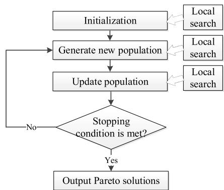  
Fig. 2. Flowchart of the basic MA.

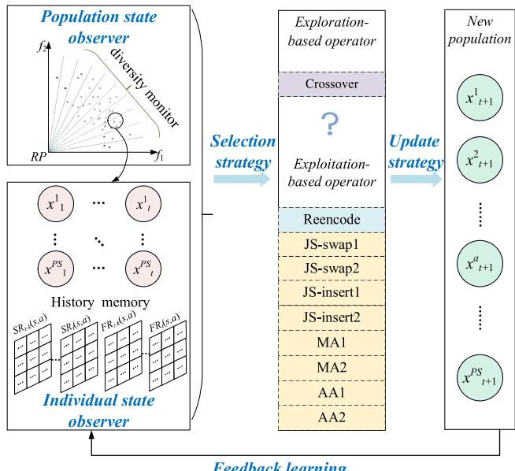  
Fig. 3. Illustration of the search mechanism of the FLMA.

Flowchart of the basic MA is presented in Fig. 2, illustrating the generation of a new population using global search strategies and the incorporation of specific local search methods at any stage of the algorithm.

According to the syncretic framework of MAs, cooperation of feedback learning in cybernetics with a populationbased paradigm is potential and promising to enhance the performance for solving the complex scheduling problems. With population evolution, the search information for each iteration should be feedback effectively in a learning way to guide evolutionary direction. Thus, the feedback learning mechanism is incorporated into the memetic computing framework as shown in Fig. 3, which illustrates the search mechanism of the proposed FLMA. In each generation, the population diversity state and each individual state are evaluated by several monitor indexes. A history memory is built to record the success and failure of search histories for all individual $x _ { t } ^ { a } ( a = 1 , . . . , P S )$ in the last generations. Various problem-specific operators are designed to enrich the search patterns, consisting of one exploration-based operator (crossover) and various exploitation-based operators for different subproblems and different objectives, introduced in

Section III-E. According to the population state, individual state and history memory, a selection strategy is designed to adaptively assign an appropriate operator for each specific individual in the current population. Then, the new population is produced via an update strategy based on the decomposition approach. Meanwhile, the search information is fed back and learned to the next iteration. For the subregion with low density, a local intensification is performed to enhance the exploitation. Based on the above search mechanism, it is expected to obtain a Pareto front with superior convergence and diversity via feedback learning autonomously during evolutionary process.

## B. Multiobjective Optimization Techniques

Generally, a multiobjective optimization problem (MOP) can be described as follows:

$$
\text { minimize } \boldsymbol {f} (x) = \left(f _ {1} (x), \dots , f _ {p} (x)\right) ^ {T}, x \in \boldsymbol {\Omega}\tag{27}
$$

where $f _ { 1 } , f _ { 2 } , \ldots ,$ and $f _ { p }$ are $p$ conflicting objective functions, and - is the solution space. Obviously, there is no unique optimum solution with the minimization of all objectives. Thus, it is crucial to tradeoff different objectives for solving an MOP.

The mainstream multiobjective techniques are Pareto dominance sorting and decomposition method as follows, deriving from NSGA-II [34] and multiobjective evolutionary algorithm based on decomposition (MOEA/D) [35]. In this article, the widely used Tchebycheff (TCH) decomposition approach is introduced.

Pareto Dominance: For any two solutions $\pmb { a } \in \pmb { \Omega }$ and $\pmb { b } \in \pmb { \Omega }$ a is said to dominate b (denoted as $\mathbf { \mu } \mathbf { \mu } \mathbf { \Sigma } \mathbf { \Sigma } \mathbf { \Sigma } \mathbf { \Sigma } \mathbf { \Sigma } \mathbf { \Sigma } \mathbf { \Sigma } \mathbf { \Sigma } \mathbf { a } \mathbf { \Sigma } \succ \mathbf { \Sigma } \mathbf { \Sigma } \mathbf { \Sigma } \mathbf { \Sigma } \mathbf { \Sigma } \mathbf { \Sigma } \mathbf { \Sigma } \mathbf { \Sigma } \mathbf { \Sigma } \mathbf { \Sigma } \mathbf { \Sigma } \mathbf { \Sigma } \mathbf { \Sigma } \mathbf { \Sigma } \mathbf { \Sigma } \mathbf { \Sigma } \mathbf { \Sigma } \mathbf { \Sigma } \mathbf { \Sigma } \mathbf { \Sigma } \mathbf { \Sigma } \mathbf { \Sigma } \mathbf { \Sigma } \mathbf { \Sigma } \mathbf { \Sigma } \mathbf { \Sigma } \mathbf { \Sigma } \mathbf { \Sigma } \mathbf { \Sigma } \mathbf { \Sigma } \mathbf { \Sigma } \mathbf { \Sigma } \mathbf { \Sigma } \mathbf { \Sigma } \mathbf { \Sigma } \mathbf { \Sigma } \mathbf { \Sigma } \mathbf { \Sigma } \mathbf { \Sigma } \mathbf { \Sigma } \mathbf { \Sigma } \mathbf \mathbf { \Sigma } \mathbf { \Sigma } \mathbf \Sigma \mathbf { } \mathbf \Sigma \Sigma \mathbf { } \mathbf \Sigma \Sigma \Sigma \mathbf { } \mathbf \Sigma \Sigma \Sigma \Sigma \mathbf \Sigma \Sigma \Sigma \Sigma \Sigma \Sigma \mathbf \Sigma \Sigma \Sigma \Sigma \Sigma \Sigma \Sigma \Sigma \Sigma \Sigma \Sigma \Sigma \Sigma \Sigma \Sigma \Sigma \Sigma \Sigma \Sigma \Sigma \Sigma \Sigma \Sigma \Sigma \Sigma \Sigma \Sigma \Sigma \Sigma \Sigma \Sigma \Sigma \Sigma \Sigma \Sigma \Sigma \Sigma \Sigma \Sigma \Sigma \Sigma \Sigma \Sigma \Sigma \Sigma \Sigma \Sigma \Sigma \Sigma \Sigma \Sigma \Sigma \Sigma \Sigma \Sigma \Sigma \Sigma \Sigma \Sigma \Sigma \Sigma \Sigma \Sigma \Sigma \Sigma \Sigma \Sigma \Sigma \Sigma \Sigma \Sigma \Sigma \Sigma \Sigma \Sigma \Sigma \Sigma \Sigma \Sigma \Sigma \Sigma \Sigma \Sigma \Sigma \Sigma \Sigma \Sigma \Sigma \Sigma \Sigma \Sigma \Sigma \Sigma \Sigma \Sigma \Sigma \Sigma \Sigma \Sigma \Sigma \Sigma \Sigma \Sigma \Sigma \Sigma \Sigma \Sigma \Sigma \Sigma \Sigma \Sigma \Sigma \Sigma \Sigma \Sigma \Sigma \Sigma \Sigma \Sigma \Sigma \Sigma \Sigma \Sigma \Sigma \Sigma \Sigma \Sigma \Sigma \Sigma \Sigma \Sigma \Sigma \Sigma \Sigma \Sigma \Sigma \Sigma \Sigma \Sigma \Sigma \Sigma \Sigma \Sigma \Sigma \Sigma \Sigma \Sigma \Sigma \Sigma \Sigma \Sigma \Sigma \Sigma \Sigma \Sigma \Sigma \Sigma \Sigma \Sigma \Sigma \Sigma \Sigma \Sigma \Sigma \Sigma \Sigma \Sigma \Sigma \Sigma \Sigma $ if and only if $\forall l \in \{ 1 , \ldots , p \} , f _ { l } ( \pmb { a } ) \leq f _ { l } ( \pmb { b } )$ and $\exists l ^ { \prime } \in \{ 1 , 2 , \dots , p \} , f _ { l ^ { \prime } } ( \pmb { a } ) <$ $f _ { l ^ { \prime } } ( \pmb { b } )$ ). If no solution can dominate a solution ${ \pmb a } ,$ it is called a nondominated solution or Pareto solution. All the Pareto solutions constitute the Pareto-optimal set and their projection in objective space forms the optimal Pareto front.

TCH Decomposition Approach: It decomposes the MOP into a number of single objective problems via a set of weight vectors. Each solution $x _ { a }$ is associated with a weight vector $\pmb { \lambda } ^ { a } = ( \lambda _ { 1 } ^ { a } , \ldots , \lambda _ { p } ^ { a } ) ^ { T }$ . Define its objective function as minimization of $\begin{array} { r } { g ( x _ { a } | \lambda ^ { a ^ { * } } , z ^ { * } ) = \operatorname* { m a x } _ { r = 1 , 2 , \ldots , p } \{ | f _ { r } ( x _ { a } ) - z _ { r } ^ { * } | / \lambda _ { r } ^ { a } \} } \end{array}$ where $f _ { r } ( x _ { a } )$ is the normalized rth objective value of $x _ { a }$ and $z ^ { * }$ is normalized reference point, respectively.

In order to maintain both convergence and diversity within the Pareto front, the aforementioned multiobjective techniques serve distinct purposes. Specifically, Pareto dominance is utilized to restore nondominated solutions ensuring convergence, while the TCH decomposition approach is adopted for solution and population updates to enrich diversity and dispersion. In the TCH decomposition approach, the weight vector is initialized uniformly, and each initial solution is associated with the nearest weight vector. The neighbors of each $\lambda _ { a }$ are composed of neighborhood size (NS) Euclidean-distancebased nearest weight vectors, including itself. Accordingly, the neighbors of $x _ { a }$ are those solutions associated with the corresponding vectors.

## C. Encoding and Decoding

For solving the DFJSP, three-string encoding is commonly used to represent the factory assignment, machine assignment and job scheduling [26]. In this article, the EDFJSP-T to be addressed contains five subproblems, that is, factory assignment, machine assignment, AGV assignment, job scheduling and AGV scheduling. Since transfer between different factories is allowed, factory assignment and machine assignment can be represented as all the available machines assignment in all factories. Meanwhile, the available machine sets will be dynamic by the reason of transfer prohibition between specific factories. Besides, the transportation task will start only when the current processing task is completed and the next processing task will start only when the last transportation task is completed. Thus, the AGV scheduling and job scheduling should be considered simultaneously in the encoding scheme to enhance the search efficiency. Based on the above analysis, a new three-string representation is adopted for the EDFJSP-T in this article.

In the FLMA, the three strings contain the machine assignment vector (MAV), job scheduling vector (JSV) and AGV assignment vector (AAV). To represent the transportation tasks in raw material warehouse and finished product warehouse, the length of each vector is $h + 2 n$ , including two more operations of each job. The MAV $\pmb { \eta } = ( \eta _ { 1 , 0 } , \dotsc , \eta _ { 1 , n _ { j } + 1 } , \eta _ { 2 , 0 } , \dotsc , \eta _ { n , n _ { j } + 1 } )$ represents the factory assignment and machine assignment simultaneously. For all machines in all factories, each machine is marked to represent the difference. Element $\eta _ { j , i } \ : ( j = 1 , \ldots , n ,$ $i = 0 , \ldots , n _ { j } { + } 1 )$ in η presents the assigned machine in one factory for operator $o _ { j , i }$ . Once $\eta _ { j , 0 } ~ ( j = 1 , \ldots , n )$ is determined, the available machine sets of the remaining operations will be adjusted dynamically based on the solution and factory information to satisfy the transfer constraint. The JSV $\pi =$ $( \pi _ { 1 } , \ldots , \pi _ { h + 2 n } )$ represents the sequence of all operations. Each job j will occur $n _ { j } + 2$ times in π for validity. The AAV $\pmb { \theta } \ = \ ( \theta _ { 1 , 0 } , \ldots \theta _ { 1 , n _ { i } + 1 } , \theta _ { 2 , 0 } , \ldots , \theta _ { n , n _ { i } + 1 } )$ represents the AGV assignment and the available AGV sets are also dynamic and analogous to MAV.

To map an encoded solution to a high-quality schedule, a decoding method based on forward insertion is proposed. First, according to the job sequence in JSV, the corresponding job is assigned to the allocated machine in one factory based on the MAV. Second, if the job needs to be transported to the allocated machine, the transportation task will be carried out by the allocated AGV based on the AAV. Third, the idle periods of the machine or AGV are checked and the current task will be inserted if the insertion criteria are met. The insertion criteria should meet two requirements: 1) the start time of the current task is no earlier than the completion time of the last associated task and 2) the idle time is no less than the task execution time. Finally, the start time and completion time of the task are obtained and the idle times of the machine or AGV are updated. Repeat the above steps until all the jobs are processed and transported to the final warehouse. Thus, the makespan and TEC can be obtained.

For an example of an encoded solution in Fig. 4, jobs 1, 2, and 3 have 2, 2 and 3 operations to be processed.

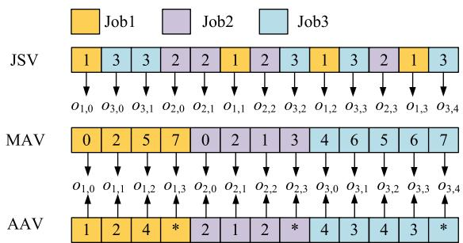  
Fig. 4. Example of an encoded solution.

There are two factories with two machines in each factory. Machines 0 and 4 represent the raw material warehouses in factories 1 and 2, while machine 3 and 7 represent the finished product warehouses in factory 1 and 2, respectively. There are two AGVs in each factory. Each element in AAV means the transportation task after process of the current operation and ‘\*” means the transportation is not needed when the job has been transported to the product warehouse.

## D. Hybrid Initialization

To obtain an initial population with quality and diversity, two initial methods are presented in the FLMA. Based on the three-string encoding, job scheduling, machine assignment and AGV assignment should be determined to generate a complete solution. Thus, a random method and a heuristic based on the earliest completion time (ECT) are presented as follows.

For the random initialization method, the JSV, MAV and AAV are generated randomly. To ensure feasibility, each job j will occur $n _ { j } + 2$ times in JSV, and the available machine (or AGV) set of each element in MAV (or AAV) will be adjusted dynamically according to the previous elements.

For the ECT heuristic, the JSV is generated randomly, while the MAV and AAV are generated based on the ECT rule. Assign the job sequentially to all the idle periods of all available machines (or AGVs). If the insertion criteria are met, the machine (or AGV) assignment of the current operation is accomplished; otherwise, the machine (or AGV) with ECT for the current operation is selected.

In the FLMA, half initial solutions are generated by random method and others are generated by the ECT heuristics to constitute initial population. Besides, a Pareto archive (PA) is built and updated to restore the nondominated solutions during the search process.

## E. Problem-Specific Operators

In the MA, diverse problem-specific operators can enrich search patterns. Meanwhile, reasonable application of diverse operators can enhance the diversity and convergence of population effectively. Thus, in the FLMA, multiple problemspecific operators are employed to adjust the three strings of encoded solutions.

For the EDFJSP-T, makespan depends on the critical path, defined as the longest path from the completion time of the last job back to the beginning of the whole process with no idle time. Regarding the transportation task as part of production, the AGV can be regarded as a machine. The critical job (or operation) is defined as the job (operation) on the critical path. Thus, adjustment of the critical jobs becomes an effective way to reduce the makespan value. Analogously, critical machine $C M _ { C }$ (critical AGV $C A _ { C } )$ is defined as the last machine (AGV) to complete the processing. In addition, the machine (AGV) with the largest EC is defined as the bottleneck machine $B M _ { T }$ (bottleneck AGV $B A _ { T } )$ . Based on the above definitions, several problem-specific operators are designed focusing on exploration or exploitation to reduce makespan or TEC via adjusting the JSV, MAV, and AAV, respectively.

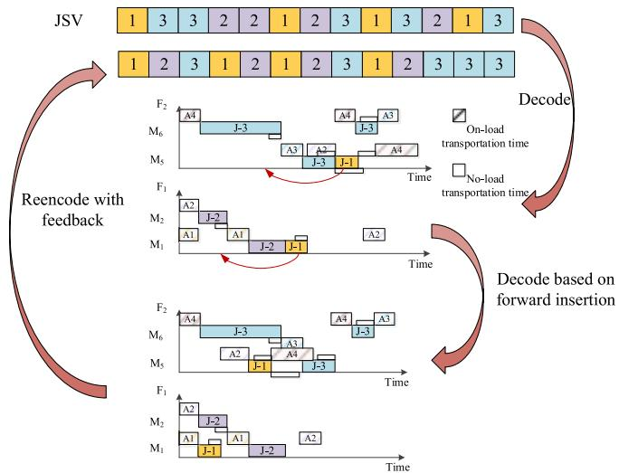  
Fig. 5. Illustration of reencode operator.

In this article, an efficient crossover operator is used to enhance the exploration capacity via combining the precedence operation crossover (POX [17]) for the JSV and uniform crossover operator for the MAV and AAV. First, a job set $J _ { 1 }$ is built via selecting several jobs randomly and the remaining jobs constitute the job set $J _ { 2 } .$ . Second, the jobs in JSV of individual $I n d i _ { 1 }$ belonging to the $J _ { 1 }$ are inherited by the new individual newIndi, while the jobs in JSV of individual Indi2 belonging to the $J _ { 2 }$ are taken out and insert the empty position orderly in JSV of newIndi. Thus, the validity of the newIndi can be guaranteed. Third, select several jobs randomly to inherit their machine assignment and AGV assignment of $I n d i _ { 1 }$ and inherit the machine and AGV assignment of other jobs in $I n d i _ { 1 }$ . Thus, the information of two individuals is retained and inherited simultaneously in the newIndi.

During the decoding process of an encoded solution, the actual processing order on each machine or each AGV will differ from the JSV due to the insertion to idle periods. Thus, effective information during the decoding process should be utilized and form feedback for job scheduling. As illustrated in Fig. 5, the reencode operator with feedback is designed to make the utmost of information produced by decoding method based on forward insertion. First, the completion times of all operations in the completed schedule are sorted in ascending order. Then, the JSV of new solution is determined by the sequence, and the MAV and AAV are retained. Finally, the decoding method without the forward insertion is used for the new encoded solution. Thus, a new schedule is generated by the reencode operator.

TABLE I  
PROBLEM-SPECIFIC OPERATORS (ACTIONS)

<table><tr><td>No</td><td>Operator</td><td>Exploration or Exploitation</td><td>Vector</td><td>Objective</td></tr><tr><td>1</td><td>crossover</td><td>Exploration</td><td>all</td><td>all</td></tr><tr><td>2</td><td>reencode</td><td>Exploitation</td><td>JSV</td><td> $C_{\text{max}}$ </td></tr><tr><td>3</td><td>JS-swap1</td><td>Exploitation</td><td>JSV</td><td> $C_{\text{max}}$ </td></tr><tr><td>4</td><td>JS-swap2</td><td>Exploitation</td><td>JSV</td><td>TEC</td></tr><tr><td>5</td><td>JS-insert1</td><td>Exploitation</td><td>JSV</td><td> $C_{\text{max}}$ </td></tr><tr><td>6</td><td>JS-insert2</td><td>Exploitation</td><td>JSV</td><td>TEC</td></tr><tr><td>7</td><td>MA1</td><td>Exploitation</td><td>MAV</td><td> $C_{\text{max}}$ </td></tr><tr><td>8</td><td>MA2</td><td>Exploitation</td><td>MAV</td><td>TEC</td></tr><tr><td>9</td><td>AA1</td><td>Exploitation</td><td>AAV</td><td> $C_{\text{max}}$ </td></tr><tr><td>10</td><td>AA2</td><td>Exploitation</td><td>AAV</td><td>TEC</td></tr></table>

Other operators focusing on exploitation are designed as follows.

JS-swap1: Randomly select two operations of different jobs on the critical path and swap them in JSV.

JS-swap2: Select one operation on the bottleneck machine BM randomly and another different job, then swap them in JSV.

JS-insert1: Randomly select one job on the critical path and insert it into another position in JSV.

JS-insert2: Select one job on bottleneck machine $B M _ { T }$ randomly and insert it into another position in JSV.

MA1: Select one operation on the critical machine $C M _ { C }$ randomly, and reassign it to another processing machine in the current available machine set.

MA2: Select one operation on the bottleneck machine $B M _ { T }$ randomly, and reassign it to another processing machine in the current available machine set.

AA1: Select one operation on the critical AGV $C A _ { C } \mathrm { ~ }$ randomly, and reassign it to another available AGV.

AA2: Select one operation on the bottleneck AGV $B A _ { T }$ randomly, and reassign it to another available AGV.

To summarize the characteristics of each operator, Table I lists each operator focusing on exploration or exploitation, adjusting JSV or MAV or AAV, and optimizing $C _ { \mathrm { m a x } }$ or TEC. To exploit the advantages of each operator for search process, memetic search framework and feedback learning mechanism are introduced detailedly in the next section.

## F. Memetic Search With Feedback Learning

To obtain the Pareto front with evenness and convergence, full exploration of search space and objective space is vital during evolutionary process. Since it is difficult to depict the complex search space of the EDFJSP-T, full exploration in objective space is significant. Thus, the objective space is divided into K subregions $S _ { l } ( l = 1 , \ldots , K )$ uniformly based on the direction vector shown as Fig. 6. In this article, K is set to 10. $\boldsymbol { S _ { l } }$ is defined as (28), where $\nu ^ { l } , l \ = \ 1 , . . K$ in $R _ { + } ^ { r }$ represents the lth direction vector in the objective space, and $\langle u , \nu ^ { l } \rangle$ is the acute angle between u and $\nu ^ { l } .$ The local density of a subregion is evaluated by the number of solutions $\rho _ { l }$ in subregion $\boldsymbol { S } _ { l } .$ . Based on the subregion definition, the following solution states, population diversity monitoring, feedback learning and operator selection strategies are designed to enhance the performance of the FLMA:

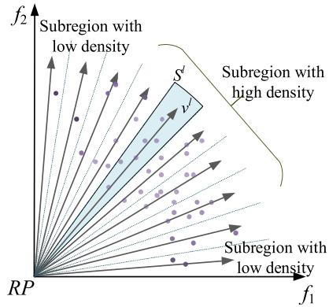  
Fig. 6. Illustration of subregion in objective space.

$$
\mathcal {S} _ {l} = \left\{u \in R _ {+} ^ {r} | \left\langle u, v ^ {l} \right\rangle \leq \left\langle u, v ^ {j} \right\rangle , j = 1, \dots , K \right\}.\tag{28}
$$

To evaluate the population diversity, a diversity monitor index (DMI) based on the Shannon Wiener diversity index is proposed and employed, which describes the disorder and uncertainty of species to reflect species richness and evenness of individual distribution [37]. The higher the uncertainty, the higher the diversity. In this article, DMIt of generation t is defined as (29), where PS denotes the population size. The variation of the DMI as (30) is employed to determine the population focusing on exploration or exploitation

$$
D M I _ {t} = - \frac {1}{\ln K} \times \sum_ {l} ^ {K} \frac {\rho_ {l}}{P S} \times \ln \left(\frac {\rho_ {l}}{P S}\right)\tag{29}
$$

$$
\Delta D M I _ {t} = D M I _ {t} - D M I _ {t - 1}\tag{30}
$$

$$
Q E I _ {t} (\boldsymbol {x}) = \left\{ \begin{array}{l l} 0, & \text { if } \boldsymbol {x} \text { is   updated } \\ Q E I _ {t - 1} (\boldsymbol {x}) + 1, & \text { otherwise. } \end{array} \right.\tag{31}
$$

The DMI is designed to monitor the diversity state of the population, while another quality enhancement index (QEI) is proposed to monitor the enhancement state of current solution. For each solution x, QEIt(x) is evaluated as (31). The higher the $Q E I _ { t } ( { \boldsymbol { x } } )$ , the more probability to fall into local optimum and more urgent for exploration of $x .$

Based on the above indexes, different types of operators presented in the previous section will be selected for different solutions adaptively. The crossover operator, with the ability to prevent a solution from getting trapped in a local optimum, is assigned a higher-selection probability when population diversity decreases and solution shows no improvement. Thus, exponential function and hyperbolic tangent function are utilized to provide an appropriate possibility value in the interval (0, 1) by averaging the impact of the two indexes as (32). On the other hand, the reencode operator, which focuses on reproduction based on current schedule, is assigned a higherselection possibility when an individual is trapped in a local optimum, as represented by an exponential function in (33). Specifically, first, determine a solution focusing the exploration or exploitation. The estimation probability $e q _ { t } ^ { 1 } ( { \pmb x } )$ is calculated as (32). If a random number in [0, 1] is less than the $e q _ { t } ^ { 1 } ( { \pmb x } )$

then x will execute the crossover operator with a random neighbor. Otherwise, calculate estimation probability $e q _ { t } ^ { 2 } ( { \pmb x } )$ as (33) to determine whether to perform the reencode operator. If a random number in $[ 0 , 1 ]$ is larger than the $e q _ { t } ^ { 2 } ( { \pmb x } )$ , then x will execute the reencode operator; otherwise, an exploitationbased search will be performed based on operator No.3-10

$$
\begin{array}{l} e q _ {t} ^ {1} (\boldsymbol {x}) = \frac {e ^ {- 1 - \Delta D M I _ {t}} + \tanh Q E I _ {t} (\boldsymbol {x})}{2} \\ e q _ {t} ^ {2} (\boldsymbol {x}) = e ^ {- 1 \times Q E I _ {t} (\boldsymbol {x})}. \end{array}\tag{32}
$$

(33)

To adaptively select the operators focusing on the exploitation, an adaptive selection strategy with feedback learning is proposed, inspired by various feedback strategies in [18] and [32]. The success record (SR) and failure record (FR) are used to record the knowledge for each operator of each solution with specific state. The belonging subregion of a solution is regarded as its state, while the selected operator is regarded as the action. Thus, the historical list $S R _ { t - k } ( s , a ) \ ( k { = } 1 , \ldots , H L )$ with $H L$ length of history memory calculates the times that the new solution in generation $t { - } k$ is not dominated by the old one at state s when performing action a. Analogously, $F R _ { t - k } ( s , a )$ calculates the times that the new solution is dominated by the old one. According to the SR and FR, the selection probability $q _ { t } ( s , a )$ for the solution at state s to perform action a is calculated as (34). If $q _ { t } ( s , a ) >$ $q _ { t - 1 } ( s , a )$ , a reward $r \in [ 0 . 1 , 0 . 2 ]$ is added to the selection probability $q _ { t } ( s , a )$ . In this article, $r$ is set to 0.15 and the $q _ { t } ( s , a )$ is normalized to ensure the $\begin{array} { r } { \sum _ { a } q _ { t } ( s , a ) = 1 } \end{array}$ . Based on the selection probability, roulette wheel selection is employed. For each solution, the selection strategy is employed to select an appropriate operator to balance the exploration and exploitation. The new population is generated by the update strategy based on the TCH decomposition approach. Then, the historical indexes and memory are updated for new generation. The detailed memetic search with feedback learning is illustrated in Algorithm 1

$$
q _ {t} (s, a) = \frac {\sum_ {k = 0} ^ {H L} S R _ {t - k} (s , a)}{\sum_ {k = 0} ^ {H L} S R _ {t - k} (s , a) + \sum_ {k = 0} ^ {H L} F R _ {t - k} (s , a)}.\tag{34}
$$

## G. Local Intensification

In the memetic search framework, local intensification is employed to enhance the exploitation capability for the promising search space. To locate the local search space, a selection strategy based on the local density is designed by measuring the local density of each subregion in objective space [38]. The number of solutions $\rho _ { l }$ reflects the local density of the subregions $\boldsymbol { S _ { l } }$ as shown in Fig. 6. To enhance the exploitation of the subregion with low density, the selection probability $q _ { l }$ is determined based on the local density $\rho _ { l }$ as (35). Thus, the lower the local density, the higher the selection probability. The roulette wheel selection with probability $q _ { l }$ is employed to locate the subregion for further intensification

$$
q _ {l} = \frac {1 / \rho_ {l}}{\sum_ {l = 1} ^ {K} 1 / \rho_ {l}}, l = 1, \ldots , K.\tag{35}
$$

A random nondominated solution in the selected subregion is chosen to execute the JS-swap1, JS-insert1, MA-rand, and AA-rand for further reducing the makespan and TEC. The operators MA-rand and AA-rand mean that reassign another available machine and AGV for a random operation. Algorithm 2 provides the procedure of local intensification with the above four neighborhood structures according to the framework of VNS [18]. The update strategy based on TCH decomposition is used and the QEI is also updated.

Algorithm 1: Memetic Search With Feedback Learning
Divide objective space into K subregions uniformly;
Calculate local density of each subregion  $\rho_{l}$ $(l=1,\ldots,K)$ ;
Evaluate  $DMI_{t}$  of current population based on Eq. (29);
For i in PS
    Calculate the  $QEI_{t}(x)$  and  $eq_{t}^{1}(x_{i})$  for individual  $x_{i}$  based on Eq. (31) and (32);
    Generate a random number in [0,1] r;
    If  $r &lt; eq_{t}^{1}(x_{i})$ 
    Perform crossover with another random neighbor of  $x_{a}$  to get  $x_{a}^{\prime}$ ;
    Else
    Calculate  $eq_{t}^{2}(x)$  based on Eq. (33) and regenerate random number r;
    If  $r &lt; eq_{t}^{2}(x_{i})$ 
    Estimate the state of  $x_{i}$  and define operator No.3-10 as action  $a_{1} \sim a_{8}$ .
    Calculate and normalize the  $q_{t}(s,a)$  based on Eq. (34);
    Select an action  $a_{l}$  for  $x_{i}$  with roulette wheel;
    Perform operator  $a_{l}$  to get  $x_{a}^{\prime}$ ;
    Else
    Perform reencode ( $x_{a}$ ) to get  $x_{a}^{\prime}$ ;
End Else
If  $g(x_{a}^{\prime}|\lambda^{a},z^{*}) \leq g(x_{a}|\lambda^{a},z^{*})$  then  $x_{a} = x_{a}^{\prime}$ ;
Update the neighbors of  $x_{a}$  with  $x_{a}^{\prime}$ ;
Update the PA with  $x_{a}^{\prime}$ ;
Update  $QEI_{t}(x)$  and historical lists SR and FR;
End For

## H. Framework and Complexity Analysis of FLMA

The framework of the proposed FLMA is shown in Fig. 7. Combining the information utilization ability of feedback learning, the evolutionary search with various problem-specific operators is designed via the state observer indexes and history memory. Through the specifically designed components, including encoding and decoding method, initialization, memetic search with feedback learning and local intensification, the proposed algorithm is expected to achieve satisfactory performance in solving the EDFJSP-T.

To analyze the complexity of the proposed FLMA, suppose there are n jobs, h operations in total, and the population size is PS and iteration number is iter. In the initialization phase, computational complexity of random method and ECT heuristics are ${ \cal O } ( P S / 2 \times 3 ( h + 2 n ) )$ and ${ \cal O } ( P S / 2 \times ( h +$ $2 n + h ^ { 2 } ) )$ ). Thus, the complexity of initialization phase is approximately equal to $\overset { \cdot } { O ( P S \times h ^ { 2 } ) }$ . In each iteration, the memetic search with feedback learning contains calculating indexes, selecting operators for each solution, performing operators and updating. The complexity of indexes calculation and update is $O ( P S \times ( 4 + N S ) + K )$ , while complexity of operator selection is $O ( P S ( 2 + H L \times 8 ) )$ . The complexity of crossover and reencode operator are $O ( h ^ { 2 } )$ and $O ( h \times l o g h )$ while complexity of other operators is lower than $O ( h ^ { 2 } )$ . Thus, the complexity of the memetic search is approximately equal to $O ( P S ( h ^ { 2 } + N S + 8 H L ) )$ ). As for local intensification, the complexity is $O ( l s \times h )$ , where $l s$ is iterations of local search. Therefore, the computational complexity of the FLMA is $O ( P S \times h ^ { 2 } ) + O ( i t e r \times ( P S ( h ^ { 2 } + N S + 8 H L ) + l s \times h ) )$ , which is approximately equal to $O ( i t e r \times ( P S \times h ^ { 2 } + l s \times h ) )$ .

Algorithm 2: Local Intensification
Calculate local density of each subregion $\rho_l$ $(l = 1, \ldots, K)$;
Evaluate the selection probability $q_l$ of each subregion;
Select a subregion $\mathcal{S}_i$ based on the probability;
Select a nondominated solution $x_a$ in subregion $\mathcal{S}_i$; $k=0$.
While $k&lt;4$
    If $k=0$
    Perform JS-swap1 ($x_a$) to get $x'_a$;
    Else If $k=1$
    Perform JS-insert1 ($x_a$) to get $x'_a$;
    Else If $k=2$
    Perform MA-rand ($x_a$) to get $x'_a$;
    Else If $k=3$
    Perform AA-rand ($x_a$) to get $x'_a$;
    If $g(x'_a|\lambda^a,z^*) \le g(x_a|\lambda^a,z^*)$ then $x_a=x'_a$;
    Else $k=k+1$;
    If $x'_a$ is not dominated by $x_a$
    Update the PA with $x'_a$ and $QEI_t(x_a)=0$;
End While

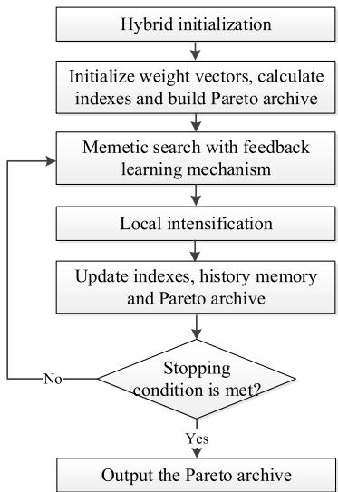  
Fig. 7. Framework of the FLMA.

## IV. NUMERICAL RESULTS AND COMPARISONS

In this section, extensive simulation experiments are carried out to test the performance of the proposed FLMA. First, the experiment setting is introduced, including the construction of testing instances and evaluation metrics. Second, the effect of the specific designs of the FLMA is tested to verify their performance promotion for solving the EDFJSP-T. Third, the FLMA is compared to the state-of-art algorithms to demonstrate its superiority. All the algorithms are implemented in C++ and the experiments are run on a PC with 16.0-GB RAM 1.70-GHz CPU.

## A. Experiment Settings

To test the performance of the FLMA for solving the EDFJSP-T, the following three types of test instances are generated, according to the famous benchmark FJSPT1-10 for FJSP-T [22], [23], [24], benchmark MK01-10 for FJSP [26], and construction methods based on literature [17]. In each instance, the speed of each AGV is randomly generated from {1.0, 1.2, 1.5} and its power consumption at running mode is a discrete value uniformly sampled from the [2] and [6]. The power consumption of each machine at running mode is a discrete value uniformly sampled from the [10] and [20]. The power consumption of AGV and machine at standby mode is set as 1 and 2, respectively. For the first type instances, DFJSPT1-10 is generated by extending multiple factories and EC data of FJSPT1-10. Each instance is generated by setting two homogeneous factories and transfer between two factories is not allowed. For the second type instances, DMK01- 40 is generated by setting the number of factories $F { = } 2$ and $F { = } 3$ , and generating two scales of the AGV number as small-scaled $g _ { s }$ sampled from [1, round(0.3×m+1)] and large-scaled $g _ { l }$ sampled from [2, round(0.8×m+1)]. Keep the distance of each factory center at least 50 and take the factory center as the origin. Coordinates of each machine are generated between [0,20]. The standard transportation time between machine $k$ and machine $k '$ is set as $d i s _ { k , k ^ { \prime } } / 4$ , where $d i s _ { k , k ^ { \prime } }$ denotes the Euclidean distance between machine k and machine $k ' .$ . For the third type instances, the number of factories F is from {2, 3, 5}, the number of jobs n is from {20, 40, 60, 80, 100} and the number of machines in each factory m is from {3, 5}. The processing time of each operation is a discrete value uniformly sampled from the [10,100]. Besides, the number and speed of AGV, transportation time and power consumption are generated as the above method. Thus, a total of $1 0 + 4 0 + 5 \times 2 \times 3 \times 2 = 1 1 0$ instances are generated to test. For all the tests and comparisons, the stopping criterion of all compared algorithms is set as the running time of $0 . 2 5 \times h \ { \mathrm { ( s ) } }$

The following three widely used metrics are employed to evaluate the performance of the algorithm in terms of convergence and diversity.

1) C Metric: It is a commonly used metric to compare the dominance of two Pareto sets via measuring the dominance relationship between solutions in the two sets $E _ { 1 }$ and $E _ { 2 } . C ( E _ { 1 } , E _ { 2 } )$ can be calculated by the percentage of the solutions in set $E _ { 2 }$ dominated by the solutions in set $E _ { 1 }$ as $C ( E _ { 1 } , E _ { 2 } ) = | \{ x _ { b } \in E _ { 2 } | \exists x _ { a } \in E _ { 1 } , \ x _ { a } \succ x _ { b } \} | / | E _ { 2 } |$

2) Hyper Volume: It is a general metric to evaluate comprehensive performance for solving a MOP. The HV value of Pareto set E measures the volume of the region in objective space dominated by E and bounded by reference point $R = ( r _ { 1 } , r _ { 2 } , \ldots , r _ { p } )$ , which is set to (1.0, 1.0) after normalizing E in this article. $H V ( E ) \ = \ L e b ( \bigcup _ { x \in E } \left[ f _ { 1 } ( x ) , \ r _ { 1 } \right] \times \ldots [ f _ { p } ( x ) , \ r _ { p } ] )$ where Leb( ) indicates the Lebesgue measure [39]. Obviously, the higher the HV values, the better the approximation of the E to the optimal Pareto set.

3) Inverted Generational Distance [38]: It evaluates the convergence and diversity by computing the distance of the obtained Pareto set approximation E with the true Pareto front P. In particular, $I G D ( E , P ) =$ $1 / | P | \sum _ { y \in P }$ min $\{ d _ { x y } | x \in E \}$ , where $d _ { x y }$ is the distance between solution x and optimal Pareto solution y in the normalized objective space. Since the true Pareto front P is always unknown for the EDFJSP-T, the nondominated set $E ^ { * }$ generated by all algorithms is used as the approximation Pareto front. The smaller the $I G D ( E , E ^ { * } )$ value, the better the algorithm. $I G D ( E , E ^ { * } ) = 0$ indicates the algorithm can obtain all the solutions in $E ^ { * }$

## B. Parameter Settings

To investigate the effect of key parameters on the performance of the proposed FLMA, the widely used Taguchi method of design-of-experiment (DOE) [40] is carried out. Three key parameters the population size (PS), the NS, and the length of history memory (HL) are analyzed. Four levels of each parameter are set as $P S ~ \in ~ \{ 1 0 , ~ 5 0 , ~ 1 0 0 , ~ 1 5 0 \}$ $N S \in \{ 1 , 3 , \ 5 , \ 7 \}$ and HL ∈{5, 10, 15, 20}. Accordingly, an orthogonal array $\mathrm { L } _ { 1 6 } ( 4 ^ { 3 } )$ is designed and generated by Minitab/MATLAB, based on principles of even distribution and symmetrical comparability [40]. In $\mathrm { L } _ { 1 6 } ( 4 ^ { 3 } )$ orthogonal array, L refers to the orthogonal array, 16 refers to number of rows, 4 refers to levels of each parameter, and 3 refers to number of parameters or columns. Accordingly, the orthogonal array $\mathrm { L } _ { 1 6 } ( 4 ^ { 3 } )$ includes 16 different (PS, NS, HL) combinations. To avoid the effect of instances with different scales, a total of 60 third-type instances are used for investigation. For each instance, the FLMA with each (PS, NS, HL) runs 10 times independently for each parameter combination and obtains Pareto set $E _ { i } ( { i = 1 , 2 , . . . , 1 6 } )$ . The average HV value of each parameter combination is used as the response value (RV).

The orthogonal array is listed in Table II and the significance rank of each parameter is listed in Table III. From Table III, it can be seen that NS is the most significant parameter, while PS and HL rank the second and the last, respectively. An appropriate value of NS means well balance of diversity and convergence when updating the population for the MOPs. For PS, a small value will result in poor performance for parallel search, while a large value will result in insufficient evolution with limited generations. Thus, an appropriate PS value can balance the evolutionary depth and breadth. HL denotes the feedback degree of the history information. A large value will gather more information to assist evolutionary process. However, too large value will result in lack of feedback timely. According to the above investigation, the parameters are suggested as $P S \ = \ 5 0$ $N S = 5 , H L = 2 0$

TABLE II  
ORTHOGONAL ARRAY AND RV VALUES

<table><tr><td rowspan="2">Experiment Number</td><td colspan="3">Factor level</td><td rowspan="2">RV</td></tr><tr><td>PS</td><td>NS</td><td>HL</td></tr><tr><td>1</td><td>1</td><td>1</td><td>1</td><td>0.800</td></tr><tr><td>2</td><td>1</td><td>2</td><td>2</td><td>0.732</td></tr><tr><td>3</td><td>1</td><td>3</td><td>3</td><td>0.717</td></tr><tr><td>4</td><td>1</td><td>4</td><td>4</td><td>0.686</td></tr><tr><td>5</td><td>2</td><td>1</td><td>2</td><td>0.739</td></tr><tr><td>6</td><td>2</td><td>2</td><td>1</td><td>0.681</td></tr><tr><td>7</td><td>2</td><td>3</td><td>4</td><td>0.792</td></tr><tr><td>8</td><td>2</td><td>4</td><td>3</td><td>0.733</td></tr><tr><td>9</td><td>3</td><td>1</td><td>3</td><td>0.686</td></tr><tr><td>10</td><td>3</td><td>2</td><td>4</td><td>0.764</td></tr><tr><td>11</td><td>3</td><td>3</td><td>1</td><td>0.736</td></tr><tr><td>12</td><td>3</td><td>4</td><td>2</td><td>0.596</td></tr><tr><td>13</td><td>4</td><td>1</td><td>4</td><td>0.649</td></tr><tr><td>14</td><td>4</td><td>2</td><td>3</td><td>0.744</td></tr><tr><td>15</td><td>4</td><td>3</td><td>2</td><td>0.709</td></tr><tr><td>16</td><td>4</td><td>4</td><td>1</td><td>0.612</td></tr></table>

TABLE III

AVERAGE RVS AND THE RANK OF EACH PARAMETER

<table><tr><td>Level</td><td>PS</td><td>NS</td><td>HL</td></tr><tr><td>1</td><td>0.7337</td><td>0.7185</td><td>0.7072</td></tr><tr><td>2</td><td>0.7362</td><td>0.7301</td><td>0.6940</td></tr><tr><td>3</td><td>0.6955</td><td>0.7385</td><td>0.7201</td></tr><tr><td>4</td><td>0.6787</td><td>0.6569</td><td>0.7228</td></tr><tr><td>Delta</td><td>0.0575</td><td>0.0816</td><td>0.0288</td></tr><tr><td>Rank</td><td>2</td><td>1</td><td>3</td></tr></table>

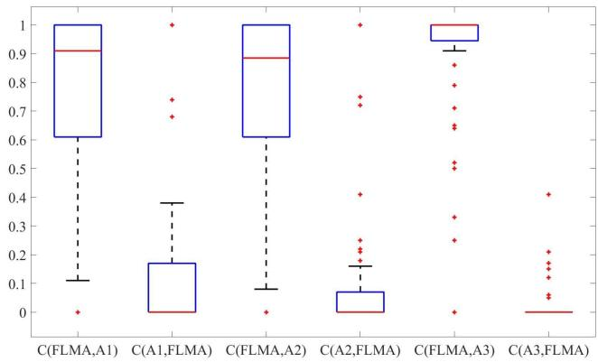  
Fig. 8. Boxplots of C metrics of FLMA, A1, A2, and A3.

## C. Effect of Designed Strategies on the FLMA

To investigate the effectiveness of the designed feedback learning mechanism and local intensification scheme, three variants of FLMA are compared to the FLMA. A1 is constructed via eliminating the reencode operator and its associated probability from the FLMA. A2 is constructed via removing the history memory and randomly selecting the operators of FLMA. A3 is constructed via removing local intensification scheme of FLMA. To test the performance of three variants on instances with different scales, the third type instances are used and each instance runs 20 times and the final Pareto set is retained for comparisons. The average HV and IGD values for each scale (F, n, and m) are presented in Table IV and the boxplot of C metrics is presented in Fig. 8. To show the difference between the FLMA and the variants statistically, the p values of pairwise comparison with 95% confidence level are provided in Table VI. Besides, the Pareto fronts obtained by the four algorithms for different instances are shown in Fig. 11.

TABLE IV  
COMPARISONS OF FLMA AND THE VARIANTS ON HV AND IGD METRICS

<table><tr><td rowspan="2">(F,n,m)</td><td colspan="4">HV</td><td colspan="4">IGD</td></tr><tr><td>FLMA</td><td>A1</td><td>A2</td><td>A3</td><td>FLMA</td><td>A1</td><td>A2</td><td>A3</td></tr><tr><td>(2,20,3)</td><td>0.77</td><td>0.66</td><td>0.68</td><td>0.61</td><td>0.00</td><td>0.05</td><td>0.07</td><td>0.10</td></tr><tr><td>(2,20,5)</td><td>0.83</td><td>0.65</td><td>0.53</td><td>0.42</td><td>0.00</td><td>0.09</td><td>0.20</td><td>0.19</td></tr><tr><td>(2,40,3)</td><td>0.75</td><td>0.67</td><td>0.65</td><td>0.62</td><td>0.00</td><td>0.07</td><td>0.09</td><td>0.09</td></tr><tr><td>(2,40,5)</td><td>0.76</td><td>0.63</td><td>0.63</td><td>0.48</td><td>0.00</td><td>0.09</td><td>0.11</td><td>0.18</td></tr><tr><td>(2,60,3)</td><td>0.71</td><td>0.58</td><td>0.59</td><td>0.50</td><td>0.00</td><td>0.08</td><td>0.06</td><td>0.12</td></tr><tr><td>(2,60,5)</td><td>0.77</td><td>0.62</td><td>0.54</td><td>0.40</td><td>0.00</td><td>0.11</td><td>0.14</td><td>0.28</td></tr><tr><td>(2,80,3)</td><td>0.73</td><td>0.67</td><td>0.70</td><td>0.56</td><td>0.02</td><td>0.05</td><td>0.04</td><td>0.13</td></tr><tr><td>(2,80,5)</td><td>0.80</td><td>0.68</td><td>0.66</td><td>0.49</td><td>0.00</td><td>0.08</td><td>0.09</td><td>0.21</td></tr><tr><td>(2,100,3)</td><td>0.82</td><td>0.61</td><td>0.72</td><td>0.53</td><td>0.00</td><td>0.11</td><td>0.07</td><td>0.20</td></tr><tr><td>(2,100,5)</td><td>0.85</td><td>0.70</td><td>0.57</td><td>0.56</td><td>0.00</td><td>0.10</td><td>0.22</td><td>0.20</td></tr><tr><td>(3,20,3)</td><td>0.71</td><td>0.65</td><td>0.58</td><td>0.54</td><td>0.05</td><td>0.07</td><td>0.13</td><td>0.23</td></tr><tr><td>(3,20,5)</td><td>0.88</td><td>0.67</td><td>0.76</td><td>0.19</td><td>0.00</td><td>0.15</td><td>0.07</td><td>0.54</td></tr><tr><td>(3,40,3)</td><td>0.77</td><td>0.62</td><td>0.61</td><td>0.57</td><td>0.02</td><td>0.09</td><td>0.12</td><td>0.09</td></tr><tr><td>(3,40,5)</td><td>0.77</td><td>0.63</td><td>0.53</td><td>0.56</td><td>0.00</td><td>0.10</td><td>0.18</td><td>0.15</td></tr><tr><td>(3,60,3)</td><td>0.75</td><td>0.63</td><td>0.65</td><td>0.58</td><td>0.00</td><td>0.07</td><td>0.07</td><td>0.11</td></tr><tr><td>(3,60,5)</td><td>0.81</td><td>0.60</td><td>0.63</td><td>0.42</td><td>0.00</td><td>0.14</td><td>0.15</td><td>0.25</td></tr><tr><td>(3,80,3)</td><td>0.72</td><td>0.60</td><td>0.65</td><td>0.45</td><td>0.01</td><td>0.05</td><td>0.06</td><td>0.19</td></tr><tr><td>(3,80,5)</td><td>0.76</td><td>0.66</td><td>0.42</td><td>0.30</td><td>0.05</td><td>0.14</td><td>0.26</td><td>0.31</td></tr><tr><td>(3,100,3)</td><td>0.68</td><td>0.60</td><td>0.59</td><td>0.45</td><td>0.05</td><td>0.06</td><td>0.09</td><td>0.20</td></tr><tr><td>(3,100,5)</td><td>0.59</td><td>0.84</td><td>0.70</td><td>0.32</td><td>0.21</td><td>0.00</td><td>0.15</td><td>0.47</td></tr><tr><td>(5,20,3)</td><td>0.84</td><td>0.69</td><td>0.77</td><td>0.58</td><td>0.06</td><td>0.18</td><td>0.12</td><td>0.30</td></tr><tr><td>(5,20,5)</td><td>0.85</td><td>0.78</td><td>0.71</td><td>0.11</td><td>0.08</td><td>0.10</td><td>0.20</td><td>0.70</td></tr><tr><td>(5,40,3)</td><td>0.90</td><td>0.80</td><td>0.46</td><td>0.25</td><td>0.00</td><td>0.11</td><td>0.53</td><td>0.56</td></tr><tr><td>(5,40,5)</td><td>0.90</td><td>0.78</td><td>0.78</td><td>0.13</td><td>0.02</td><td>0.17</td><td>0.05</td><td>0.70</td></tr><tr><td>(5,60,3)</td><td>0.67</td><td>0.33</td><td>0.44</td><td>0.24</td><td>0.00</td><td>0.31</td><td>0.11</td><td>0.35</td></tr><tr><td>(5,60,5)</td><td>0.76</td><td>0.46</td><td>0.74</td><td>0.16</td><td>0.00</td><td>0.14</td><td>0.07</td><td>0.51</td></tr><tr><td>(5,80,3)</td><td>0.77</td><td>0.32</td><td>0.50</td><td>0.24</td><td>0.00</td><td>0.37</td><td>0.20</td><td>0.31</td></tr><tr><td>(5,80,5)</td><td>0.63</td><td>0.67</td><td>0.73</td><td>0.04</td><td>0.19</td><td>0.14</td><td>0.11</td><td>0.79</td></tr><tr><td>(5,100,3)</td><td>0.82</td><td>0.79</td><td>0.42</td><td>0.24</td><td>0.07</td><td>0.09</td><td>0.23</td><td>0.45</td></tr><tr><td>(5,100,5)</td><td>0.94</td><td>0.52</td><td>0.78</td><td>0.31</td><td>0.00</td><td>0.40</td><td>0.10</td><td>0.36</td></tr><tr><td>AVE</td><td>0.78</td><td>0.64</td><td>0.62</td><td>0.40</td><td>0.03</td><td>0.12</td><td>0.14</td><td>0.31</td></tr></table>

From Fig. 8, it can be seen that the C(FLMA, A1), C(FLMA, A2), C(FLMA, A3) are larger than C(A1, FLMA), C(A2, FLMA), C(A3, FLMA) on almost all instances. Especially, C(FLMA, A3) is much larger than C(A3, FLMA) and all the p-values are less than 0.05. Thus, most nondominated solutions obtained by the FLMA can dominate the solutions obtained by the A1, A2 and A3. From Tables IV and VI, it can be seen that the HV and IGD values obtained by the FLMA are significantly better than those obtained by the three variants on almost all instances. The results demonstrate the convergence and diversity of the FLMA are superior to the three variants, especially for the algorithm without local intensification. Therefore, the feedback learning mechanisms and local intensification can significantly improve the performance of the FLMA. Particularly, local search plays an indispensable role in the MA and problem-specific local intensification can enhance effectiveness of MA.

To illustrate the changes in related indexes and selection probabilities during the evolutionary process, we present the trends of DMI, selection probabilities, and IGD metrics with generations in Fig. 9. The curves in Fig. 9 reveal the convergence of IGD and the tendency of DMI toward stability over iterations. Due to the varying selection probabilities for different solutions, we utilize average probabilities to observe trends. It is noted that the variability in crossover probabilities is inversely related to the variability in DMI, indicating an increase in crossover probabilities as the population diversity decreases, which is conducive to enhancing exploration ability. The curves for both crossover and re-encoding probabilities display rapid changes in the early stages, gradually stabilizing with iterations. Furthermore, the stable values of these probabilities facilitate reasonable operator selection. Consequently, the feedback learning mechanism can effectively guide operator selection for solutions and populations with specific characteristics.

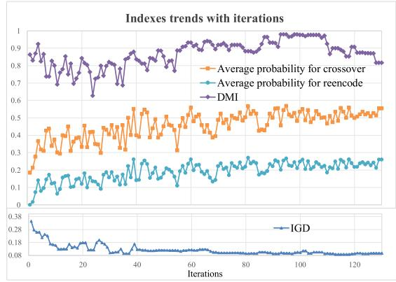  
Fig. 9. Indexes trends with iterations.

## D. Comparisons to Other Algorithms

To the best of our knowledge, there is no existing algorithm for solving the proposed EDFJSP-T in this article. Nonetheless, the DFJSP and FJSP-T have been studied in recent years. Thus, we select two recent algorithms for comparisons, i.e., a HMOMA in 2022 [20] and an IGA in 2021 [25]. The HMOMA is designed to address the multiobjective DFJSP, but it does not account for transportation constraints [20]. On the other hand, the IGA is intended to solve the FJSP-T, without considering distributed shops and the energy-efficient objective [25]. Both the HMOMA and IGA exhibit competitiveness in solving the DFJSP and FJSP-T. For fair comparison, we adapt the encoding methods to the HMOMA and IGA, and adapt the nondominated sorting method for the IGA to obtain a Pareto set. The parameters of the HMOMA are set as PS 126, mating probability 0.8, and mutation probability 0.1 [20]. The parameters of IGA are set as PS 60, crossover rate 0.8, and mutation rate 0.1, and selection percentage 10% [25]. The stopping criterion is the same running time. Each testing instance is run 20 times independently and the final Pareto set is used for comparison.

To compare the performance of the three comparative algorithms in terms of convergence and diversity, the C, HV, and IGD metrics are calculated for all instances. The boxplots of C metrics are shown in Fig. 10 and HV and IGD values for the EDFJSPT1-10, average HV and IGD values for DMK instances with different F and g, and average HV and IGD values for each scale (F, n) are presented in Table V. The nonparametric test with 95% confidence level is carried out and all the p values for different metrics are listed in Table VI. The Pareto fronts of all algorithms for different scales are shown in Fig. 11 to show the performance of the comparative algorithms institutively.

TABLE V  
COMPARISONS OF FLMA, HMOMA, AND IGA ON HV AND IGD METRICS

<table><tr><td rowspan="2">Instance</td><td colspan="3">HV</td><td colspan="3">IGD</td></tr><tr><td>FLMA</td><td>HMOMA</td><td>IGA</td><td>FLMA</td><td>HMOMA</td><td>IGA</td></tr><tr><td>DFJSPT1</td><td>0.95</td><td>0.51</td><td>0.59</td><td>0.00</td><td>0.31</td><td>0.27</td></tr><tr><td>DFJSPT2</td><td>0.98</td><td>0.54</td><td>0.63</td><td>0.00</td><td>0.50</td><td>0.37</td></tr><tr><td>DFJSPT3</td><td>0.99</td><td>0.65</td><td>0.74</td><td>0.00</td><td>0.56</td><td>0.39</td></tr><tr><td>DFJSPT4</td><td>0.96</td><td>0.60</td><td>0.67</td><td>0.00</td><td>0.38</td><td>0.12</td></tr><tr><td>DFJSPT5</td><td>1.00</td><td>0.72</td><td>0.64</td><td>0.00</td><td>0.59</td><td>0.62</td></tr><tr><td>DFJSPT6</td><td>0.95</td><td>0.61</td><td>0.58</td><td>0.00</td><td>0.42</td><td>0.15</td></tr><tr><td>DFJSPT7</td><td>0.98</td><td>0.66</td><td>0.63</td><td>0.00</td><td>0.35</td><td>0.19</td></tr><tr><td>DFJSPT8</td><td>0.93</td><td>0.56</td><td>0.58</td><td>0.00</td><td>0.28</td><td>0.10</td></tr><tr><td>DFJSPT9</td><td>0.96</td><td>0.67</td><td>0.72</td><td>0.01</td><td>0.29</td><td>0.10</td></tr><tr><td>DFJSPT10</td><td>0.93</td><td>0.55</td><td>0.54</td><td>0.00</td><td>0.34</td><td>0.26</td></tr><tr><td>DMK01</td><td>1.00</td><td>0.05</td><td>0.23</td><td>0.00</td><td>1.12</td><td>0.77</td></tr><tr><td>DMK02</td><td>1.00</td><td>0.04</td><td>0.15</td><td>0.00</td><td>1.11</td><td>0.83</td></tr><tr><td>DMK03</td><td>1.00</td><td>0.04</td><td>0.14</td><td>0.00</td><td>1.17</td><td>0.91</td></tr><tr><td>DMK04</td><td>1.00</td><td>0.07</td><td>0.23</td><td>0.00</td><td>1.06</td><td>0.80</td></tr><tr><td>DMK05</td><td>1.00</td><td>0.05</td><td>0.16</td><td>0.00</td><td>1.12</td><td>0.83</td></tr><tr><td>DMK06</td><td>1.00</td><td>0.03</td><td>0.09</td><td>0.00</td><td>1.20</td><td>0.94</td></tr><tr><td>DMK07</td><td>1.00</td><td>0.05</td><td>0.18</td><td>0.00</td><td>1.11</td><td>0.79</td></tr><tr><td>DMK08</td><td>1.00</td><td>0.08</td><td>0.21</td><td>0.00</td><td>1.02</td><td>0.74</td></tr><tr><td>DMK09</td><td>1.00</td><td>0.04</td><td>0.18</td><td>0.00</td><td>1.18</td><td>0.84</td></tr><tr><td>DMK10</td><td>1.00</td><td>0.04</td><td>0.09</td><td>0.00</td><td>1.18</td><td>0.92</td></tr><tr><td>(2,20)</td><td>0.93</td><td>0.21</td><td>0.38</td><td>0.00</td><td>0.65</td><td>0.43</td></tr><tr><td>(2,40)</td><td>0.92</td><td>0.12</td><td>0.23</td><td>0.00</td><td>0.69</td><td>0.45</td></tr><tr><td>(2,60)</td><td>0.90</td><td>0.07</td><td>0.25</td><td>0.00</td><td>0.79</td><td>0.49</td></tr><tr><td>(2,80)</td><td>0.93</td><td>0.05</td><td>0.14</td><td>0.00</td><td>0.86</td><td>0.58</td></tr><tr><td>(2,100)</td><td>0.95</td><td>0.06</td><td>0.15</td><td>0.00</td><td>0.89</td><td>0.63</td></tr><tr><td>(3,20)</td><td>0.96</td><td>0.13</td><td>0.40</td><td>0.00</td><td>0.77</td><td>0.39</td></tr><tr><td>(3,40)</td><td>0.96</td><td>0.06</td><td>0.24</td><td>0.00</td><td>0.84</td><td>0.44</td></tr><tr><td>(3,60)</td><td>0.93</td><td>0.09</td><td>0.20</td><td>0.00</td><td>0.81</td><td>0.47</td></tr><tr><td>(3,80)</td><td>0.97</td><td>0.05</td><td>0.17</td><td>0.00</td><td>0.91</td><td>0.38</td></tr><tr><td>(3,100)</td><td>0.97</td><td>0.04</td><td>0.18</td><td>0.00</td><td>1.00</td><td>0.48</td></tr><tr><td>(5,20)</td><td>0.98</td><td>0.13</td><td>0.23</td><td>0.00</td><td>0.88</td><td>0.64</td></tr><tr><td>(5,40)</td><td>1.00</td><td>0.04</td><td>0.30</td><td>0.00</td><td>1.08</td><td>0.69</td></tr><tr><td>(5,60)</td><td>0.95</td><td>0.03</td><td>0.31</td><td>0.00</td><td>0.84</td><td>0.07</td></tr><tr><td>(5,80)</td><td>0.99</td><td>0.03</td><td>0.21</td><td>0.00</td><td>1.02</td><td>0.56</td></tr><tr><td>(5,100)</td><td>0.99</td><td>0.03</td><td>0.26</td><td>0.00</td><td>1.02</td><td>0.38</td></tr><tr><td>AVE</td><td>0.97</td><td>0.22</td><td>0.33</td><td>0.00</td><td>0.81</td><td>0.52</td></tr></table>

TABLE VI

PAIRWISE COMPARISONS OF ALL ALGORITHMS

<table><tr><td></td><td>p-value(C)</td><td>p-value(HV)</td><td>p-value(IGD)</td></tr><tr><td>p-value (FLMA, A1)</td><td>0.000</td><td>0.000</td><td>0.000</td></tr><tr><td>p-value (FLMA, A2)</td><td>0.000</td><td>0.000</td><td>0.000</td></tr><tr><td>p-value (FLMA, A3)</td><td>0.000</td><td>0.000</td><td>0.000</td></tr><tr><td>p-value (FLMA, HMOMA)</td><td>0.000</td><td>0.000</td><td>0.000</td></tr><tr><td>p-value (FLMA, IGA)</td><td>0.000</td><td>0.000</td><td>0.000</td></tr></table>

From the Fig. 10, it can be seen that C(FLMA, HMOMA) is almost 1 and C(HMOMA, FLMA) is almost 0 on all instances. The nondominated solutions obtained by the FLMA can almost dominate all solutions obtained by the HMOMA on all instances. Meanwhile, the C(FLMA, IGA) is 1 and C(IGA, FLMA) is 0 on most instances, which indicates the nondominated solutions obtained by the FLMA can dominate most solutions obtained by the IGA on most instances. The p values of C metrics are close to 0 from Table VI, which also indicates the FLMA is significantly better than the HMOMA and IGA on C metric.

From Table V, it can be seen that the HV values of the FLMA are close to 1 and the IGD values obtained by the FLMA are close to 0 on all instances. Besides, the HV values of the FLMA are much larger than those of the HMOMA and

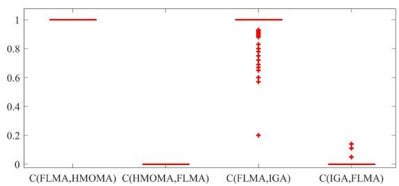  
Fig. 10. Boxplots of C metric of FLMA, HMOMA, and IGA.

IGA, and the IGD values obtained by the FLMA are much smaller than the HMOMA and IGA. The resulted p values for HV and IGD metrics in Table VI are close to 0, which means performance of the FLMA is significantly better than the HMOMA and IGA on HV and IGD metrics.

Synthesizing the above statistical results, it has been observed that FLMA outperforms the HMOMA and IGA significantly in terms of the C, HV, and IGD metrics. The results demonstrate that FLMA exhibits superior convergence and diversity in the Pareto set. In addition, the Pareto fronts obtained by FLMA closely approximate the optimal Pareto front from Fig. 11. Meanwhile, the Pareto sets obtained by the FLMA and its variants are much better than those of the HMOMA and IGA, especially for the TEC objective. These achievements can be largely attributed to the diversified problem-specific operators, objective-oriented search, feedback learning mechanisms, and local intensification proposed in FLMA, which effectively balance exploration and exploitation. Therefore, the FLMA is more effective than the state-of-art algorithms in solving the EDFJSP-T.

## V. CONCLUSION AND FUTURE WORK

The integration of feedback learning with the evolutionary algorithm is a promising research direction for solving complex scheduling problems. This article has presented an effective MA with feedback learning mechanism to address the energy-aware collaborative scheduling of distributed flexible job-shop with transportation constraints. The extensive experiments showed the proposed feedback learning mechanisms are effective and the proposed FLMA can achieve better performance in terms of convergence and diversity than the existing algorithms. The advantages of the FLMA are four aspects as follows. Encoding and decoding methods are developed to depict solution space efficiency and map a solution to a high-quality schedule. Various problem-specific operators are designed for different subproblems focusing on different objectives to improve search capability. Memetic search with feedback learning is proposed via estimating population state and individual state to choose appropriate operators for enhancing search efficiency. Local intensification is used to improve exploitation of specific regions and obtain a convergent and diverse Pareto front. The proposed algorithm framework and integration of feedback learning mechanism present an effective approach to addressing complex integrated scheduling problems. Additionally, the high-quality Pareto solutions obtained by the FLMA provide production managers with the opportunity to explore the interaction between economic and environmental alternatives.

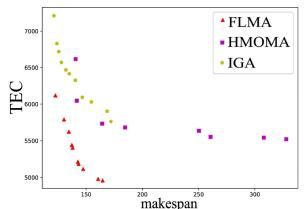  
(a)

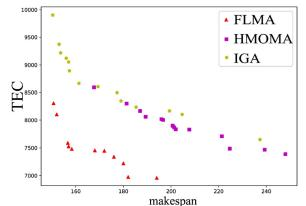

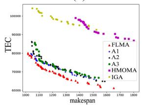  
(e)

(b)  
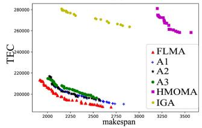

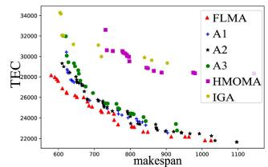

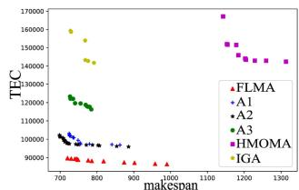

(f)  
(c)  
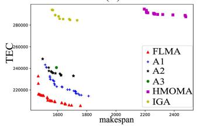  
(g)

(d)  
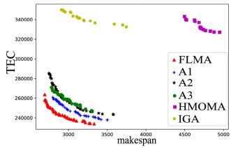  
(h)  
Fig. 11. Pareto fronts of compared algorithms for instances with different scales. (a) DFJSPT6. (b) DFJSPT10. (c) $n = 2 0 , F = 2 , m = 3 ,$ and g is large. $\bar { ( \mathrm { d ) } } n = 4 0 , F = 5 , m = 5 ,$ and g is large. (e) $n = 6 0 , F = 3 , m = 3$ , and g is large. (e) $n = 6 0 , F = 3 , m = 3 ,$ and g is large. (g) $n = 8 0 , F = 3 , m = 5 ,$ and g is large. (h) $n = 1 0 0 , F = 2 , m = 5 ,$ and g is small.

In addition to the advantages of this study, it is important to note that other types of algorithms could be utilized to address the EDFJSP-T and the proposed algorithm should be utilized and extended to solve real industrial scheduling problems in the future. Besides, the uncertainties in energyaware distributed shop scheduling in real-life manufacturing are worth investigating, such as dynamic order, uncertain production environment, and machine breakdown. In addition, the combination of feedback learning mechanism or reinforcement learning and evolutionary algorithm continues to be a promising direction for complex scheduling problems.

## REFERENCES

[1] M. Li and G. G. Wang, “A review of green shop scheduling problem,” Inf. Sci., vol. 589, pp. 478–496, Apr. 2022.

[2] J. M. R. C. Fernandes, S. M. Homayouni, and D. B. M. M. Fontes, “Energy-efficient scheduling in job shop manufacturing systems: A literature review,” Sustainability, vol. 14, no. 10, p. 6264, May 2022.

[3] K. Z. Gao, Y. Huang, A. Sadollah, and L. Wang, “A review of energyefficient scheduling in intelligent production systems,” Complex Intell. Syst., vol. 6, pp. 237–249, Jul. 2020.

[4] A. Toptal and I. Sabuncuoglu, “Distributed scheduling: A review of concepts and applications,” Int. J. Prod. Res., vol. 48, pp. 5235–5262, Sep. 2010.

[5] J. Behnamian and S. M. T. F. Ghomi, “A survey of multi-factory scheduling,” J. Intell. Manuf., vol. 27, pp. 231–249, Feb. 2016.

[6] F. Pezzella, G. Morganti, and G. Ciaschetti, “A genetic algorithm for the flexible job-shop scheduling problem,” Comput. Oper. Res., vol. 35, no. 10, pp. 3202–3212, Oct. 2008.

[7] R. Chen, B. Yang, S. Li, and S. Wang, “A self-learning genetic algorithm based on reinforcement learning for flexible job-shop scheduling problem,” Comput. Ind. Eng., vol. 149, Nov. 2020, Art. no. 106778.

[8] L. D. Giovanni and F. Pezzella, “An improved genetic algorithm for the distributed and flexible job-shop scheduling problem,” Eur. J. Oper. Res., vol. 200, no. 2, pp. 395–408, Jan. 2010.

[9] L. Meng, C. Zhang, Y. Ren, B. Zhang, and C. Lv, “Mixed-integer linear programming and constraint programming formulations for solving distributed flexible job shop scheduling problem,” Comput. Ind. Eng., vol. 142, Apr. 2020, Art. no. 106347.

[10] M. C. Wu, C.-S. Lin, C.-H. Lin, and C.-F. Chen, “Effects of different chromosome representations in developing genetic algorithms to solve DFJS scheduling problems,” Comput. Oper. Res., vol. 80, pp. 101–112, Apr. 2017.

[11] H. Tang, B. Fang, R. Liu, Y. Li, and S. Guo, “A hybrid teaching and learning-based optimization algorithm for distributed sand casting job shop scheduling problem,” Appl. Soft Comput., vol. 120, May 2022, Art. no. 108694.

[12] C. Gahm, F. Denz, M. Dirr, and A. Tuma, “Energy-efficient scheduling in manufacturing companies: A review and research framework,” Eur. J. Oper. Res., vol. 248, no. 3, pp. 744–757, Feb. 2016.

[13] N. Rakovitis, D. Li, N. Zhang, J. Li, L. Zhang, and X. Xiao, “Novel approach to energy-efficient flexible job-shop scheduling problems,” Energy, vol. 238, Jan. 2022, Art. no. 121773.

[14] H. Mokhtari and A. Hasani, “An energy-efficient multi-objective optimization for flexible job-shop scheduling problem,” Comput. Chem. Eng., vol. 104, no. 2, pp. 339–352, Sep. 2017.

[15] R. Li, W. Gong, C. Lu, and L. Wang, “A learning-based memetic algorithm for energy-efficient flexible job shop scheduling with type-2 fuzzy processing time,” IEEE Trans. Evol. Comput., vol. 27, no. 3, pp. 610–620, Jun. 2023.

[16] J. Wang, Y. Liu, S. Ren, C. Wang, and W. Wang, “Evolutionary game based real-time scheduling for energy-efficient distributed and flexible job shop,” J. Clean. Prod., vol. 293, Apr. 2021, Art. no. 126093.

[17] Y. Du, J. Li, C. Lu, and L. Meng, “A hybrid estimation of distribution algorithm for distributed flexible job shop scheduling with crane transportations,” Swarm Evol. Comput., vol. 62, Apr. 2021, Art. no. 100861.

[18] R. Li, W. Gong, L. Wang, C. Lu, and X. Zhuang, “Surprisingly popular-based adaptive memetic algorithm for energy-efficient distributed flexible job shop scheduling,” IEEE Trans. Cybern., vol. 53, no. 12, pp. 8013–8023, Dec. 2023, doi: 10.1109/TCYB.2023.3280175.

[19] Q. Luo, Q. Deng, G. Gong, L. Zhang, W. Han, and K. Li, “An efficient memetic algorithm for distributed flexible job shop scheduling problem with transfers,” Expert Syst. Appl., vol. 160, Dec. 2020, Art. no. 113721.

[20] Y. Sang and J. Tan, “Intelligent factory many-objective distributed flexible job shop collaborative scheduling method,” Comput. Ind. Eng., vol. 164, Feb. 2022, Art. no. 107884.

[21] M. V. S. Kumar, R. Janardhana, and C. S. P. Rao, “Simultaneous scheduling of machines and vehicles in an FMS environment with alternative routing,” Int. J. Adv. Manuf. Tech., vol. 53, pp. 339–351, Mar. 2011.

[22] Q. Zhang, H. Manier, and M.-A. Manier, “A genetic algorithm with tabu search procedure for flexible job shop scheduling with transportation constraints and bounded processing times,” Comput. Oper. Res., vol. 39, no. 7, pp. 1713–1723, 2012.

[23] H. E. Nouri, O. B. Driss, and K. Ghedira, “Simultaneous scheduling of machines and transport robots in flexible job shop environment using hybrid metaheuristics based on clustered holonic multiagent model,” Comput. Ind. Eng., vol. 102, pp. 488–501, Dec. 2016.

[24] S. M. Homayouni and D. B. M. M. Fontes, “Production and transport scheduling in flexible job shop manufacturing systems,” J. Global Optim., vol. 79, pp. 463–502, Feb. 2021.

[25] J. Yan, Z. F. Liu, C. X. Zhang, T. Zhang, Y. Z. Zhang, and C. B. Yang, “Research on flexible job shop scheduling under finite transportation conditions for digital twin workshop,” Robot. Comput. Int. Manuf., vol. 72, Dec. 2021, Art. no. 102198.

[26] Z. Pan, L. Wang, J. Zhang, J. Chen, X. Wang, “A learning-based multi-population evolutionary optimization for flexible job shop scheduling problem with finite transportation resources,” IEEE Trans. Evol. Comput., vol. 27, no. 6, pp. 1590–1603, Dec. 2023.

[27] X. Chen, Y.-S. Ong, M.-H. Lim, and K. C. Tan, “A multi-facet survey on memetic computation,” IEEE Trans. Evol. Comput., vol. 15, no. 5, pp. 591–607, Oct. 2011.

[28] J. J. Wang and L. Wang, “A cooperative memetic algorithm with learning-based agent for energy-aware distributed hybrid flow-shop scheduling,” IEEE Trans. Evol. Comput., vol. 26, no. 3, pp. 461–475, Jun. 2022.

[29] G. Zhang, B. Liu, L. Wang, D. Yu, and K. Xing, “Distributed coevolutionary memetic algorithm for distributed hybrid differentiation flowshop scheduling problem,” IEEE Trans. Evol. Comput., vol. 26, no. 5, pp. 1043–1057, Oct. 2022.

[30] Y. Zhang, G. G. Wang, K. Li, W. C. Yeh, M. Jian, and J. Dong, “Enhancing MOEA/D with information feedback models for large-scale many-objective optimization,” Inf. Sci., vol. 522, pp. 1–16, Jun. 2020.

[31] C. Lu, L. Gao, X. Li, B. Zeng, and F. Zhou, “A hybrid multi-objective evolutionary algorithm with feedback mechanism,” Appl. Intell., vol. 48, no. 11, pp. 4149–4173, May 2018.

[32] J. Wang and L. Wang, “A cooperative memetic algorithm with feedback for the energy-aware distributed flow-shops with flexible assembly scheduling,” Comput. Ind. Eng., vol. 168, Jun. 2022, Art. no. 108126.

[33] G. Zhang, X. Ma, L. Wang, and K. Xing, “Elite archive-assisted adaptive memetic algorithm for a realistic hybrid differentiation flowshop scheduling problem,” IEEE Trans. Evol. Comput., vol. 26, no. 1, pp. 100–114, Feb. 2022.

[34] K. Deb, A. Pratap, S. Agarwal, and T. Meyarivan, “A fast and elitist multiobjective genetic algorithm: NSGA-II,” IEEE Trans. Evol. Comput., vol. 6, no. 2, pp. 182–197, Apr. 2002.

[35] Q. Zhang and H. Li, “MOEA/D: A multiobjective evolutionary algorithm based on decomposition,” IEEE Trans. Evol. Comput., vol. 11, no. 6, pp. 712–731, Dec. 2007.

[36] N. Krasnogor and J. Smith, “A tutorial for competent memetic algorithms: Model, taxonomy, and design issues,” IEEE Trans. Evol. Comput., vol. 9, no. 5, pp. 474–488, Oct. 2005.

[37] W. L. Strong, “Biased richness and evenness relationships within Shannon–Wiener index values,” Ecol. Indic., vol. 67, pp. 703–713, Aug. 2016.

[38] S. Yang, H. Huang, F. Luo, Y. Xu, and Z. Hao, “Local-diversity evaluation assignment strategy for decomposition-based multiobjective evolutionary algorithm,” IEEE Trans. Syst. Man, Cybern. Syst., vol. 53, no. 3, pp. 1697–1709, Mar. 2023.

[39] L. While, P. Hingston, L. Barone, and S. Huband, “A faster algorithm for calculating hypervolume,” IEEE Trans. Evol. Comput., vol. 10, no. 1, pp. 29–38, Feb. 2006.

[40] D. C. Montgomery, Design and Analysis of Experiments. Hoboken, NJ, USA: Wiley, 2005.

Jingjing Wang received the B.Sc., M.Sc. and Ph.D. degrees from Tsinghua University, Beijing, China, in 2015, 2018, and 2022, respectively.

She is currently an Assistant Professor with the Faculty of Information Technology, Beijing University of Technology, Beijing. Her current research interests include distributed and green shop scheduling with evolutionary computation and reinforcement learning.

Honggui Han (Senior Member, IEEE) received the B.S. degree in automatic from the Civil Aviation University of China, Tianjin, China, in 2005, and the M.E. and Ph.D. degrees in control theory and control engineering from the Beijing University of Technology, Beijing, China, in 2007 and 2011, respectively.

He has been with the Beijing University of Technology since 2011, where he is currently a Professor. His current research interests include neural networks, fuzzy systems, intelligent systems,

modeling and control in process systems, and civil and environmental engineering.

Prof. Han is currently a reviewer of IEEE TRANSACTIONS ON FUZZY SYSTEMS, IEEE TRANSACTIONS ON NEURAL NETWORKS AND LEARNING SYSTEMS, IEEE TRANSACTIONS ON CYBERNETICS, and IEEE TRANSACTIONS ON CONTROL SYSTEMS TECHNOLOGY.

Ling Wang (Member, IEEE) received the B.Sc. degree in automation and the Ph.D. degree in control theory and control engineering from Tsinghua University, Beijing, China, in 1995 and 1999, respectively.

Since 1999, he has been with the Department of Automation, Tsinghua University, where he became a Full Professor in 2008. He has authored five academic books and more than 300 refereed papers. His current research interests include intelligent optimization and production scheduling.

Prof. Wang is a recipient of the National Natural Science Fund for Distinguished Young Scholars of China, the National Natural Science Award (Second Place) in 2014, the Science and Technology Award of Beijing City in 2008, the Natural Science Award (First Place in 2003 and the Second Place in 2007) nominated by the Ministry of Education of China. He is currently the Editor-in-Chief of the Swarm and Evolutionary Computation and International Journal of Automation and Control, and the Associate Editor of IEEE TRANSACTIONS ON EVOLUTIONARY COMPUTATION, and Expert Systems With Applications.