# A Hierarchical Optimization Algorithm With Dual-Cache Synced Tuning Mechanism for Distributed Flexible Job Shop Scheduling Problem

Fuqing Zhao , Junang Zhou, Ling Wang , Senior Member, IEEE, and Hongyan Sang

Abstract—Distributed manufacturing is emerging as the mainstream production paradigm within contemporary industrial systems. The distributed flexible job shop scheduling problem (DFJSP) is an NP-hard combinatorial optimization problem. A hierarchical optimization algorithm with a dual-cache synced tuning mechanism (HOA-DSTM) is proposed to solve the DFJSP in this article. The HOA-DSTM consists of two distinct stages: the evolutionary stage and the optimization stage. In the evolutionary stage, an elite retention strategy is designed in the crossover process to preserve the knowledge of high-quality individuals during each iteration. A dual-reinforcement learning (dual-RL) mechanism based on a conversion factor is employed to adjust the crossover probability $( P _ { c } )$ and mutation probability $( P _ { m } )$ to increase the optimization eficiency. The optimization stage includes a local search with seven operators and a DSTM for the optimum elite in the population. The DSTM leverages the coupling characteristic of the DFJSP encoding scheme to adjust the operation sequence (OS) and factory assignment (FA) in the current optimal individual. The experimental results on benchmark datasets demonstrate that the HOA-DSTM outperforms state-of-the-art algorithms in solving the DFJSP.

Index Terms—Conversion factor, distributed flexible job shop scheduling, dual-cache synced tuning mechanism (DSTM), dualreinforcement learning (RL) mechanism, elite retention strategy.

## NOMENCLATURE

$i , i ^ { \prime }$ Indices of jobs. n Total number of jobs. J Set of jobs, $J = \{ 1 , 2 , \dots , n \} .$ $j , j ^ { \prime }$ Index of operations.

Received 4 October 2025; revised 18 November 2025; accepted 12 December 2025. This work was supported in part by the National Natural Science Foundation of China under Grant 62473182, in part by the Industry Support Project of Gansu Province College under Grant 2024CYZC-15, in part by the Intellectual Property Program of Gansu Province under Grant 24ZSCQG045, and in part by Lanzhou Science and Technology Planning Project under Grant 2025-3-019. This article was recommended by Associate Editor P. P. Angelov. (Corresponding authors: Fuqing Zhao; Ling Wang.)

Fuqing Zhao and Junang Zhou are with the School of Computer and Communication Technology, Lanzhou University of Technology, Lanzhou 730050, China (e-mail: zhaofq@lut.edu.cn; zhouja0105@163.com). Ling Wang is with the Department of Automation, Tsinghua University, Beijing 100084, China (e-mail: wangling@tsinghua.edu.cn).

Hongyan Sang is with the School of Computer Science, Liaocheng University, Liaocheng 252059, China (e-mail: sanghongyan@lcu-cs.com).

Color versions of one or more figures in this article are available at https://doi.org/10.1109/TCYB.2025.3644904.

Digital Object Identifier 10.1109/TCYB.2025.3644904 $n _ { i }$ Number of operations for job i. $P _ { i }$ Set of operations for job $i , P _ { i } = \{ 1 , 2 , \dots , n _ { i } \}$ $P P _ { i }$ Set of partial operations for job i, $P P _ { i } =$ $\{ 1 , 2 , \dotsc , n _ { i - 1 } \}$ $k , k ^ { \prime }$ Indices of machines. $O _ { i j }$ jth operation of job i. $f$ Indices of factories. $r _ { f }$ Total number of factories. $F$ Set of factories, $F = \{ 1 , \dots , r _ { f } \} .$ $m _ { f }$ Number of machines in factory $f .$ $M _ { f }$ Machine set in factory $\begin{array} { r l r l } { f , } & { { } M _ { f } } & { } & { { } = } \end{array}$ $\{ 1 , 2 , \ldots , m _ { f } \} .$ $M _ { i , j , f }$ Set of available machines for operation $O _ { i j }$ in factory $f .$ $p t _ { i , j , f , k }$ Processing time of operation $O _ { i j }$ processed on machine k in factory $f .$ $L$ Large positive number. $X _ { i , j , f , k }$ If operation $O _ { i j }$ is assigned on machine k in factory $f , X _ { i , j , f , k } = 1 ;$ otherwise, $X _ { i , j , f , k } = 0 .$ $Y _ { i , j , i ^ { \prime } , j ^ { \prime } }$ If operation $O _ { i j }$ is processed before operation $O _ { i ^ { \prime } j ^ { \prime } } , Y _ { i , j , i ^ { \prime } , j ^ { \prime } } = 1$ ; otherwise, $Y _ { i , j , i ^ { \prime } , j ^ { \prime } } = 0 .$ $A _ { i , f }$ If job i is assigned to factory $f , A _ { i , j } = 1 ;$ otherwise, $A _ { i , f } = 0 .$ $B _ { i , j }$ Start time of operation $O _ { i j } .$ $C _ { m a x }$ Makespan.

## I. INTRODUCTION

of mechanical machining and a broad spectrum of manufacturing scenarios, such as tasks, processing machines, machine setup times, tool paths, and process sequences [1]. The flexible job shop problem (FJSP) extends the classical JSP by incorporating machine selection flexibility for operations, thereby enabling dynamically reconfigurable processing sequences [2], [3], [4]. Traditional centralized manufacturing increasingly struggles to meet contemporary market demands amid economic and social progress [5], [6]. The conventional FJSP has evolved into the distributed flexible JSP (DFJSP), which accounts for the complexity of geographically distributed production environments and the coordination of multiple manufacturing resources [7], [8]. The DFJSP is of paramount importance in several real-world industrial applications [9], [10]. For example, in automotive manufacturing, where parts are produced in diferent factories across the globe, eficient scheduling of production lines and assembly operations is critical to reduce lead times and minimize costs [11]. In electronics manufacturing, especially in industries such as smartphone or semiconductor production, companies optimize production across multiple regions, ensuring smooth coordination between factories that are located in diferent countries [12]. In addition, the rise of global supply chains further complicates scheduling problems, and companies manage resources and production processes across diverse facilities to meet the rapidly changing demands of the market [13], [14]. Furthermore, a large number of machines and jobs result in an exponentially growing solution space, making it challenging to identify the globally optimal solution. The DFJSP is an NP-hard problem that is extremely challenging to solve, given its significant academic value [15]. In engineering practice, obtaining optimal or near-optimal DFJSP solutions contributes to significantly shortened project durations and reduced production costs, demonstrating practical importance.

The existing DFJSP optimization methods are a large proportion of the existing approximation methods [16]. The exact methods perform highly eficiently in solving small-scale problems, but it takes too long to solve large-scale problems because of their very large solution space. For large-scale problems, heuristic algorithms and intelligent optimization methods are widely applied [17]. Heuristic methods rapidly construct feasible solutions on the basis of scheduling rules, which are favorable for their computational eficiency. However, these methods struggle to guarantee solution quality, particularly in complex and large-scale environments. Furthermore, heuristic methods are inherently problem-specific, which limits their ability to adapt to variations in problem instances without substantial reengineering. Intelligent optimization methods iteratively improve the solution quality through specific operations. The optimization performance of intelligent optimization methods is generally superior to that of heuristic methods. However, they face their own challenges, including the reliance on eficient and robust search mechanisms. In the absence of an appropriate balance between exploration and exploitation, intelligent optimization methods are prone to becoming trapped in local traps, especially in problems with highdimensional and nonlinear search spaces.

Reinforcement learning (RL) adaptive decision-making capabilities and the ability to optimize dynamic systems have demonstrated significant applicability across various scheduling domains [18]. The integration of classical heuristic algorithms with RL is an emerging research direction in the optimization domain. RL can be divided into two categories depending on whether an environmental model is used: model-based RL and model-free RL [19]. Since, in the production scheduling problem, state transition information is dificult to obtain, many production scheduling optimization algorithms combined with RL are model-free RL algorithms at present. Current approaches exhibit persistent challenges in dynamically balancing exploration–exploitation and preserving population diversity to prevent premature convergence, along with underutilization of coupled encoding characteristics that constrain collaborative optimization eficacy in DFJSP.

A hierarchical optimization algorithm with a dual-cache synced tuning mechanism (HOA-DSTM) is proposed in this article for solving the DFJSP. The HOA-DSTM includes mainly dual-RL, the evolutionary stage, and the optimization stage. Dynamic calibrations of the crossover probability $( P _ { c } )$ and mutation probability $( P _ { m } )$ are achieved through dual-RL, enabling precision-controlled adjustments during the evolutionary stage. In the evolutionary stage, crossover and mutation operations with an elite retention strategy are designed to maintain the knowledge of the elite individual in the popu lation. In the optimization stage, the DSTM is designed to dynamically and synchronously adjust the operation sequence (OS) and the factory assignment (FA) on the basis of the property of decoupled collaborative optimization in the encoding. This approach enables the HOA-DSTM to explore more eficient combinations in the solution space and accelerate convergence speed. The main contributions of this article are given as follows.

1) A dual-RL mechanism based on a conversion factor is designed to guide crossover and mutation to maintain the balance between exploration and exploitation.

2) An elite retention strategy based on population division is designed to retain and learn the knowledge of elite solutions to expand population diversity simultaneously.

3) A DSTM is proposed to further optimize the elite individual by two candidate solution recording stacks, leveraging the coupled collaborative synergy characteristics in the decoding process.

The remainder of this article is organized as follows. Section II reviews recent related work. Section III describes the DFJSP and presents the mixed integer linear programming (MILP) model. Section IV details the HOA-DSTM. Section V provides the experimental results and a comprehensive analysis. Section VI concludes the findings of this article and discusses potential future research directions.

## II. LITERATURE REVIEW

Obtaining high-quality solutions eficiently in practical DFJSP constitutes an important research topic. In recent years, researchers have proposed various optimization algorithms to solve the DFJSP. De Giovanni and Pezzella [20] first introduced an enhanced genetic algorithm (GA) framework tailored for the DFJSP, and a novel local search operator was introduced to improve the solution quality through iterative refinement of elite candidate solutions within the evolutionary population. Xie et al. [21] proposed a hybrid genetic Tabu search algorithm (HGTSA) for the DFJSP, merging GAs with tabu search (TS) via factory-centric operators and adaptive neighborhoods to strengthen search synergy. Zhang et al. [22] designed a simulated annealing boosted coevolutionary algorithm for DFJSP, using triple-integer encoding and multipopulation heuristics with unified global local mechanisms to optimize integrated production logistics. Luo et al. [23] proposed an improved memetic algorithm (IMA) with simplified two-layer encoding, heuristic decoding, and adaptive neighborhood search for the DFJSP with worker arrangement. Zhu et al. [24] integrated order cancellation into the DFJSP via a reformed memetic algorithm (RMA) with loadbalanced initialization and enhanced genetic-local search to address resource ineficiency. Zhang et al. [25] addressed the energy-eficient DFJSP via a multidimensional probabilistic model-based evolutionary algorithm. The method incorporates a hybrid initialization strategy, a union probabilistic model, and problem-specific neighborhood operators. Li et al. [26] proposed an improved gray wolf optimizer (IGWO) for the DFJSP, integrating novel encoding–decoding schemes, hybrid crossover operators, and critical factory-driven local search to enhance solution exploration and refinement. Zhang et al. [27] proposed a deep Q-network (DQN)-guided variable neighborhood search for DFJSP. The framework integrates 61 scheduling features with six strategies, is trained via a simulation environment, and increases the quality of solutions by synergizing greedy initialization with critical-path-driven search operators. Li et al. [28] proposed a surprisingly popularbased adaptive memetic algorithm (SPAMA) that innovatively employs a surprisingly popular degree feedback-based selfmodifying operator selection model to enhance convergence and energy eficiency. Wang et al. [29] proposed a feedback learning-based memetic algorithm (FLMA) for energy-aware DFJSP with transportation constraints. Appropriate operators are adaptively selected for individuals by monitoring both population and individual states, thereby minimizing makespan and total energy consumption. Zhang et al. [30] proposed an MILP model and a multiobjective artificial bee colony algorithm for DFJSP with maintenance and transportation. The algorithm incorporates Q-learning and problem-specific heuristics to increase the search eficiency. Yang et al. [31] proposed a Q-learning-based multiobjective GA (QL-IMOGA) for DFJSP with transfers. Key parameters are adaptively adjusted by Q-learning to improve the convergence speed and solution quality.

Heuristic algorithms have demonstrated significant advancements in addressing production scheduling problems after a comprehensive analysis of the literature. In recent years, RL has emerged as a promising paradigm with substantial potential for addressing scheduling problems.

Wang [32] proposed a multiagent adaptive scheduling framework for dynamic job shop scheduling, incorporating clustering mechanisms and responsive search strategies within an augmented Q-learning architecture to optimize operational decisions. He et al. [33] proposed a historical informationbased iterated greedy algorithm (HIG) that innovatively integrates historical information for solution construction and employs group-based, job-based insertion and a domination criterion-based swap operator. Bao et al. [34] proposed a cooperative iterated greedy algorithm based on Q-learning (CIG) that addresses energy-aware scheduling in a distributed blocking flow shop. The core innovation of this article is a dual-layer Q-learning mechanism that jointly optimizes makespan and energy consumption. Zhao et al. [35] proposed a hybrid optimization approach that incorporates adversarial generative learning for global solution space exploration and uses a dueling double DQN (DDQN) for local search operator selection. Du et al. [36] proposed a hybrid multiobjective optimization algorithm that uses 3-D encoding to optimize multiobjective FJSP under time-of-use electricity pricing. Lei et al. [37] proposed a hierarchical RL framework that combines graph neural networks and multilayer perceptrons to solve large-scale dynamic FJSP in near real time, enabling adaptive subproblem coordination under uncertain environments to surpass that of traditional methods. Li et al. [38] designed a Q-learning-enhanced artificial bee colony algorithm for solving permutation flow-shop scheduling problems, integrating NEH initialization, adaptive neighborhood selection, all-around search strategies, and insert-based local trap avoidance. Song et al. [39] proposed a DRL-based approach for FJSP that integrates composite operation–machine decisions and a heterogeneous graph neural network to model complex scheduling state relationships. Cheng et al. [40] addressed the energy-aware FJSP with automated guided vehicles (AGVs) by proposing a novel MILP model and an imitation learningassisted multipopulation evolutionary algorithm to optimize makespan and energy consumption. Meng et al. [41] addressed the FJSP with AGVs by proposing a novel constraint programming (CP) model and a CP-assisted metaheuristic algorithm framework.

The research gaps that this study aimed to elucidate are summarized as follows: 1) the insuficient dynamic balance between exploration and exploitation in existing optimization frameworks limits their ability to adaptively adjust search directions; 2) inefective preservation of population diversity leads to failure to address premature convergence while handling complex problems; and 3) fragmented knowledge utilization without leveraging of coupled encoding characteristics restricts collaborative optimization eficiency and solution quality improvement in the DFJSP.

## III. PROBLEM DESCRIPTION AND MILP MODEL

## A. Notation Definition

The symbols defined in the DFJSP are in Nomenclature.

## B. Problem Definition

The definition of the DFJSP is given as follows: n jobs with the determined processing time are distributed across multiple factories for processing, and each factory is a flexible job shop process environment. The DFJSP includes three subproblems: allocating all the jobs to diferent factories, arranging the OS of each operation in each factory, and selecting a machine for each operation. In addition, the DFJSP assumes the following assumptions: 1) all machines in all factories are ready at the beginning; 2) each machine only processes one job at one time, and each operation is only processed on one machine selected from $M _ { f } ;$ 3) jobs that have already commenced processing on the machine are not preempted or interrupted; 4) all processing times are deterministic; 5) each job is processed in only one factory; 6) the types of machines in each factory are the same; and 7) the DFJSP does not take into account setup times, machine breakdowns, dynamic events, transportation constraints, and other constraints. As shown in Fig. 1, there are three factories with three machines in each factory and nine jobs to be processed. The jobs are first assigned to the appropriate factories, and then, the assigned jobs are processed in each factory. The MILP model for the DFJSP is expressed as follows [42]:

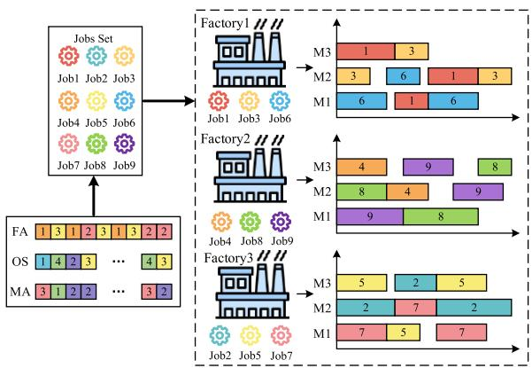  
Fig. 1. Example of DFJSP.

Objective min $C _ { m a x }$

(1)

$$
\text { s.t. } \sum_ {f \in F} A _ {i, f} = 1 \quad \forall i \in J\tag{2}
$$

$$
A _ {i, f} = \sum_ {k \in K _ {i, j, f}} X _ {i, j, f, k} \quad \forall i \in J, j \in P _ {i}, f \in F\tag{3}
$$

$$
\begin{array}{c} B _ {i, j} + \sum_ {f \in F} \sum_ {k \in M _ {i, j, f}} \left(p t _ {i, j, f, k} X _ {i, j, f, k}\right) \leq B _ {i, j + 1} \\ \forall i \in J, j \in P P _ {i} \end{array}\tag{4}
$$

$$
\begin{array}{l} B _ {i, j} + p t _ {i, j, f, k} X _ {i, j, f, k} \\ \leq B _ {i ^ {\prime}, j ^ {\prime}} + L \left(3 - Y _ {i, j, i ^ {\prime}, j ^ {\prime}} - X _ {i, j, f, k} - X _ {i ^ {\prime}, j ^ {\prime}, f, k}\right) \\ \forall i \in J, \quad i ^ {\prime} \in J, i <   i ^ {\prime}, j \in P _ {i}, j ^ {\prime} \in P _ {i ^ {\prime}} \\ f \in F, \quad k \in M _ {i, j, f} \cap M _ {i ^ {\prime}, j ^ {\prime}, f} \end{array}\tag{5}
$$

$$
\begin{array}{l} B _ {i ^ {\prime}, j ^ {\prime}} + p t _ {i ^ {\prime}, j ^ {\prime}, f, k} X _ {i ^ {\prime}, j ^ {\prime}, f, k} \\ \leq B _ {i, j} + L \left(2 + Y _ {i, j, i ^ {\prime}, j ^ {\prime}} - X _ {i, j, f, k} - X _ {i ^ {\prime}, j ^ {\prime}, f, k}\right) \\ \forall i \in J, i ^ {\prime} \in J, i <   i ^ {\prime}, j \in P _ {i}, j ^ {\prime} \in P _ {i ^ {\prime}} \\ f \in F, k \in M _ {i, j, f} \cap M _ {i ^ {\prime}, j ^ {\prime}, f} \end{array}\tag{6}
$$

$$
C _ {m a x} \geq B _ {i, n _ {i}} + \sum_ {f \in F} \sum_ {k \in M _ {i, n _ {i}, f}} \left(p t _ {i, n _ {i}, f, k} X _ {i, n _ {i}, f, k}\right)
$$

$$
\forall i \in J\tag{7}
$$

$$
B _ {i, j} \geq 0 \quad \forall i \in J, j \in P _ {i}\tag{8}
$$

where (1) indicates the objective of the DFJSP. Constraint (2) enforces mutual exclusivity in job-to-FAs, mandating that each job be allocated to exactly one factory. Constraint (3) establishes dual restrictions: first, it requires all operations within a single job to be processed within the same factory; second, it guarantees that any operation is exclusively assigned to a single machine. Constraint (4) maintains temporal precedence by ensuring sequential processing of job operations according to predefined technological sequences. Constraints (5) and (6) collectively prevent temporal overlaps between operations scheduled on one machine. The makespan is formally defined by Constraint (7). Constraint (8) imposes nonnegativity requirements on all decision variables in the MILP model.

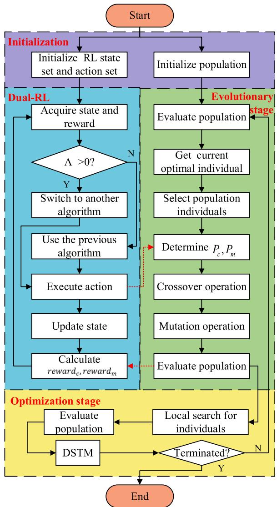  
Fig. 2. Flowchart of the HOA-DSTM.

## IV. HOA WITH DSTM

## A. Framework of the HOA-DSTM

The HOA-DSTM is proposed to address the DFJSP and minimize the makespan. The framework of the HOA-DSTM is shown in Fig. 2 (the solid black single-headed arrows represent the algorithm’s main, irreversible, and sequential flow, and the red dashed arrows depict information transfer and feedback). The overall framework starts with a hybrid partitioned initialization that generates a diverse and high-quality population while simultaneously establishing RL state–action sets. Before the iterative search, the current elite is identified. During the evolutionary stage, the individuals of the population are selected, and the population is split into two parts, executing heterogeneous crossover and mutation strategies. $P _ { c }$ and $P _ { m }$ are adjusted online by the dual-RL, which alternates between state–action–reward–state–action (SARSA) and Q-learning via a conversion factor Λ, using the reward feedback of each generation to balance exploration and exploitation and maintain genetic diversity with elite retention. In the optimization stage, seven local search operators are employed to explore the individual neighborhood. After the population is evaluated, the DSTM is used to further optimize the current optimal individual based on the coupling of the three-layer encoding. By recording candidates in two synchronized stacks and committing only coordinated OS–FA improvements, the DSTM captures coupled gains that OSonly or FA-only adjusted misses, accelerating convergence without compromising machine assignment (MA) consistency. The HOA-DSTM iterates until the termination condition is satisfied, and the algorithm outputs the optimal individual as the final scheduling solution for the problem.

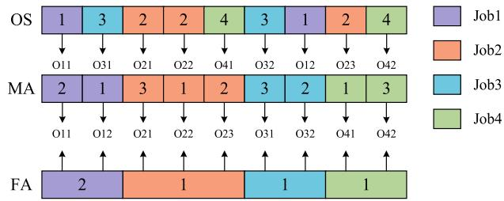  
Fig. 3. Example of the encoding scheme of the HOA-DSTM.

## B. Encoding and Decoding

Encoding and decoding establish bidirectional mappings between chromosomes and scheduling solutions. Appropriate codec schemes enhance evolutionary eficiency. The proposed chromosomal encoding scheme is composed of three layers of 1-D vectors. The first layer is the OS layer; the length of the OS is the total number of operations of all jobs, and each element represents one job. The second layer is the MA layer; the length of the MA is the same as the length of the OS, and each element represents the assigned machine index for its corresponding operation. The third layer is the FA layer. The length of the FA is the total number of jobs, and each element denotes the assigned factory for its corresponding job. An encoding three-layer scheme example is shown in Fig. 3.

The decoding content is described in the following. Each job is assigned to a corresponding factory according to the FA, operations in the factory are processed in order according to the OS, and a machine is selected for each operation based on the MA. The makespan of the scheduling scheme is calculated by the maximum end time of each job.

## C. Initialization Method

The initial population strategy influences the rate at which the population converges to high-quality solutions. The threelayer hybrid initialization method is designed to improve the quality of the population before the iteration of the HOA-DSTM. The initial population is divided into two parts. The first part uses specific methods, and the other part is randomly initialized to improve the diversity. The specific initialization methods of the FA, OS, and MA in the first part are given as follows.

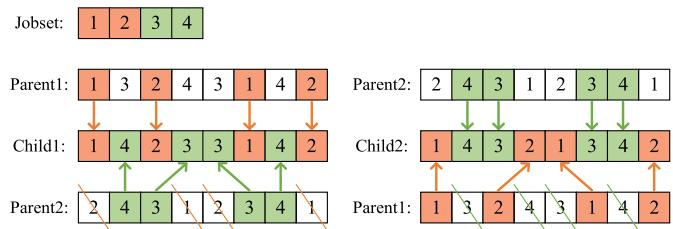

Fig. 4. Example of the POX method for OS.  
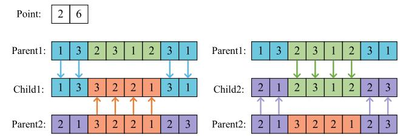  
Fig. 5. Example of the two-point crossover method for MA.

FA: Jobs are assigned according to the factory load balancing rules. Each job is assigned to the factory with the lowest load.

OS: The OS is arranged by prioritizing jobs with the highest remaining operations. The job is selected randomly if multiple jobs have the same remaining operations.

MA: Machines are selected from $M _ { f }$ by the shortest processing time rule.

## D. Crossover and Mutation

Crossover and mutation are the core operations in the evolutionary stage and play important roles in the exploration of the solution space. The crossover operator is an important part of within-population learning in the HOA-DSTM, and the mutation operator is used to further improve population diversity in each generation. In the crossover process, the population of n individuals is evenly divided into two subpopulations $\mathcal { P }$ and $\mathcal { Q } .$ . Individuals in $\mathcal { P }$ sequentially cross with the current optimal individual and the superior individual from the two individuals generated by crossover are selected as the ofspring to learn elite knowledge. Individuals in $\mathcal { Q }$ are randomly divided into two subgroups $\mathcal { Q } _ { 1 }$ and $\mathcal { Q } _ { 2 } ,$ which are crossed over to learn knowledge about the population. Diferent crossover strategies are designed for diferent layers. In the FA, a mask-based uniform crossover (UX) method is employed for mutual knowledge learning. In the OS, a priority-preserving order-based crossover (POX) method is designed to maintain individual legitimacy. In the MA, a combination of two-point crossover and UX is implemented to avoid population prematurity. Mutation is a critical strategy for maintaining population diversity. A swap operator is applied to both the FA and OS, while a random reset mutation operator is utilized for the MA. Examples of the crossover and mutation operations are presented in Figs. 4–7.

## E. Dual-RL

$P _ { c }$ and $P _ { m }$ are two important parameters in the crossover and mutation operations. Small values of $P _ { c }$ and $P _ { m }$ slow population evolution and reduce the diversity of the population [43]. Large values disrupt high-quality individuals, impairing solution convergence and optimal solution formation. Thus, determining appropriate values for $P _ { c }$ and $P _ { m }$ becomes essential in the evolutionary stage of the HOA-DSTM. Dual-RL dynamically selects the appropriate $P _ { c }$ and $P _ { m } .$ Q-learning and SARSA are utilized interchangeably to balance exploration and exploitation performance in the evolutionary stage.

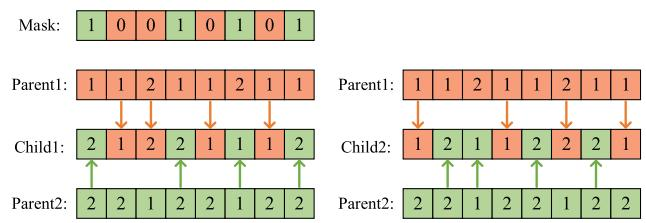  
Fig. 6. Example of the mask-based UX method for FA.

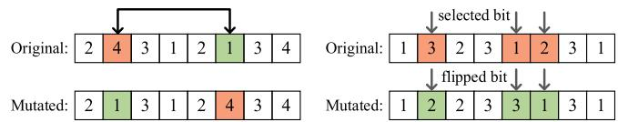  
Fig. 7. Example of mutation.

Q-learning is an of-policy temporal diference (TD) algorithm that derives optimal control strategies by iteratively optimizing the Q-values independent of environmental dynamics. Q-learning uses a Q-table to estimate state–action values, where the agent selects actions, receives rewards and next states, and iteratively refines Q-values via the Bellman optimality principle. The SARSA algorithm is an on-policy TD algorithm. It calculates the expected cumulative reward for a given state–action pair $Q ( s , a )$ by leveraging TD updates that balance immediate rewards with future projections. The update mechanism of SARSA incorporates the actual execution characteristics of the current behavioral policy rather than relying exclusively on optimal action–value estimation.

Dual-RL combines the complementary strengths of both algorithms during the learning process. Q-learning is exploratory in that it selects the optimal action when the value of an action is estimated, whereas SARSA considers the actual action performed under the current policy. This combination enables the algorithm to flexibly adjust its strategy in the face of diferent environments and tasks. The Q value update functions of SARSA and Q-learning are shown as follows, respectively,

$$
Q \left(s _ {t}, a _ {t}\right) \leftarrow (1 - \alpha) Q \left(s _ {t}, a _ {t}\right) + \alpha \left(r _ {t + 1} + \gamma Q \left(s _ {t + 1}, a _ {t + 1}\right)\right)\tag{9}
$$

$$
\begin{array}{l} Q \left(s _ {t}, a _ {t}\right) \leftarrow (1 - \alpha) Q \left(s _ {t}, a _ {t}\right) \\ \qquad + \alpha \left(r _ {t + 1} + \gamma \max _ {a} Q \left(s _ {t + 1}, a _ {t + 1}\right)\right). \end{array}\tag{10}
$$

The dual-RL mechanism in the HOA-DSTM employs SARSA at the beginning of each iteration, where the recorded Q value estimates establish the foundation for subsequent learning. A conversion factor Λ is designed to determine whether the RL algorithms switch. If $\Lambda > 0$ , the other algorithm provides a better reward than the current algorithm does. In each iteration, both RL algorithms are used to calculate rewards, and the current algorithm is used to update the Q value. The agent determines which RL algorithm will be used in the next iteration on the basis of the conversion factor. The calculation of Λ is given as follows:

$$
\Lambda = e _ {r e w a r d} - a _ {r e w a r d}\tag{11}
$$

where $a _ { r e w a r d }$ represents the reward value of the actual employed algorithm and $e _ { r e w a r d }$ represents the reward value of the other algorithm.

Λ is initially set to 0. For example, SARSA is selected in the tth iteration, but $\Lambda > 0 ,$ which indicates that using Q-learning in this iteration would have yielded better results. Therefore, Q-learning is chosen in the (t + 1)th iteration. The conversion is equivalent to the population switching from exploitation to exploration. An example of RL switch is shown in Fig. 8.

Dual-RL enables the dynamic and intelligent adjustment of $P _ { c }$ and $P _ { m }$ throughout the iterative process, thereby improving the evolutionary eficiency. The Markov decision process (MDP) for dual-RL is defined as follows.

State: The state indicates the population information in dual-RL. The maximum makespan obtained by a solution is considered the fitness of the individual. The state construction is formulated on the basis of evolutionary population fitness characteristics, including the average fitness of the population $f _ { n o r } ,$ population diversity $d _ { n o r }$ , and the fitness of the best individual $m _ { n o r }$

$$
f _ {n o r} = \frac {\sum_ {i = 1} ^ {N} f (x _ {i} ^ {t})}{\sum_ {i = 1} ^ {N} f (x _ {i} ^ {1})}\tag{12}
$$

$$
d _ {n o r} = \frac {\sum_ {i = 1} ^ {N} \left| f \left(x _ {i} ^ {t}\right) - \frac {\sum_ {k = 1} ^ {N} f \left(x _ {k} ^ {t}\right)}{N} \right|}{\sum_ {j = 1} ^ {N} \left| f \left(x _ {j} ^ {1}\right) - \frac {\sum_ {k = 1} ^ {N} f \left(x _ {k} ^ {1}\right)}{N} \right|}\tag{13}
$$

$$
m _ {n o r} = \frac {\max f (x _ {i} ^ {t})}{\max f (x _ {i} ^ {1})}\tag{14}
$$

$$
S _ {p o p} = w _ {1} f _ {n o r} + w _ {2} d _ {n o r} + w _ {3} m _ {n o r}\tag{15}
$$

where (15) defines the population state value as a weighted composite of (12)–(14). f(xt) represents the fitness of the ith individual of the tth generation, $f ( x _ { i } ^ { 1 } )$ represents the fitness of the ith individual of the initial generation, and max $f ( x _ { i } ^ { t } )$ represents the fitness of the optimal individual of the tth generation [44]. $w _ { 1 } , w _ { 2 } .$ and $w _ { 3 }$ are the weight values such that $w _ { 1 } + w _ { 2 } + w _ { 3 } = 1$ , which quantifies the relative significance of these three components. In the HOA-DSTM, w1, w2, and w3 are set as 0.35, 0.35, and $0 . 3 ,$ respectively [44]. The values of $w _ { 1 }$ and w are relatively designed to be larger than the value of $w _ { 3 }$ to control the crossover between inferior individuals to obtain diferent individuals.

Excessive states require large exploration resources, and insuficient states conversely afect the quality of the solution; the state set is divided into 20 states for $\begin{array} { r l } { S } & { { } = } \end{array}$ $[ s ( 1 ) , s ( 2 ) , \ldots , s ( 1 9 ) , s ( 2 0 ) ]$ , where the interval value of S is set as 0.05 [45]. For example, $S _ { p o p } \in [ 0 , 0 . 0 5 ) , s = s ( 1 ) , S _ { p o p } \in$ [0 05 0 10], and $s = s ( 2 )$

Action: The adaptation of $P _ { c }$ and $P _ { m }$ constitutes the agent action execution. The agent adopts diferent actions to obtain appropriate $P _ { c }$ and $P _ { m } ,$ , which includes ten actions in the action set. For $P _ { c }$ , the range of values is from 0.4 to 1, and the interval between each action is 0.06. After selecting the action, the agent randomly generates a value from the interval of the $P _ { c }$ set as the real $P _ { c } .$ . The same method is designed for $P _ { m } ;$ the range of values is from 0.01 to 0.3 [46], and the interval is 0.03. The ε-greedy strategy is used to select the appropriate action in dual-RL that balances both exploration and exploitation [47], which is described as follows:

$$
\pi \left(s _ {t}, a _ {t}\right) = \left\{ \begin{array}{l l} \max _ {a} Q \left(s _ {t}, a\right), & \varepsilon \geq r \\ a \left(\text {Randomly}\right), & \varepsilon <   r \end{array} \right.\tag{16}
$$

where ε represents the greedy rate and r is a random value between 0 and 1.

Reward: The reward is a scalar signal that the environment feeds back to the agent, which is used to measure the feedback obtained after the agent takes an action under the state to guide the subsequent learning. The reward is designed according to the best fitness of the individual and the average fitness of the population. The calculation of rewards is given as follows:

$$
\operatorname{reward} _ {c} = \frac {\max f \left(x _ {i} ^ {t}\right) - \max f \left(x _ {i} ^ {t - 1}\right)}{\max f \left(x _ {i} ^ {t - 1}\right)}\tag{17}
$$

$$
\operatorname{reward} _ {m} = \frac {\sum_ {i = 1} ^ {N} f \left(x _ {i} ^ {t}\right) - \sum_ {i = 1} ^ {N} f \left(x _ {i} ^ {t - 1}\right)}{\sum_ {i = 1} ^ {N} f \left(x _ {i} ^ {t - 1}\right)}\tag{18}
$$

$$
\operatorname{reward} _ {i} = \frac {\operatorname{reward} _ {c} + \operatorname{reward} _ {m}}{2}\tag{19}
$$

where reward represents the reward value of the adjusted $P _ { c }$ and ${ \mathrm { r e w a r d } } _ { m }$ represents the reward value of the adjusted $P _ { m } .$ The calculation of the reward in each iteration is shown in (19).

## F. Local Search

Several specialized operators (LS1–LS7) have been developed to enhance local search eficiency in the DFJSP. The individual randomly chooses one operator in the local search.

LS1: The OS is equally divided into m subsequences. Within each subsequence, the first process is called the head process, and the remaining processes are called member processes. Each subsequence is traversed, and member processes are exchanged with the head process one by one, sequentially generating the neighborhoods for evaluation. For example, an OS comprising nine operations is evenly divided into three subsequences, and each subsequence contains three operations; then, LS1 generates a total of six neighborhoods. This example is shown in Fig. 9

LS2: The OS is divided into m subsequences, and each subsequence is then sequentially removed and reinserted into every possible position within the remaining subsequence. For example, an OS comprising nine operations is evenly divided into three subsequences, each subsequence containing three operations, and there are exactly three possible insertion positions for any given subsequence, resulting in a comprehensive exploration of the neighborhood.

LS3: In the OS of length n, a position is randomly selected, which is swapped with each of the other n − 1 positions in the sequence.

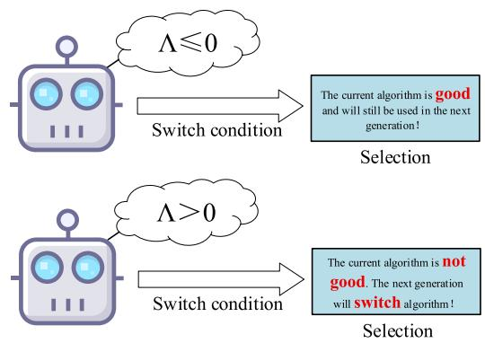

Fig. 8. Example of RL switch.  
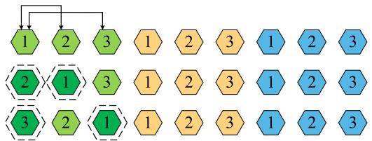  
Fig. 9. LS1 neighborhood search strategy.

LS4: In the OS, a position is randomly selected to find n−1 possible insertion positions, and the selected elements are sequentially inserted to generate a new neighborhood solution.

LS5: Two critical operations in the critical factory are selected, and their positions are swapped.

LS6: To balance workload, a job is arbitrarily selected from the critical factory and reassigned to another available facility.

LS7: A critical operation in the critical factory is randomly selected and moved to another available machine.

## G. Dual-Cache Synced Tuning Mechanism

The three-layer encodings adopted is treated as three independent subproblems. Each part of the individual information evolves independently during the optimization stage without mutual interference. This decoupling strategy reduces the search space complexity by separating diferent dimensions of the complex problem, enabling the algorithm to explore optimal configurations for each subproblem eficiently. Although each part is optimized independently, the three parts are integrated during the decoding stage to generate complete individual information and produce a scheduling solution. The independence of the subproblems does not preclude the global consistency of the final solution, which reflects the collaborative synergy inherent in the decoupling framework.

In the optimization stage, local search operations on the OS sequence sometimes fail to improve the overall fitness of the individual, leading to the common practice of skipping such neighboring individuals and evaluating others. Although the OS sequence of an individual is suboptimal, a situation in which simultaneously adjusting the FA sequence yields a neighborhood individual who is superior in fitness to the original individual still exists. An example of the above situation is shown in Fig. 10. Thus, retaining certain candidate solutions necessitates dynamically synchronizing adjustments to both the OS and FA. By dynamically coordinating the OS and FA adjustments, the algorithm balances local optimization with global coordination. The synchronized optimization of the OS and FA reflects interactive refinement within the decoupled framework. This approach allows for the algorithm to explore more eficient combinations in the solution space while preserving the independence of the MA, thereby avoiding premature convergence to local traps.

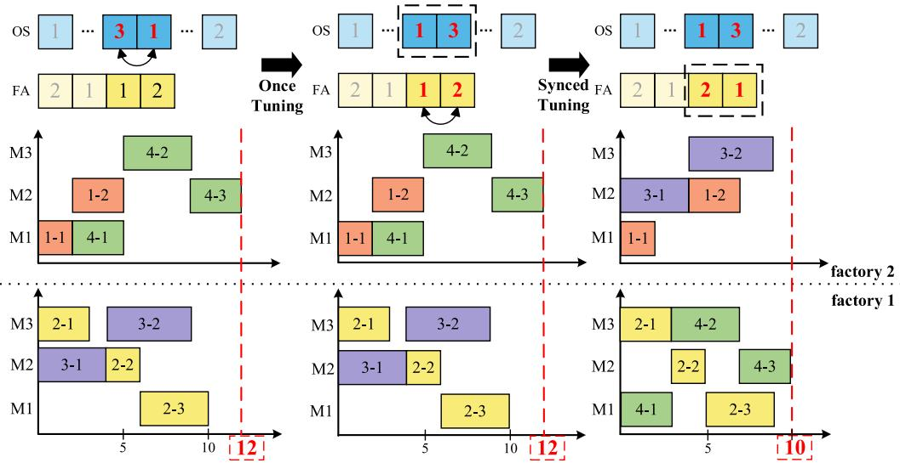

Fig. 10. Simple example of coupling between the OS and FA.  
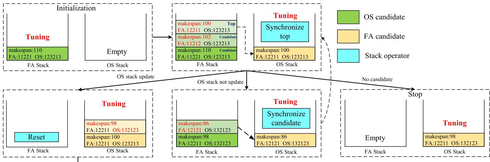  
Fig. 11. Simple example of the DSTM.

The DSTM is designed to fine-tune the distribution relationship between the FA and OS in the DFJSP, which uses two candidate solution recording stacks to record the candidate solution set in the fine-tuning process. When a new solution is found, the tuning process is repeated. When no new solution is found, the candidate solution is searched and tuned. The specific process of the DSTM is shown in Algorithm 1 and Fig. 11.

## V. EXPERIMENTAL RESULTS AND ANALYSIS

The efectiveness and performance of the HOA-DSTM in addressing the DFJSP were evaluated through a comprehensive set of experiments. All the experiments were implemented using Python 3.11 within PyCharm 2024.1. The computer was an Intel1 $\mathrm { C o r e } ^ { 2 }$ i7-14650HX. The relative percentage deviation (RPD) and the average RPD (ARPD) were employed to evaluate the experimental results. The calculation formulas are provided in the following:

$$
\mathrm{RPD} = \frac {\mathrm{Alg} _ {s o l} - \mathrm{Best} _ {s o l}}{\mathrm{Best} _ {s o l}} \times 100 \%\tag{20}
$$

where $\mathbf { A l g } _ { s o l }$ is the solution obtained by the current algorithm and $\mathtt { B e s t } _ { s o l }$ is the best solution among all the compared algorithms

$$
\mathrm{ARPD} = \frac {1}{N} \sum_ {i = 1} ^ {N} \mathrm{RPD} _ {i}\tag{21}
$$

where N represents the number of times all the algorithms are executed on a single instance.

The specific details of the experiments are presented as follows. The experiment utilized instances from the Mk, Mt,

Algorithm 1 DSTM
Input: b: best individual
Output: b': new individual after fine-tuning
    1.  $S_{FA} = []$ .
    2.  $S_{OS} = []$ .
    3.  $Push(S_{OS}, b)$ .
    4.  initflag = 1.
    5.  FTflag = 0.
    6. while  $Size(S_{FA}) + Size(S_{OS}) &gt; 1$  or initflag == 1 do
    7. \\ update FA or OS
    8. if FTflag
    9.  $S_{1} = S_{FA}, S_{2} = S_{OS}$ .
    10. else
    11.  $S_{1} = S_{OS}, S_{2} = S_{FA}$ .
    12. end if
    13. FTflag = !FTflag.
    14. tb = Pop( $S_{2}$ ).
    15. Push( $S_{1}, tb$ ).
    16. Finish = 1.
    17. while Finish do
    18. x ← random choice an index.
    19. v ← b[x].
    20. for i = 1 to len(b) do
    21. b' ← delete b[x] and insert v into b[i].
    22. if  $C_{max}(b') \leq C_{max}(b)$  then
    23. Push( $S_{1}, b'$ ).
    24. b = b'.
    25. Clear( $S_{2}$ ).
    26. end if
    27. end for
    28. if IsEmpty( $S_{2}$ ) then
    29. Finish = 0.
    30. else
    31. Clear( $S_{1}$ ).
    32. tb = Pop( $S_{2}$ ).
    33. Push( $S_{1}, tb$ ).
    34. end if
    35. end while
    36. initflag = 0.
    37. end while
    38. return b'

La, and Orb benchmark datasets [48]. Each experimental instance was independently executed 20 times, with cputime = $n * m * f$ as the stopping criterion. To avoid situations in which the memory exceeds the upper limit during the execution of the algorithm, the stack depth limit was set as follows: $\mathrm { S i z e } ( S _ { F A } ) + \mathrm { S i z e } ( S _ { O S } ) \leq 1 0 0 0$

## A. Parameter Setting

The HOA-DSTM incorporates certain critical parameters, including the population size, greedy rate, and discount rate. The appropriate values for these parameters are determined by testing various values for each parameter. In general, the value of one parameter is varied, while the values of the remaining parameters are held constant. If a diferent value for a fixed parameter yields improved results, the new value is adopted, and the experiments are repeated accordingly. The parameters were set at diferent levels, where $P S \in \{ 2 0 , 4 0 , 6 0 , 8 0 \} , \varepsilon \in$ {0 85 0 90 0 95}, and $\gamma \in \{ 0 . 1 , 0 . 2 , 0 . 3 \}$ . The main efect plots for all the parameters are shown in Fig. 12. On the basis of the three curves, the optimal parameter configuration was $P S = 4 0 , \varepsilon = 0 . 9 0 ,$ , and $\gamma = 0 . 3$

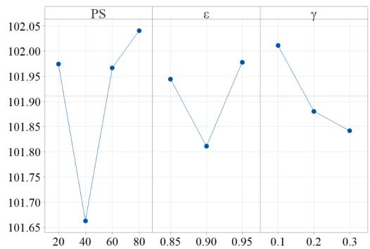  
Fig. 12. Main efect plot of the HOA-DSTM.

## B. Ablation Experiments

The efectiveness of each proposed strategy was evaluated via ablation experiments, which involved selectively disabling, substituting, or simplifying the strategy and then reevaluating the model under identical settings. Seven variants of algorithms were compared: 1) HOA-DSTM represents the version of Q-learning or SARSA that was randomly selected when the RL algorithm was used; 2) HOA-DSTM represents the version of Q-learning selected for the first half of the HOA-DSTM, and SARSA was selected for the second half when the RL algorithm was used; 3) HOA-DSTM represents the version of SARSA that was selected for the first half of the HOA-DSTM, and Q-learning was selected for the second half when the RL algorithm was used; 4) HOA-DSTM represents the version of Q-learning selected for each iteration of the HOA-DSTM; 5) HOA-DSTM5 represents the version of SARSA selected for each iteration of the HOA-DSTM; 6) HOA-DSTM6 denotes the version without local search operators; and 7) the HOA denotes the version without the DSTM.

As shown in Fig. 13, the ablation experiments were divided into two main groups: one focused on the impact of diferent RL strategies, and the other focused on the efect of structural components, namely, the DSTM and local search.

In the first group, the performance of various RL approaches was analyzed carefully. The results indicate that combining Q-learning and SARSA in diferent phases (HOA-DSTM2 and HOA-DSTM3) outperformed both individual strategies, namely, pure Q-learning (HOA-DSTM4) and pure SARSA (HOA-DSTM5). The mixed Q-learning/SARSA variants exhibited lower ARPD values, suggesting a more robust learning process and better optimization of the solution. Moreover, the results demonstrate that a random selection between Q-learning and SARSA (HOA-DSTM1) still performed relatively well, but it did not reach the level of the hybrid approach. In the second group, the contributions of structural elements—the DSTM and local search—were evaluated.

TABLE I  
EFFECTIVENESS ANALYSIS RESULTS

<table><tr><td rowspan="2">n</td><td rowspan="2">f</td><td colspan="2">MIN</td><td colspan="2">MAX</td><td colspan="2">AVE</td><td colspan="2">STD</td></tr><tr><td>HOA-DSTM</td><td>HOA</td><td>HOA-DSTM</td><td>HOA</td><td>HOA-DSTM</td><td>HOA</td><td>HOA-DSTM</td><td>HOA</td></tr><tr><td rowspan="3">6</td><td>2</td><td>0.0000</td><td>0.0000</td><td>0.0000</td><td>0.0000</td><td>0.0000</td><td>0.0000</td><td>0.0000</td><td>0.0000</td></tr><tr><td>3</td><td>0.0000</td><td>0.0000</td><td>0.0000</td><td>0.0000</td><td>0.0000</td><td>0.0000</td><td>0.0000</td><td>0.0000</td></tr><tr><td>4</td><td>0.0000</td><td>0.0000</td><td>0.0000</td><td>0.0000</td><td>0.0000</td><td>0.0000</td><td>0.0000</td><td>0.0000</td></tr><tr><td rowspan="3">10</td><td>2</td><td>0.0000</td><td>0.0000</td><td>0.0469</td><td>0.0563</td><td>0.0118</td><td>0.0153</td><td>0.0108</td><td>0.0135</td></tr><tr><td>3</td><td>0.0000</td><td>0.0000</td><td>0.0362</td><td>0.1250</td><td>0.0043</td><td>0.0177</td><td>0.0078</td><td>0.0274</td></tr><tr><td>4</td><td>0.0000</td><td>0.0000</td><td>0.0333</td><td>0.0670</td><td>0.0028</td><td>0.0079</td><td>0.0071</td><td>0.0146</td></tr><tr><td rowspan="3">15</td><td>2</td><td>0.0000</td><td>0.0012</td><td>0.0273</td><td>0.0659</td><td>0.0106</td><td>0.0271</td><td>0.0105</td><td>0.0197</td></tr><tr><td>3</td><td>0.0013</td><td>0.0031</td><td>0.0171</td><td>0.0930</td><td>0.0077</td><td>0.0294</td><td>0.0048</td><td>0.0289</td></tr><tr><td>4</td><td>0.0000</td><td>0.0000</td><td>0.0279</td><td>0.0600</td><td>0.0084</td><td>0.0243</td><td>0.0099</td><td>0.0230</td></tr><tr><td rowspan="3">20</td><td>2</td><td>0.0000</td><td>0.0172</td><td>0.0043</td><td>0.0704</td><td>0.0014</td><td>0.0352</td><td>0.0018</td><td>0.0185</td></tr><tr><td>3</td><td>0.0000</td><td>0.0067</td><td>0.0089</td><td>0.0799</td><td>0.0032</td><td>0.0326</td><td>0.0028</td><td>0.0193</td></tr><tr><td>4</td><td>0.0000</td><td>0.0066</td><td>0.0188</td><td>0.0463</td><td>0.0056</td><td>0.0257</td><td>0.0061</td><td>0.0151</td></tr></table>

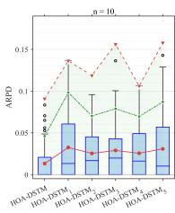

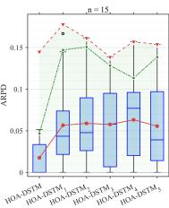

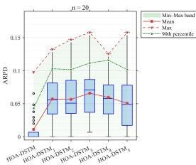

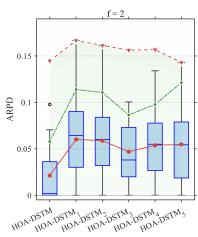

(a)  
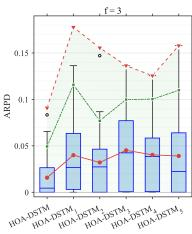

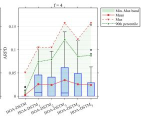

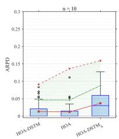

(b)  
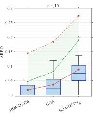

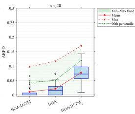  
(c)

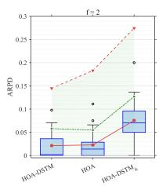

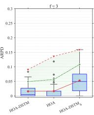  
(d)

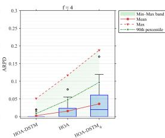  
Fig. 13. (a) Box plots of the ablation experiment results with RL (diferent n’s). (b) Box plots of the ablation experiment results with RL (diferent $f ^ { * } { \mathbf { s } } ) .$ (c) Box plots of the ablation experiment results with HOA-DSTM structural elements (diferent n’s). (d) Box plots of the ablation experiment results with HOA-DSTM structural elements (diferent f’s).

Removing the local search (HOA-DSTM6) led to a noticeable deterioration in performance, with a significant increase in the

ARPD, as well as wider variability (broader boxes and longer whiskers in the plots). Similarly, removing the DSTM entirely (HOA) resulted in a less drastic, but still significant, increase in the ARPD, showing that the DSTM plays a vital role in maintaining robustness, especially as problem complexity increases [e.g., higher values of (n) and (r)].

Moreover, as shown in Table I. The ARPD values of the HOA-DSTM were generally lower than those of the HOA, demonstrating the efectiveness of the DSTM. Table I reveals that when $n = 6 ,$ all the values were zero, indicating that there was no diference in performance between the HOA-DSTM and HOA in small-scale scenarios. Nevertheless, significant divergences emerged with increasing job numbers. The HOA-DSTM had clear advantages in terms of both the MAX and the AVE metrics, indicating the critical role of the DSTM mechanism in optimization processes, particularly for largescale problems.

Overall, the findings highlight that our proposed RL strategy, which combines Q-learning and SARSA, leads to superior performance. In addition, both the DSTM and local search proved to be essential components in improving the algorithm’s stability and robustness, further confirming their value in enhancing the quality of solutions.

## C. Comparison to Other Algorithms

In this section, several state-of-the-art algorithms, including IAHA, GA-VNS-CP, and HGTSA, were selected as benchmark methods to evaluate the performance of the HOA-DSTM in solving the DFJSP [21], [49], [50]. The IAHA introduces a hybrid decoding strategy that employs a dual-layer encoding scheme for simultaneous factory-job representation while adaptively integrating variable neighborhood search mechanisms during local optimization. The GA-VNS-CP method is executed in two consecutive phases, combining the GA with a variable neighborhood search in the hybrid metaheuristic phase for local search enhancement and continuing with a CP phase that expands and refines the solutions. The HGTSA combines the comprehensive exploration capacity of the GA with the intensive exploitation potential of TS, including two customized genetic operators to increase population heterogeneity. A new neighborhood framework is proposed to seek optimal solutions across a broader exploration domain.

TABLE II  
RESULTS OF THE WILCOXON TEST

<table><tr><td>HOA-DSTM</td><td>f</td><td> $R^+$ </td><td> $R^-$ </td><td>+</td><td>-</td><td>=</td><td>Z</td><td>p-value</td><td>α = 0.05</td><td>α = 0.1</td></tr><tr><td rowspan="3">IAHA</td><td>2</td><td>911</td><td>35</td><td>42</td><td>0</td><td>1</td><td>-5.2888</td><td>1.231e-07</td><td>yes</td><td>yes</td></tr><tr><td>3</td><td>903</td><td>0</td><td>42</td><td>0</td><td>1</td><td>-5.6454</td><td>1.648e-08</td><td>yes</td><td>yes</td></tr><tr><td>4</td><td>860</td><td>1</td><td>40</td><td>1</td><td>2</td><td>-5.5656</td><td>2.6123e-08</td><td>yes</td><td>yes</td></tr><tr><td rowspan="3">HGTSA</td><td>2</td><td>910</td><td>36</td><td>42</td><td>0</td><td>1</td><td>-5.2768</td><td>1.3149e-07</td><td>yes</td><td>yes</td></tr><tr><td>3</td><td>901</td><td>2</td><td>41</td><td>1</td><td>1</td><td>-5.6204</td><td>1.9052e-08</td><td>yes</td><td>yes</td></tr><tr><td>4</td><td>902</td><td>1</td><td>41</td><td>1</td><td>1</td><td>-5.6329</td><td>1.772e-08</td><td>yes</td><td>yes</td></tr><tr><td rowspan="3">GA-VNS-CP</td><td>2</td><td>784</td><td>119</td><td>32</td><td>1</td><td>10</td><td>-4.1575</td><td>3.2179e-05</td><td>yes</td><td>yes</td></tr><tr><td>3</td><td>716</td><td>64</td><td>31</td><td>8</td><td>4</td><td>-4.5493</td><td>5.3817e-06</td><td>yes</td><td>yes</td></tr><tr><td>4</td><td>741</td><td>39</td><td>34</td><td>5</td><td>4</td><td>-4.8982</td><td>9.6716e-07</td><td>yes</td><td>yes</td></tr></table>

TABLE III

ARPD VALUES IN THE COMPARISON ALGORITHMS

<table><tr><td>n</td><td>f</td><td>HOA-DSTM</td><td>IAHA</td><td>HGTSA</td><td>GA-VNS-CP</td></tr><tr><td rowspan="3">6</td><td>2</td><td>0.0000</td><td>0.0142</td><td>0.0248</td><td>0.0000</td></tr><tr><td>3</td><td>0.0000</td><td>0.0000</td><td>0.0000</td><td>0.0000</td></tr><tr><td>4</td><td>0.0000</td><td>0.0000</td><td>0.0000</td><td>0.0000</td></tr><tr><td rowspan="3">10</td><td>2</td><td>0.0093</td><td>0.1701</td><td>0.1608</td><td>0.0803</td></tr><tr><td>3</td><td>0.0051</td><td>0.1430</td><td>0.1500</td><td>0.0765</td></tr><tr><td>4</td><td>0.0023</td><td>0.1322</td><td>0.1268</td><td>0.0766</td></tr><tr><td rowspan="3">15</td><td>2</td><td>0.0415</td><td>0.1564</td><td>0.1459</td><td>0.0717</td></tr><tr><td>3</td><td>0.0138</td><td>0.2021</td><td>0.1994</td><td>0.0999</td></tr><tr><td>4</td><td>0.0114</td><td>0.1953</td><td>0.2124</td><td>0.1072</td></tr><tr><td rowspan="3">20</td><td>2</td><td>0.0051</td><td>0.2142</td><td>0.2021</td><td>0.1337</td></tr><tr><td>3</td><td>0.0015</td><td>0.2418</td><td>0.2381</td><td>0.1452</td></tr><tr><td>4</td><td>0.0051</td><td>0.2715</td><td>0.2753</td><td>0.1663</td></tr></table>

TABLE IV  
RESULTS OF THE FRIEDMAN TEST

<table><tr><td>f</td><td>IAHA</td><td>HGTSA</td><td>GA-VNS-CP</td><td>HOA-DSTM</td></tr><tr><td>2</td><td>3.56</td><td>3.37</td><td>1.78</td><td>1.29</td></tr><tr><td>3</td><td>3.50</td><td>3.43</td><td>1.79</td><td>1.28</td></tr><tr><td>4</td><td>3.45</td><td>3.41</td><td>1.90</td><td>1.24</td></tr><tr><td>CD. $\alpha = 0.05$ </td><td>0.4130</td><td>0.4130</td><td>0.4130</td><td>0.4130</td></tr><tr><td>CD. $\alpha = 0.1$ </td><td>0.3683</td><td>0.3683</td><td>0.3683</td><td>0.3683</td></tr></table>

The parameter configuration of the comparison algorithms was based on the conclusions in this article. The performance of all the algorithms was assessed through the ARPD evaluation criterion. The comprehensive experimental results are presented in Tables II–IV and Fig. 14. As shown in Fig. 14, the outliers of the HOA-DSTM were smaller and more compact than those of the comparison algorithms under diferent numbers of jobs and diferent numbers of factories. This finding indicates that the HOA-DSTM fluctuates less and is more stable under diferent conditions.

As shown in Table III, the HOA-DSTM consistently achieved the best performance across all the tested scales, demonstrating significantly higher numerical stability than the other comparison algorithms did.

The Wilcoxon test is a nonparametric statistical method used to compare median diferences between two related or independent groups and evaluate the significance of distributional diferences through rank-based analysis. The Wilcoxon test was used to validate algorithmic eficacy, with the statistical findings detailed in Table II. In the Wilcoxon test results, “R+” indicates that the rank sum of the HOA-DSTM is better than that of the comparison algorithm, and $\mathbf { \ddot { \Delta } } ^ { 6 } \mathbf { R } ^ { - \mathbf { \curlyeq \ } }$ indicates the opposite outcome. “+” indicates the number of instances where the HOA-DSTM outperformed the comparison algorithm, and “−” indicates the opposite outcome. In Table II, “yes” is denoted when the P-value is less than α, indicating a significant diference at the (1 − α)% confidence level between HOA-DSTM and the comparison algorithms.

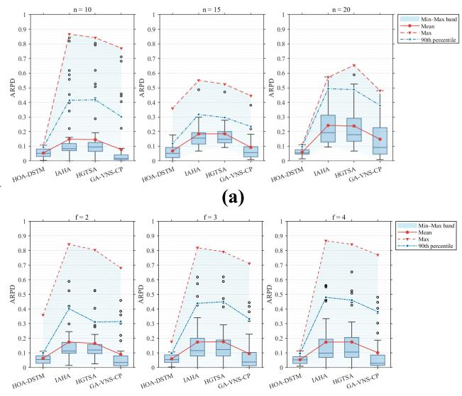  
(b)  
Fig. 14. (a) Box plots of the four algorithms for diferent jobs. (b) Box plots of the four algorithms for diferent factories.

The experimental results show that all the algorithms exhibited statistically significant p-value (<0 05) diferences across the diferent parameters. The IAHA and HGTSA demonstrated substantially higher positive rank sums $( \mathbb { R } ^ { + } )$ than negative rank sums (R−), with absolute Z values exceeding 5, suggesting that the HOA-DSTM significantly outperformed the IAHA and HGTSA. In contrast, GA-VNS-CP resulted in lower “R+” values and a smaller Z. When the parameter f was increased to 4, $\mathbf { \^ { 6 6 } R ^ { + 5 3 } }$ improved slightly, but the HOA-DSTM remained superior to GA-VNS-CP.

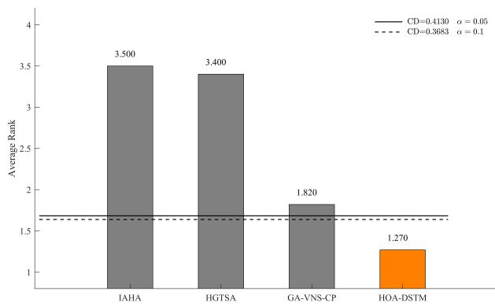  
Fig. 15. Results of the Friedman test.

The homogeneity of the various algorithms was verified by the Friedman test. In the Friedman test, post-hoc tests are used to distinguish the diferences between algorithms, and the critical diference (CD) is calculated using the following equation:

$$
\mathrm{CD} = q _ {\alpha} \sqrt {\frac {k (k + 1)}{6 N}}\tag{22}
$$

where k is the number of algorithms, N is the number of instances, and $q _ { \alpha }$ is the critical value obtained from the table.

The solid and dashed lines indicate the CD boundaries between the HOA-DSTM and the other algorithms at the 95% and 90% confidence levels, respectively. The data in Fig. 15 and Table IV show that compared with the other algorithms, the HOA-DSTM had the smallest average rank and significantly difered at both $\alpha ~ = ~ 0 . 0 5$ and $\alpha = 0 . 1$

## VI. CONCLUSION AND FUTURE WORK

The HOA-DSTM was proposed to address the DFJSP in this article. In the evolutionary stage, the solution space was explored by employing an elite retention strategy and a dual-RL mechanism. The elite retention strategy based on population division was designed to retain the information of high-quality individuals in the population. The dual-RL mechanism was applied to dynamically regulate $P _ { c }$ and $P _ { m }$ within evolutionary operators, ensuring a balance between exploration and exploitation. This strategy mitigates the risk of premature convergence, improving the diversity of the search.

In the optimization stage, the current optimal solution was fine-tuned using the DSTM. The OS and FA were jointly optimized by the DSTM, leveraging the coupling characteristic of the DFJSP encoding scheme, ensuring synchronized improvements and accelerating the convergence velocity.

This dual-cache mechanism enables the HOA-DSTM to efectively exploit the synergy between diferent decision variables, leading to high-quality scheduling solutions.

The performance of the HOA-DSTM was verified under diferent conditions using 43 well-known benchmark instances. The experimental results show that the HOA-DSTM is superior to the three latest algorithms in terms of the solution quality and computational eficiency.

Possible future research directions include: 1) extending the DFJSP model to encompass heterogeneous factory environments characterized by nonidentical and complementary machine configurations, which demand more adaptive task allocation mechanisms; 2) incorporating multiobjective optimization frameworks that simultaneously optimize performance metrics such as energy consumption, machine utilization, and due date satisfaction, necessitating eficient Pareto-based solution approaches; and 3) investigating knowledge-enhanced RL mechanisms that integrate domain priors and transfer learning to improve generalizability across diverse combinatorial optimization problems.

## REFERENCES

[1] F. Zhang, Y. Mei, S. Nguyen, and M. Zhang, “Survey on genetic programming and machine learning techniques for heuristic design in job shop scheduling,” IEEE Trans. Evol. Comput., vol. 28, no. 1, pp. 147–167, Feb. 2024.

[2] G.-G. Wang, D. Gao, and W. Pedrycz, “Solving multiobjective fuzzy job-shop scheduling problem by a hybrid adaptive diferential evolution algorithm,” IEEE Trans. Ind. Informat., vol. 18, no. 12, pp. 8519–8528, Dec. 2022.

[3] R. Li, L. Wang, H. Sang, and L. Yao, “Knowledge-guided multiview hierarchical evolutionary algorithm for flexible job shop scheduling with finite skilled workers,” IEEE Trans. Syst., Man, Cybern., Syst., vol. 55, no. 10, pp. 7259–7272, Oct. 2025.

[4] J. Huang, X. Li, Q. Liu, and L. Gao, “Eficient scheduling for fixed-type multi-robot collaborative problem in flexible job shop,” Robot. Comput.- Integr. Manuf., vol. 98, Apr. 2026, Art. no. 103157.

[5] Z. Shao, W. Shao, J. Chen, and D. Pi, “MQL-MM: A meta-Q-learningbased multiobjective metaheuristic for energy-eficient distributed fuzzy hybrid blocking flow-shop scheduling problem,” IEEE Trans. Evol. Comput., vol. 29, no. 4, pp. 1183–1198, Aug. 2025.

[6] L. Deng, Y. Di, and L. Wang, “A reinforcement-learning-based 3-D estimation of distribution algorithm for fuzzy distributed hybrid flowshop scheduling considering on-time-delivery,” IEEE Trans. Cybern., vol. 54, no. 2, pp. 1024–1036, Feb. 2024.

[7] R. Li, W. Gong, L. Wang, C. Lu, and C. Dong, “Co-evolution with deep reinforcement learning for energy-aware distributed heterogeneous flexible job shop scheduling,” IEEE Trans. Syst., Man, Cybern., Syst., vol. 54, no. 1, pp. 201–211, Jan. 2024.

[8] F. Zhao, H. Zhou, L. Wang, and Y. Yu, “A feature-based learning diferential evolution algorithm for the flexible job-shop scheduling with occupational repetitive actions index,” IEEE Trans. Cybern., vol. 55, no. 7, pp. 3457–3470, Jul. 2025.

[9] Y. Wang, H. Jin, G.-G. Wang, and L. Wang, “A bi-population cooperative discrete diferential evolution for multiobjective energyeficient distributed blocking flow shop scheduling problem,” IEEE Trans. Syst., Man, Cybern., Syst., vol. 55, no. 3, pp. 2211–2223, Mar. 2025.

[10] Z. Pan, L. Wang, J. Wang, and Q. Zhang, “A bi-learning evolutionary algorithm for transportation-constrained and distributed energy-eficient flexible scheduling,” IEEE Trans. Evol. Comput., vol. 29, no. 1, pp. 232–246, Feb. 2025.

[11] H. Bao, Q. Pan, C.-M. Chew, L. Wang, and L. Gao, “Energyeficient distributed heterogeneous hybrid flow-shop scheduling using graph neural network and deep reinforcement learning,” IEEE Trans. Autom. Sci. Eng., early access, Jul. 23, 2025, doi: 10.1109/TASE.2025. 3591984.

[12] Z. Cao, C. Lin, M. Zhou, and X. Wen, “Learning-based genetic algorithm to schedule an extended flexible job shop,” IEEE Trans. Cybern., vol. 54, no. 11, pp. 6909–6920, Nov. 2024.

[13] H. Bao, Q. Pan, C.-M. Chew, L. Wang, and L. Gao, “An end-toend framework for energy-eficient cascaded dual-shop collaborative scheduling with mating operations,” IEEE Trans. Cybern., vol. 55, no. 10, pp. 4929–4942, Oct. 2025.

[14] F. Yu, C. Lu, J. Zhou, L. Yin, and K. Wang, “A knowledge-guided bi-population evolutionary algorithm for energy-eficient scheduling of distributed flexible job shop problem,” Eng. Appl. Artif. Intell., vol. 128, Feb. 2024, Art. no. 107458.

[15] M. Mahmoodjanloo, R. Tavakkoli-Moghaddam, A. Baboli, and A. Bozorgi-Amiri, “Distributed job-shop rescheduling problem considering reconfigurability of machines: A self-adaptive hybrid equilibrium optimiser,” Int. J. Prod. Res., vol. 60, no. 16, pp. 4973–4994, Aug. 2022.

[16] J. Huang et al., “Leveraging large language models for eficient scheduling in human–robot collaborative flexible manufacturing systems,” npj Adv. Manuf., vol. 2, no. 1, p. 47, Nov. 2025.

[17] Y. Hou, X. Qin, H. Han, and J. Wang, “Multiobjective ant colony optimization algorithm based on dynamic constraint evaluation strategy for highly constrained optimization,” IEEE Trans. Cybern., vol. 55, no. 10, pp. 4570–4582, Oct. 2025.

[18] Y. Di, L. Deng, and L. Zhang, “A collaborative-learning multi-agent reinforcement learning method for distributed hybrid flow shop scheduling problem,” Swarm Evol. Comput., vol. 91, Dec. 2024, Art. no. 101764.

[19] L. Wang, Z. Pan, and J. Wang, “A review of reinforcement learning based intelligent optimization for manufacturing scheduling,” Complex Syst. Model. Simul., vol. 1, no. 4, pp. 257–270, Dec. 2021.

[20] L. De Giovanni and F. Pezzella, “An improved genetic algorithm for the distributed and flexible job-shop scheduling problem,” Eur. J. Oper. Res., vol. 200, no. 2, pp. 395–408, Jan. 2010.

[21] J. Xie, X. Li, L. Gao, and L. Gui, “A hybrid genetic Tabu search algorithm for distributed flexible job shop scheduling problems,” J. Manuf. Syst., vol. 71, pp. 82–94, Dec. 2023.

[22] Z. Zhang, Y. Fu, K. Gao, H. Zhang, and L. Wang, “A cooperative evolutionary algorithm with simulated annealing for integrated scheduling of distributed flexible job shops and distribution,” Swarm Evol. Comput., vol. 85, Mar. 2024, Art. no. 101467.

[23] Q. Luo, Q. Deng, G. Gong, X. Guo, and X. Liu, “A distributed flexible job shop scheduling problem considering worker arrangement using an improved memetic algorithm,” Expert Syst. Appl., vol. 207, Nov. 2022, Art. no. 117984.

[24] N. Zhu, G. Gong, D. Lu, D. Huang, N. Peng, and H. Qi, “An efective reformative memetic algorithm for distributed flexible jobshop scheduling problem with order cancellation,” Expert Syst. Appl., vol. 237, Mar. 2024, Art. no. 121205.

[25] Z.-Q. Zhang, Y. Li, B. Qian, R. Hu, and J.-B. Yang, “A multidimensional probabilistic model based evolutionary algorithm for the energy-eficient distributed flexible job-shop scheduling problem,” Eng. Appl. Artif. Intell., vol. 135, Sep. 2024, Art. no. 108841.

[26] X. Li, J. Xie, Q. Ma, L. Gao, and P. Li, “Improved gray wolf optimizer for distributed flexible job shop scheduling problem,” Sci. China Technological Sci., vol. 65, no. 9, pp. 2105–2115, Sep. 2022.

[27] Q. Zhang, W. Shao, Z. Shao, D. Pi, and J. Gao, “Deep reinforcement learning driven trajectory-based meta-heuristic for distributed heterogeneous flexible job shop scheduling problem,” Swarm Evol. Comput., vol. 91, Dec. 2024, Art. no. 101753.

[28] R. Li, W. Gong, L. Wang, C. Lu, and X. Zhuang, “Surprisingly popular-based adaptive memetic algorithm for energy-eficient distributed flexible job shop scheduling,” IEEE Trans. Cybern., vol. 53, no. 12, pp. 8013–8023, Dec. 2023.

[29] J. Wang, H. Han, and L. Wang, “A feedback learning-based memetic algorithm for energy-aware distributed flexible job-shop scheduling with transportation constraints,” IEEE Trans. Evol. Comput., vol. 29, no. 4, pp. 1085–1099, Aug. 2025.

[30] Z. Zhang, Y. Fu, K. Gao, Q. Pan, and M. Huang, “A learning-driven multi-objective cooperative artificial bee colony algorithm for distributed flexible job shop scheduling problems with preventive maintenance and transportation operations,” Comput. Ind. Eng., vol. 196, Oct. 2024, Art. no. 110484.

[31] Z. Yang et al., “A Q-learning-based improved multi-objective genetic algorithm for solving distributed heterogeneous assembly flexible job shop scheduling problems with transfers,” J. Manuf. Syst., vol. 79, pp. 398–418, Apr. 2025.

[32] Y.-F. Wang, “Adaptive job shop scheduling strategy based on weighted Q-learning algorithm,” J. Intell. Manuf., vol. 31, no. 2, pp. 417–432, Feb. 2020.

[33] X. He, Q.-K. Pan, L. Gao, J. S. Neufeld, and J. N. D. Gupta, “Historical information based iterated greedy algorithm for distributed flowshop group scheduling problem with sequence-dependent setup times,” Omega, vol. 123, Feb. 2024, Art. no. 102997.

[34] H. Bao, Q. Pan, R. Ruiz, and L. Gao, “A collaborative iterated greedy algorithm with reinforcement learning for energy-aware distributed blocking flow-shop scheduling,” Swarm Evol. Comput., vol. 83, Dec. 2023, Art. no. 101399.

[35] F. Zhao, F. Yin, L. Wang, and Y. Yu, “A co-evolution algorithm with dueling reinforcement learning mechanism for the energy-aware distributed heterogeneous flexible flow-shop scheduling problem,” IEEE Trans. Syst., Man, Cybern., Syst., vol. 55, no. 3, pp. 1794–1809, Mar. 2025.

[36] Y. Du, J.-Q. Li, X.-L. Chen, P.-Y. Duan, and Q.-K. Pan, “Knowledgebased reinforcement learning and estimation of distribution algorithm for flexible job shop scheduling problem,” IEEE Trans. Emerg. Topics Comput. Intell., vol. 7, no. 4, pp. 1036–1050, Aug. 2023.

[37] K. Lei, P. Guo, Y. Wang, J. Zhang, X. Meng, and L. Qian, “Large-scale dynamic scheduling for flexible job-shop with random arrivals of new jobs by hierarchical reinforcement learning,” IEEE Trans. Ind. Informat., vol. 20, no. 1, pp. 1007–1018, Jan. 2024.

[38] H. Li, K. Gao, P.-Y. Duan, J.-Q. Li, and L. Zhang, “An improved artificial bee colony algorithm with Q-learning for solving permutation flow-shop scheduling problems,” IEEE Trans. Syst., Man, Cybern., Syst., vol. 53, no. 5, pp. 2684–2693, May 2023.

[39] W. Song, X. Chen, Q. Li, and Z. Cao, “Flexible job-shop scheduling via graph neural network and deep reinforcement learning,” IEEE Trans. Ind. Informat., vol. 19, no. 2, pp. 1600–1610, Feb. 2023.

[40] W. Cheng, L. Meng, B. Zhang, K. Gao, and H. Sang, “Imitation learning-assisted evolutionary algorithm for energy-eficient flexible job shop scheduling problem with automated guided vehicles,” IEEE Trans. Evol. Comput., early access, Feb. 10, 2025, doi: 10.1109/ TEVC.2025.3540105.

[41] L. Meng, W. Cheng, C. Zhang, K. Gao, B. Zhang, and Y. Ren, “Novel CP models and CP-assisted meta-heuristic algorithm for flexible job shop scheduling benchmark problem with multi-AGV,” IEEE Trans. Syst., Man, Cybern., Syst., vol. 55, no. 11, pp. 8455–8468, Nov. 2025.

[42] L. Meng, C. Zhang, Y. Ren, B. Zhang, and C. Lv, “Mixed-integer linear programming and constraint programming formulations for solving distributed flexible job shop scheduling problem,” Comput. Ind. Eng., vol. 142, Apr. 2020, Art. no. 106347.

[43] F. Zhao, Y. Du, C. Zhuang, L. Wang, and Y. Yu, “An iterative greedy algorithm for solving a multiobjective distributed assembly flexible job shop scheduling problem with fuzzy processing time,” IEEE Trans. Cybern., vol. 55, no. 5, pp. 2302–2315, May 2025.

[44] R. Chen, B. Yang, S. Li, and S. Wang, “A self-learning genetic algorithm based on reinforcement learning for flexible job-shop scheduling problem,” Comput. Ind. Eng., vol. 149, Nov. 2020, Art. no. 106778.

[45] J. Shahrabi, M. A. Adibi, and M. Mahootchi, “A reinforcement learning approach to parameter estimation in dynamic job shop scheduling,” Comput. Ind. Eng., vol. 110, pp. 75–82, Aug. 2017.

[46] Q. W. X. Yan and C. Hu, Genetic Algorithm and Its Applications. Wuhan, China: China University of Geosciences Press, 2018.

[47] Y.-Z. Hsieh and M.-C. Su, “A Q-learning-based swarm optimization algorithm for economic dispatch problem,” Neural Comput. Appl., vol. 27, no. 8, pp. 2333–2350, Nov. 2016.

[48] P. Brandimarte, “Routing and scheduling in a flexible job shop by Tabu search,” Ann. Oper. Res., vol. 41, no. 3, pp. 157–183, Sep. 1993.

[49] C. Wang, M. Wei, Q. Liu, X. Zhang, and X. Li, “An improved adaptive hybrid algorithm for solving distributed flexible job shop scheduling problem,” Swarm Evol. Comput., vol. 94, Apr. 2025, Art. no. 101873.

[50] L. Meng, W. Cheng, B. Zhang, W. Zou, and P. Duan, “A novel hybrid algorithm of genetic algorithm, variable neighborhood search and constraint programming for distributed flexible job shop scheduling problem,” Int. J. Ind. Eng. Comput., vol. 15, no. 3, pp. 813–832, 2024.

Fuqing Zhao received the B.Sc. and Ph.D. degrees from Lanzhou University of Technology, Lanzhou, China, in 1994 and 2006, respectively.

Since 1998, he has been with the School of Computer Science Department, Lanzhou University of Technology, where he became a Full Professor in 2012. He was a Post-Doctoral Researcher with the State Key Laboratory of Manufacturing System Engineering, Xi’an Jiaotong University, Xi’an, China, in 2009. He was a Visiting Scholar at Exeter Manufacturing Enterprise Center, Exeter University,

Exeter, U.K., and Georgia Tech Manufacturing Institute, Georgia Institute of Technology, Atlanta, GA, USA, from 2008 to 2019 and from 2014 to 2015, respectively. He has authored two academic books and over 90 refereed papers. His current research interests include intelligent optimization and scheduling.

  
Junang Zhou received the B.S. degree from Northeast Agricultural University, Harbin, China, in 2021. She is currently pursuing the M.S. degree in computer application technology, Lanzhou University of Technology, Lanzhou, China.  
Her current research interests include intelligent optimization and scheduling algorithms.

Ling Wang (Senior Member, IEEE) received the B.Sc. degree in automation and the Ph.D. degree in control theory and control engineering from Tsinghua University, Beijing, China, in 1995 and 1999, respectively.

Prof. Wang was a recipient of the National Natural Science Fund for Distinguished Young Scholars of China, the National Natural Science Award (Second Place) in 2014, the Science and Technology Award of Beijing City in 2008, and the Natural Science Award (First Place in 2003 and Second Place in 2007) nominated by the Ministry of Education of China. He is the Editorin-Chief of International Journal of Automation and Control, Swarm and Evolutionary Computation and an Associate Editor of IEEE TRANSACTIONS ON EVOLUTIONARY COMPUTATION.

Since 1999, he has been with the Department of Automation, Tsinghua University, where he became a Full Professor in 2008. He has authored five academic books and more than 300 refereed papers. His current research interests include intelligent optimization and production scheduling.

Hongyan Sang received the M.S. degree from the School of Computer Science, Liaocheng University, Liaocheng, China, in 2010, and the Ph.D. degree in industrial engineering from Huazhong University of Science and Technology, Wuhan, China, in 2013.

Since 2003, she has been with the School of Computer Science, Liaocheng University, where she became a Professor in 2021. She has authored more than 100 refereed papers. Her current research interests include intelligent optimization and scheduling.

Dr. Sang is an Associate Editor of Swarm and

Evolutionary Computation and Expert Systems With Applications. She is also an Editorial Board Member of Engineering Applications of Artificial Intelligence.