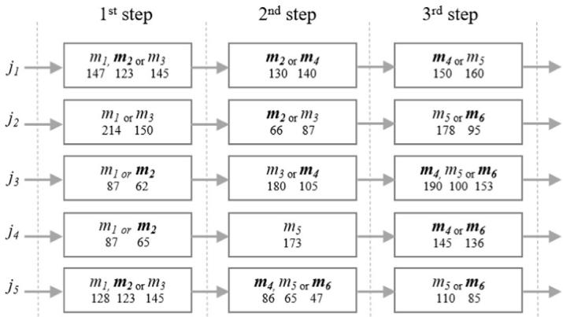
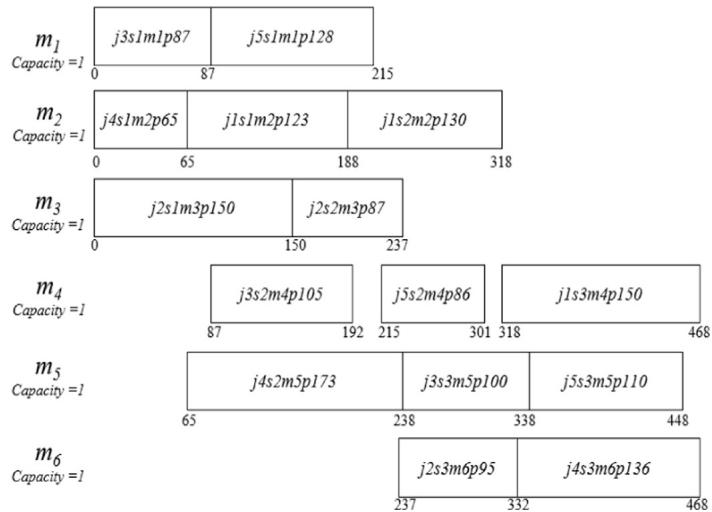
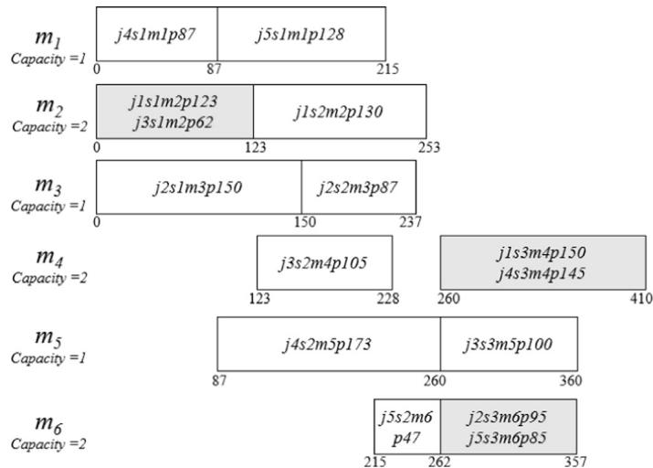
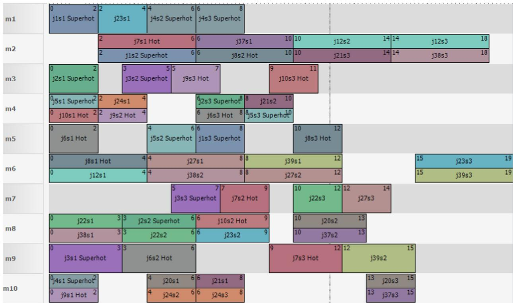

# Flexible job shop scheduling problem for parallel batch processing machine with compatible job families

Andy Ham

Industrial & Systems Engineering, Liberty University, Lynchburg, VA, USA

## a r t i c l e i n f o

Article history: Received 4 April 2016 Revised 12 November 2016 Accepted 31 December 2016 Available online 12 January 2017

Index Terms: FJSP PBM MIP Priority job Semiconductor

## a b s t r a c t

Flexible Job-Shop Scheduling Problem (FJSP) with Parallel Batch processing Machine (PBM) is studied. First, a Mixed Integer Programming (MIP) formulation is proposed for the first time. In order to address an NP-hard structure of this problem, the formulation is modified to selectively schedule jobs. Although there are many jobs on a given floor, semiconductor manufacturing is most challenged by priority jobs that promise a significant amount of financial compensation in exchange for an expedited delivery. This modification could leave some non-priority jobs unscheduled. However, it vastly expedites the discovery of improving solutions by first branching on integer variables with higher priority jobs. This study then turns job-dependent processing times into job-independent ones by assuming a machine has an equal processing time on different jobs. This assumption is roughly true or acceptable for the sake of the reduced computational time in the industry. These changes significantly reduce computational time compared to the original model when tested on a set of common problem instances from the literature. Computational results show that this proposed model can generate an effective schedule for large problems. Author encourages other researchers to propose an improved MIP model.

© 2017 Elsevier Inc. All rights reserved.

## 1. Introduction

In the semiconductor industry, researchers have exploited the performance of local production areas like lithography, diffusion, etch, and implanter for the last decades by using advanced scheduling/dispatching systems. Now, there is a growing need for orchestrating a whole factory to seek a global optimization. While flexible job shop scheduling problem (FJSP) with 3000-job (assuming 50 K monthly wafers output and 45 days cycle time), 1000-machine, 500-step, 40-product is unlikely to be solved in reasonable time, linking and orchestrating multiple consecutive steps seem to be approachable.

One application is a wet-diffusion area scheduling problem which has 2–4 consecutive steps with parallel batching ma chines [1–3]. Another application is to schedule jobs having the time constraint between consecutive process steps [4–7]. The last application which has not yet been studied in the literature is to schedule priority jobs which are often introduced into the factory for new product development or business considerations. A typical priority job travels on such an irregular process flow that it disrupts normal production and creates an inconsistent cycle. Furthermore, a floor supervisor often takes an extreme measure letting some ports of machine empty as the priority job is approaching from upstream steps due to the non-preemptive nature of machines in the industry. This results in a productivity loss. The industry calls it priority job scheduler (PJS). This study tackles this PJS problem in the context of FJSP with batching.

Table 1  
The articles related FJSP mathematical models

<table><tr><td>Ref.</td><td>Year</td><td>Highlights</td><td>Journal</td></tr><tr><td>[15]</td><td>1997</td><td>sequence dependent setup times</td><td>EJOR</td></tr><tr><td>[16]</td><td>1999</td><td>process plan flexibility</td><td>IJPR</td></tr><tr><td>[17]</td><td>2001</td><td>alternative process plan</td><td>IJPE</td></tr><tr><td>[8]</td><td>2001</td><td>sequence dependent setup times</td><td>IJPR</td></tr><tr><td>[18]</td><td>2001</td><td>sequence dependent setup times</td><td>IEEE</td></tr><tr><td>[19]</td><td>2002</td><td>process plan flexibility</td><td>C&amp;IE</td></tr><tr><td>[20]</td><td>2005</td><td>homogenous machines</td><td>IJPE</td></tr><tr><td>[21]</td><td>2006</td><td>sequence dependent setup times</td><td>IEEE</td></tr><tr><td>[22]</td><td>2006</td><td>sequence independent setup times</td><td>C&amp;OR</td></tr><tr><td>[23]</td><td>2006</td><td>flexible preventive maintenance</td><td>JIM</td></tr><tr><td>[10]</td><td>2007</td><td>-</td><td>JIM</td></tr><tr><td>[24]</td><td>2007</td><td>sequence dependent setup times</td><td>IJAMT</td></tr><tr><td>[25]</td><td>2009</td><td>-</td><td>C&amp;IE</td></tr><tr><td>[26]</td><td>2009</td><td>sequence independent setup times</td><td>SETP</td></tr><tr><td>[27]</td><td>2009</td><td>overlapping</td><td>AMM</td></tr><tr><td>[28]</td><td>2010</td><td>process plan flexibility</td><td>AMM</td></tr><tr><td>[29]</td><td>2010</td><td>disturbances</td><td>JMST</td></tr><tr><td>[30]</td><td>2010</td><td>-</td><td>IJPR</td></tr><tr><td>[31]</td><td>2011</td><td>preventive maintenance</td><td>ESA</td></tr><tr><td>[32]</td><td>2012</td><td>transportation constraints</td><td>C&amp;OR</td></tr><tr><td>[9]</td><td>2013</td><td>evaluation of MIP models</td><td>AMM</td></tr><tr><td>[33]</td><td>2015</td><td>sequence dependent setup times</td><td>JIM</td></tr><tr><td>[34]</td><td>2016</td><td>With transportation times</td><td>AMM</td></tr></table>

Considerable research has been devoted to FJSP in the literature. However, in consideration of the fact that there is no earlier work concerning FJSP with parallel batch processing machine (PBM), this paper attempts to propose an MIP model for FJSP with batching constraint for the first time and suggest a couple of modifications to reduce computational time. The rest of this paper is organized as follows: a literature review is presented in Section 2, and the proposed MIP model is developed in Section 3. Computational results are reported in Section 4, and finally Section 5 covers the conclusion.

## 2. Previous related work

## 2.1. Flexible job-shop scheduling problem

The classical JSP schedules a set of jobs on a set of machines with the objective to minimize a maximum completion time over all jobs (Cmax), subjected to the constraint that each job has an ordered set of operations, each of which must be processed on a predefined machine, whereas FJSP allows an operation to be processed on a machine out of a set of alternatives, which adds another dimension of complexity.

Researchers have addressed the FJSP mostly using heuristics. Despite the fact that these heuristics may generate fast and effective solutions, they are usually tailor-made. The best combination of parameters, which lead to effective solutions, is difficult to find so researchers conduct extensive experiments solely for that purpose. Namely, the eficiency of these techniques strongly depends on a proper implementation and fine tuning of parameters since they combine a problem representation and a solution strategy into a single framework. In contrast, mathematical modeling approach separates a problem representation from a solution strategy [13]. Furthermore, as computer hardware and solvers have improved, practitioners have been able to formulate increasingly detailed and complex problems. Therefore, this study explores a mathematical modeling approach.

Table 1 shows an overview of FJSP mathematical models in the literature. The overview table created by Demir and ˙Is¸ leyen [9] is slightly modified. A vast number of studies have addressed FJSP and its variants like plan flexibility, setup, overlapping, preventive maintenance, etc. However, to the best of our knowledge to date, no published work has dealt with the FJSP with batching.

They also categorize FJSP mathematical formulations into three different types: sequence-position variable based, precedence variable based, and time-indexed. Our proposed model is based on the sequence-position variable.

## 2.2. Priority job scheduler

Business requirements drive the need for a small number of jobs to be run through the factory as fast as possible. Various manual and automated schemes have been tried to keep the priority jobs from “queuing at the machine”. These schemes involve idling machines ahead of the arrival of priority jobs and trading machine utilization for priority jobs cycle time [3].

The main contributions of this paper can be summarized as follows. This study proposes a mathematical formulation of FJSP with batching constraint for the first time and makes a couple of modifications to reduce computational time for the PJS problem encountered at semiconductor manufacturing.

  
Fig. 1. FJSP instance of 5-job, 6-machine, and 3-step with batching.

## 3. Problem description and formulation

## 3.1. FJSP with batching

The FJSP with batch processing machine inherits every complexity of the original FJSP. In addition, it has a set of parallel batch processing machines. Each job has to be processed on one machine out of a set of given compatible machines as it visits a predetermined series of steps. The batching allows multiple jobs to be simultaneously processed as long as the total size of the batch does not exceed machine capacity. The processing time of a batch is dependent on the individual jobs in the batch, which is the maximum of individual processing times. Fig. 1 represents a FJSP instance of 5-job, 6-machine, and 3-step with batching.

The parallel batch scheduling problem with compatible job families arises at the burn-in operation in a back-end facility. Different products can be simultaneously processed in a machine because jobs may stay in a machine for a period longer than their minimum required burn-in times. On the contrary, jobs which belong to different families cannot be processed together (incompatible job families) in the diffusion operation in a front fabrication facility. This study assumes that the batch processing machine can process different products simultaneously (compatible job families).

The notation used in this paper is summarized in the following: Sets
J jobs (j)
S steps (s)
M machines (m)
K(|J| × |S|) positions (k)

Parameters
par$_{j}^{release}$ release time of job j
par$_{j,s,m}^{ptime}$ processing time
par$_{m}^{capa}$ capacity of machine m
L max{∑j,s par$_{j,s,m}^{ptime}$ ∀m }

Decision variables
Xjsmk 1 if job j occupies position k in the sequence of machine m at step s; 0 otherwise

Resultant variables
J$_{j,s}^{arrival}$ arrival time to step s of job j
M$_{m,k}^{start}$ start time at position k in the sequence of machine m
M$_{m,k}^{complete}$ completion time at position k in the sequence of machine m
M$_{m,k}^{ptime}$ processing time at position k in the sequence of machine m
Cmax makespan

The following model is named FJSP+Batching.

Routing

$$
\sum_ {m, k} X _ {j s m k} = 1 \forall j, s\tag{1.1}
$$

$$
\sum_ {j, s} \left(X _ {j s m k}\right) \leq p a r _ {m} ^ {c a p a} \forall k, m\tag{1.2}
$$

Scheduling

$$
M _ {m, k} ^ {\text { ptime }} \geq (p a r _ {j, s, m} ^ {\text { ptime }}) X _ {j s m k} \forall j, s, m, k\tag{1.3}
$$

$$
J _ {j, 1} ^ {\text { arrival }} = \operatorname{par} _ {j} ^ {\text { release }} \forall j\tag{1.4}
$$

$$
M _ {m, k} ^ {\text { start }} \geq J _ {j, s} ^ {\text { arrival }} + L (X _ {j s m k} - 1) \forall j, s, m, k\tag{1.5}
$$

$$
M _ {m, k} ^ {\text { complete }} = M _ {m, k} ^ {\text { start }} + M _ {m, k} ^ {\text { ptime }} \forall m, k\tag{1.6}
$$

$$
J _ {j, s + 1} ^ {\text { arrival }} \geq M _ {m, k} ^ {\text { complete }} + L (X _ {j s m k} - 1) \forall j, m, k: s <   | S |\tag{1.7}
$$

$$
M _ {m, k + 1} ^ {\text { start }} \geq M _ {m, k} ^ {\text { complete }} \forall m: k <   | K |\tag{1.8}
$$

Measuring

$$
C m a x \geq M _ {m, k} ^ {\text { complete }} + L \left(X _ {j s m k} - 1\right) \forall j, s, m, k\tag{1.9}
$$

$$
\text { Minimize   Cmax }\tag{1.10}
$$

Constraint (1.1) ensures that jobs are assigned to one of the available slots. Machine capacity is taken into consideration in Constraint (1.2). Then, Constraint (1.3) defines the processing time of a batch on a machine, which is represented by the longest time of all jobs in the batch. Constraint (1 4) considers the release time of a job Constraint (1 5) ensures that a batch cannot start its processing until all jobs assigned to the corresponding batch become ready. Constraint (1.6) determines the completion time of a batch. Constraint (1.7) ensures that the available time of a job is greater than or equal to the completion time at the step just previous. Constraint (1.8) ensures the precedence relationship between batches on the same machine. Finally, Constraint (1.9) determines the makespan and Objective (1.10) minimizes it.

For the incompatible job families, let $Q _ { m k f }$ be ∈ {0, 1} a derived variable to indicate whether a job family f is scheduled to position k in the sequence of machine m. We can then limit the total count of different job families at each position k of machine m.

Fig. 2 represents an optimal solution for the FJSP instance of 5-job, 6-machine, and 3-step when batching is not considered or the capacity of machine is set to 1. The values in each rectangle show a job schedule, for instance, j3s1m1p87 indicates job 3 is scheduled to machine 1 at step 1 with a processing time of 87

On the other hand, Fig. 3 represents an optimal solution for the same instance when batching is considered, for instance, Machine 2 processes a batch which is composed of j1 and $j 3 .$

## 3.2. FJSP with batching applied to priority job scheduling

The FJSP+Batching model could not generate an effective solution for large instances after several hours of computational time during a preliminary experimentation, so this study explores an opportunity of practical modification. An interview with an industry subject matter expert (SME) provides the following two key insights:

(a) One key insight concerns a selective job scheduling. Although there are many jobs on a given floor, the industry is most interested in priority jobs that promise a significant amount of financial compensation in exchange for an expedited delivery. To take advantage of this finding, the proposed model has come under close scrutiny. The model uses many binary variables $( X _ { j s m k } ) .$ . One of the set indexes which caught our eye is k, positions, whose size is currently set to $\left| J \right| \times \left| S \right|$ assuming all operations could be scheduled to a single machine. This size can be dramatically decreased if the model allows some jobs to remain unscheduled. Now, the routing Constraint (1.1) is modified as follows:

  
Fig. 2. An optimal solution for the 5-job, 6-machine, and 3-step w/o batching.

  
Fig. 3. An optimal solution for the 5-job, 6-machine, and 3-step w/ batching.

$$
\sum_ {m, k} X _ {j s m k} \leq 1 \forall j, s\tag{2.1}
$$

Constraint (2.2) is added in order to force a job to complete all operations once it is selected for the schedule.

$$
\sum_ {m k} X _ {j s m k} = \sum_ {m k} X _ {j, s + 1, m, k} \forall j: s <   | S |\tag{2.2}
$$

Unfortunately, this change on the routing constraint leads to undesirable results. Namely, the solver drops all jobs from a schedule to minimize Cmax. In order to prevent this side effect, Objective (2.3) rewards each job schedule with a large compensation.

$$
\text { Maximize } \sum_ {j, s, m, k} L \left(X _ {j s m k}\right)\tag{2.3}
$$

This study then calculates a completion time of each individual job and uses the time to calculate the makespan as shown on Constraints (2.4) and (2.5), which replace Constraint (1.9).

$$
J _ {j} ^ {\text { complete }} \geq M _ {m, k} ^ {\text { complete }} + L (X _ {j s m k} - 1) \forall j s m k\tag{2.4}
$$

$$
C m a x \geq J _ {j} ^ {\text { complete }} \forall j\tag{2.5}
$$

This change reduces the number of nodes in branch-and-bound algorithm owing to smaller |K|. This variant is named $F J S P _ { S e l e c t i \nu e } ^ { + B a t c h i n \xi }$ g

(b) Another insight concerns a processing time. Although there are minor variations of processing times, a machine has an equal processing time on different jobs in general. This assumption is acceptable for the sake of a reduced computational time. The proposed model has again come under close scrutiny and the $F J S P ^ { + B a t c h i n g }$ model is modified as follows. Let $p a r _ { m } ^ { p t i m e }$ be the processing time of machine m. Then, Constraint (1.6) can be replaced by Constraint (2.6) and Constraint (1.3) can be removed. This modification tightens the formulation and vastly improves CPLEX run-time performance. It is discussed in the computational study section.

$$
M _ {m, k} ^ {\text {complete}} = M _ {m, k} ^ {\text {start}} + p a r _ {m} ^ {\text {ptime}} \forall m, k\tag{2.6}
$$

New objectives are to maximize the total count of jobs scheduled while minimizing the last completion time.

## 4. Computational study

In this section, the effectiveness of our proposed models is tested. Firstly, $F J S P ^ { + B a t c h i n g }$ and $F J S P _ { S e l e c t i \nu e } ^ { + B a t c h i n g }$ are compared. Then, this study conducts a similar study with the assumption of job-independent processing time.

The proposed MIP models are generated by IBM OPL and solved by CPLEX 12.6.3 on a personal computer with an Intel Core i5-3470 @ 3.2 Ghz processor and 16 GB RAM.

## 4.1. Small-size test instances

To test our model, the same test problem instances created by Fattahi et al. [10] are borrowed. They randomly generated a total of 20 FJSP instances. The instances are divided to two categories: small size problems (SFJS1:10) and medium and large size problems (MFJS1:10). The problem instances are determined by size of the problem (n/h/m) in which index n denotes number of jobs, h denotes the maximum number of operations for all jobs and m denotes the machine number. The instances, however, do not have a batching requirement, so this study simply assumes even (odd) numbered machines have a capacity of two (one). Another change is made to support the assumption of job-independent processing time. The processing time of machine $( p a r _ { m } ^ { p t i m e }$ )is calculated as follows: min $\{ p a r _ { j , s , m } ^ { p t i m e } \ \forall m \}$

The $F J S P _ { S e l e c t i \nu e . } ^ { + B a t c h i n g }$ is set to schedule all jobs for a fair comparison with FJSP+Batching, although it selectively chooses jobs to schedule. This is made by setting |K| value to six. We have confirmed the model schedules all jobs during a study. The customized CPLEX logs have all the details about the scheduling results and the number of jobs scheduled. All the test instances, log files, and results are located at https://dl.dropboxusercontent.com/u/57440903/FJSP\_Batching.zip.

## 4.2. Results of small-size test instances

Table 2 summarizes the computational results. Columns 1–2 show the names of instances used by Fattahi et al. [10] and size, respectively. Columns 3–6 contain the best solutions generated by $F J S P ^ { + B a t c h i n g }$ and $F J S P _ { S e l e c t i \nu e } ^ { + B a t c \tilde { h i n } g }$ which are reported within 300 s.

The $F J S P _ { S e l e c t i \nu e } ^ { + B a t c h i n g }$ finds an optimal solutions of 11 instances out of 20 compared to 9 out of 20 by the $F J S P ^ { + B a t c h i n g } .$ Also, the average Cmax values of $F J S P _ { S e l e c t i \nu e } ^ { + B a t c h i n g } ( F J S P ^ { + }$ Batching) are 637.1 (899.4) respectively for the large size instances. The statistic does not include the MFJS9 instance since FJSP+Batching fails to report any feasible solution.

In terms of computational time, $F J S P _ { S e l e c t i \nu e } ^ { + B a t c h i n g }$ finds the optimal solutions in 1.16 s on average compared to 3.44 s by FJSP+Batching, for the small size problem instances. The statistic does not include the SFJS10 instance since $F J S P ^ { + B a t c h i n g }$ fails to reach an optimal.

Table 3 summarizes the computational results based on the assumption of job-independent processing time. Under this assumption, both FJSP+Batching and $F J S P _ { S e l e c t i \nu e } ^ { + B a t c h i n g }$ find optimal solutions of 16 instances out of 20 within 300 s which demonstrates a reduction of computational time by tightening the formulation. There are also significant differences in Cmax values for the large instances of MFJS8, 9 and 10.

After confirming both modifications could significantly reduce computational time, the proposed model is applied to the priority job scheduling problem encountered in semiconductor manufacturing.

## 4.3. Priority job scheduling test instances

An industry SME directed this study to look into the test problem instances especially with 3-step which typically takes 2–3 h for wafers to flow through in semiconductor manufacturing. A real instance could not be obtained due to an intellectual property concern so a set of test instances was randomly generated. There are $5 0 { \mathrm { ~ j o b s . } }$ The first 10% of jobs are tagged as superhot, the next 10% hot, and the remaining 80% normal. Jobs with superhot or hot must be included into a schedule.

Table 2  
Comparison of two different models with the assumption of job-dependent processing time.

<table><tr><td rowspan="2">Problem</td><td rowspan="2">Size</td><td colspan="2"> $FJSP^{+Batching}$ </td><td colspan="2"> $FJSP^{+Batching\ Selective}$ </td></tr><tr><td>Cmax</td><td>CPU</td><td>Cmax</td><td>CPU</td></tr><tr><td>SFJS1</td><td>2/2/2</td><td>66</td><td>0.05</td><td>66</td><td>0.08</td></tr><tr><td>SFJS2</td><td>2/2/2</td><td>107</td><td>0.05</td><td>107</td><td>0.05</td></tr><tr><td>SFJS3</td><td>3/2/2</td><td>208</td><td>0.31</td><td>208</td><td>0.20</td></tr><tr><td>SFJS4</td><td>3/2/2</td><td>272</td><td>0.06</td><td>272</td><td>0.05</td></tr><tr><td>SFJS5</td><td>3/2/2</td><td>100</td><td>0.14</td><td>100</td><td>0.39</td></tr><tr><td>SFJS6</td><td>3/3/2</td><td>320</td><td>12.29</td><td>320</td><td>1.37</td></tr><tr><td>SFJS7</td><td>3/3/5</td><td>397</td><td>9.77</td><td>397</td><td>1.00</td></tr><tr><td>SFJS8</td><td>3/3/4</td><td>216</td><td>5.34</td><td>216</td><td>6.46</td></tr><tr><td>SFJS9</td><td>3/3/3</td><td>210</td><td>2.95</td><td>210</td><td>0.87</td></tr><tr><td>SFJS10</td><td>4/3/5</td><td>516</td><td>300</td><td>516</td><td>91.96</td></tr><tr><td>MFJS1</td><td>5/3/6</td><td>410</td><td>300</td><td>410</td><td>300</td></tr><tr><td>MFJS2</td><td>5/3/7</td><td>410</td><td>300</td><td>410</td><td>300</td></tr><tr><td>MFJS3</td><td>6/3/7</td><td>420</td><td>300</td><td>420</td><td>300</td></tr><tr><td>MFJS4</td><td>7/3/7</td><td>506</td><td>300</td><td>506</td><td>300</td></tr><tr><td>MFJS5</td><td>7/3/7</td><td>488</td><td>300</td><td>488</td><td>300</td></tr><tr><td>MFJS6</td><td>8/3/7</td><td>631</td><td>300</td><td>614</td><td>42.43</td></tr><tr><td>MFJS7</td><td>8/4/7</td><td>916</td><td>300</td><td>863</td><td>300</td></tr><tr><td>MFJS8</td><td>9/4/8</td><td>896</td><td>300</td><td>808</td><td>300</td></tr><tr><td>MFJS9</td><td>11/4/8</td><td>nf</td><td>300</td><td>955</td><td>300</td></tr><tr><td>MFJS10</td><td>12/4/8</td><td>3418</td><td>300</td><td>1215</td><td>300</td></tr></table>

∗bold font indicates an optimal.

Table 3  
Comparison of two different models with the assumption of job-independent processing time.

<table><tr><td rowspan="2">Problem</td><td colspan="2"> $FJSP^{+Batching}$ </td><td colspan="2"> $FJSP^{+Batching}_{Selective}$ </td></tr><tr><td>Cmax</td><td>CPU</td><td>Cmax</td><td>CPU</td></tr><tr><td>SFJS1</td><td>48</td><td>0.03</td><td>48</td><td>0.03</td></tr><tr><td>SFJS2</td><td>63</td><td>0.01</td><td>63</td><td>0.03</td></tr><tr><td>SFJS3</td><td>106</td><td>0.03</td><td>106</td><td>0.03</td></tr><tr><td>SFJS4</td><td>126</td><td>0.03</td><td>126</td><td>0.03</td></tr><tr><td>SFJS5</td><td>42</td><td>0.02</td><td>42</td><td>0.03</td></tr><tr><td>SFJS6</td><td>134</td><td>0.09</td><td>134</td><td>0.12</td></tr><tr><td>SFJS7</td><td>194</td><td>0.08</td><td>194</td><td>0.17</td></tr><tr><td>SFJS8</td><td>100</td><td>0.11</td><td>100</td><td>0.17</td></tr><tr><td>SFJS9</td><td>84</td><td>0.16</td><td>84</td><td>0.25</td></tr><tr><td>SFJS10</td><td>314</td><td>0.22</td><td>314</td><td>0.28</td></tr><tr><td>MFJS1</td><td>236</td><td>1.00</td><td>236</td><td>4.38</td></tr><tr><td>MFJS2</td><td>236</td><td>2.28</td><td>236</td><td>6.58</td></tr><tr><td>MFJS3</td><td>250</td><td>4.06</td><td>250</td><td>12.34</td></tr><tr><td>MFJS4</td><td>251</td><td>26.43</td><td>251</td><td>71.57</td></tr><tr><td>MFJS5</td><td>251</td><td>17.91</td><td>251</td><td>29.44</td></tr><tr><td>MFJS6</td><td>254</td><td>23.71</td><td>254</td><td>51.29</td></tr><tr><td>MFJS7</td><td>325</td><td>300</td><td>325</td><td>300</td></tr><tr><td>MFJS8</td><td>980</td><td>300</td><td>344</td><td>300</td></tr><tr><td>MFJS9</td><td>1160</td><td>300</td><td>435</td><td>300</td></tr><tr><td>MFJS10</td><td>1036</td><td>300</td><td>457</td><td>300</td></tr><tr><td>Average</td><td>309.5</td><td>63.8</td><td>212.5</td><td>68.8</td></tr></table>

∗ bold font indicates an optimal.

Remaining normal jobs could be selectively scheduled as much as possible to maximize a production output, but this is optional.

The new performance measures are to maximize a total amount of production (or jobs scheduled) and to meet a target of X-factor [11] which is defined as the ratio of flow time to raw process time. The X-factor is commonly measured in semiconductor manufacturing to assess a level of operational excellence. Table 4 represents a job priority profile with its X-factor target. The model is modified in order to calculate the X-factor of a job. This variant is named $F J S { \bar { P } } _ { P J S } ^ { + B a t c h i n g }$ and the mathematical model is provided in the Appendix.

Finally, there are 10 machines and 3 steps. Therefore, each machine could be scheduled with 15 operations (= 3 steps × 50 jobs/10 machines) on average if all jobs are scheduled. The size of |K| is set as 4 and the computational study confirms that it provides enough spaces to accommodate all priority jobs.

Table 4  
Profile of job priority with its X-factor target.

<table><tr><td>Priority levels</td><td>Volume</td><td>Selectiveness</td><td>X-factor target</td></tr><tr><td>Superhot</td><td>10%</td><td>Must</td><td>1.1</td></tr><tr><td>Hot</td><td>10%</td><td>Must</td><td>1.3</td></tr><tr><td>Normal</td><td>80%</td><td>Optional</td><td>-</td></tr></table>

Table 5  
Optimal schedules of priority job scheduling

<table><tr><td rowspan="2">Problem</td><td colspan="3">Superhot jobs</td><td colspan="3">Hot jobs</td><td colspan="3">Normal jobs</td><td rowspan="2">CPU</td></tr><tr><td>Jobs</td><td>Avg</td><td>Max</td><td>Jobs</td><td>Avg</td><td>Max</td><td>Jobs</td><td>Avg</td><td>Max</td></tr><tr><td>PJS01</td><td>5</td><td>1.05</td><td>1.14</td><td>5</td><td>1.28</td><td>1.33</td><td>10</td><td>1.72</td><td>2.11</td><td>150</td></tr><tr><td>PJS02</td><td>5</td><td>1.06</td><td>1.11</td><td>5</td><td>1.28</td><td>1.44</td><td>10</td><td>1.69</td><td>2.63</td><td>33</td></tr><tr><td>PJS03</td><td>5</td><td>1.11</td><td>1.27</td><td>5</td><td>1.31</td><td>1.45</td><td>10</td><td>1.57</td><td>1.60</td><td>113</td></tr><tr><td>PJS04</td><td>5</td><td>1.04</td><td>1.11</td><td>5</td><td>1.33</td><td>1.40</td><td>10</td><td>1.72</td><td>2.25</td><td>120</td></tr><tr><td>PJS05</td><td>5</td><td>1.09</td><td>1.09</td><td>5</td><td>1.28</td><td>1.30</td><td>10</td><td>1.74</td><td>2.18</td><td>65</td></tr><tr><td>PJS06</td><td>5</td><td>1.05</td><td>1.14</td><td>5</td><td>1.31</td><td>1.38</td><td>10</td><td>1.66</td><td>2.13</td><td>119</td></tr><tr><td>PJS07</td><td>5</td><td>1.02</td><td>1.10</td><td>5</td><td>1.26</td><td>1.30</td><td>10</td><td>1.73</td><td>2.44</td><td>64</td></tr><tr><td>PJS08</td><td>5</td><td>1.09</td><td>1.10</td><td>5</td><td>1.33</td><td>1.55</td><td>10</td><td>1.68</td><td>2.63</td><td>111</td></tr><tr><td>PJS09</td><td>5</td><td>1.10</td><td>1.10</td><td>5</td><td>1.29</td><td>1.50</td><td>10</td><td>1.60</td><td>1.80</td><td>35</td></tr><tr><td>PJS10</td><td>5</td><td>1.09</td><td>1.10</td><td>5</td><td>1.32</td><td>1.40</td><td>10</td><td>1.74</td><td>2.18</td><td>105</td></tr><tr><td>Average</td><td>5</td><td>1.07</td><td>1.13</td><td>5</td><td>1.30</td><td>1.41</td><td>10</td><td>1.69</td><td>2.19</td><td>91</td></tr></table>

  
Fig. 4. Gantt chart schedule of test instance of PJS01.

## 4.4. Results of priority job scheduling

Table 5 reports the computational results. Column 1 shows the name of instances. Columns 2–4 contain an optimal solutions of superhot jobs: number of jobs scheduled, average of X-factors, and maximum of X-factors. Columns 5–7 (8–10) contain the results of hot jobs (normal). The last Column 11 records the CPU time to reach an optimal solution.

The $F J S P _ { P I S } ^ { + B a t c h i n g }$ finds an optimal schedule within 2.5 min for all problem instances while accomplishing the X-factor targets. Fig. 4 represents an optimal solution of PSJ01. Each box shows a schedule of an operation; for instance, j1s1 superhot on m1 indicates job 1 which has the superhot priority is scheduled to machine 1 at step 1 starting at time 0 and completing at 2.

## 5. Conclusion and future research

Encountered at the semiconductor manufacturing, a flexible job-shop scheduling problem with parallel batch processing machine is studied as there is a growing need for orchestrating a whole factory to seek a global optimization. There are several immediate applications of the FJSP with batching in semiconductor manufacturing. One of the applications is a wetdiffusion area scheduling problem which has 2–4 consecutive steps with parallel batching machines. Another application is to schedule jobs having time constraints between consecutive process steps. The last application is to schedule priority jobs, which are often introduced into the factory out of new product development or business considerations. They often follow such an irregular flow of steps that it greatly disrupts normal production, not to mention its high priority over normal jobs A floor supervisor often takes an extreme measure, letting some ports of machine idle as priority jobs are approaching from upstream steps which results in a productivity loss. This study addresses the priority job scheduling problem in the contex of FJSP with batching.

A mixed integer programming (MIP) formulation is composed for the first time. Owing to two critical insights found during an interview with an industry SME. the mathematical formulation is modified to cope with industry-size instances The first insight is about a selective job scheduling. Although there are thousands of jobs on a floor, the industry is most interested in priority jobs because special customers promise a significant amount of financial compensation in exchange for an expedited delivery. There are three levels of priority: superhot, hot, and normal. Jobs with superhot or hot priorities must be included into a schedule whereas normal jobs could be selectively scheduled as much as possible to maximize a production output, but this is optional. The second insight concerns the job-independent processing time. A machine has a similar processing time on different jobs in general, although there are minor variations of processing times depend ing on recipes. This assumption is acceptable for the sake of a reduced computational time. This modification tightens the formulation and vastly improves CPLEX run-time performance. Computational results show that the modified model can schedule 50-job, 10-machine, and 3-step within 2.5 min run-time. The model successfully schedules all jobs tagged as superhot or hot within their due dates, while filling a machine idle space with normal jobs to maximize the production output. This study demonstrates how to orchestrate multiple batching machines sitting on a series of consecutive steps by using a mathematical model. The floor does not need to let some ports of machine idle as priority jobs are approaching since the proposed model effectively combines the priority jobs with the normal jobs and generates an optimal schedule.

This research can be further extended by considering a relatively new approach, constraint programming (CP), which is designed to cope with complex scheduling problems such as TSP, JSP, and FJSP [12]. Another extension is to improve the proposed MIP model. Lastly, application opportunities can be further explored as discussed in the Introduction Section.

## Appendix

$F J S P _ { S e l e c t i \nu e } ^ { + B a t c h i n g }$ model in condensed form

Routing

$$
\sum_ {m, k} X _ {j s m k} \leq 1 \forall j, s\tag{2.1}
$$

$$
\sum_ {m k} X _ {j s m k} = \sum_ {m k} X _ {j, s + 1, m, k} \forall j: s <   | S |\tag{2.2}
$$

$$
\sum_ {j, s} \left(X _ {j s m k}\right) \leq p a r _ {m} ^ {c a p a} \forall k, m\tag{1.2}
$$

Scheduling

$$
J _ {j, 1} ^ {\text {arrival}} = \text {par} _ {j} ^ {\text {release}} \forall j\tag{1.4}
$$

(continued on next page)

$$
M _ {m, k} ^ {\text { start }} \geq J _ {j, s} ^ {\text { arrival }} + L (X _ {j s m k} - 1) \forall j, s, m, k\tag{1.5}
$$

$$
M _ {m, k} ^ {\text { complete }} = M _ {m, k} ^ {\text { start }} + \operatorname{par} _ {m} ^ {\text { ptime }} \forall m, k\tag{2.6}
$$

$$
J _ {j, s + 1} ^ {\text { arrival }} \geq M _ {m, k} ^ {\text { complete }} + L (X _ {j s m k} - 1) \forall j, m, k: s <   | S |\tag{1.7}
$$

$$
M _ {m, k + 1} ^ {\text { start }} \geq M _ {m, k} ^ {\text { complete }} \forall m: k <   | K |\tag{1.8}
$$

Measuring

$$
J _ {j} ^ {\text { complete }} \geq M _ {m, k} ^ {\text { complete }} + L (X _ {j s m k} - 1) \forall j s m k\tag{2.4}
$$

$$
C m a x \geq J _ {j} ^ {\text { complete }} \forall j\tag{2.5}
$$

$$
\text { Minimize   Cmax }\tag{1.10}
$$

$$
\text { Maximize } \sum_ {j, s, m, k} L \left(X _ {j s m k}\right)\tag{2.3}
$$

$F J S P _ { P I S } ^ { + B a t c h i n g }$ model in condensed form

In order to explicitly generate the X-factor of individual job and control it as a knob, the following changes are made. Parameters

$p a r _ { j } ^ { p r i }$ priority of job j (1 for superhot, 2 for hot, 9 for normal)

$p a r _ { i } ^ { X f a c t o r }$ target X-factor of job j

$p a r _ { j } ^ { \bar { T } C T }$ theoretical cycle time of job j which is the summation of processing times at each steps

Resultant variables

$J _ { j } ^ { \tt X - }$ amount of X-factor under accomplished against a target

Routing

$$
\sum_ {m, k} X _ {j s m k} = 1 \forall j, s: p a r _ {j} ^ {p r i} = s u p e r h o t o r h o t\tag{3.1}
$$

$$
\sum_ {m, k} X _ {j s m k} \leq 1 \forall j, s: p a r _ {j} ^ {p r i} = n o r m a l\tag{3.2}
$$

$$
\sum_ {m k} X _ {j s m k} = \sum_ {m k} X _ {j, s + 1, m, k} \forall j: s <   | S |\tag{2.2b}
$$

(continued on next page)

$$
\sum_ {j, s} \left(X _ {j s m k}\right) \leq p a r _ {m} ^ {c a p a} \forall k, m\tag{1.2b}
$$

Scheduling

$$
J _ {j, 1} ^ {\text {arrival}} = p a r _ {j} ^ {\text {release}} \forall j\tag{1.4b}
$$

$$
M _ {m, k} ^ {\text { start }} \geq J _ {j, s} ^ {\text { arrival }} + L (X _ {j s m k} - 1) \forall j, s, m, k\tag{1.5b}
$$

$$
M _ {m, k} ^ {\text { complete }} = M _ {m, k} ^ {\text { start }} + p a r _ {m} ^ {\text { ptime }} \forall m, k\tag{2.6b}
$$

$$
J _ {j, s + 1} ^ {\text { arrival }} \geq M _ {m, k} ^ {\text { complete }} + L (X _ {j s m k} - 1) \forall j, m, k: s <   | S |\tag{1.7b}
$$

$$
M _ {m, k + 1} ^ {\text { start }} \geq M _ {m, k} ^ {\text { complete }} \forall m: k <   | K |\tag{1.8b}
$$

Measuring

$$
J _ {j} ^ {\text { complete }} \geq M _ {m, k} ^ {\text { complete }} + L (X _ {j s m k} - 1) \forall j s m k\tag{2.4b}
$$

$$
\frac {J _ {j} ^ {\text { complete }}}{p a r _ {j} ^ {T C T}} \leq p a r _ {j} ^ {X f a c t o r} + J _ {j} ^ {X -} \forall j\tag{3.3}
$$

$$
\text { Maximize } \sum_ {j, s, m, k} \left(L / p a r _ {j} ^ {p r i}\right) X _ {j s m k}\tag{3.4}
$$

$$
\text { Minimize } \sum_ {j} J _ {j} ^ {\mathrm{X-}}\tag{3.5}
$$

Constraints (3.1) and (3.2) differentiate the mandatory and the selective scheduling depending on a priority of a job. Constraint (3.3) calculates the deviation from the target X-factor. Objective (3.4) maximizes the total summation of production weighted by priority. Differentiating jobs by adding appropriate weight factors to cost coeficients in the objective function helps the algorithm distinguish between dominated and dominating solutions. which expedites the discovery of improying solutions [14]. This change instructs CPLEX to branch on integer variables with higher priority jobs first. Objective (3.5) penalizes the amount of X-factor under accomplished compared to a target.

## References

[1] C. Jung, D. Pabst, M. Ham, M. Stehli, M. Rothe, An effective problem decomposition method for scheduling of diffusion processes based on mixed integer linear programming, IEEE Trans, Semicond, Manuf, 27 (3) (2014) 357-363.

[2] C. Yugma, S. Dauzère-Pérès. C. Artigues. A. Derreumaux, O. Sibille. A batching and scheduling algorithm for the diffusion area in semiconductor manufacturing, Int. J. Prod. Res. 50 (8) (2012) 2118–2132.

[3] R. Bixby, R. Burda, D. Miller, Short-interval detailed production scheduling in 300 mm semiconductor manufacturing using mixed integer and constraint programming, in: The 17th Annual SEMI/IEEE Advanced Semiconductor Manufacturing Conference (ASMC-2006), 2006, May, pp. 148–154.

[4] A. Klemmt. L. Monch, Scheduling jobs with time constraints between consecutive process steps in semiconductor manufacturing, in: Proceedings of the Winter Simulation Conference, 2012, December, p. 194.

[5] D.S. Sun. Y.I. Choung, Y.I. Lee. Y.C. Jang, Scheduling and control for time-constrained processes in semiconductor manufacturing, in: IEEE International Symposium on Semiconductor Manufacturing, 2005, September2005, pp. 295–298.

[6] M. Ham, Y.H. Lee, J. An, IP-Based Real-Time Dispatching for Two-Machine Batching Problem with Time Window Constraints, IEEE Trans. Autom. Sci. Eng 8(3)(2011).589-597

[7] R. Sadeghi, S. Dauzere-Peres, C. Yugma, G. Lepelletier, Production control in semiconductor manufacturing with time constraints, in: 26th Annual SEMI Advanced Semiconductor Manufacturing Conference (ASMC), 2015, IEEE, 2015, May, pp. 29–33.

[8] C.Y. Low, T.H. Wu, Mathematical modelling and heuristic approaches to operation scheduling problems in an FMS environment, Int. J. Prod. Res. 39 (2001) 689–708

[9] Y. Demir, S.K. ˙Is¸ leyen, Evaluation of mathematical models for flexible job-shop scheduling problems, Appl. Math. Model. 37 (3) (2013) 977–988.

[10] P. Fattahi, M.S. Mehrebad, F. Jolai, Mathematical modeling and heuristic approaches to flexible job shop scheduling problems, J. Intell. Manuf. 18 (2007) 331–342.

[11] D.P. Martin, The advantages of using short cycle time manufacturing (SCM) instead of continuous flow manufacturing (CFM), in: Advanced Semiconductor Manufacturing Conference and Workshop, 1998, IEEE/SEMI, 1998, pp. 43–49.

[12] R. Sahraeian, M. Namakshenas, On the optimal modeling and evaluation of job shops with a total weighted tardiness objective: constraint programming vs. mixed integer programming, Appl. Math. Model. 39 (2) (2015) 955–964.

[13] G.M. Kopanos, C.A. Méndez, L. Puigjaner, MIP-based decomposition strategies for large-scale scheduling problems in multiproduct multistage batch plants: a benchmark scheduling problem of the pharmaceutical industry, Eur. J. Oper. Res. 207 (2) (2010) 644–655.

[14] E. Klotz, A.M. Newman, Practical guidelines for solving dificult mixed integer linear programs, Surv. Oper. Res. Manage. Sci. 18 (1) (2013) 18–32.

[15] J. Liu, B.L. MacCarty, A global MILP model for FMS scheduling, Eur. J. Oper. Res. 100 (1997) 441–453.

[16] K.-H. Kim, P.J. Egbelu, Scheduling in a production environment with multiple process plans per job, Int. J. Prod. Res. 37 (1999) 2725–2753.

[17] C.S. Thomalla, Job shop scheduling with alternative process plans, Int. J. Prod. Econ. 71 (2001) 125–134.

[18] H. Tamaki, T. Ono, H. Murao, S. Kitamura, Modeling and genetic solution of a class of flexible job shop scheduling problems, in: Proceedings of the IEEE Symposium on Emerging Techonologies and Factory Automation, vol. 2, IEEE, 2001, pp. 343–350.

[19] Y.H. Lee, C.S. Jeong, C. Moon, Advanced planning and scheduling with outsourcing in manufacturing supply chain, Comput. Ind. Eng. 43 (2002) 351–374.

[20] S.A. Torabi, B. Karimi, S.M.T. Fatemi Ghomi, The common cycle economic lot scheduling in flexible job shops: the finite horizon case, Int. J. Prod. Econ. 97（2005）52-65.

[21] N. Imanipour, Modeling & solving flexible job shop problem with sequence dependent setup times, in: Proceedings of the International conference on service systems and service management, October 25-27, 2006, vol. 2, IEEE, 2006, pp. 1205–1210.

[22] C. Low, Y. Yip, T.H. Wu, Modeling and heuristics of FMS scheduling with multiple objectives, Comput. Oper. Res. 33 (2006) 674–694

[23] J. Gao, M. Gen, L. Sun, Scheduling jobs and maintenances in flexible job shop with a hybrid genetic algorithm, J. Intell. Manuf. 17 (2006) 493–507.

[24] M.S. Mehrabad, P. Fattahi, Flexible job shop scheduling with tabu search algorithms, Int. J. Adv. Manuf. Technol. 32 (2007) 563–570.

[25] G. Zhang, X. Shao, P. Li, L. Gao, An effective hybrid particle swarm optimization algorithm for multi-objective flexible job-shop scheduling problem, Comput. Ind. Eng. 56 (2009) 1309–1318.

[26] L. Lin, H. Jia-zhen, Multi-objective flexible job-shop scheduling problem in steel tubes production, Syst. Eng. Theory Pract. 29 (8) (2009) 117–126

[27] P. Fattahi, F. Jolai, J. Arkat, Flexible job shop scheduling with overlapping in operations, Appl. Math. Model. 33 (2009) 3076–3087.

[28] C. Özgüven, L. Özbakır, Y. Yavuz, Mathematical models for job-shop scheduling problems with routing and process plan flexibility, Appl. Math. Model. 34 (2010) 1539–1548.

[29] P. Fattahi, A. Fallahi, Dynamic scheduling in flexible job shop systems by considering simultaneously eficiency and stability, CIRP, J. Manuf. Sci. Technol. 2 (2010) 114–123.

[30] M. Ham, Y.H. Lee, S.H. Kim, Real-time scheduling of multi-stage flexible job shop floor, Int. J. Prod. Res. 49 (12) (2011) 3715–3730.

[31] E. Moradi, S.M.T. Fatemi Ghomi, M. Zandieh, Bi-objective optimization research on integrated fixed time interval preventive maintenance and production for scheduling flexible job-shop problem, Expert Syst. Appl. 38 (2011) 7169–7178.

[32] Q. Zhang, H. Manier, M.-A. Manier, A genetic algorithm with tabu search procedure for flexible job shop scheduling with transportation constraints and bounded processing times, Comput. Oper. Res. 39 (2012) 1713–1723.

[33] A. Jalilvand-Nejad, P. Fattahi, A mathematical model and genetic algorithm to cyclic flexible job shop scheduling problem, J. Intell. Manuf. 26 (6) (2015) 1085–1098.

[34] S. Karimi, Z. Ardalan, B. Naderi, M. Mohammadi, Scheduling flexible job-shops with transportation times: Mathematical models and a hybrid imperialist competitive algorithm, Appl. Math. Model 41 (2016) 667–682.