# Knowledge Transfer-Based Co-Evolutionary Search for Energy-Saving Distributed Heterogeneous Flexible Job Shop Scheduling

Tao Li , Xingchen Li , Junna Zhang , Member, IEEE, Dong Liu , and Zidong Wang , Fellow, IEEE

Abstract—This paper investigates the energy-saving distributed heterogeneous flexiblejob shop scheduling problem (ES-DHFJSP), with the dual objectives of reducing both makespan and total energy consumption. To address ES-DHFJSP, a knowledge transferbased co-evolutionary search algorithm (KTCE) is proposed. Three key components are incorporated into the algorithm. First, a greedy population initialization strategy is designed, by which the characteristics of multi-factory distributed systems are leveraged to generate superior initial individuals. Second, a dynamic neighborhood search structure centered on critical factory is developed, through which the algorithm’s capability to explore promising regions around elite solutions is enhanced. Third, a knowledge transfer mechanism centered on a factory allocation probability model is implemented, wherein the optimal factory allocations from previous generations are utilized to construct the probability model and the evolution of subsequent population is guided. The algorithm’s convergence rate is substantially improved by this mechanism. The effectiveness and efficiency of KTCE are validated through comprehensive experimental results on various benchmark instances, where superior performance is demonstrated in solving ES-DHFJSP.

Index Terms—Evolutionary algorithm, knowledge transfer, Coevolutionary search, distributed heterogeneous flexible job shop scheduling, energy-conserving.

## I. INTRODUCTION

products [1]. Traditional single-factory production systems have proven inadequate in meeting these demands, particularly in terms of rapid, large-scale production of high-quality goods [2]. Distributed manufacturing systems, characterized by multiple factories collaboratively processing product sets, have emerged as a promising solution by significantly enhancing production throughput. This approach offers notable advantages, including enhanced operational flexibility and reduced management risks [3]. Nevertheless, conventional distributed manufacturing systems continue to face critical challenges, primarily manifesting as suboptimal production efficiency and excessive energy consumption [4]. These limitations pose substantial challenges to existing job shop scheduling methodologies [5]. Consequently, there is an urgent need to develop advancedjob scheduling techniques that can simultaneously optimize production efficiency and minimize energy consumption.

At present, energy-saving distributed flexible job shop scheduling (ES-DFJSP) presents an effective solution to aforementioned challenges. This method requires solving three fundamental sub-problems: 1) determining optimal job-to-factory allocation schemes; 2) assigning operations to specific machines; and 3) establishing operation processing orders within each factory. The interdependence of these three subproblems makes the ES-DFJSP highly complex, characterized by a vast solution space and significant computational difficulty. Therefore, ES-DFJSP is classified as an NP-hard problem [6].

Evolutionary algorithms possess remarkable advantages in addressing multi-objective optimization challenges and have achieved notable results. Among them, noteworthy examples include the differential evolution (DE) [7], the co-evolutionary algorithm (CE) [8], [9], and the particle swarm optimization (PSO) [10], [11]. These algorithms have been extensively applied in various fields such as social networks [12], signal processing [13], computer vision [14], and the intelligent manufacturing [15], [16].

Notably, evolutionary algorithms have emerged as a viable method for addressing the ES-DFJSP problem. Although existing scheduling approaches have demonstrated promising results, they primarily focus on homogeneous factory environments. Heterogeneous distributed architectures better reflect real-world workshop production environments [17], [18]. The effect of factory heterogeneity on makespan and energy consumption has not been thoroughly investigated [19]. Furthermore, the inherent randomness in evolutionary algorithms results in substantial computational overhead when applied to high-dimensional or complex optimization problems. Consequently, efficiently addressing the ES-DHFJSP with both speed and accuracy remains a critical challenge in contemporary production scheduling research.

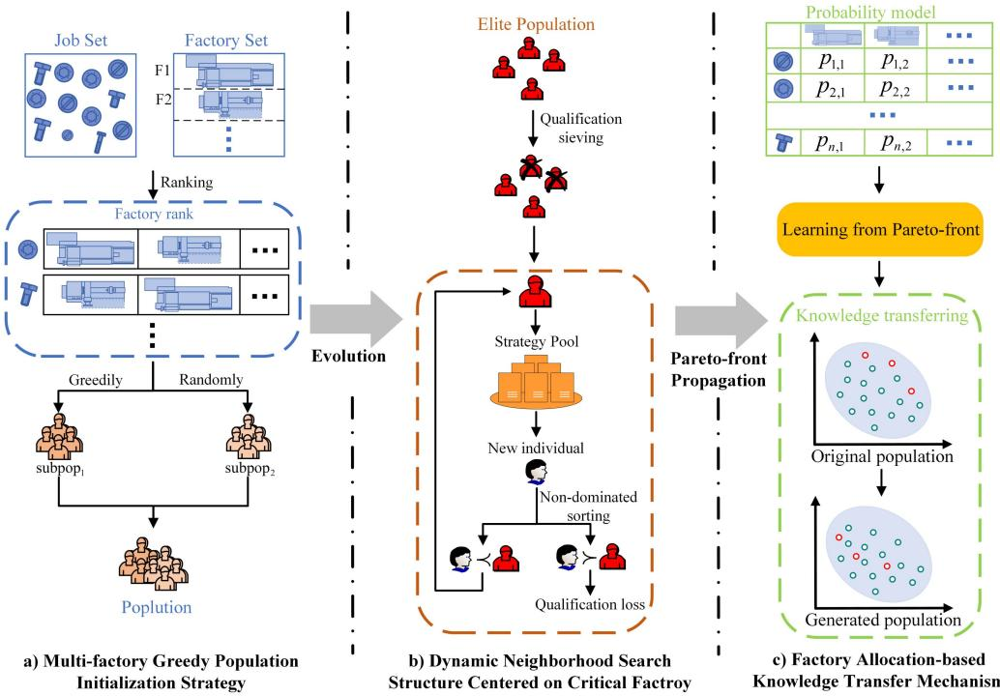  
Fig. 1. Overall framework of KTCE.

Breakthroughs in machine learning have driven growing interest in its synergy with evolutionary computation, fostering novel approaches to complex optimization problems [20], [21]. Knowledge transfer, which leverages insights from related source tasks to address target problems, has demonstrated remarkable effectiveness in optimization domains [22].

Evidence suggests that knowledge transfer mechanisms can effectively reduce computational overhead and enhance convergence rates of evolutionary algorithms. Motivated by these advantages, we propose integrating knowledge transfer techniques with evolutionary algorithms to solve the ES-DHFJSP.

Drawing on the aforementioned analysis, a knowledge transfer-based co-evolutionary search algorithm is proposed to solve the ES-DHFJSP. In the algorithm, the dynamic local search is integrated with global search to explore the optimal solution collaboratively, and the knowledge transfer is employed to minimize the makespan and the total energy consumption. The overall framework of the KTCE is shown in Fig. 1. The primary contributions of this paper are presented as follows:

1) A multi-factory-based greedy population initialization strategy is designed. The average processing time of jobs in each factory is adopted to generate one quarter of the initial population, which can accelerate the population convergence. Meanwhile, to ensure the diversity of the initial population, the rest of individuals are generated stochastically.

2) A dynamic neighborhood search structure centered on critical factory is presented. This structure dynamically adjusts the neighborhood search around the elite population composed of elite individuals based on the degree of global search. And the search strategy is provided by a neighborhood search strategy pool which includes three neighborhood search strategies: priority factory search strategy, equal probability factory search strategy and critical path search strategy.

3) A factory allocation-based knowledge transfer mechanism is proposed. This mechanism utilizes the factory allocation of historical elite individuals as knowledge to construct a factory allocation probability model. New knowledge is derived from the probability model and transferred to the evolving population to accelerate the acquisition of the global optimal solution.

The rest of this paper is as follows. Section II covers related work. Section III describes the problem description of ES-DHFJSP. Section IV introduces the proposed KTCE in this paper comprehensively. In Section V, relevant experiments are designed and the experimental results are analyzed and discussed. Finally, Section VI summarizes the work of this paper and analyzes future research directions.

## II. RELATED WORK

## A. Distributed Flexible Scheduling Based on Evolutionary Algorithm

Evolutionary algorithms excel in parallel computing and search capabilities, rendering them highly effective for distributed flexible scheduling. Sang et al. [23] developed a high-dimensional many-objective memetic approach to address ES-DFJSP in collaborative multi-factory environments.

Li et al. [24] introduced a hybrid chemical reaction optimization algorithm for makespan minimization within scheduling schemes. Xie et al. [25] proposed a hybrid genetic tabu search algorithm, where genetic algorithms and tabu search were integrated to maintain an equilibrium in the exploration-exploitation paradigm. Yu et al. [26] constructed a knowledge-guided bipopulation evolutionary algorithm, achieving enhanced convergence through knowledge-guided local search strategies and specialized evolutionary operators.

Recent research has extensively explored evolutionary approaches for distributed heterogeneous scheduling (DHS). Zhang et al. [27] introduced a biogeography-based optimization algorithm featuring local search mechanisms to address DHS with multiple process plans, employing a cosine migration rate model to escape local optima. Yang et al. [28] extracted two knowledge points from the problem structure to develop a hybrid initialization method and integrated Q-learning to dynamically adjust key parameters using population evolutionary information, resulting in accelerated the convergence. Yuan et al. [29] adopted an enhanced ε-greedy exploration mechanism combined with double DQN to improve training stability, thus achieving significant performance improvement.

Additionally, considerable research has focused on optimizing neighborhood search operator selection to enhance algorithmic exploration capabilities. Zhang et al. [30] introduced a novel distributed heterogeneous co-evolutionary algorithm, where learning operators and their intensities are adaptively selected based on subpopulation characteristics to improve search efficiency. Recent studies have incorporated reinforcement learning, with Q-learning and deep-Q networks being employed for optimal operator selection [31], [32], [33].

Analysis of existing literature reveals that previous research on neighborhood search strategies development continues to exhibit several limitations. These include inadequate consideration of factory prioritization in job assignment adjustments, among others. As a result, the neighborhood search exhibits limited capacity in exploring candidate optimal solutions, which adversely affects the algorithm’s convergence properties. Thus, developing neighborhood search strategies with strong exploitation capabilities is essential to enhance the algorithm’s search performance.

Furthermore, computational resource allocation serves as another critical factor affecting algorithm performance. However, existing studies predominantly focus on selecting optimal neighborhood search strategies while largely neglecting in-depth investigation into resource allocation mechanisms. Consequently, we develop a dynamic framework that adjusts the intensity of neighborhood search and restricts its application exclusively to promising individuals.

## B. Knowledge Transfer

In recent years, knowledge transfer has emerged as an effective optimization mechanism with numerous researchers exploring its integration with evolutionary algorithms. Zhang et al. [34] incorporated knowledge transfer into genetic programming, implementing task-oriented knowledge sharing within crossover operations to enhance algorithmic convergence. Lin et al. [35] developed knowledge transfer prediction and maintenance sampling techniques to mitigate negative transfer effects while improving optimization efficiency. Zheng et al. [36] integrated CE with fuzzy deep transfer learning for predicting relief demand.

Furthermore, historical experience, neighborhood information, and elite individuals are frequently utilized as knowledge sources for transfer to populations, thus enhancing optimization efficiency. Jiang et al. [37] formulated a dynamic multi-objective evolutionary algorithm that utilizes historical experience to construct effective initial population pools. Wang et al. [38] introduced an EA based on decomposition with dual neighborhoods, enhancing the transfer effectiveness through acquiring knowledge from the task’s neighborhood. Guo et al. [39] developed a knowledge pool approach that preserves Paretooptimal solutions from historical environments. When encountering new environments, this approach selectively applies the most relevant knowledge to initialize populations, facilitating rapid convergence to Pareto-optimal solutions. Zhang et al. [40] implemented bidirectional knowledge transfer between dual populations (POP) and elite archives (ERT), where population diversity is maintained through inter-population individual migration while evolutionary progress is enhanced by exchanging elite solutions between populations. Peng et al. [41] proposed a micro many-objective evolutionary algorithm with knowledge transfer (μMaOEA) that enhances the performance of unoptimized niches by transferring neighborhood niches knowledge, thereby fostering the emergence of better individuals.

Mitigating negative transfer remains a critical challenge in knowledge transfer optimization. Xu et al. [42] developed an adaptive EMTO framework that dynamically adjusts knowledge transfer parameters, including transfer frequency, source selection, and transfer intensity. This approach effectively maintains the equilibrium between intratask evolutionary processes and intertask knowledge transfer. Wang et al. [43] proposed a taskspecific anomaly detection framework to evaluate inter-task relationships, enabling the identification and filtering of potentially detrimental knowledge transfers.

It can be seen that the combination of knowledge transfer and evolutionary algorithms can utilize the historical experience to quickly generate appropriate high-quality population when the new environment emerges. In this way, the convergence speed of the algorithm in new environments can be improved. For this reason, we consider combining knowledge transfer and evolutionary algorithms to solve ES-DHFJSP. The historical optimization experience is leveraged to guide population evolution, significantly enhancing the algorithm’s efficiency.

## III. PROBLEM DESCRIPTION

ES-DHFJSP incorporates multiple complex constraints that significantly increase its computational complexity. The problem is characterized by heterogeneous factories, each possessing varying numbers of machines, while individual operations may require different sets of available machines with distinct processing times. Formally, the ES-DHFJSP involves processing a set of N jobs across $n _ { f }$ heterogeneous factories, where each job consists of multiple operations and each heterogeneous factory contains $m _ { f }$ machines. The notation and terminology used throughout this paper are defined in Table I. The following assumptions are established for problem formulation:

TABLE I SYMBOLS AND DESCRIPTIONS

<table><tr><td>Symbol</td><td>Description</td></tr><tr><td> $N$ </td><td>total number of jobs.</td></tr><tr><td> $I$ </td><td>the set of jobs.</td></tr><tr><td> $n_{f}$ </td><td>total number of heterogeneous factories.</td></tr><tr><td> $F$ </td><td>the ensemble of heterogeneous factories and  $F = \{1, \dots, n_{f}\}$ .</td></tr><tr><td> $m_{f}$ </td><td>the number of machines of factory  $F_{f}$ .</td></tr><tr><td> $M_{f}$ </td><td>the set of machines of factory  $F_{f}$  and  $M_{f} = \{1, \dots, m_{f}\}$ .</td></tr><tr><td> $M^{n}$ </td><td>the vector of the number of machines for each factory.</td></tr><tr><td> $n_{i}$ </td><td>the number of operations of the job  $I_{i}$ .</td></tr><tr><td> $J_{i}$ </td><td>the set of operations of job  $I_{i}$  and  $J_{i} = \{1, \dots, n_{i}\}$ .</td></tr><tr><td> $J^{n}$ </td><td>the vector of the number of operations for each job.</td></tr><tr><td> $O_{i,j}$ </td><td>the  $j$ -th operation of  $I_{i}$ .</td></tr><tr><td> $M_{i,j,f}$ </td><td>the set of available machines of  $O_{i,j}$  in  $F_{f}$ .</td></tr><tr><td> $M_{i,j,f}^{n}$ </td><td>the number of available machines of  $O_{i,j}$  in  $F_{f}$ .</td></tr><tr><td> $T_{i,j,f,m}$ </td><td>the processing time of the operation  $O_{i,j}$  on the  $m$ -th machine in  $F_{f}$ .</td></tr><tr><td> $x_{i,j,f,m}$ </td><td> $x_{i,j,f,m}$  is a bool decision variable. If  $O_{i,j}$  is processed on the  $m$ -th machine in  $F_{f}$ ,  $x_{i,j,f,m} = 1$ ; otherwise,  $x_{i,j,f,m} = 0$ .</td></tr><tr><td> $\varphi_{i,j,f,m}$ </td><td> $\varphi_{i,j,f,m}$  is a bool decision variable. If the  $m$ -th machine in  $F_{f}$  is included in  $M_{i,j,f}$ ,  $\varphi_{i,j,f,m} = 1$ ; otherwise,  $\varphi_{i,j,f,m} = 0$ .</td></tr><tr><td> $u_{i,j,f,m,p}$ </td><td> $u_{i,j,f,m,p}$  is a bool decision variable. If  $O_{i,j}$  is processed at the  $p$ -th position on the  $m$ -th machine in  $F_{f}$ ,  $u_{i,j,f,m,p} = 1$ ; otherwise,  $u_{i,j,f,m,p} = 0$ .</td></tr><tr><td> $v_{i,f}$ </td><td> $v_{i,f}$  is a bool decision variable. If  $I_{i}$  is assigned to  $F_{f}$ ,  $v_{i,f} = 1$ ; otherwise,  $v_{i,f} = 0$ .</td></tr><tr><td> $W_{I}$ </td><td>the idle power of all machines.</td></tr><tr><td> $W_{P}$ </td><td>the process power of all machines.</td></tr><tr><td> $P_{f,m}$ </td><td>the number of positions of the  $m$ -th machine in  $F_{f}$ . Each position corresponds to an operation.</td></tr><tr><td> $ST_{i,j,f}$ </td><td>the start processing time of  $O_{i,j}$  in  $F_{f}$ .</td></tr><tr><td> $FT_{i,j,f}$ </td><td>the finish processing time of  $O_{i,j}$  in  $F_{f}$ .</td></tr><tr><td> $SP_{f,m,p}$ </td><td>the start processing time of the  $p$ -th position on the  $m$ -th machine in  $F_{f}$ .</td></tr><tr><td> $FP_{f,m,p}$ </td><td>the finish processing time of the  $p$ -th position on the  $m$ -th machine in  $F_{f}$ .</td></tr></table>

1) Initially, all factories and machines are accessible, and each job can be assigned in any factory.

2) Job assignments to factories are final and cannot be altered.

3) A machine cannot process two operations simultaneously and be interrupted during the machining process.

4) Operations cannot be split across multiple machines.

5) For each job, the next operation can only be processed only when the previous operation is finished.

6) All machines in all factories are started from the beginning. When the assigned operations are completed, the machine will immediately stop running.

ES-DHFJSP aims to find an optimal scheduling solution [44]. In this paper, the two objectives of makespan and total energy consumption (TEC) are mainly considered.

1) $F _ { 1 } \colon$ Makespan refers to the time required to complete the processing of all jobs, which can directly reflect the efficiency of industrial production. Makespan is

calculated as:

$$
\min F _ {1} = C _ {\max} = \max F T _ {i, j, f}\tag{1}
$$

where $i \in I , j \in J _ { i } ,$ , and $f \in F .$

2) $F _ { \mathrm { 2 } } \colon \mathrm { T E C }$ refers to the total energy consumption required to complete the processing of all jobs, which can directly reflect the cost of industrial production. TEC is calculated as:

$$
\min F _ {2} = T E C = P _ {1} + P _ {2}\tag{2}
$$

$$
P _ {1}
$$

$$
= \sum_ {i = 1} ^ {N} \sum_ {j = 1} ^ {n _ {i}} \sum_ {f = 1} ^ {n _ {f}} \sum_ {m = 1} ^ {m _ {f}} T _ {i, j, f, m} \cdot W _ {P} \cdot x _ {i, j, f, m} \cdot \varphi_ {i, j, f, m}\tag{3}
$$

$$
P _ {2} = \sum_ {f = 1} ^ {n _ {f}} \sum_ {m = 1} ^ {m _ {f}} \sum_ {p = 1} ^ {P _ {f, m}} (S P _ {f, m, p} - F P _ {f, m, p - 1}) \cdot W _ {I}\tag{4}
$$

In addition, ES-DHFJSP has the following constraints:

$$
\sum_ {f = 1} ^ {n _ {f}} \sum_ {m = 1} ^ {m _ {f}} x _ {i, j, f, m} * \varphi_ {i, j, f, m} = 1, \forall i \in I, j \in J _ {i}\tag{5}
$$

$$
\sum_ {f = 1} ^ {n _ {f}} v _ {i, f} = 1, \forall i \in I\tag{6}
$$

$$
\sum_ {i = 1} ^ {N} \sum_ {j = 1} ^ {n _ {i}} u _ {i, j, f, m, p} \leq 1, \forall f \in F, m \in M _ {i, j, f},
$$

$$
p = \{1, 2, \dots , P _ {f, m} \}\tag{7}
$$

$$
\sum_ {i = 1} ^ {N} \sum_ {j = 1} ^ {n _ {i}} u _ {i, j, f, m, p + 1} \leq \sum_ {i = 1} ^ {N} \sum_ {j = 1} ^ {n _ {i}} u _ {i, j, f, m, p}, \forall f \in F,
$$

$$
m \in M _ {i, j, f}, p = \{1, 2, \dots , P _ {f, m} - 1 \}\tag{8}
$$

$$
F T _ {i, j, f} \leq S T _ {i, j + 1, f}, \forall i \in I, j = \{1, 2, \dots , n _ {i} - 1 \},
$$

$$
f \in F\tag{9}
$$

$$
\begin{array}{c} F P _ {f, m, p} \leq S P _ {f, m, p + 1}, \forall f \in F, m \in M _ {f}, \\ p = \{1, 2, \ldots , P _ {f, m} - 1 \} \end{array}\tag{10}
$$

where (5) stipulates that any operation can only be processed by one available machine. Equation (6) ensures that any job can only be processed in the same factory. Equation (7) indicates that any machine can only process one operation at a time. Equation (8) describes that each position can be used only after the previous position has been used. Equation (9) states that the current operation can only start after the previous operation is completed. Equation (10) ensures that all operations on a machine must be completed in the specified order.

## IV. OUR APPROACH: KTCE

This section presents an in-depth explanation of the proposed KTCE algorithm, encompassing its core methodology, the encoding and decoding mechanisms, the greedy population initialization strategy, dynamic neighborhood search structure based on critical factory, and knowledge transfer mechanism utilizing factory allocation probability models. Additionally, a comprehensive analysis of the algorithm’s computational complexity is provided.

```txt
Algorithm 1: KTCE algorithm.

Input: Population size ps, crossover rate Pc, mutation probability Pm, maximum number of function evaluations MaxNFEs, maximum number of neighborhood searches ε, learning intensity σ.

Output: Pareto-optimal solutions set.

1 Initialize current evaluation count NFEs = 0, elite archive A = ∅, qualification vector Qual = ∅, current iteration count t = 0, factory allocation probability model PM, and Pareto front PF₀ = ∅.

2 P₀ ← Generate initial population by greedy initialization strategy.

3 while NFES ≤ MaxNFES do

4    t = t + 1.

5    if meet the transfer condition then

6    P₀ ← Factory allocation-based knowledge transferring(PM, P₀).

7    end

8    O ← Crossover and mutation(P₀, Pc, Pm).

9    P', PF ← Obtain the new population P' and the Pareto front PF by Environmental Selection(P₀ ∪ O).

10    A ← Get the Pareto front(A ∪ PF).

11    Qual ← Update qualification vector.

12    PM ← Factory Allocation-based knowledge learning(PF/PF₀, PM, σ).

13    PF', P'' ← Dynamic neighborhood search based on critical factory(A, ε, Qual, P', NFEs, MaxNFEs, σ).

14    A ← PF', P₀ ← P'', PF₀ ← PF'.

15 end
```

## A. The Main Idea of KTCE

The KTCE algorithm operates through the following key phases. Initially, a multi-factory-based greedy population initialization strategy is employed to generate superior initial individuals. Subsequently, a factory allocation-based knowledge transfer mechanism guides population optimization. The algorithm then executes global search across the entire population, while implementing neighborhood search within an elite population A comprising superior individuals. Finally, a dynamic neighborhood search structure centered on critical factory is utilized, which evaluates the current Pareto front using qualification vector Qual and conducts adaptive neighborhood exploration. This framework enables thorough investigation of promising solution regions. The collaboration between dual populations enhances the algorithm’s capability to identify optimal solutions. The complete algorithmic procedure is detailed in Algorithm 1.

## B. Encoding and Decoding Schema

1) Encoding Schema: This paper employs a three-layer vector $s = [ O S , M S , F A ]$ as the encoding schema. OS determines the processing order, and its length is equivalent to operations count SH, where $\begin{array} { r } { S H = \sum _ { i = 1 } ^ { N } { \overline { { n _ { i } } } } } \end{array}$ . Job numbers are assigned to elements, with each number pointing to a specific job operation. MS represents the machine selection for each operation, and its length is equal to OS. The k-th element indicates the machine number for processing the corresponding operation. FA prescribes the processing factory for each job, and its length is $N .$ The i-th element denotes the factory number assigned to the i-th job. A encoding situation is shown in Fig. 2, where $N =$ $\textstyle 3 , J ^ { n } = \{ 3 , 3 , 2 \} , n _ { f } = 2 , M ^ { n } = \{ 2 , 2 \} , S H = \sum _ { i = 1 } ^ { 3 } n _ { i } = 8 .$

<div class="mineru-algorithm" style="white-space: pre-wrap; font-family:monospace;">
OS 2 1 1 3 2 3 1 2
↓ O$_{2,1}$ O$_{1,1}$ O$_{1,2}$ O$_{3,1}$ O$_{2,2}$ O$_{3,2}$ O$_{1,3}$ O$_{2,3}$
MS 1 1 2 1 2 2 1 1
↓ O$_{1,1}$ O$_{1,2}$ O$_{1,3}$ O$_{2,1}$ O$_{2,2}$ O$_{2,3}$ O$_{3,1}$ O$_{3,2}$
FA 1 2 2
</div>

Fig. 2. Example for encoding schema in the KTCE.

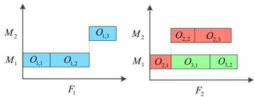  
Fig. 3. Example for decoding schema in the KTCE.

2) Decoding Schema: Firstly, the jobs are assigned to the corresponding factory according to the FA. And then the processing machine is selected for each job by the MS vector. Finally, the operation sequence on each machine is determined based on OS to form a complete scheduling scheme. Fig. 3 shows the scheduling scheme obtained after decoding.

## C. Multi-Factory-Based Greedy Population Initialization Strategy

In evolutionary computation, the quality and uniformity of the initial population significantly influence the efficiency of solution space exploration and algorithmic convergence rate [45]. Hence, the development of effective population initialization strategies is crucial for solving optimization problems. This paper proposes a multi-factory-based greedy population initialization strategy that constructs superior initial population while preserving the diversity.

First, the average total processing time $A T _ { i , f }$ of any job across all factories is computed by:

$$
A T _ {i, f} = \sum_ {j = 1} ^ {n _ {i}} \frac {\sum_ {m \in M _ {i , j , f}} T _ {i , j , f , m}}{M _ {i , j , f} ^ {n}}\tag{11}
$$

The factories are arranged in ascending order according to $A T _ { i , f }$ . Subsequently, i-th job is assigned to the factory with the minimum $A T _ { i , f }$ . This process repeats until all jobs are assigned. This greedy initialization approach facilitates the generation of high-quality FA chromosomes while enhancing algorithm convergence. For example, given the current factory set $F =$ {1, 2, 3, 4, 5}, average total processing times for job $I _ { i }$ at each factory are calculated as $A T = \{ 1 9 . 6 , 1 7 . 0 , 3 1 . 2 , 2 4 . 2 , 2 1 . 4 \}$ Therefore, factory $F _ { 2 }$ achieves the minimum average total processing time. Under the greedy strategy, $I _ { i }$ is allocated to $F _ { 2 }$ Alternatively, the randomized strategy assigns $I _ { i }$ to any factory in F with equal probability.

However, excessive use of greedy strategies may lead to limited search range of the initial population, resulting in falling into local optima. FA vectors of one quarter of the initial population are generated by the proposed greedy strategy, while the remaining are generated by the random strategy.

Following population initialization, a global search with extended step size is implemented to expand the exploration space and identify promising solution regions. The algorithm employs two crossover operators [46]: Priority Operation Crossover (POX) for operation sequence crossover, and Universal Crossover (UX) for machine selection and factory allocation crossover. Subsequently, two mutation strategies are applied according to probability $P m \colon 1 )$ position exchange between two randomly selected operations in the operation sequence; and 2) reassignment of processing machines for randomly selected operations to alternative available machines. Environmental selection is performed using non-dominated sorting [47].

## D. Dynamic Neighborhood Search Structure Centered on Critical Factory

While global search with large step sizes effectively expands the solution space, identifying optimal solutions within extensive search domains under time constraints remains challenging, particularly when exploring regions around specific solution targets. Neighborhood search methods have emerged as an effective approach and have been extensively investigated [48], [49], [50]. Consequently, neighborhood search techniques are essential for conducting intensive exploration around elite solutions. The synergistic integration of global and neighborhood search mechanisms substantially enhances the algorithm’s capability to identify optimal solutions.

In the context of ES-DHFJSP optimization, critical factory and critical path factors play vital roles. Their definitions are as follows:

\- The critical factory is defined as the factory with the maximum completion time.

\- The critical path refers to the sequence of operations requiring the longest total processing time from start to end.

Accordingly, three neighborhood search strategies combined with a dynamic search structure are developed to maintain an equilibrium between neighborhood and global search operations. These local search strategies are detailed as follows:

1) LS<sub>1</sub>(Neighborhood Search Strategy Based on Priority Factory): The neighborhood strategy focuses on the adjustment of factory assignment for the critical factory. Firstly, calculate the finish time of factories other than the critical one and rank them in ascending sequence, where the higher the ranking of the factory, the smaller the makespan, and the higher the priority. Then select a job at random from the critical factory and add it to the factory with the highest priority.

2) LS (Neighborhood Search Strategy Based on Equal Probability Factory): This neighborhood strategy also focuses on the adjustment of the critical factory. It concentrates on slightly increasing the search space to explore solutions more effectively in the neighborhood. $L S _ { 2 }$ is to select a factory with moderate probability from other factories except for the critical factory. Then, a job is randomly extracted from the critical factory and added to the chosen factory.

3) LS<sub>3</sub>(Neighborhood Search Strategy Based on Critical Path): This neighborhood strategy focuses on the adjustment of the critical path, which exchanges the positions of two operations randomly.

It should be emphasized that excessive allocation of computational resources to neighborhood search may result in premature convergence to local optima. Therefore, efficient resource allocation between neighborhood and global search operations is crucial for enhancing algorithmic performance [51], [52]. This paper introduces a dynamic neighborhood search framework that adaptively distributes computational resources based on search requirements at different optimization stages.

First, two variables are defined as: (1) LST represents the frequency of neighborhood searches; (2) maxLST denotes the current maximum allowable number of neighborhood searches, calculated as follows:

$$
m a x L S T = \left\lceil \varepsilon \times \frac {N F E s}{M a x N F E s} \right\rceil\tag{12}
$$

During the initial phase of KTCE, computational resources are predominantly allocated to global search for broad exploration. As the algorithm progresses through iterations, the effectiveness of large-scale exploration diminishes, necessitating the allocation of computational resources to neighborhood search around elite solutions for identifying promising optimal candidates.

Additionally, a qualification vector Qual is introduced to filter individuals eligible for neighborhood search. It has the same size as ${ \mathcal { A } } ,$ and both are initially empty. Upon adding a new solution $p _ { i }$ to $\mathcal { A } , Q u a l _ { p _ { i } }$ is added to Qual and initialized to 1. Correspondingly, when $p _ { i }$ is removed from $\mathcal { A } , Q u a l _ { p _ { i } }$ is removed. For solution $p _ { i }$ in ${ \mathcal { A } } .$ , neighborhood search is activated only when $Q u a l _ { p _ { i } } = 1$

Specifically, $p _ { i } ^ { \prime }$ is defined as the obtained individual through neighborhood search. $e n d _ { f }$ denotes the termination indicator and $e n d \mathrm { { \_ } n a x }$ represents the maximum threshold value of end<sub>f</sub>, calculated as follows:

$$
e n d _ {\max} = \left\lceil m a x L S T \times \frac {2}{3} \right\rceil\tag{13}
$$

When $e n d _ { f } > e n d _ { \mathrm { m a x } }$ , indicating that $e n d _ { f }$ has exceeded its upper bound, the neighborhood search performed on solution $p _ { i }$ fails to yield a better solution. Then, $Q u a l _ { p _ { i } } = Q u a l _ { p _ { i } } - 1$ Simultaneously, $p _ { i }$ is excluded from subsequent neighborhood search iterations. This mechanism significantly reduces redundant exploitation.

Algorithm 2 presents the pseudo-code of the dynamic neigh borhood search structure based on critical factory.

<div class="mineru-algorithm" style="white-space: pre-wrap; font-family:monospace;">
Algorithm 2: Dynamic Neighborhood Search Structure Centered on Critical Factory.

Input: Elite population A, maximum number of neighborhood searches ε, Qualification vector Qual, population P', current evaluation count NFEs, maximum number of function evaluations MaxNFEs.

Output: A', P'.

1 L ← Len(A).

2 for i=1 to L do

3    pi ← A(i), endf = 0, maxLST = [ε × $\frac{NFEs}{MaxNFEs}$].

4    if Quali = 0 then

5    Continue.

6    end

7    while LST ≤ maxLST do

8    if endf &gt; endmax then

9    Quali ← Quali - 1, break.

10    end

11    pi' ← Randomly select a strategy from the strategy pool for neighborhood search(pi).

12    if pi' dominates pi then

13    A ← A ∪ pi'

14    if rand() &lt; 0.5 then

15    P' ← Select an individual from the final front of P' randomly to replace with pi'

16    else

17    P' ← Select an individual from P' randomly to replace with pi'

18    end

19    endf = 0.

20    else if pi' and pi do not dominate each other then

21    pi' ← Randomly select from pi' and pi.

22    A ← A ∪ pi'

23    P' ← Replace an individual in the population as pi' dominates pi.

24    endf = 0.

25    else

26    endf = endf + 1.

27    end

28    end

29 end

30 A' ← non-dominated sort(A).

31 PM ← Factory Allocation-based Knowledge Learning(A'/A,PM,σ).
</div>

## E. Factory Allocation-Based Knowledge Transfer Mechanism

Beyond determining operation sequences and machine assignments, ES-DHFJSP necessitates factory allocation decisions, substantially expanding the problem dimensionality. Consequently, we partition the solution space into multiple subspaces based on factory allocation patterns, with each subspace representing a distinct allocation strategy. Upon identifying elite solutions, selected individuals are directed to explore promising regions within these elite solution subspaces.

To facilitate this approach, we develop a knowledge transfer mechanism utilizing a factory allocation probability model. This framework leverages historical elite solutions’ factory assignments as transferable knowledge to guide the current population toward promising subspaces. This mechanism enhances both population convergence rate and solution quality. To ensure effective subspace exploration, knowledge transfer is implemented at regular $T \cdot$ -generation intervals, where ${ p s / 1 0 }$ individuals are selected for factory allocation adjustment using the probability model, thereby concentrating the search within elite solution subspaces. The detailed implementation of this factory allocation-based knowledge transfer mechanism proceeds as follows:

<div class="mineru-algorithm" style="white-space: pre-wrap; font-family:monospace;">
Algorithm 3: Factory Allocation-based Knowledge Learning.

Input: the newly added elite individuals set  $Dif_{t+1}$ , factory allocation probability model PM, learning intensity  $\sigma$ .

Output: PM.

1  $L \leftarrow Len(Dif_{t+1})$ .

2 for i=1 to L do

3 while  $j \leq N$  do

4  $PM \leftarrow Update$  the probability model by equation (15).

5 end

6 end
</div>

1) Factory Allocation-based Knowledge Learning: Let $P M \in \mathbb { R } ^ { N \times ( n _ { f } + 1 ) }$ denote the factory allocation probability model. Initially, all factories share a uniform probability distribution. Specifically, for any job $I _ { i }$ $\begin{array} { r } { P M _ { i } = \left\lceil 0 , \frac { 1 } { n _ { f } } , \frac { 2 } { n _ { f } } , \dots , 1 \right\rceil } \end{array}$ Assume the elite population is denoted as $\bar { P } { F _ { t } }$ after the completion of the t-th iteration. Then, a new Pareto front $P F _ { t + 1 } ^ { 1 }$ is generated after the $( t + 1 )$ -th global search, and the newly added elite individuals are collected to form the set $D i f _ { t + 1 }$ , it is shown as:

$$
D i f _ {t + 1} = P F _ {t + 1} ^ {1} / P F _ {t}\tag{14}
$$

Then, the FA encoding of each elite individual $d _ { i } \in D i f _ { t + 1 }$ is obtained, and it is denoted as $d F A _ { i } .$ Afterwards update the factory allocation probability model PM based on $d F A _ { i }$ . The update formula is shown as:

$$
P M _ {j, f} = \left\{ \begin{array}{l l} P M _ {j, f} + \sigma \times (n _ {f} - f - 1) & \text { if } f \geq d F A _ {i, j} \\ P M _ {j, f} - \sigma \times (f + 1), & \text { otherwise } \end{array} \right.\tag{15}
$$

where σ represents the learning intensity, j is the job index, and $d F A _ { i , j }$ denotes the FA encoding of the j-th job in individual $d F A _ { i } .$ In Algorithm 3, the pseudo-code for factory allocationbased knowledge learning is outlined.

2) Factory Allocation-based Knowledge Transferring: First, the vector $Q = [ P _ { 1 } , P _ { 2 } , \dots , P _ { r } ]$ is obtained based on the nondominated sorting of the population, where $P _ { i }$ represents the vector of individuals with Pareto rank $i ,$ and the highest rank is denoted as $r .$ Then, select individuals of this rank as transfer individuals starting from $P _ { r }$ . If the number of individuals is insufficient, the individuals from the previous rank are selected until the number of extracted individuals reaches ${ p s / 1 0 }$ . The factory assignments of each transfer individual are adjusted according to the PM.

The pseudo-code of factory allocation-based knowledge transferring is shown in Algorithm 4.

```txt
Algorithm 4: Factory Allocation-based Knowledge Transferring.

Input: factory allocation probability model PM, current population P.
Output: P.

1 Q, r ← Fast Nondominated Sort(P).
2 TS ← Select transfer individuals.
3 L ← Len(TS), P' ← P/TS.
4 for l=1 to L do
5    for i=1 to N do
6    Generate a random number rd range in [0,1).
7    Reassign factories of job I_i based on which interval of PM the value rd falls into.
8    end
9    Update TS_i.
10 end
11 P ← P' ∪ TS.
```

## F. Time Complexity of KTCE

The KTCE algorithm comprises the following three components: evolutionary process, neighborhood search and knowledge transfer. The complexity of each component is described as follows:

1) Evolutionary Process: Within the global search, the complexity are decomposed into two distinct phases: $O ( p s )$ for the crossover-mutation phase and $O ( p s ^ { 2 } )$ for the environmental selection phase. Therefore, the evolutionary process requires $O ( p s ^ { 2 } )$

2) Neighborhood Search: The neighborhood search section has a time complexity of $O ( s i z e ( A ) * ( m a x L S T + N ) )$ The learning section requires $O ( s i z e ( \mathcal { A } ) * N )$ . Hence, the total complexity of the neighborhood search section is $O ( s i z e ( A ) * ( m a x L S T + N ) )$

3) Knowledge Transfer: The time complexity of knowledge transfer stage is $O ( ( p s + r ) * p s )$

We define Iter as iteration count. Hence, the aggregate complexity of the KTCE is $O ( p s ^ { 2 } * I t e r )$ .

## V. EXPERIMENT RESULTS AND ANALYSIS

The current section conducts a in-depth experimental evaluation of the KTCE algorithm. The experimental analysis is structured into five subsections: first, CPLEX is employed to verify the ES-DHFJSP model; second, the benchmark instances and performance metrics are introduced; third, parameter calibration procedures are detailed; furthermore, to execute individual component, ablation experiments are carried out; finally, comparative analyses against state-of-the-art multi-objective optimal algorithms are performed. KTCE is programmed using Python 3.9. All algorithms run on an Intel(R) Core (TM) i5-10210 U CPU @ 1.60 GHz 2.11 GHz and 8 GB of RAM.

## A. Model Verification

To verify the correctness of the ES-DHFJSP model, CPLEX 22.1.0 (full version) is employed. The model is coded in the native optimization language of CPLEX and verified on six generated small-scale instances. Each instance contains 4-6jobs, each having 5 operations, along with 2 or 3 factories, each equipped with 5 machines. The maximum runtimes of CPLEX and KTCE is limited to 600 seconds. Utilizing the optimal solution obtained by CPLEX as the benchmark, the time for KTCE to reach the benchmark is recorded. To minimize variability, we executed 10 independent runs on each instance for both CPLEX and KTCE. The average computation times are computed as the final times. The computational results are presented in Table II. The results verify the correction of the model. Furthermore, they demonstrate that KTCE converges to the optimal solution within a desirable time.

TABLE II  
COMPARISON RESULTS BETWEEN KTCE AND CPLEX ON SIX SMALL-SCALE INSTANCES

<table><tr><td rowspan="2">Instance</td><td colspan="2">makespan</td><td colspan="2">TEC</td><td colspan="2">time(s)</td></tr><tr><td>CPLEX</td><td>KTCE</td><td>CPLEX</td><td>KTCE</td><td>CPLEX</td><td>KTCE</td></tr><tr><td>4J2F</td><td>41</td><td>41</td><td>625</td><td>625</td><td>0.590</td><td>1.428</td></tr><tr><td>4J3F</td><td>43</td><td>43</td><td>648</td><td>648</td><td>0.838</td><td>0.992</td></tr><tr><td>5J2F</td><td>45</td><td>45</td><td>806</td><td>806</td><td>3.232</td><td>1.609</td></tr><tr><td>5J3F</td><td>44</td><td>44</td><td>766</td><td>766</td><td>0.281</td><td>1.638</td></tr><tr><td>6J2F</td><td>55</td><td>55</td><td>1032</td><td>1032</td><td>19.120</td><td>2.938</td></tr><tr><td>6J3F</td><td>48</td><td>48</td><td>886</td><td>886</td><td>29.196</td><td>3.290</td></tr></table>

## B. Instances and Metrics

The evaluation of KTCE is conducted on 20 instances of varying scales. The job count N takes values from {10, 20, 30, 40, 50, 100, 150, 200}, while the factory count $n _ { f }$ spans the interval [2, 7]. All factories contain $m = 5$ machines. In addition, any machine consumes 4kWh for processing and 1kWh for idle states. The instances are available at https: //wewnyin.github.io/wenyingong/Software/DQCE-code.zip.

Two standard performance metrics are employed to evaluate the multi-objective evolutionary algorithms (MOEAs): hypervolume (HV) and inverted generational distance (IGD). The HV metric quantifies the algorithm’s comprehensive performance by computing the hypervolume bounded by the Pareto front and a reference point, where elevated HV indicates superior overall performance. The IGD metric characterizes comprehensive performance through the distance separating the true and approximated Pareto fronts, with smaller IGD values suggesting better convergence and solution diversity.

## C. Parameter Sensitivity Analysis

The performance ofKTCE is greatly affected by the parameter settings, making it essential to investigate the best combination. Therefore, the Taguchi experimental design method [53] is applied to identify the optimal parameters of the KTCE. The KTCE encompasses several critical parameters, including population size $p s ,$ crossover probability $P c ,$ , mutation probability $P m$ , learning intensity $\sigma ,$ and upper bound for neighborhood search ε. In here, we set each parameter at four levels: $p s = \{ 6 0 , 8 0 , 1 0 0 , 1 2 0 \} , P c = \{ 0 . 7 , 0 . 8 , 0 . 9 , 1 . 0 \}$ , $P m = \{ 0 . 0 5 , 0 . 1 , 0 . 1 5 , 0 . 2 \} , \sigma = \{ 0 . 0 1 , 0 . 0 2 , 0 . 0 3 , 0 . 0 4 \}$ , and $\varepsilon = \{ 3 , 4 , 5 , 6 \}$

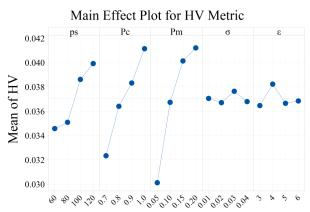  
(a) HV

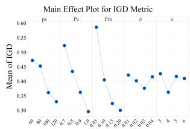  
(b) IGD  
Fig. 4. Influence trend of parameters in the KTCE on HV and IGD.

TABLE III  
COMPARISONS OF KTCE AND THE VARIANTS ON HV METRICS

<table><tr><td rowspan="2">Ins</td><td colspan="2">KTCE1</td><td colspan="2">KTCE2</td><td colspan="2">KTCE3</td><td>KTCE</td></tr><tr><td>mean</td><td>p-value</td><td>mean</td><td>p-value</td><td>mean</td><td>p-value</td><td>mean</td></tr><tr><td>10J2F</td><td>0.0764</td><td>4.5755E-01</td><td>0.0649</td><td>1.3756E-01</td><td>0.0785</td><td>3.5807E-01</td><td>0.0755</td></tr><tr><td>20J2F</td><td>0.0414</td><td>4.6853E-01</td><td>0.0410</td><td>4.8047E-01</td><td>0.0397</td><td>3.2142E-01</td><td>0.0411</td></tr><tr><td>20J3F</td><td>0.0558</td><td>3.7596E-01</td><td>0.0564</td><td>3.0011E-01</td><td>0.0620</td><td>8.4189E-02</td><td>0.0540</td></tr><tr><td>30J2F</td><td>0.0371</td><td>1.1775E-01</td><td>0.0385</td><td>2.3822E-01</td><td>0.0310</td><td>3.5849E-04</td><td>0.0398</td></tr><tr><td>30J3F</td><td>0.0550</td><td>1.7452E-01</td><td>0.0522</td><td>2.9852E-01</td><td>0.0454</td><td>2.4835E-02</td><td>0.0511</td></tr><tr><td>40J2F</td><td>0.0334</td><td>3.3616E-01</td><td>0.0371</td><td>1.0383E-01</td><td>0.0293</td><td>4.8375E-02</td><td>0.0344</td></tr><tr><td>40J3F</td><td>0.0431</td><td>4.3212E-01</td><td>0.0479</td><td>6.0814E-02</td><td>0.0336</td><td>1.1151E-03</td><td>0.0435</td></tr><tr><td>40J4F</td><td>0.0510</td><td>4.8273E-01</td><td>0.0456</td><td>3.0149E-02</td><td>0.0326</td><td>1.2882E-04</td><td>0.0509</td></tr><tr><td>50J3F</td><td>0.0569</td><td>2.0164E-01</td><td>0.0546</td><td>4.8041E-01</td><td>0.0383</td><td>2.5840E-04</td><td>0.0544</td></tr><tr><td>50J4F</td><td>0.0459</td><td>8.8428E-02</td><td>0.0519</td><td>2.7624E-01</td><td>0.0346</td><td>2.3158E-04</td><td>0.0505</td></tr><tr><td>50J5F</td><td>0.0614</td><td>6.2963E-02</td><td>0.0487</td><td>6.8616E-02</td><td>0.0421</td><td>7.1813E-03</td><td>0.0550</td></tr><tr><td>100J4F</td><td>0.0465</td><td>2.9029E-05</td><td>0.0591</td><td>3.3706E-01</td><td>0.0210</td><td>6.4334E-09</td><td>0.0584</td></tr><tr><td>100J5F</td><td>0.0425</td><td>4.6175E-05</td><td>0.0433</td><td>8.0428E-03</td><td>0.0169</td><td>3.1376E-11</td><td>0.0524</td></tr><tr><td>100J6F</td><td>0.0572</td><td>4.1538E-04</td><td>0.0706</td><td>3.4618E-01</td><td>0.0199</td><td>8.3332E-14</td><td>0.0718</td></tr><tr><td>100J7F</td><td>0.0548</td><td>2.2510E-08</td><td>0.0771</td><td>4.1754E-01</td><td>0.0280</td><td>3.3860E-08</td><td>0.0765</td></tr><tr><td>150J5F</td><td>0.0504</td><td>6.8750E-07</td><td>0.0609</td><td>4.6830E-02</td><td>0.0159</td><td>5.7506E-16</td><td>0.0648</td></tr><tr><td>150J6F</td><td>0.0567</td><td>5.4032E-05</td><td>0.0659</td><td>3.3892E-02</td><td>0.0199</td><td>2.7602E-10</td><td>0.0694</td></tr><tr><td>150J7F</td><td>0.0595</td><td>3.0644E-05</td><td>0.0727</td><td>4.9159E-01</td><td>0.0225</td><td>8.1750E-08</td><td>0.0727</td></tr><tr><td>200J6F</td><td>0.0581</td><td>2.7475E-07</td><td>0.0714</td><td>8.4895E-02</td><td>0.0195</td><td>3.8152E-08</td><td>0.0738</td></tr><tr><td>200J7F</td><td>0.0667</td><td>2.0321E-05</td><td>0.0687</td><td>3.5910E-04</td><td>0.0229</td><td>9.2921E-09</td><td>0.0778</td></tr><tr><td>-/=/+</td><td colspan="2">9/11/0</td><td colspan="2">5/15/0</td><td colspan="2">17/3/0</td><td></td></tr></table>

An orthogonal table $L _ { 1 6 } ( 4 ^ { 5 } )$ is utilized for the parameter experiment, and each experiment is adhered to the same termination condition: the maximum evaluation count $\begin{array} { r } { M a x N F E s = } \end{array}$ $\textstyle 2 0 0 \times \sum _ { i = 1 } ^ { N } n _ { i }$ . Each parameter setting runs 10 times to derive the average of two metrics. Fig. 4 illustrates the evaluation metrics across the five parameters at each level. Consequently, the selected parameter combination for the KTCE is $p s = 1 2 0$ $P c = 1 . 0 , P m = 0 . 2 , \sigma = 0 . 0 3 , \varepsilon = 4 .$

## D. Ablation Experiment

To assess individual algorithmic component’s contribution, three variant algorithms are constructed: 1) KTCE1, which excludes the greedy population initialization strategy; 2) KTCE2, which omits the dynamic neighborhood search structure; and 3) KTCE3, which eliminates the knowledge transfer mechanism. To ensure fair comparative analysis, all variants and the complete KTCE algorithm are executed independently 10 trials across 20 test instances, with the termination condition set as $\begin{array} { r } { M a x N F E s = 2 0 0 \times \sum _ { i = 1 } ^ { N } n _ { i } } \end{array}$

Tables III and IV respectively show comparative results of KTCE versus three variant algorithms across two performance metrics, accompanied by p-values derived from t-tests $( \alpha =$ 0.05). “-” indicates that the comparative algorithm shows a clear disadvantage compared to KTCE, $^ { 6 6 } = ^ { 9 9 }$ signifies comparable performance, and $" + "$ denotes that the comparative variant is markedly superior to the KTCE. From the experiments, the knowledge transfer mechanism significantly enhances algorithmic efficiency. And the other two are slightly inferior to the knowledge transfer mechanism, but they have also achieved satisfactory results.

TABLE IV  
COMPARISONS OF KTCE AND THE VARIANTS ON IGD METRICS

<table><tr><td rowspan="2">Ins</td><td colspan="2">KTCE1</td><td colspan="2">KTCE2</td><td colspan="2">KTCE3</td><td>KTCE</td></tr><tr><td>mean</td><td>p-value</td><td>mean</td><td>p-value</td><td>mean</td><td>p-value</td><td>mean</td></tr><tr><td>10J2F</td><td>0.2299</td><td>2.5099E-01</td><td>0.2776</td><td>4.8533E-01</td><td>0.1331</td><td>1.1897E-02</td><td>0.2751</td></tr><tr><td>20J2F</td><td>0.3475</td><td>4.6322E-01</td><td>0.3521</td><td>4.3706E-01</td><td>0.3900</td><td>2.2547E-01</td><td>0.3404</td></tr><tr><td>20J3F</td><td>0.3283</td><td>3.2425E-01</td><td>0.3387</td><td>2.0926E-01</td><td>0.2384</td><td>2.2603E-01</td><td>0.2920</td></tr><tr><td>30J2F</td><td>0.3677</td><td>2.9047E-03</td><td>0.2069</td><td>4.6889E-01</td><td>0.5836</td><td>1.7968E-04</td><td>0.2101</td></tr><tr><td>30J3F</td><td>0.3000</td><td>2.9560E-01</td><td>0.4447</td><td>1.7730E-02</td><td>0.4498</td><td>4.8789E-02</td><td>0.3299</td></tr><tr><td>40J2F</td><td>0.3264</td><td>2.6641E-02</td><td>0.2185</td><td>4.9868E-01</td><td>0.4959</td><td>7.4489E-03</td><td>0.2184</td></tr><tr><td>40J3F</td><td>0.2435</td><td>5.9029E-02</td><td>0.2199</td><td>2.0638E-01</td><td>0.4761</td><td>6.7411E-05</td><td>0.1877</td></tr><tr><td>40J4F</td><td>0.2367</td><td>1.4549E-01</td><td>0.2634</td><td>3.9529E-02</td><td>0.5939</td><td>1.1934E-04</td><td>0.2125</td></tr><tr><td>50J3F</td><td>0.2292</td><td>2.0287E-01</td><td>0.2921</td><td>2.7400E-01</td><td>0.6319</td><td>2.6576E-04</td><td>0.2682</td></tr><tr><td>50J4F</td><td>0.3621</td><td>2.3762E-03</td><td>0.2173</td><td>1.5421E-01</td><td>0.5487</td><td>1.1851E-04</td><td>0.1796</td></tr><tr><td>50J5F</td><td>0.2550</td><td>1.7297E-01</td><td>0.3405</td><td>4.1045E-03</td><td>0.5634</td><td>2.3007E-04</td><td>0.2252</td></tr><tr><td>100J4F</td><td>0.3198</td><td>8.1988E-03</td><td>0.1442</td><td>1.3741E-03</td><td>0.8789</td><td>3.1232E-07</td><td>0.2401</td></tr><tr><td>100J5F</td><td>0.3581</td><td>1.1968E-06</td><td>0.2697</td><td>7.0566E-02</td><td>0.9159</td><td>4.0141E-08</td><td>0.1943</td></tr><tr><td>100J6F</td><td>0.3502</td><td>7.8589E-05</td><td>0.1897</td><td>9.2063E-03</td><td>1.0019</td><td>1.8546E-09</td><td>0.1199</td></tr><tr><td>100J7F</td><td>0.4469</td><td>9.4117E-09</td><td>0.2185</td><td>1.1212E-02</td><td>0.9245</td><td>2.7121E-07</td><td>0.1405</td></tr><tr><td>150J5F</td><td>0.3372</td><td>6.0635E-06</td><td>0.1723</td><td>1.7869E-01</td><td>1.1242</td><td>1.3114E-14</td><td>0.1409</td></tr><tr><td>150J6F</td><td>0.3431</td><td>5.1757E-06</td><td>0.1870</td><td>1.5973E-02</td><td>1.0467</td><td>7.2997E-08</td><td>0.1211</td></tr><tr><td>150J7F</td><td>0.3453</td><td>1.9141E-08</td><td>0.1778</td><td>1.1220E-01</td><td>0.9229</td><td>1.4665E-06</td><td>0.2128</td></tr><tr><td>200J6F</td><td>0.2995</td><td>1.3362E-07</td><td>0.1268</td><td>9.8222E-02</td><td>1.0372</td><td>4.2289E-07</td><td>0.1022</td></tr><tr><td>200J7F</td><td>0.2552</td><td>2.7880E-06</td><td>0.2094</td><td>1.3180E-03</td><td>0.9577</td><td>2.8110E-07</td><td>0.1257</td></tr><tr><td>-=/+</td><td colspan="2">12/8/0</td><td colspan="2">7/12/1</td><td colspan="2">17/2/1</td><td></td></tr></table>

TABLE V

PARAMETERS SETTING FOR COMPARISON ALGORITHMS

<table><tr><td>Algorithms</td><td>Parameters</td></tr><tr><td>MOEA/D</td><td> $T = 10$ </td></tr><tr><td>LRVMA</td><td> $\gamma = 0.8, \alpha = 0.1, \epsilon = 0.95$ </td></tr><tr><td>DQCE</td><td> $\alpha = 0.001, bs = 16, \epsilon = 0.9, \gamma = 0.9, S_{E} = 512$ </td></tr><tr><td>MFLEDA</td><td> $\beta_{max} = 0.5, \ell = 10$ </td></tr></table>

## E. Comparison and Analysis

To highlight KTCE’s performance advantages, it is compared with MOEA/D [54], NSGA-II [47], TSKEA [55], LRVMA [56], DQCE [57] and MFLEDA [58]. These algorithms leverage varied approaches to tackle ES-DHFJSP effectively. MOEA/D applies decomposition in its framework. NSGA-II relies on non-dominated sorting. TSKEA, a two-stage method, incorporates knowledge-driven. LRVMA and DQCE leverage reinforcement learning and deep reinforcement learning, respectively. MFLEDA utilizes a probabilistic modeling approach to produce new solutions. DQCE is implemented in Python 3.9, while other algorithms are implemented in MATLAB 2022a.

The parameter setting for the KTCE follows the optimal values obtained in subsection V-C. For the comparative algorithms, the population size $p s ,$ the probabilities for crossover $( P c )$ and mutation $( P m )$ are set the same as the original. And, other parameters are shown in Table V, where $T$ is the size of neighborhood in MOEA/D. In LRVMA, $\gamma$ is discount factor, while include α (learning rate) and  (greedy factor). α and  in DQCE have the same meaning as in LRVMA, and there are batch size bs and experience pool size $S _ { E }$ . In addition, $\beta _ { \mathrm { m a x } }$ and 	 represent learning rate limit and random walk span respectively. All algorithms execute 10 independent runs on each instance and all experiments use the same termination condition, including: the maximum number of evaluations $\begin{array} { r } { M a x N F E s = 2 0 0 \times \sum _ { i = 1 } ^ { N } n _ { i } } \end{array}$ or the CPU time $C T _ { \mathrm { m a x } } = N \times \left( n _ { f } - 1 \right) ( s )$

TABLE VI  
RESULTS OF HV METRIC FOR COMPARING SEVEN ALGORITHMS UNDER THE SAME MAXIMUM NUMBER OF EVALUATIONS

<table><tr><td rowspan="2">Ins</td><td colspan="2">MOEA/D</td><td colspan="2">NSGA-II</td><td colspan="2">TSKEA</td><td colspan="2">LRVMA</td><td colspan="2">DQCE</td><td colspan="2">MFLEDA</td><td colspan="2">KTCE</td></tr><tr><td>mean</td><td>std</td><td>mean</td><td>std</td><td>mean</td><td>std</td><td>mean</td><td>std</td><td>mean</td><td>std</td><td>mean</td><td>std</td><td>mean</td><td>std</td></tr><tr><td>10J2F</td><td>0.0566-</td><td>0.012</td><td>0.0675-</td><td>0.025</td><td>0.2271=</td><td>0.013</td><td>0.2122-</td><td>0.015</td><td> $\mathbf{0.2424=}$ </td><td>0.020</td><td>0.0924-</td><td>0.016</td><td>0.2343</td><td>0.021</td></tr><tr><td>20J2F</td><td>0.0703-</td><td>0.017</td><td>0.0491-</td><td>0.012</td><td>0.2780=</td><td>0.006</td><td>0.1764-</td><td>0.019</td><td>0.2766=</td><td>0.013</td><td>0.1158-</td><td>0.016</td><td> $\mathbf{0.2794}$ </td><td>0.009</td></tr><tr><td>20J3F</td><td>0.0524-</td><td>0.014</td><td>0.0608-</td><td>0.011</td><td>0.2440-</td><td>0.006</td><td>0.2057-</td><td>0.024</td><td>0.3291-</td><td>0.020</td><td>0.1603-</td><td>0.017</td><td> $\mathbf{0.3537}$ </td><td>0.011</td></tr><tr><td>30J2F</td><td>0.0473-</td><td>0.007</td><td>0.0524-</td><td>0.009</td><td>0.2735-</td><td>0.003</td><td>0.1667-</td><td>0.016</td><td>0.3004-</td><td>0.010</td><td>0.1333-</td><td>0.006</td><td> $\mathbf{0.3071}$ </td><td>0.006</td></tr><tr><td>30J3F</td><td>0.0515-</td><td>0.011</td><td>0.0551-</td><td>0.005</td><td>0.2697-</td><td>0.004</td><td>0.1985-</td><td>0.008</td><td>0.3407=</td><td>0.008</td><td>0.1695-</td><td>0.015</td><td> $\mathbf{0.3433}$ </td><td>0.007</td></tr><tr><td>40J2F</td><td>0.0370-</td><td>0.008</td><td>0.0400-</td><td>0.008</td><td>0.2618-</td><td>0.004</td><td>0.1393-</td><td>0.021</td><td>0.2812=</td><td>0.013</td><td>0.1210-</td><td>0.008</td><td> $\mathbf{0.2870}$ </td><td>0.005</td></tr><tr><td>40J3F</td><td>0.0663-</td><td>0.014</td><td>0.0730-</td><td>0.013</td><td>0.2598-</td><td>0.003</td><td>0.1896-</td><td>0.021</td><td>0.3618=</td><td>0.013</td><td>0.2003-</td><td>0.008</td><td> $\mathbf{0.3696}$ </td><td>0.008</td></tr><tr><td>40J4F</td><td>0.0556-</td><td>0.012</td><td>0.0594-</td><td>0.009</td><td>0.2015-</td><td>0.003</td><td>0.1705-</td><td>0.028</td><td>0.3577=</td><td>0.016</td><td>0.1794-</td><td>0.014</td><td> $\mathbf{0.3655}$ </td><td>0.013</td></tr><tr><td>50J3F</td><td>0.0400-</td><td>0.007</td><td>0.0347-</td><td>0.003</td><td>0.2142-</td><td>0.004</td><td>0.1465-</td><td>0.020</td><td> $\mathbf{0.3146=}$ </td><td>0.010</td><td>0.1488-</td><td>0.009</td><td>0.3082</td><td>0.008</td></tr><tr><td>50J4F</td><td>0.0552-</td><td>0.009</td><td>0.0605-</td><td>0.012</td><td>0.2045-</td><td>0.004</td><td>0.1983-</td><td>0.009</td><td>0.3751-</td><td>0.014</td><td>0.1966-</td><td>0.013</td><td> $\mathbf{0.3946}$ </td><td>0.012</td></tr><tr><td>50J5F</td><td>0.0552-</td><td>0.010</td><td>0.0653-</td><td>0.006</td><td>0.1981-</td><td>0.005</td><td>0.2053-</td><td>0.043</td><td>0.3883-</td><td>0.012</td><td>0.2111-</td><td>0.015</td><td> $\mathbf{0.4010}$ </td><td>0.008</td></tr><tr><td>100J4F</td><td>0.0308-</td><td>0.005</td><td>0.0381-</td><td>0.005</td><td>0.0948-</td><td>0.004</td><td>0.1229-</td><td>0.020</td><td>0.3012-</td><td>0.007</td><td>0.1286-</td><td>0.008</td><td> $\mathbf{0.3289}$ </td><td>0.006</td></tr><tr><td>100J5F</td><td>0.0406-</td><td>0.008</td><td>0.0455-</td><td>0.007</td><td>0.0926-</td><td>0.002</td><td>0.1473-</td><td>0.043</td><td>0.3506-</td><td>0.010</td><td>0.1701-</td><td>0.008</td><td> $\mathbf{0.3659}$ </td><td>0.009</td></tr><tr><td>100J6F</td><td>0.0516-</td><td>0.007</td><td>0.0618-</td><td>0.006</td><td>0.0691-</td><td>0.004</td><td>0.1826-</td><td>0.022</td><td>0.3711-</td><td>0.010</td><td>0.1868-</td><td>0.010</td><td> $\mathbf{0.4033}$ </td><td>0.009</td></tr><tr><td>100J7F</td><td>0.0746-</td><td>0.016</td><td>0.0635-</td><td>0.007</td><td>0.0803-</td><td>0.002</td><td>0.1744-</td><td>0.043</td><td>0.4032-</td><td>0.009</td><td>0.2119-</td><td>0.011</td><td> $\mathbf{0.4359}$ </td><td>0.006</td></tr><tr><td>150J5F</td><td>0.0485-</td><td>0.005</td><td>0.0519-</td><td>0.009</td><td>0.1011-</td><td>0.002</td><td>0.1701-</td><td>0.018</td><td>0.3543-</td><td>0.009</td><td>0.1664-</td><td>0.005</td><td> $\mathbf{0.3736}$ </td><td>0.006</td></tr><tr><td>150J6F</td><td>0.0775-</td><td>0.013</td><td>0.0557-</td><td>0.013</td><td>0.0705-</td><td>0.003</td><td>0.1652-</td><td>0.040</td><td>0.3627-</td><td>0.005</td><td>0.1715-</td><td>0.007</td><td> $\mathbf{0.3935}$ </td><td>0.006</td></tr><tr><td>150J7F</td><td>0.0867-</td><td>0.022</td><td>0.0775-</td><td>0.014</td><td>0.0663-</td><td>0.002</td><td>0.2009-</td><td>0.025</td><td>0.3881-</td><td>0.008</td><td>0.1947-</td><td>0.006</td><td> $\mathbf{0.4173}$ </td><td>0.007</td></tr><tr><td>200J6F</td><td>0.0603-</td><td>0.015</td><td>0.0573-</td><td>0.003</td><td>0.0789-</td><td>0.003</td><td>0.1740-</td><td>0.009</td><td>0.3681-</td><td>0.007</td><td>0.1713-</td><td>0.005</td><td> $\mathbf{0.4052}$ </td><td>0.006</td></tr><tr><td>200J7F</td><td>0.0646-</td><td>0.014</td><td>0.0617-</td><td>0.004</td><td>0.0620-</td><td>0.001</td><td>0.2103-</td><td>0.010</td><td>0.3918-</td><td>0.007</td><td>0.1852-</td><td>0.010</td><td> $\mathbf{0.4215}$ </td><td>0.003</td></tr><tr><td>-/=/+</td><td colspan="2">20/0/0</td><td colspan="2">20/0/0</td><td colspan="2">18/2/0</td><td colspan="2">20/0/0</td><td colspan="2">13/7/0</td><td colspan="2">20/0/0</td><td colspan="2"></td></tr></table>

TABLE VII

RESULTS OF IGD METRIC FOR COMPARING SEVEN ALGORITHMS UNDER THE SAME MAXIMUM NUMBER OF EVALUATIONS

<table><tr><td rowspan="2">Ins</td><td colspan="2">MOEA/D</td><td colspan="2">NSGA-II</td><td colspan="2">TSKEA</td><td colspan="2">LRVMA</td><td colspan="2">DQCE</td><td colspan="2">MFLEDA</td><td colspan="2">KTCE</td></tr><tr><td>mean</td><td>std</td><td>mean</td><td>std</td><td>mean</td><td>std</td><td>mean</td><td>std</td><td>mean</td><td>std</td><td>mean</td><td>std</td><td>mean</td><td>std</td></tr><tr><td>10J2F</td><td>0.8030-</td><td>0.149</td><td>0.8466-</td><td>0.056</td><td>0.1301=</td><td>0.030</td><td>0.1560-</td><td>0.045</td><td>0.0984=</td><td>0.041</td><td>0.6783-</td><td>0.090</td><td>0.1107</td><td>0.053</td></tr><tr><td>20J2F</td><td>0.9773-</td><td>0.078</td><td>0.8963-</td><td>0.099</td><td>0.0554=</td><td>0.014</td><td>0.3121-</td><td>0.045</td><td>0.0564=</td><td>0.029</td><td>0.6402-</td><td>0.067</td><td>0.0467</td><td>0.020</td></tr><tr><td>20J3F</td><td>0.9605-</td><td>0.061</td><td>0.9607-</td><td>0.037</td><td>0.2998-</td><td>0.019</td><td>0.4125-</td><td>0.073</td><td>0.0793-</td><td>0.033</td><td>0.5544-</td><td>0.065</td><td>0.0399</td><td>0.018</td></tr><tr><td>30J2F</td><td>1.0050-</td><td>0.045</td><td>1.0283-</td><td>0.027</td><td>0.1187-</td><td>0.005</td><td>0.4704-</td><td>0.041</td><td>0.0518-</td><td>0.024</td><td>0.5981-</td><td>0.028</td><td>0.0293</td><td>0.009</td></tr><tr><td>30J3F</td><td>0.9957-</td><td>0.026</td><td>0.9561-</td><td>0.044</td><td>0.2268-</td><td>0.013</td><td>0.4369-</td><td>0.030</td><td>0.0428=</td><td>0.015</td><td>0.5195-</td><td>0.061</td><td>0.0339</td><td>0.008</td></tr><tr><td>40J2F</td><td>1.0888-</td><td>0.059</td><td>1.0900-</td><td>0.055</td><td>0.1165-</td><td>0.007</td><td>0.5182-</td><td>0.049</td><td>0.0593-</td><td>0.033</td><td>0.6198-</td><td>0.034</td><td>0.0392</td><td>0.010</td></tr><tr><td>40J3F</td><td>0.9224-</td><td>0.043</td><td>0.9482-</td><td>0.044</td><td>0.2993-</td><td>0.010</td><td>0.4490-</td><td>0.039</td><td>0.0475=</td><td>0.028</td><td>0.4734-</td><td>0.029</td><td>0.0311</td><td>0.016</td></tr><tr><td>40J4F</td><td>1.0146-</td><td>0.028</td><td>1.0117-</td><td>0.034</td><td>0.4739-</td><td>0.009</td><td>0.4891-</td><td>0.046</td><td>0.0596-</td><td>0.034</td><td>0.5496-</td><td>0.048</td><td>0.0318</td><td>0.016</td></tr><tr><td>50J3F</td><td>1.0973-</td><td>0.017</td><td>1.0911-</td><td>0.055</td><td>0.3501-</td><td>0.012</td><td>0.5356-</td><td>0.029</td><td>0.0422=</td><td>0.024</td><td>0.5616-</td><td>0.037</td><td>0.0529</td><td>0.017</td></tr><tr><td>50J4F</td><td>0.9731-</td><td>0.026</td><td>0.9895-</td><td>0.032</td><td>0.4658-</td><td>0.012</td><td>0.5034-</td><td>0.023</td><td>0.0875-</td><td>0.031</td><td>0.5079-</td><td>0.042</td><td>0.0500</td><td>0.019</td></tr><tr><td>50J5F</td><td>0.9645-</td><td>0.029</td><td>1.0029-</td><td>0.009</td><td>0.5416-</td><td>0.015</td><td>0.4240-</td><td>0.034</td><td>0.0499-</td><td>0.020</td><td>0.4736-</td><td>0.041</td><td>0.0346</td><td>0.009</td></tr><tr><td>100J4F</td><td>1.1110-</td><td>0.035</td><td>1.1348-</td><td>0.026</td><td>0.8131-</td><td>0.018</td><td>0.6342-</td><td>0.023</td><td>0.0911-</td><td>0.018</td><td>0.6545-</td><td>0.037</td><td>0.0168</td><td>0.014</td></tr><tr><td>100J5F</td><td>1.0328-</td><td>0.023</td><td>1.0811-</td><td>0.026</td><td>0.8492-</td><td>0.008</td><td>0.5561-</td><td>0.041</td><td>0.0677-</td><td>0.026</td><td>0.5678-</td><td>0.029</td><td>0.0236</td><td>0.015</td></tr><tr><td>100J6F</td><td>0.9744-</td><td>0.010</td><td>0.9778-</td><td>0.045</td><td>0.9211-</td><td>0.016</td><td>0.5513-</td><td>0.036</td><td>0.1010-</td><td>0.022</td><td>0.5664-</td><td>0.034</td><td>0.0265</td><td>0.013</td></tr><tr><td>100J7F</td><td>0.8868-</td><td>0.070</td><td>0.8530-</td><td>0.021</td><td>0.9008-</td><td>0.005</td><td>0.4877-</td><td>0.045</td><td>0.0803-</td><td>0.022</td><td>0.5377-</td><td>0.033</td><td>0.0160</td><td>0.010</td></tr><tr><td>150J5F</td><td>1.0222-</td><td>0.035</td><td>1.0130-</td><td>0.018</td><td>0.8172-</td><td>0.009</td><td>0.5392-</td><td>0.016</td><td>0.0754-</td><td>0.022</td><td>0.6017-</td><td>0.016</td><td>0.0220</td><td>0.015</td></tr><tr><td>150J6F</td><td>1.0135-</td><td>0.064</td><td>0.9337-</td><td>0.029</td><td>0.9234-</td><td>0.009</td><td>0.5390-</td><td>0.033</td><td>0.0954-</td><td>0.012</td><td>0.6107-</td><td>0.023</td><td>0.0275</td><td>0.009</td></tr><tr><td>150J7F</td><td>0.9153-</td><td>0.066</td><td>0.8653-</td><td>0.021</td><td>0.9428-</td><td>0.005</td><td>0.4939-</td><td>0.038</td><td>0.0777-</td><td>0.017</td><td>0.5725-</td><td>0.019</td><td>0.0185</td><td>0.010</td></tr><tr><td>200J6F</td><td>0.9772-</td><td>0.048</td><td>0.9075-</td><td>0.019</td><td>0.9021-</td><td>0.009</td><td>0.5471-</td><td>0.012</td><td>0.1021-</td><td>0.018</td><td>0.6279-</td><td>0.020</td><td>0.0153</td><td>0.010</td></tr><tr><td>200J7F</td><td>0.8947-</td><td>0.089</td><td>0.8426-</td><td>0.011</td><td>0.9590-</td><td>0.005</td><td>0.5128-</td><td>0.026</td><td>0.0805-</td><td>0.017</td><td>0.6073-</td><td>0.029</td><td>0.0107</td><td>0.005</td></tr><tr><td>-/-/+</td><td colspan="2">20/0/0</td><td colspan="2">20/0/0</td><td colspan="2">18/2/0</td><td colspan="2">20/0/0</td><td colspan="2">15/5/0</td><td colspan="2">20/0/0</td><td></td><td></td></tr></table>

1) Comparison experiments under the same maximum number of evaluations: Tables VI and VII respectively present the mean values and standard deviations of the seven algorithms on the HV and IGD metrics. Simultaneously, the concluding row present t-test (α = 0.05) statistical significance results. “-” denotes that the comparison algorithm is markedly inferior to KTCE, “=” signifies that there is no significant difference exists and “+” means significantly superior to KTCE. In the experimental results, the optimal metric values are marked in bold. Additionally, Table VIII illustrates the ranking results and corresponding p-values derived from the Friedman rank-sum test, using a confidence level α = 0.05.

The experimental analyses show that the KTCE is significantly better than MOEA/D, NSGA-II, TSKEA, LRVMA and MFLEDA. For DQCE, the KTCE outperforms it on most small-scale instances, but not significantly, and significantly outperforms it on large-scale instances. Therefore, the experimental results validate the superior efficacy of the KTCE for ES-DHFJSP.

TABLE VIII  
FRIEDMAN TEST RANKINGS ACROSS ALL ALGORITHMS UNDER THE SAME MAXIMUM NUMBER OF EVALUATIONS

<table><tr><td rowspan="2">MOEAs</td><td colspan="2">HV</td><td colspan="2">IGD</td></tr><tr><td>rank</td><td>p-value</td><td>rank</td><td>p-value</td></tr><tr><td>MOEA/D</td><td>6.30</td><td></td><td>6.35</td><td></td></tr><tr><td>NSGA-II</td><td>6.50</td><td></td><td>6.35</td><td></td></tr><tr><td>TSKEA</td><td>4.15</td><td></td><td>4.25</td><td></td></tr><tr><td>LRVMA</td><td>3.95</td><td>4.385E-20</td><td>3.50</td><td>4.038E-20</td></tr><tr><td>DQCE</td><td>1.95</td><td></td><td>1.95</td><td></td></tr><tr><td>MFLEDA</td><td>4.05</td><td></td><td>4.50</td><td></td></tr><tr><td>KTCE</td><td>1.10</td><td></td><td>1.10</td><td></td></tr></table>

For each algorithm, the solutions of 10 times running are integrated and sorted non-dominated to obtain the final pareto front which is shown in Fig. 5. The average running time of the KTCE and three advanced algorithms on all instances is illustrated in Fig. 6. The results indicate that the KTCE reach the Pareto front with less time.

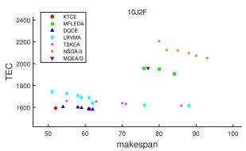

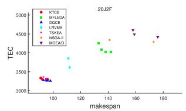

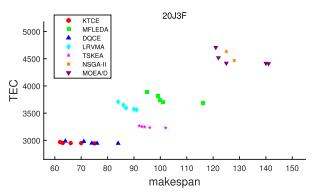

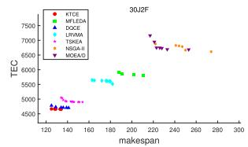

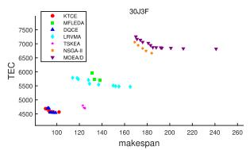

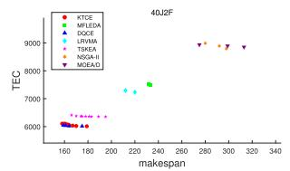

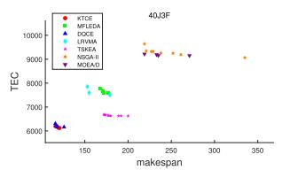

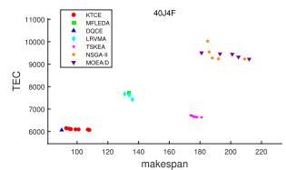

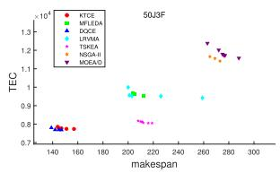

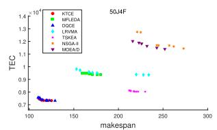

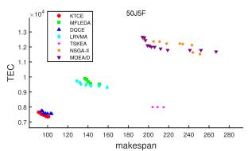

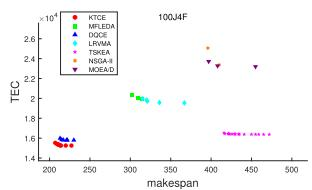

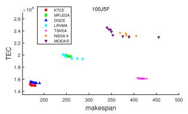

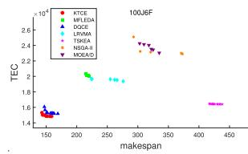

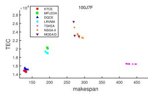

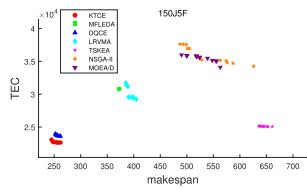

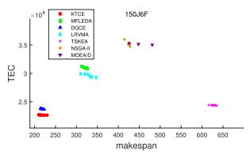

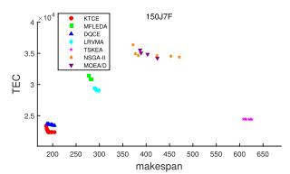  
Fig. 5. Comparison of Pareto frontiers of different algorithms on each instance.

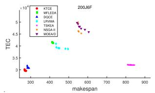

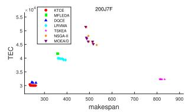

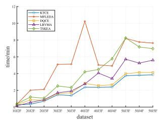  
(a) small-scale instances

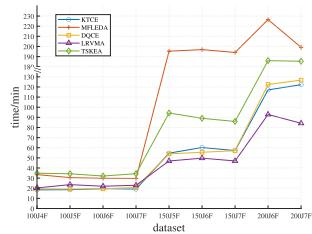  
(b) large-scale instances

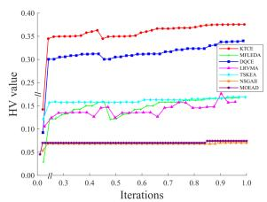  
(a) HV  
Fig. 6. The runtime analysis on different scale instances.

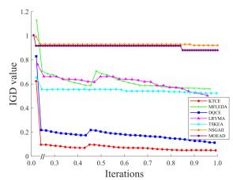  
(b) IGD  
Fig. 7. The convergence behavior across seven algorithms on HV and IGD.

To facilitate a further efficiency comparison of the algorithms, the instance 100J4F is selected and optimized by seven optimization algorithms to analyze convergence. The curves of HV and IGD changing with the number of algorithm iterations are shown in Fig. 7. Due to the fact that different algorithms may complete different numbers of evaluations in one iteration, the proportion of completed evaluations in MaxNFEs is utilized to show the changes in the two indicators.

Experimental results demonstrate that the greedy population initialization strategy significantly enhances both initial population quality and algorithmic convergence rate. Additionally, the factory allocation probability model-based knowledge transfer mechanism facilitates effective population evolution, further accelerating convergence performance. Moreover, the critical factory-based dynamic neighborhood search structure exhibits robust capabilities in exploring promising solution regions. These synergistic components enable KTCE to efficiently address the ES-DHFJSP.

TABLE IX  
RESULTS OF HV METRIC FOR COMPARING SEVEN ALGORITHMS UNDER THE SAME CPU TIME

<table><tr><td rowspan="2">Ins</td><td colspan="2">MOEA/D</td><td colspan="2">NSGA-II</td><td colspan="2">TSKEA</td><td colspan="2">LRVMA</td><td colspan="2">DQCE</td><td colspan="2">MFLEDA</td><td colspan="2">KTCE</td></tr><tr><td>mean</td><td>std</td><td>mean</td><td>std</td><td>mean</td><td>std</td><td>mean</td><td>std</td><td>mean</td><td>std</td><td>mean</td><td>std</td><td>mean</td><td>std</td></tr><tr><td>10J2F</td><td>0.1113-</td><td>0.021</td><td>0.1014-</td><td>0.016</td><td>0.2906+</td><td>0.011</td><td>0.3153+</td><td>0.022</td><td>0.2631+</td><td>0.022</td><td>0.0677-</td><td>0.020</td><td>0.2358</td><td>0.024</td></tr><tr><td>20J2F</td><td>0.1011-</td><td>0.011</td><td>0.1092-</td><td>0.016</td><td>0.3416+</td><td>0.003</td><td>0.2552-</td><td>0.020</td><td>0.2536=</td><td>0.035</td><td>0.0561-</td><td>0.017</td><td>0.2780</td><td>0.031</td></tr><tr><td>20J3F</td><td>0.0810-</td><td>0.016</td><td>0.0841-</td><td>0.023</td><td>0.3001-</td><td>0.008</td><td>0.2979-</td><td>0.017</td><td>0.3870=</td><td>0.016</td><td>0.0809-</td><td>0.018</td><td>0.3977</td><td>0.013</td></tr><tr><td>30J2F</td><td>0.0772-</td><td>0.011</td><td>0.0814-</td><td>0.012</td><td>0.3237+</td><td>0.005</td><td>0.2010-</td><td>0.017</td><td>0.3087=</td><td>0.020</td><td>0.0470-</td><td>0.007</td><td>0.3116</td><td>0.013</td></tr><tr><td>30J3F</td><td>0.0789-</td><td>0.011</td><td>0.0822-</td><td>0.014</td><td>0.3034-</td><td>0.005</td><td>0.2448-</td><td>0.030</td><td>0.3647-</td><td>0.015</td><td>0.0682-</td><td>0.016</td><td>0.3749</td><td>0.007</td></tr><tr><td>40J2F</td><td>0.0824-</td><td>0.009</td><td>0.0788-</td><td>0.010</td><td>0.3229=</td><td>0.005</td><td>0.1800-</td><td>0.021</td><td>0.2856-</td><td>0.013</td><td>0.0401-</td><td>0.006</td><td>0.3081</td><td>0.011</td></tr><tr><td>40J3F</td><td>0.0723-</td><td>0.009</td><td>0.0723-</td><td>0.009</td><td>0.2550-</td><td>0.005</td><td>0.2210-</td><td>0.014</td><td>0.3439-</td><td>0.011</td><td>0.0565-</td><td>0.009</td><td>0.3537</td><td>0.011</td></tr><tr><td>40J4F</td><td>0.0805-</td><td>0.007</td><td>0.0808-</td><td>0.010</td><td>0.2496-</td><td>0.004</td><td>0.2707-</td><td>0.031</td><td>0.3929-</td><td>0.014</td><td>0.0900-</td><td>0.018</td><td>0.4193</td><td>0.006</td></tr><tr><td>50J3F</td><td>0.0695-</td><td>0.006</td><td>0.0667-</td><td>0.009</td><td>0.2523-</td><td>0.006</td><td>0.1981-</td><td>0.013</td><td>0.3189-</td><td>0.020</td><td>0.0495-</td><td>0.009</td><td>0.3336</td><td>0.008</td></tr><tr><td>50J4F</td><td>0.0620-</td><td>0.008</td><td>0.0620-</td><td>0.007</td><td>0.2291-</td><td>0.004</td><td>0.2177-</td><td>0.033</td><td>0.3580-</td><td>0.010</td><td>0.0769-</td><td>0.010</td><td>0.3944</td><td>0.005</td></tr><tr><td>50J5F</td><td>0.0669-</td><td>0.006</td><td>0.0668-</td><td>0.016</td><td>0.2053-</td><td>0.005</td><td>0.2651-</td><td>0.022</td><td>0.3808-</td><td>0.017</td><td>0.1009-</td><td>0.013</td><td>0.3979</td><td>0.011</td></tr><tr><td>100J4F</td><td>0.0611-</td><td>0.004</td><td>0.0651-</td><td>0.010</td><td>0.1441-</td><td>0.005</td><td>0.1525-</td><td>0.017</td><td>0.2847-</td><td>0.020</td><td>0.0476-</td><td>0.007</td><td>0.3538</td><td>0.003</td></tr><tr><td>100J5F</td><td>0.0549-</td><td>0.009</td><td>0.0569-</td><td>0.005</td><td>0.1232-</td><td>0.003</td><td>0.1790-</td><td>0.010</td><td>0.3078-</td><td>0.015</td><td>0.0548-</td><td>0.006</td><td>0.3635</td><td>0.013</td></tr><tr><td>100J6F</td><td>0.0569-</td><td>0.006</td><td>0.0559-</td><td>0.011</td><td>0.0767-</td><td>0.005</td><td>0.1821-</td><td>0.026</td><td>0.3321-</td><td>0.012</td><td>0.0761-</td><td>0.009</td><td>0.3978</td><td>0.005</td></tr><tr><td>100J7F</td><td>0.0694-</td><td>0.006</td><td>0.0861-</td><td>0.025</td><td>0.0814-</td><td>0.006</td><td>0.2461-</td><td>0.011</td><td>0.3753-</td><td>0.013</td><td>0.1123-</td><td>0.010</td><td>0.4404</td><td>0.007</td></tr><tr><td>150J5F</td><td>0.0744-</td><td>0.008</td><td>0.0752-</td><td>0.007</td><td>0.1002-</td><td>0.003</td><td>0.1613-</td><td>0.024</td><td>0.2971-</td><td>0.008</td><td>0.0550-</td><td>0.008</td><td>0.3343</td><td>0.011</td></tr><tr><td>150J6F</td><td>0.0754-</td><td>0.004</td><td>0.0989-</td><td>0.020</td><td>0.0935-</td><td>0.003</td><td>0.1973-</td><td>0.011</td><td>0.3205-</td><td>0.006</td><td>0.0668-</td><td>0.013</td><td>0.3931</td><td>0.015</td></tr><tr><td>150J7F</td><td>0.0591-</td><td>0.004</td><td>0.0775-</td><td>0.019</td><td>0.0609-</td><td>0.001</td><td>0.1750-</td><td>0.028</td><td>0.3145-</td><td>0.008</td><td>0.0653-</td><td>0.010</td><td>0.3809</td><td>0.011</td></tr><tr><td>200J6F</td><td>0.0792-</td><td>0.005</td><td>0.0949-</td><td>0.017</td><td>0.0817-</td><td>0.002</td><td>0.1662-</td><td>0.021</td><td>0.2726-</td><td>0.014</td><td>0.0575-</td><td>0.008</td><td>0.3679</td><td>0.009</td></tr><tr><td>200J7F</td><td>0.0672-</td><td>0.006</td><td>0.0920-</td><td>0.021</td><td>0.0614-</td><td>0.002</td><td>0.1546-</td><td>0.027</td><td>0.2872-</td><td>0.018</td><td>0.0836-</td><td>0.010</td><td>0.3537</td><td>0.026</td></tr><tr><td>-/-/+/+</td><td colspan="2">20/0/0</td><td colspan="2">20/0/0</td><td colspan="2">16/1/3</td><td colspan="2">19/0/1</td><td colspan="2">16/3/1</td><td colspan="2">20/0/0</td><td></td><td></td></tr></table>

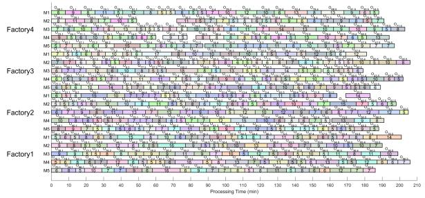  
Fig. 8. The Gantt chart of the optimal schedule $S _ { 1 }$ achieving minimum Makespan on instance 100J4F.

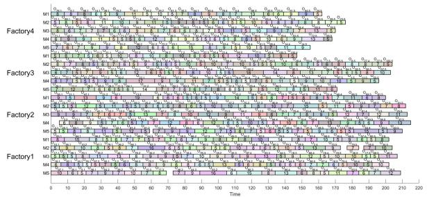  
Fig. 9. The Gantt chart of the optimal schedule $S _ { 2 }$ achieving minimum TEC on instance 100J4F.

The Gantt charts of the solution $S _ { 1 }$ with the minimum makespan and the solution $S _ { 2 }$ with the minimum TEC on 100J4F are shown in Figs. 8 and 9, respectively. The horizontal axis is the processing time, while the vertical dimension is the 5 machines in each factory. Each row shows the processing order of all processes on the machine. When the all processes on a machine are completed, then the machine stops running. The solution $S _ { 1 }$ distributes all processes to each machine with optimal uniformity. For this reason, it can obtain the smaller makespan. The solution $S _ { 2 }$ aims to minimize idle time between each process as much as possible to avoid machine idleness and energy waste. Thereby, the results verify that KTCE can obtain the best scheduling solution.

2) Comparison experiments under the same CPU time: Due to the alteration in termination conditions, the relevant components of evaluation count are adapted within each algorithm. The current CPU time is defined as $C T _ { c }$

In KTCE, the current maximum number of neighborhood searches maxLST is set to $\begin{array} { r } { \left\lceil \varepsilon \times \frac { C T _ { c } } { C T _ { \mathrm { m a x } } } \right\rceil } \end{array}$ . In MFLEDA, the learning rate $\begin{array} { r } { \beta = \beta _ { \mathrm { m a x } } - \frac { F \dot { E } s } { m a x F E s } \times \left( \beta _ { \mathrm { m a x } } - 0 . 0 1 \right) } \end{array}$ is changed to $\begin{array} { r } { \beta = \beta _ { \operatorname* { m a x } } - \frac { C T _ { c } } { C T _ { \operatorname* { m a x } } } \times \left( \beta _ { \operatorname* { m a x } } - 0 . 0 1 \right) } \end{array}$ , where $F E s$ is the number of function evaluations and maxFEs is the maximum number of function evaluations. In TSKEA, the number of function evaluations of the first stage $N F E _ { s _ { 1 } }$ is mathematically expressed as $\begin{array} { r } { N F E _ { s _ { 1 } } = M a x N F E s \times \frac { 5 } { 7 } } \end{array}$ . Thus, in this experiment, $\begin{array} { r } { N F E _ { s _ { 1 } } = C T _ { \mathrm { m a x } } \times \frac { 5 } { 7 } } \end{array}$

Tables IX and X present the experimental results of seven algorithms across 20 instances. Each algorithm’s results are presented in two columns: mean values (mean) and standard deviations (std), while the best values are marked in bold. T-tests $( \alpha = 0 . 0 5 )$ are conducted to evaluate the statistical significance between each algorithm and KTCE, with the results displayed in the bottom row of each table. “-” denotes KTCE significantly outperforming the comparison algorithm. $^ { 6 6 } = ^ { 5 9 }$ signifies no statistically significant difference. “+” indicates the comparison algorithm achieves significantly better results than KTCE. Additionally, Table XI presents the Friedman rank-sum test results, including the ranks and corresponding p-values with the confidence level $\alpha = 0 . 0 5$

The experimental results demonstrate that KTCE achieves an enhanced search efficiency. For TSKEA and LRVMA, the comparative analysis yields two key findings: (1) When CPU time serves as the termination criterion, they only outperform KTCE on the instances with $n _ { f } = 2 ,$ , indicating significant limitations in solving complex problems; (2) When the maximum number of evaluations counts as the termination criterion, they consistently underperform KTCE across all instances. These findings confirm limited local optima escaping performance in the three algorithms.

TABLE X  
RESULTS OF IGD METRIC FOR COMPARING SEVEN ALGORITHMS UNDER THE SAME CPU TIME

<table><tr><td rowspan="2">Ins</td><td colspan="2">MOEA/D</td><td colspan="2">NSGA-II</td><td colspan="2">TSKEA</td><td colspan="2">LRVMA</td><td colspan="2">DQCE</td><td colspan="2">MFLEDA</td><td colspan="2">KTCE</td></tr><tr><td>mean</td><td>std</td><td>mean</td><td>std</td><td>mean</td><td>std</td><td>mean</td><td>std</td><td>mean</td><td>std</td><td>mean</td><td>std</td><td>mean</td><td>std</td></tr><tr><td>10J2F</td><td>0.6928-</td><td>0.071</td><td>0.6923-</td><td>0.038</td><td>0.1430+</td><td>0.024</td><td>0.0731+</td><td>0.015</td><td>0.2080+</td><td>0.052</td><td>0.8803-</td><td>0.086</td><td>0.2645</td><td>0.052</td></tr><tr><td>20J2F</td><td>0.7798-</td><td>0.046</td><td>0.7252-</td><td>0.040</td><td>0.0176+</td><td>0.006</td><td>0.2339-</td><td>0.040</td><td>0.2448-</td><td>0.095</td><td>0.9649-</td><td>0.062</td><td>0.1687</td><td>0.086</td></tr><tr><td>20J3F</td><td>0.8970-</td><td>0.034</td><td>0.8820-</td><td>0.077</td><td>0.2412-</td><td>0.020</td><td>0.2503-</td><td>0.037</td><td>0.0490-</td><td>0.030</td><td>0.8770-</td><td>0.076</td><td>0.0269</td><td>0.023</td></tr><tr><td>30J2F</td><td>0.8849-</td><td>0.027</td><td>0.8704-</td><td>0.045</td><td>0.0523+</td><td>0.012</td><td>0.3834-</td><td>0.029</td><td>0.0961=</td><td>0.055</td><td>1.0556-</td><td>0.042</td><td>0.0859</td><td>0.033</td></tr><tr><td>30J3F</td><td>0.9042-</td><td>0.038</td><td>0.8828-</td><td>0.038</td><td>0.2180-</td><td>0.015</td><td>0.3187-</td><td>0.029</td><td>0.0577-</td><td>0.032</td><td>0.9359-</td><td>0.050</td><td>0.0348</td><td>0.014</td></tr><tr><td>40J2F</td><td>0.8445-</td><td>0.026</td><td>0.8461-</td><td>0.041</td><td>0.0246+</td><td>0.010</td><td>0.4038-</td><td>0.062</td><td>0.1135-</td><td>0.036</td><td>1.0864-</td><td>0.029</td><td>0.0655</td><td>0.028</td></tr><tr><td>40J3F</td><td>0.9504-</td><td>0.035</td><td>0.9463-</td><td>0.036</td><td>0.3148-</td><td>0.016</td><td>0.3987-</td><td>0.032</td><td>0.0824-</td><td>0.026</td><td>1.0151-</td><td>0.028</td><td>0.0497</td><td>0.023</td></tr><tr><td>40J4F</td><td>0.9019-</td><td>0.038</td><td>0.8843-</td><td>0.024</td><td>0.4028-</td><td>0.011</td><td>0.3121-</td><td>0.028</td><td>0.0788-</td><td>0.029</td><td>0.8668-</td><td>0.057</td><td>0.0190</td><td>0.006</td></tr><tr><td>50J3F</td><td>0.9207-</td><td>0.027</td><td>0.9408-</td><td>0.038</td><td>0.2922-</td><td>0.019</td><td>0.4135-</td><td>0.019</td><td>0.1010-</td><td>0.043</td><td>1.0300-</td><td>0.033</td><td>0.0551</td><td>0.016</td></tr><tr><td>50J4F</td><td>0.9573-</td><td>0.031</td><td>0.9672-</td><td>0.030</td><td>0.4262-</td><td>0.012</td><td>0.3966-</td><td>0.034</td><td>0.1031-</td><td>0.020</td><td>0.9048-</td><td>0.036</td><td>0.0261</td><td>0.008</td></tr><tr><td>50J5F</td><td>0.9669-</td><td>0.022</td><td>0.9553-</td><td>0.044</td><td>0.5224-</td><td>0.015</td><td>0.3263-</td><td>0.032</td><td>0.0739-</td><td>0.028</td><td>0.8144-</td><td>0.039</td><td>0.0345</td><td>0.016</td></tr><tr><td>100J4F</td><td>0.9714-</td><td>0.018</td><td>0.9139-</td><td>0.022</td><td>0.6643-</td><td>0.019</td><td>0.5572-</td><td>0.034</td><td>0.1842-</td><td>0.048</td><td>1.0482-</td><td>0.025</td><td>0.0185</td><td>0.004</td></tr><tr><td>100J5F</td><td>1.0119-</td><td>0.027</td><td>0.9668-</td><td>0.029</td><td>0.7476-</td><td>0.009</td><td>0.5223-</td><td>0.025</td><td>0.1774-</td><td>0.041</td><td>1.0294-</td><td>0.031</td><td>0.0380</td><td>0.003</td></tr><tr><td>100J6F</td><td>1.0191-</td><td>0.018</td><td>0.9233-</td><td>0.030</td><td>0.8993-</td><td>0.015</td><td>0.5073-</td><td>0.019</td><td>0.1659-</td><td>0.021</td><td>0.9336-</td><td>0.018</td><td>0.0171</td><td>0.008</td></tr><tr><td>100J7F</td><td>0.9636-</td><td>0.015</td><td>0.8245-</td><td>0.016</td><td>0.9008-</td><td>0.017</td><td>0.4274-</td><td>0.021</td><td>0.1581-</td><td>0.021</td><td>0.8211-</td><td>0.022</td><td>0.0204</td><td>0.009</td></tr><tr><td>150J5F</td><td>0.8901-</td><td>0.027</td><td>0.8693-</td><td>0.030</td><td>0.8060-</td><td>0.011</td><td>0.4949-</td><td>0.029</td><td>0.1441-</td><td>0.021</td><td>0.9864-</td><td>0.025</td><td>0.0366</td><td>0.021</td></tr><tr><td>150J6F</td><td>0.9443-</td><td>0.009</td><td>0.8129-</td><td>0.021</td><td>0.8687-</td><td>0.010</td><td>0.5268-</td><td>0.020</td><td>0.2179-</td><td>0.016</td><td>0.9682-</td><td>0.020</td><td>0.0423</td><td>0.034</td></tr><tr><td>150J7F</td><td>1.0026-</td><td>0.008</td><td>0.8497-</td><td>0.026</td><td>0.9513-</td><td>0.004</td><td>0.5322-</td><td>0.040</td><td>0.1880-</td><td>0.017</td><td>0.9675-</td><td>0.040</td><td>0.0336</td><td>0.021</td></tr><tr><td>200J6F</td><td>0.9155-</td><td>0.016</td><td>0.7662-</td><td>0.021</td><td>0.8929-</td><td>0.007</td><td>0.5495-</td><td>0.018</td><td>0.2758-</td><td>0.027</td><td>0.9963-</td><td>0.026</td><td>0.0336</td><td>0.019</td></tr><tr><td>200J7F</td><td>0.9614-</td><td>0.021</td><td>0.7776-</td><td>0.015</td><td>0.9564-</td><td>0.007</td><td>0.5607-</td><td>0.027</td><td>0.2357-</td><td>0.042</td><td>0.9036-</td><td>0.045</td><td>0.0517</td><td>0.033</td></tr><tr><td>-/=/+</td><td colspan="2">20/0/0</td><td colspan="2">20/0/0</td><td colspan="2">16/0/4</td><td colspan="2">19/0/1</td><td colspan="2">18/1/1</td><td colspan="2">20/0/0</td><td></td><td></td></tr></table>

TABLE XI

FRIEDMAN TEST RANKINGS ACROSS ALL ALGORITHMS UNDER THE SAME CPU TIME

<table><tr><td rowspan="2">MOEAs</td><td colspan="2">HV</td><td colspan="2">IGD</td></tr><tr><td>rank</td><td>p-value</td><td>rank</td><td>p-value</td></tr><tr><td>MOEA/D</td><td>5.30</td><td></td><td>5.15</td><td></td></tr><tr><td>NSGA-II</td><td>6.00</td><td></td><td>6.25</td><td></td></tr><tr><td>TSKEA</td><td>3.65</td><td></td><td>3.60</td><td></td></tr><tr><td>LRVMA</td><td>3.25</td><td>5.993E-18</td><td>3.20</td><td>1.135E-18</td></tr><tr><td>DQCE</td><td>2.25</td><td></td><td>2.25</td><td></td></tr><tr><td>MFLEDA</td><td>6.25</td><td></td><td>6.25</td><td></td></tr><tr><td>KTCE</td><td>1.30</td><td></td><td>1.30</td><td></td></tr></table>

Comprehensive evaluations across both termination conditions confirm KTCE’s superiority in two critical dimensions: accelerated convergence rate and enhanced local optimum avoidance capability.

## VI. CONCLUSION

This paper develops a knowledge transfer-based coevolutionary search algorithm for ES-DHFJSP. The algorithm has incorporated three key components: First, a greedy population initialization strategy is developed. FA vectors of one quarter of the initial population are generated based on average processing times, while the remaining individuals’ FA vectors are generated stochastically. Implementation of this methodology elevates genotypic quality within the population and significantly enhances convergence rate. Second, a dynamic framework that has combined three critical factory-based neighborhood search strategies, enabling effective exploration of promising solutions while maintaining global search capabilities. Third, a knowledge transfer mechanism that has utilized factory allocation probability models to preserve high-quality factory assignment patterns and accelerate algorithmic convergence. Comprehensive experimental results across 20 benchmark instances have demonstrated that KTCE has outperformed existing algorithms in addressing ES-DHFJSP.

Although the proposed KTCE exhibits excellent performance in ES-DHFJSP, it still has some deficiency that need to be solved in future work. Such as, in the later stage of iteration, the negative transfer may increase significantly and lead to falling into local optima. Additionally, the factors considered in the update of the probability model are also relatively limited. Therefore, investigating more efficient model to solve ES-DHFJSP problems is a future research direction.

## REFERENCES

[1] L. Deng, Y. Di, and L. Wang, “A reinforcement-learning-based 3-D estimation of distribution algorithm for fuzzy distributed hybrid flow-shop scheduling considering on-time-delivery,” IEEE Trans. Cybern., vol. 54, no. 2, pp. 1024–1036, Feb. 2024.

[2] S. Cao, R. Li, W. Gong, and C. Lu, “Inverse model and adaptive neighborhood search based cooperative optimizer for energy-efficient distributed flexible job shop scheduling,” Swarm Evol. Computation, vol. 83, 2023, Art. no. 101419.

[3] Z. Zhang, Y. Fu, K. Gao, H. Zhang, and L. Wang, “A cooperative evolutionary algorithm with simulated annealing for integrated scheduling of distributed flexiblejob shops and distribution,” Swarm Evol. Computation, vol. 85, 2024, Art. no. 101467.

[4] H. Qin et al., “Energy-efficient iterative greedy algorithm for the distributed hybrid flow shop scheduling with blocking constraints,” IEEE Trans. Emerg. Topics Comput. Intell., vol. 7, no. 5, pp. 1442–1457, Oct. 2023.

[5] L. Meng, C. Zhang, Y. Ren, B. Zhang, and C. Lv, “Mixed-integer linear programming and constraint programming formulations for solving distributed flexible job shop scheduling problem,” Comput. Ind. Eng., vol. 142, 2020, Art. no. 106347.

[6] L. De Giovanni and F. Pezzella, “An improved genetic algorithm for the distributed and flexible job-shop scheduling problem,” Eur. J. Oper. Res., vol. 200, no. 2, pp. 395–408, 2010.

[7] M. Sheng, W. Ding, and W. Sheng, “Differential evolution with adaptive niching and reinitialisation for nonlinear equation systems,” Int. J. Syst. Sci., vol. 55, no. 10, pp. 2172–2186, 2024.

[8] C. Wang, F. Qin, X. Xiang, H. Jiang, and X. Zhang, “A dual-populationbased co-evolutionary algorithm for capacitated electric vehicle routing problems,” IEEE Trans. Transport. Electrific., vol. 10, no. 2, pp. 2663–2676, Jun. 2024.

[9] L. Wei, L. Jin, and X. Luo, “A robust coevolutionary neural-based optimization algorithm for constrained nonconvex optimization,” IEEE Trans. Neural Netw. Learn. Syst., vol. 35, no. 6, pp. 7778–7791, Jun. 2024.

[10] J. Chen et al., “A state-migration particle swarm optimizer for adaptive latent factor analysis of high-dimensional and incomplete data,” IEEE/CAA J. Automatica Sinica, vol. 11, no. 11, pp. 2220–2235, Nov. 2024.

[11] J. Fang, W. Liu, L. Chen, S. Lauria, A. Miron, and X. Liu, “A survey of algorithms, applications and trends for particle swarm optimization,” Int. J. Netw. Dyn. Intell., vol. 2, no. 1, pp. 24–50, Mar. 2023.

[12] J. Cao, Y. Wang, Z. Bu, Y. Wang, H. Tao, and G. Zhu, “Compactness preserving community computation via a network generative process,” IEEE Trans. Emerg. Topics Comput. Intell., vol. 6, no. 5, pp. 1044–1056, Oct. 2022.

[13] G. Ma et al., “Estimating the state of health for lithium-ion batteries: A particle swarm optimization-assisted deep domain adaptation approach,” IEEE/CAA J. Automatica Sinica, vol. 10, no. 7, pp. 1530–1543, Jul. 2023.

[14] S. Hu, J. Lu, and S. Zhou, “Learning regression distribution: Information diffusion from template to search for visual object tracking,” Int. J. Netw. Dyn. Intell., vol. 3, no. 1, Mar. 2024, Art. no. 100006.

[15] T. Chen, S. Li, Y. Qiao, and X. Luo, “A robust and efficient ensemble of diversified evolutionary computing algorithms for accurate robot calibration,” IEEE Trans. Instrum. Meas., vol. 73, 2024, Art. no. 7501814.

[16] J. Xue and B. Shen, “A survey on sparrow search algorithms and their applications,” Int. J. Syst. Sci., vol. 55, no. 4, pp. 814–832, 2024.

[17] C. Lu, L. Gao, J. Yi, and X. Li, “Energy-efficient scheduling of distributed flow shop with heterogeneous factories: A real-world case from automobile industry in China,” IEEE Trans. Ind. Inform., vol. 17, no. 10, pp. 6687–6696, Oct. 2021.

[18] X. Yan, H. Zuo, C. Hu, W. Gong, and L. Gao, “Distributed heterogeneous flow shop scheduling method for dual-carbon goals,” IEEE Trans. Automat. Sci. Eng., vol. 22, pp. 7409–7420, 2025.

[19] R. Li, W. Gong, L. Wang, C. Lu, Z. Pan, and X. Zhuang, “Double DQN-Based coevolution for green distributed heterogeneous hybrid flowshop scheduling with multiple priorities of jobs,” IEEE Trans. Automat. Sci. Eng., vol. 21, no. 4, pp. 6550–6562, Oct. 2024.

[20] F. Ming, W. Gong, L. Wang, and Y. Jin, “Constrained multi-objective optimization with deep reinforcement learning assisted operator selection,” IEEE/CAA J. Automatica Sinica, vol. 11, no. 4, pp. 919–931, Apr. 2024.

[21] L. Hu, Z. Wang, H. Li, P. Wu, and N. Zeng, “l-DARTS: Light-weight differentiable architecture search with robustness enhancement strategy,” Knowl.-Based Syst., vol. 288, Mar. 2024, Art. no. 111466

[22] A. T. W. Min, Y. -S. Ong, A. Gupta, and C. -K. Goh, “Multiproblem surrogates: Transfer evolutionary multiobjective optimization of computationally expensive problems,” IEEE Trans. Evol. Comput., vol. 23, no. 1, pp. 15–28, Feb. 2019.

[23] Y. Sang and J. Tan, “Intelligent factory many-objective distributed flexible job shop collaborative scheduling method,” Comput. Ind. Eng., vol. 164, 2022, Art. no. 107884.

[24] X. Jin, X. Li, L. Gao, and L. Gui, “Distributed flexible job-shop scheduling problem based on hybrid chemical reaction optimization algorithm,” Complex Syst. Model. Simul., vol. 2, no. 2, pp. 156–173, 2022.

[25] J. Li, X. Gu, Y. Zhang, and X. Zhou, “A hybrid genetic Tabu search algorithm for distributed flexible job shop scheduling problems,” J. Manuf. Syst., vol. 71, pp. 82–94, 2023.

[26] F. Yu, C. Lu, J. Zhou, L. Yin, and K. Wang, “A knowledge-guided bi-population evolutionary algorithm for energy-efficient scheduling of distributed flexible job shop problem,” Eng. Appl. Artif. Intell., vol. 128, 2024, Art. no. 107458.

[27] Y. Zhang and X. Gu, “A biogeography-based optimization algorithm with local search for large-scale heterogeneous distributed scheduling with multiple process plans,” Neurocomputing, vol. 595, 2024, Art. no. 127897.

[28] Z. Yang et al., “A Q-Learning-based improved multi-objective genetic algorithm for solving distributed heterogeneous assembly flexiblejob shop scheduling problems with transfers,” J. Manuf. Syst., vol. 79, pp. 398–418, 2025.

[29] M. Yuan, S. Lu, L. Zheng, Q. Yu, F. Pei, and W. Gu, “Distributed heterogeneous flexible job-shop scheduling problem considering automated guided vehicle transportation via improved deep q network,” Swarm Evol. Computation, vol. 94, 2025, Art. no. 101902.

[30] G. Zhang, B. Liu, L. Wang, and K. Xing, “Distributed heterogeneous co-evolutionary algorithm for scheduling a multistage fine-manufacturing system with setup constraints,” IEEE Trans. Cybern., vol. 54, no. 3, pp. 1497–1510, Mar. 2024.

[31] Q. Yan, H. Wang, and S. Yang, “A learning-assisted bi-population evolutionary algorithm for distributed flexible job-shop scheduling with maintenance decisions,” IEEE Trans. Evol. Comput., early access, May, 13, 2024, doi: 10.1109/TEVC.2024.3400043.

[32] P. Fu, Z. Zhang, M. Huang, X. Guo, and L. Qi, “Multi-objective integrated energy-efficient scheduling of distributed flexible job shop and vehicle routing by knowledge-and-learning-based hyper-heuristics,” IEEE Trans. Emerg. Topics Comput. Intell., vol. 9, no. 3, pp. 2137–2150, Jun. 2025.

[33] Y. Chen, X. Liao, G. Chen, and Y. Hou, “Dynamic intelligent scheduling in low-carbon heterogeneous distributed flexiblejob shops withjob insertions and transfers,” Sensors, vol. 24, no. 7, 2024, Art. no. 2251.

[34] F. Zhang, Y. Mei, S. Nguyen, and M. Zhang, “Multitask multiobjective genetic programming for automated scheduling heuristic learning in dynamic flexible job-shop scheduling,” IEEE Trans. Cybern., vol. 53, no. 7, pp. 4473–4486, Jul. 2023.

[35] Q. Lin, Y. Ye, L. Ma, M. Jiang, and K. C. Tan, “Dynamic multiobjective evolutionary optimization via knowledge transfer and maintenance,” IEEE Trans. Syst., Man, Cybern. Syst., vol. 54, no. 2, pp. 936–949, Feb. 2024.

[36] J. Zheng, L. Yu, Q. Song, J. Huang, G. Sheng, and Y. Chen, “Coevolutionary fuzzy deep transfer learning for disaster relief demand forecasting,” IEEE Trans. Emerg. Topics Comput., vol. 10, no. 3, pp. 1361–1373, Jul./Sep. 2022.

[37] M. Jiang, Z. Huang, L. Qiu, W. Huang, and G. G. Yen, “Transfer learningbased dynamic multiobjective optimization algorithms,” IEEE Trans. Evol. Comput., vol. 22, no. 4, pp. 501–514, Aug. 2018.

[38] X. Wang, Z. Dong, L. Tang, and Q. Zhang, “Multiobjective multitask optimization-neighborhood as a bridge for knowledge transfer,” IEEE Trans. Evol. Comput., vol. 27, no. 1, pp. 155–169, Feb. 2023.

[39] Y. Guo, G. Chen, M. Jiang, D. Gong, and J. Liang, “A knowledge guided transfer strategy for evolutionary dynamic multiobjective optimization,” IEEE Trans. Evol. Comput., vol. 27, no. 6, pp. 1750–1764, Dec. 2023.

[40] G. Zhang, B. Liu, L. Wang, D. Yu, and K. Xing, “Distributed coevolutionary memetic algorithm for distributed hybrid differentiation flowshop scheduling problem,” IEEE Trans. Evol. Comput., vol. 26, no. 5, pp. 1043–1057, Oct. 2022.

[41] H. Peng, Z. Luo, T. Fang, and Q. Zhang, “Micro many-objective evolutionary algorithm with knowledge transfer,” IEEE Trans. Emerg. Topics Comput. Intell., vol. 9, no. 1, pp. 43–56, Feb. 2025.

[42] H. Xu, A. K. Qin, and S. Xia, “Evolutionary multitask optimization with adaptive knowledge transfer,” IEEE Trans. Evol. Comput., vol. 26, no. 2, pp. 290–303, Apr. 2022.

[43] C. Wang, J. Liu, K. Wu, and Z. Wu, “Solving multitask optimization problems with adaptive knowledge transfer via anomaly detection,” IEEE Trans. Evol. Comput., vol. 26, no. 2, pp. 304–318, Apr. 2022.

[44] F. Zhang, Y. Mei, S. Nguyen, K. C. Tan, and M. Zhang, “Task relatednessbased multitask genetic programming for dynamic flexible job shop scheduling,” IEEE Trans. Evol. Comput., vol. 27, no. 6, pp. 1705–1719, Dec. 2023.

[45] J. Fang et al., “A new particle swarm optimization algorithm for outlier detection: Industrial data clustering in wire arc additive manufacturing,” IEEE Trans. Automat. Sci. Eng., vol. 21, no. 2, pp. 1244–1257, Apr. 2024.

[46] R. Li, W. Gong, and C. Lu, “A reinforcement learning based RMOEA/D for Bi-objective fuzzy flexible job shop scheduling,” Expert Syst. with Appl., vol. 203, 2022, Art. no. 117380.

[47] K. Deb, A. Pratap, S. Agarwal, and T. Meyarivan, “A fast and elitist multiobjective genetic algorithm: NSGA-II,” IEEE Trans. Evol. Comput., vol. 6, no. 2, pp. 182–197, Apr. 2002.

[48] F. Zhao, Y. Du, C. Zhuang, L. Wang, and Y. Yu, “An iterative greedy algorithm for solving a multiobjective distributed assembly flexible job shop scheduling problem with fuzzy processing time,” IEEE Trans. Cybern., vol. 55, no. 5, pp. 2302–2315, May 2025.

[49] R. Li, W. Gong, L. Wang, C. Lu, and X. Zhuang, “Surprisingly popularbased adaptive memetic algorithm for energy-efficient distributed flexible job shop scheduling,” IEEETrans. Cybern., vol. 53, no. 12, pp. 8013–8023, Dec. 2023.

[50] Z. Shao, W. Shao, and D. Pi, “LS-HH: A learning-based selection hyperheuristic for distributed heterogeneous hybrid blocking flow-shop scheduling,” IEEE Trans. Emerg. Topics Comput. Intell., vol. 7, no. 1, pp. 111–127, Feb. 2023.

[51] W. Fang, B. Shen, A. Pan, L. Zou, and B. Song, “A cooperative stochastic configuration network based on differential evolutionary sparrow search algorithm for prediction,” Syst. Sci. Control Eng., vol. 12, no. 1, 2024, Art. no. 2314481.

[52] C. Wang, Z. Wang, Q.-L. Han, F. Han, and H. Dong, “Novel leaderfollower-based particle swarm optimizer inspired by multiagent systems: Algorithm, experiments, and applications,” IEEE Trans. Syst., Man, Cybern. Syst., vol. 53, no. 3, pp. 1322–1334, Mar. 2023.

[53] R. C. Van Nostrand, “Design of experiments using the Taguchi approach: 16 steps to product and process improvement,” Technometrics, vol. 44, no. 3, pp. 289–289, Aug. 2002.

[54] Q. Zhang and H. Li, “MOEA/D: A multiobjective evolutionary algorithm based on decomposition,” IEEE Trans. Evol. Comput., vol. 11, no. 6, pp. 712–731, Dec. 2007.

[55] R. Li, W. Gong, L. Wang, C. Lu, and S. Jiang, “Two-stage knowledgedriven evolutionary algorithm for distributed green flexible job shop scheduling with type-2 fuzzy processing time,” Swarm Evol. Computation, vol. 74, 2022, Art. no. 101139.

[56] R. Li, W. Gong, C. Lu, and L. Wang, “A learning-based memetic algorithm for energy-efficient flexible job-shop scheduling with Type-2 fuzzy processing time,” IEEE Trans. Evol. Comput., vol. 27, no. 3, pp. 610–620, Jun. 2023.

[57] R. Li, W. Gong, L. Wang, C. Lu, and C. Dong, “Co-evolution with deep reinforcement learning for energy-aware distributed heterogeneous flexible job shop scheduling,” IEEE Trans. Syst., Man, Cybern. Syst., vol. 54, no. 1, pp. 201–211, Jan. 2024.

[58] F. Zhao, M. Li, N. Zhu, and T.Xu and Jonrinaldi, “Multi-objective fitness landscape-based estimation of distribution algorithm for distributed heterogeneous flexible job shop scheduling problem,” Appl. Soft Comput., vol. 171, 2025, Art. no. 112780.

  
Tao Li received the M.S. degree in computer software and theory from Henan Normal University, Henan, China, in 2016, and the Ph.D. degree in software engineering from Harbin Engineering University, Harbin, China, in 2019. He is currently a Lecturer with the College of Computer and Information Engineering with Henan Normal University. His research interests include evolutionary computation and machine learning, and focusing on feature selection.


Xingchen Li is currently working toward the master’s degree with the College of Computer and Information Engineering, Henan Normal University, Henan, China. His research interests include evolutionary computation and machine learning, and focusing on shop scheduling.


Junna Zhang (Member, IEEE) received the Ph.D. degree from the Institute of Network Technology, Beijing University of Posts and Telecommunications, Beijing, China, in 2019. She is currently a Professor with the College of Computer and Information Engineering, Henan Normal University, Henan, China. She is also a Vice President with the College of Computer and Information Engineering. She has authored or coauthored more than thirty papers in her research interests which include edge computing and service computing. She was the recipient of the Best Paper Award of CCF NCSC in 2022.


Dong Liu received the B.S. and M.S. degrees in computer science from Zhengzhou University, Zhengzhou, China, in 1998 and 2004, respectively, and the Ph.D. degree in computer science from Tianjin University, Tianjin, China, in 2013. He is currently a Professor with the College of Computer and Information Engineering, Henan Normal University, Xinxiang, China. His research interests include educational data mining and complex network analysis.

Zidong Wang (Fellow, IEEE) received the B.Sc. degree in mathematics from Suzhou University, Suzhou, China, in 1986, the M.Sc. degree in applied mathematics, and the Ph.D. degree in electrical engineering from the Nanjing University of Science and Technology, Nanjing, China, in 1990 and 1994, respectively. He is currently Professor of Dynamical Systems and Computing with the Department of Computer Science, Brunel University London, Uxbridge, U.K. From 1990 to 2002, he held teaching and research appointments with Universities in China, Germany,

and U.K. He has authored or coauthored a number of papers in internationa journals. His research interests include dynamical systems, signal processing, bioinformatics, control theory, and applications. Dr. Wang is also a holder o the Alexander von Humboldt Research Fellowship of Germany, JSPS Research Fellowship of Japan, William Mong Visiting Research Fellowship of Hong Kong. He is (or was) the Editor-in-Chief of the International Journal ofSystems Science, and Neurocomputing, and an Associate Editor for 12 internationa journals, including IEEE TRANSACTIONS ON AUTOMATIC CONTROL, IEEE TRANSACTIONS ON CONTROL SYSTEMS TECHNOLOGY, IEEE TRANSACTIONS ON NEURAL NETWORKS, IEEE TRANSACTIONS ON SIGNAL PROCESSING, and IEEE TRANSACTIONS ON SYSTEMS,MAN, AND CYBERNETICS—PART C: APPLI-CATIONS AND REVIEWS. He is also a member of the Academia Europaea, fellow of the Royal Statistical Society, and member of the Program Committee for many international conferences.